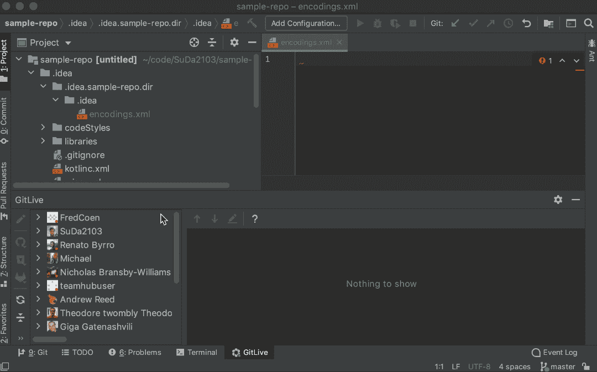

# Git 挑选本地未提交的更改——好得难以置信？

> 原文：<https://blog.devgenius.io/git-cherry-picking-locally-uncommitted-changes-too-good-to-be-true-30497a87c032?source=collection_archive---------8----------------------->

我们都熟悉 Git Cherry Pick——它允许我们通过引用挑选任意的 Git 提交，并将它们附加到当前的工作头。这对于团队协作、错误修复或恢复丢失的提交非常有用。然而，如果这个特性允许挑选你的队友的本地未提交的变更，那么它对于协作将会更加有用！听起来像一场梦？继续读！

# 请考虑以下情况:

编写测试经常被视为开销，但是说实话，毫无疑问，它们使我们的代码更加稳定，并使我们离乌托邦更近了一步；一个没有运行错误的世界。为了鼓励测试驱动的开发，它需要更有趣。一个解决方案是让它互动，也就是所谓的乒乓配对。

乒乓配对让两个开发人员走到一起，共同关注测试和生产代码。更准确地说，一个开发人员为某个行为编写一个测试，然后请求另一个开发人员实现该行为并通过测试。乒乓球比赛继续进行，每次交换都是一次新的测试。为了促进这个游戏，我们需要能够在无缝体验中来回传递我们的本地更改，这导致我介绍 [**GitLive**](https://git.live) 的樱桃采摘功能。

精选功能允许您在一次点击体验中接管队友的本地工作副本更改。因此，两个开发人员可以方便地进行交互，并在远程设置中将结对编程与 TDD 结合起来，也就是不用来回传递键盘。

然而，这个特性允许更多。你有多少次陷入困境，并通过提交和推送代码来寻求帮助，以便获得帮助？这种情况经常发生，尽管提交-推送-获取循环对于共享未完成的代码来说似乎非常麻烦。此外，你不应该一开始就提交不完整的更改。 [**GitLive**](https://git.live) 允许您无缝地让您的队友接管您的本地更改，并在本地审查它们，从而摆脱令人困惑的提交。

作为 [**GitLive**](https://git.live) 的联合创始人，我很有兴趣知道你在日常工作中会如何使用这个功能。如果你有任何关于如何让生活变得更好、更方便的想法，请直接联系我！