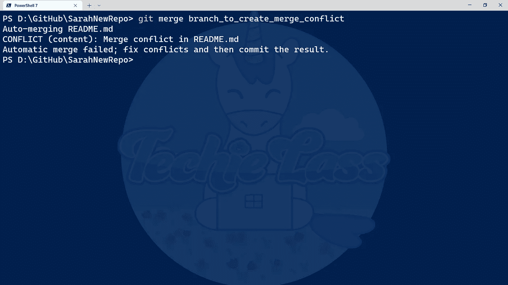
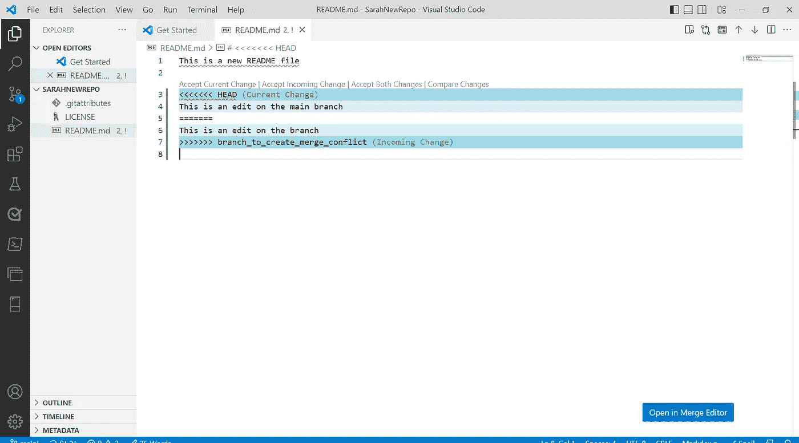

# Git 冲突— 14 天的 Git

> 原文：<https://blog.devgenius.io/git-conflicts-14-days-of-git-4a24d90b8ece?source=collection_archive---------5----------------------->

我正在继续我 14 天的 Git 学习之旅，你可以在这里看到我迄今为止所学的历史。今天我在探索冲突的世界，它们是什么，如何解决它们，如何发现冲突。

# 什么是 Git 冲突？

正如我们在之前的学习中所看到的 [Git 可以在大部分时间自动处理合并](https://www.techielass.com/merging-with-git/)。当两个独立的分支对一个文件中的同一行进行了编辑时，甚至当一个文件在一个分支中被删除而在另一个分支中被更改时，就会出现 Git 冲突。

当团队成员处理不同的分支、特性和错误时，冲突就可能发生。它们几乎是使用 Git 和源代码控制的协作本质的一部分。

# 如何解决 git 合并冲突？

一般来说，当存在合并冲突时，您会从 Git 获得关于应该如何解决它的信息。

下面是我试图将一个分支合并到主分支时出现的错误消息:

git 合并错误

我故意修改了两个分支上的自述文件来触发这个错误，但是您可以看到错误消息告诉我自述文件有问题。

如果我们切换到 [Visual Studio 代码](https://code.visualstudio.com/)并打开那个自述文件，我们可以看到更多关于导致错误的原因的信息:

git 合并 visual studio 代码

正如我们在这里看到的，Git 为我们添加了一些语法，我们有“小于”字符和“大于”字符。每种都有 7 个，如果你有很多编辑要做，你可以用它们在你的编辑器中快速搜索。

在本例中，我们有两个部分:

*   “小于”字符表示当前分支的编辑，等号表示第一部分的结束。
*   第二部分是我们试图合并的地方的编辑。这次它以等号开始，以“大于号”结束。

这是由你作为工程师，或合并来决定什么留下来，什么去。在 Visual Studio 代码中，您还可以选择使用“合并编辑器”,它可以让您更好地了解什么是冲突的，并帮助您纠正它。

如果我打开合并编辑器，它可以帮助我接受即将到来的合并，当前的合并或者两个合并。

我想接受分支机构的变更，所以我在旁边打了个勾，然后接受合并。

git 合并 visual studio 代码编辑器

在整个学习过程中，我尝试在命令行中做所有的事情，这样我就可以真正了解 Git，并且在没有编辑帮助的情况下学习它。在这里，我向一位编辑求助。Visual Studio 代码等编辑器可以帮助您。让我们面对现实吧，当我们遇到 Git 时，我们大多数人都会在编辑器中工作，那么当我们遇到更复杂的问题时，为什么不利用这些特性呢？

还有其他方式可能会遇到合并冲突，例如在 GitHub 中。GitHub 有很棒的[文档介绍如何处理这个问题。](https://docs.github.com/pull-requests/collaborating-with-pull-requests/addressing-merge-conflicts/resolving-a-merge-conflict-on-github)

处理冲突总是很棘手，要决定保留什么，删除什么，合并什么。作为合并者或所有者，甚至作为一个团队，你需要决定什么是最好的。

对我来说，这可能是很好的明确拉请求到仓库是需要的，保持你的拉请求简单，修复一个 bug 或者一次增加一个特性。对你正在做的事情给出好的解释，这样，如果有合并冲突，无论是谁试图决定做什么，都会有正确的背景，使他们的工作更容易。

# 14 天的饭钱

明天是我 14 天 Git 学习之旅的最后一天，这是我们学习子树和子模块的最后一天。

请务必[订阅](https://www.techielass.com/newsletter)，和我一起完成学习旅程的最后一步！

你可以跟着这里:【https://github.com/weeyin83/14daysofgit】T4

*原载于 2022 年 10 月 5 日 https://www.techielass.com**[*。*](https://www.techielass.com/git-conflicts)*