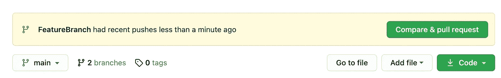

# Git 开发人员工作流程

> 原文：<https://blog.devgenius.io/git-developer-workflow-a0956e70972?source=collection_archive---------1----------------------->

## 为了支持协作环境


詹姆斯·哈里森在 [Unsplash](https://unsplash.com/photos/vpOeXr5wmR4) 上的照片

在有多个参与者的项目中工作时，拥有一致且高效的开发人员工作流是至关重要的。如果没有结构化的工作方式，如果多个开发人员将代码提交给同一个 git 存储库，代码可能会陷入混乱的状态。如果团队没有相同的工作方式，通常很难判断其他人的工作状态并简单地保持最新的稳定版本。本文概述了当有多个开发人员在一个项目上工作时，git 开发人员的基本工作流程。本文假设读者对 git 和分支有基本的了解。

# 主线分支

当使用 Git 时，`mainline`分支通常被认为是包含项目稳定版本的分支。检验这个分支意味着开发人员可以期望软件工作，已经测试，并且可以在所有支持的目标上构建和运行。

开发人员不应该直接在主线分支上工作。相反，所有开发都应该在一个特性分支中完成，并在代码评审完成后合并到主线分支中。推荐的开发工作流程概述如下。

# 1.创建特征分支

当开发人员开始一项新任务时，他们应该创建一个从主分支创建的特性分支。特性的所有相关开发都应该在这个特性分支上完成。

从主分支获取最新信息:

`> git pull origin master`

创建特征分支:

`> git checkout -b FeatureBranch`

# 2.压缩提交

给定特性的开发完成后，开发人员可能希望清理提交历史。根据特性的范围和开发风格，变更可能由带有无信息提交消息的多次提交组成。例如，你见过多少次像“填充”、“修改”、“修正打字错误”这样的提交？这些提交可以从 git 历史中删除。

首先，记下有多少提交应该被压缩。这可以通过查看日志来验证。

`> git log`

假设我们想要压缩最后 3 个提交。压缩提交并编写新的提交消息:

`> git reset --soft HEAD~3 && git commit`

# 3.重设主线的基础

在推送和创建一个合并请求之前，建议对主线的变更进行调整。将主线分支的最新变更合并到特征分支是必要的，以避免将特征分支合并到主线分支时的合并冲突。

重定基础而不是合并的主要优点是在主线分支上创建一个清晰的线性历史。

```
# Pull the latest changes from mainline
> git checkout mainline
> git pull origin mainline# Rebase to mainline
> git checkout FeatureBranch
> git rebase mainline
```

# 4.推送特征分支

既然 feature 分支已经更新了，那么就推送分支，以便其他开发人员和远程网络可以使用它。

`git push origin FeatureBranch`

# 5.创建拉式请求

项目中的合作者审查所有代码变更是最佳实践。这对于识别任何潜在的 bug 以及让参与项目的其他开发人员意识到变更是很重要的。

一旦特性分支被推送到回购，GitHub 中就会出现**比较&拉取请求**按钮选项。点击此按钮将引导您完成创建拉取请求的提示。



# 6.将功能分支合并到主线中

一旦拉取请求被批准，分支就可以合并到主线中了！这意味着添加到特性分支的变更将会出现在主线分支中。其他开发人员下次从主线分支提取变更时，将会收到来自特性分支的更新。

通过选择**合并拉取请求**按钮，可以将特征分支合并到主线中。


# 7.删除特征分支

既然特性的开发已经完成，并且变更已经被合并，那么特性分支就可以被删除了。

可以通过运行以下命令删除远程分支:

`git push origin :FeatureBranch`

可以通过运行以下命令删除本地特征分支:

`git branch -D FeatureBranch`

# 结论

实施一致的开发人员工作流将有助于保持代码的组织性，并提供更快、更易维护的开发环境。上述工作流是提供一种环境的一种方法，在这种环境中，开发人员可以专注于代码的质量，而不会因为在协作环境中工作而受到阻碍。