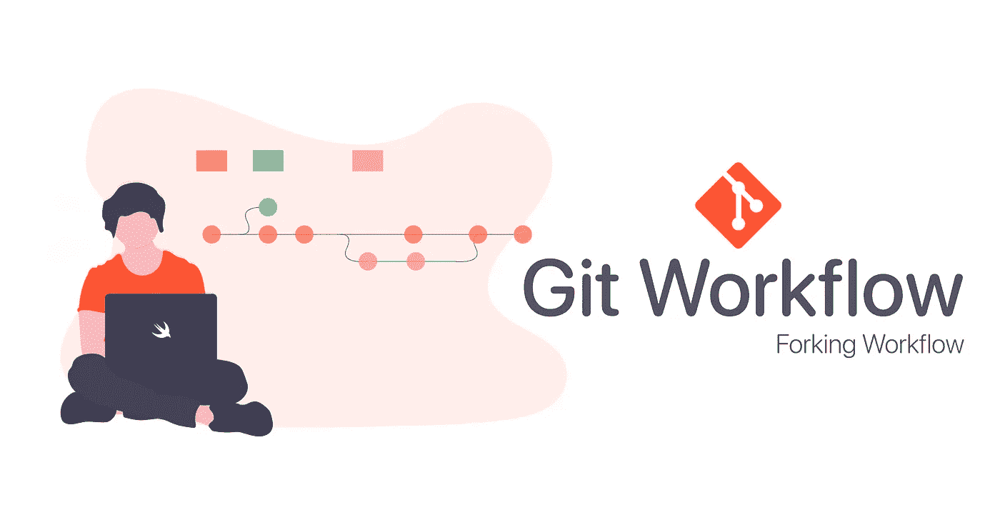
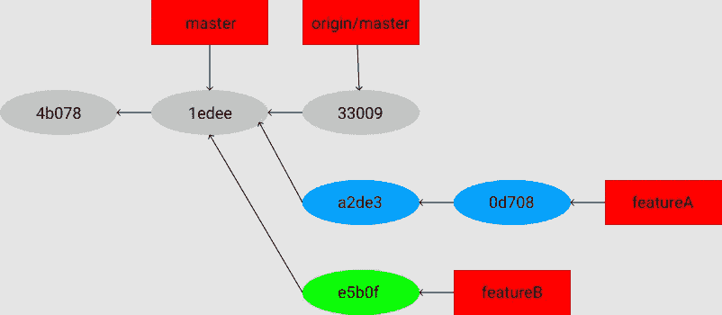
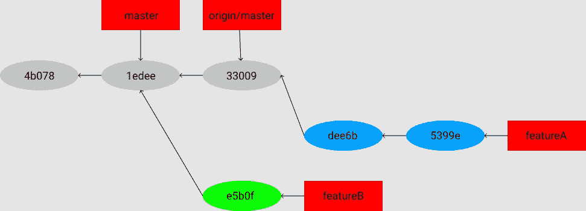
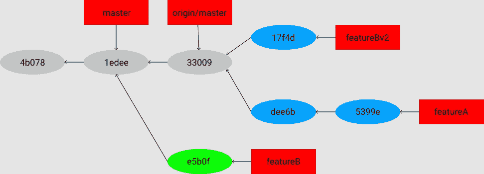

# git-分叉工作流

> 原文：<https://blog.devgenius.io/git-forking-workflow-bbba0226d39c?source=collection_archive---------0----------------------->

## 开源项目的工作流



要了解什么是工作流，请看一下[这个](https://medium.com/swlh/git-workflow-7134b4eb9e5c)。

**分叉工作流程**与其他工作流程稍有不同。因为它为每个开发人员提供了自己的服务器端存储库。分叉工作流在开源项目中更常见。

分叉工作流的主要优点是，不需要每个人都推到一个单一的中央存储库就可以完成贡献。开发者推送到他们**自己的服务器端仓库**，只有**项目维护者**才能推送到官方仓库。这允许维护者接受来自任何开发者的提交，而不给他们对官方代码库的写访问权。

## 它是如何工作的？

1.  一个开发者分支一个服务器端的仓库。这将创建它们自己的服务器端副本。
2.  新的服务器端副本被克隆到他们的本地系统。
3.  存储库的 Git 远程路径被添加到本地克隆中。
4.  将创建一个新的局部特征分支。
5.  开发人员对新分支进行更改，并为这些更改创建新的提交。
6.  分支被推送到开发人员自己的服务器端副本。
7.  开发人员打开从新分支到存储库的拉请求。
8.  拉请求被批准合并，并被合并到原始的服务器端存储库中。

## 什么是分叉？

没有唯一的 Git 命令来创建分叉的存储库。因为**分叉**不是特殊操作。分叉库是使用标准的 **git clone** 命令创建的。分叉库通常是服务器端克隆，通常由第三方 Git 服务管理和托管，如 Github。

让我们看看它是怎么做的，

首先，主存储库被克隆，计划贡献的补丁的主题分支被创建，工作完成。

## **序列**为**这个看起来是这样的**

```
$ **git clone** <url>
$ **cd** project
$ **git checkout** -**b** featureA
… work …
$ **git commit**
… work …
$ **git commit
...**
```

当分支工作完成并准备反馈给维护人员时，点击**原始项目页面**中的 **Fork** 按钮，现在创建了项目自己的可写分支。

然后，将这个存储库 URL 作为新的远程存储库添加到本地存储库中。在这里，它被称为 myFork

```
$ **git remote add** myFork <url>
```

现在，新的工作将被推送到这个存储库。很容易将正在处理的主题分支推送到分叉的存储库，而不是将工作合并到主分支中。

原因是如果工作不被接受，那么主分支不需要重绕。
在任何情况下，工作都可以通过以下方式推进:

```
$ **git push -u** myFork featureA
```

一旦工作被推到了存储库的分支，为了合并工作，必须通知原始项目的维护者。

这通常被称为**拉请求**，它是使用 **git 请求-拉**命令完成的。

## **考虑一下这个场景:**

如果**开发人员 1** 想要发送**开发人员 2** 一个拉请求，并且开发人员 1 已经在刚刚推送的主题分支上完成了两次提交，那么开发人员 1 可以运行这个:

```
$ **git request**-**pull** origin/master myFork
```

这将显示自提交以来所做的更改

这个输出可以被发送给维护者，它告诉他们工作是从哪里分支的，总结提交，并确定新工作将从哪里提取。

在一个项目中，如果一个人不是项目的维护者，那么让一个像 master 这样的分支总是跟踪 origin/master，并在主题分支中完成您的工作通常会更容易，如果它们被拒绝，您可以很容易地丢弃它们。

将工作主题隔离到主题分支中也使得在主存储库的尖端已经移动并且您的提交不再适用的情况下，重新确定工作的基础变得容易。

## **例如，考虑这个场景**

如果要提交项目的第二个工作主题，不建议继续从主存储库的 master 分支向上推的同一个主题分支。

```
$ **git checkout -b** featureB origin/master
… work …
$ **git commit**
$ **git push** myFork featureB
$ **git request**-**pull** origin/master myFork
… email generated request pull to maintainer …
$ **git fetch** origin
```

现在，每一个主题都可以被重写、调整和修改，而不会相互干扰或相互依赖:



功能 b 工作的初始提交历史记录

假设项目维护者引入了一堆其他补丁，并尝试了现在已经创建的第一个分支，但是它不再清晰地合并。在这种情况下，这个分支可以基于 **origin/master** 之上，为维护者解决冲突，然后重新提交变更。

```
$ **git checkout** featureA
$ **git rebase** origin/master
$ **git push -f** myFork featureA
```

这重写了历史，现在看起来像是一个作品后提交历史。



在功能后提交历史一个作品

由于分支被重置，为了能够替换服务器上的 featureA 分支，必须将 **-f** 指定给 push 命令。另一种方法是将这个新作品推送到服务器上不同的分支(可能称为 featureAv2)。

## **让我们再看一个可能的场景:**

维护人员查看了第二个分支中的工作，喜欢这个概念，但希望开发人员更改实现细节。

考虑到这个机会，移动的工作，以该项目的目前掌握分支机构。

基于当前的源/主分支开始一个新分支，压缩那里的 featureB 更改，解决任何冲突，进行实现更改，然后将其作为新分支推进

```
$ **git checkout -b** featureBv2 origin/master
$ **git merge** — **squash** featureB
… change implementation …
$ **git commit**
$ **git push** myFork featureBv2
```

**squash** 选项将合并分支上的所有工作压缩到一个变更集中，产生存储库状态，就像发生了真正的合并一样，而不需要实际提交合并。

这意味着任何未来的提交将只有一个父，这允许从另一个分支引入所有的更改，然后在记录新的提交之前进行更多的更改。

此时，可以通知维护人员请求的更改已经完成，并且可以在 featureBv2 分支中找到这些更改。



featureBv2 工作后提交历史记录

这让我们对什么是分叉工作流以及它是如何工作的有了一个全面的了解。

[](https://twitter.com/DhayalCuber) [## 达亚尔·拉朱

### iOS 开发者实习生@ivymobility，Speed Cuber，游戏玩家

twitter.com](https://twitter.com/DhayalCuber)