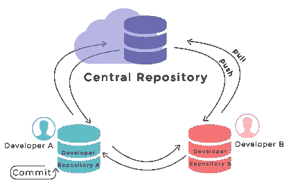
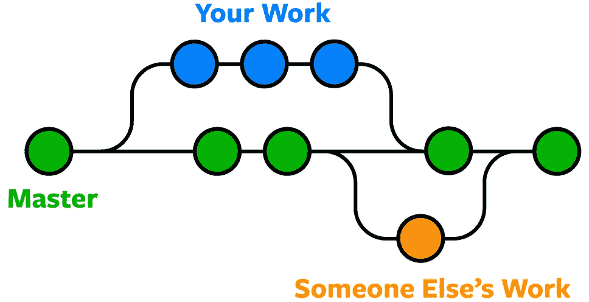

# 从头开始的 Git:基本的 Git 术语

> 原文：<https://blog.devgenius.io/git-from-scratch-basic-git-terminologies-2b8c663ea592?source=collection_archive---------12----------------------->

## 第 03 条

罗曼·辛克维奇·🇺🇦在 [Unsplash](https://unsplash.com?utm_source=medium&utm_medium=referral) 上拍摄的照片

在 Git 从头开始系列的第三篇文章中，我将介绍一些重要的基本 Git 术语。让我们开始…

## 贮藏室ˌ仓库

Git 存储库是一个**数据库**，包含存储和管理项目修订和历史所需的所有信息。存储库保存了整个项目的完整副本。每个项目都有自己的存储库。

## 本地知识库

本地存储库是存储在您的工作站或计算机上的 Git 存储库。

## 遥远的

远程或远程存储库是存储在互联网上的存储库。这个远程存储库作为共享存储库工作，因此团队成员可以推动协作和备份的更改。

**Origin** 是远程存储库的默认名称。

## 克隆

它用于创建目标存储库的副本。如果您想要在您的计算机上有一个 GitHub 资源库的副本，您可以使用这个工具在您的本地目录中使用资源库 URL 创建一个。

## 树枝

分支是指向提交的指针。它允许开发者从主分支中分离出来。一个分支代表一个独立的开发路线。

**主分支**是 Git 中第一个分支的默认分支名称。

**工作树**是您工作区中的当前分支。

## 犯罪

对存储库所做的每一个更改都由一个提交来表示，其中包含诸如作者、提交者、提交日期和日志消息之类的元数据。它在新提交中存储索引的当前内容，并存储来自用户的描述更改的日志消息。提交的快照被认为是项目的“安全”版本。

**HEAD** 是指向当前分支上最近提交的指针。

## 索引

索引是一个临时的动态二进制文件，描述了整个存储库的目录结构。更具体地说，该索引在某个时间点捕获了项目整体结构的一个版本。简单地说，它是提交更改之前存储更改的缓存。

## 采摘樱桃

在 Git 中，挑选被用来将提交从一个分支应用到另一个分支。如果您犯了一个错误，并且提交了对不正确的分支的修改，您不希望合并整个分支。您可以撤销提交并在不同的分支上进行挑选。

## 标签

标记对象给一个特定的对象起一个任意的但可能是人类可读的名字，通常是 commit。虽然 9 da 581d 910 c 9 C4 AC 93557 ca 4859 e 767 f 5 caf 5169 与特定且定义明确的提交相关，但更常见的标记名称(如 Ver-1.0- Alpha)可能更合适。

## 隐藏

当在一个分支机构工作时，尽管你的工作还没有完成，你还是想换一个分支机构。你不需要提交那些未完成的工作。所以 Git stashing 允许您在不提交当前分支的情况下切换分支。它是另一个作为堆栈的缓存，允许修改被保存而不被提交。

## 叉

分支是存储库的副本。当您派生一个存储库时，您可以在不损害原始项目的情况下自由地试验修改。fork 通常用于建议对您没有写权限的其他人的项目进行更改，或者使用其他人的项目作为您自己的概念的起点。

要创建一个存储库的副本并在不影响上游存储库的情况下进行更改，请派生它。

## 合并

整合来自另一个分支的变更被称为合并。

## 拉

Pull 这个词指的是从 GitHub 接收数据的过程。它从远程服务器获取更新并将其合并到您当前的工作目录中。

## 拉取请求

拉请求是开发人员告诉团队成员他们已经完成了某个特性的工作的一种方式。当他们的特性分支完成时，开发人员通过他们的远程服务器帐户发送一个拉请求。pull 请求通知所有团队成员，在将代码合并到主分支之前，他们必须检查代码。

## 推

“推送”是指将本地存储库资料上传到远程存储库。推送是将提交从本地存储库转移到远程存储库的行为。推送有可能覆盖更改。

这是本系列第三篇文章**从头开始**的结尾。如果你想参考我的前两篇文章，你可以使用下面的链接。

*   [Git 从零开始:Git 简介](https://medium.com/@senevirathnehu/git-from-scratch-introduction-to-git-40f959ec5ce3)
*   [Git 从零开始:如何在 Windows 上安装 Git](https://medium.com/@senevirathnehu/git-from-scratch-how-to-install-git-on-windows-d3a0bb420340)

让我们来看看下一篇文章。快乐学习！