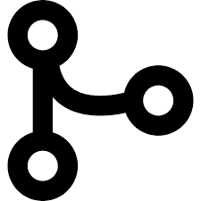

# 从头开始 Git:用于分支、合并和协作的基本 Git 命令

> 原文：<https://blog.devgenius.io/git-from-scratch-essential-git-commands-for-branching-merging-and-collaborating-8acfad75291?source=collection_archive---------9----------------------->

## 第 06 条

前两篇文章讨论了用于准备和提交的 [**基本 Git 命令**](https://medium.com/@senevirathnehu/git-from-scratch-essential-git-commands-for-staging-and-commits-f7eba5ef433c?source=your_stories_page-------------------------------------) 和用于撤销和检查变更的 [**基本 Git 命令**](https://medium.com/@senevirathnehu/git-from-scratch-essential-git-commands-for-undoing-and-inspecting-changes-8c0bd0fe7570?source=your_stories_page-------------------------------------) **。在本文中，让我们看看分支、合并和协作的基本命令。**

首先，我们来看看分支。

## 1.Git 分支

要创建分支:

**$ git 分支*分支名称***

要获取分支列表:

**$ git 分支**

或者

**$ git 分支—列表**

要删除分支:

**$ git branch-d*branch name***

要删除远程分支:

**$ git 推送原点-删除*branch name***

要在分支之间切换:

**$ git check out*branch name***

要切换到主分支:

**$ git 开关-m 主机**

要重命名分支:

**$ git branch-m*oldbranch name*new branch name**

接下来，我们来看看合并。

## 1.Git 合并

要合并分支:

**$ git 合并 *branchName***

**合并冲突**

合并冲突是当两个分支试图合并，并且两个分支同时在同一文件中被修改时发生的冲突。Git 无法确定哪个版本应该用于修改。所以我们必须解决这个冲突来合并分支。

我们可以使用

**$ git 合并工具**

并使用以下命令接受更改:

**$ git rebase —继续**

之后，它会解决冲突。

现在让我们来看看哪些命令用于协作。

## 1.获取 Git

Git fetch 用于将文件、提交和引用从远程存储库下载到本地存储库中。

要获取存储库中的所有分支:

**$ git fetch*remotepositoryurl***

要获取特定分支中的所有内容:

**$ git fetch*remotepositoryurl branch name***

要同时获取所有分支:

**$ Git 获取全部**

**2。Git pull**

**$ git 拉**

从另一个存储库或本地分支获取并与它合并。它用远程存储库中的更改更新本地存储库。

**3。Git 推送**

**$ git 推送**

此命令会将本地存储库内容上传到远程存储库。

TaDaaa…我们已经到了文章系列**从头开始**的结尾。这是本系列的最后一篇文章，我们已经接近尾声了。我希望您从这个系列中学到并喜欢 Git。非常感谢！！

快乐学习！