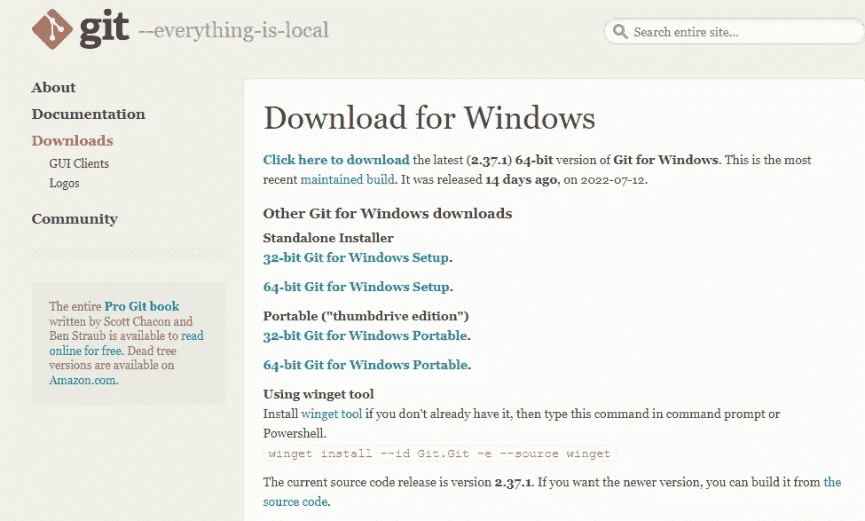
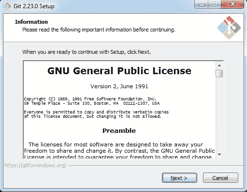
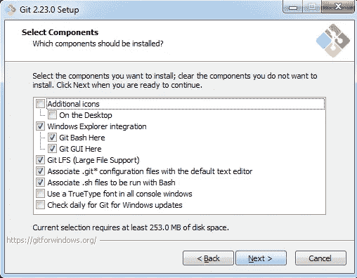
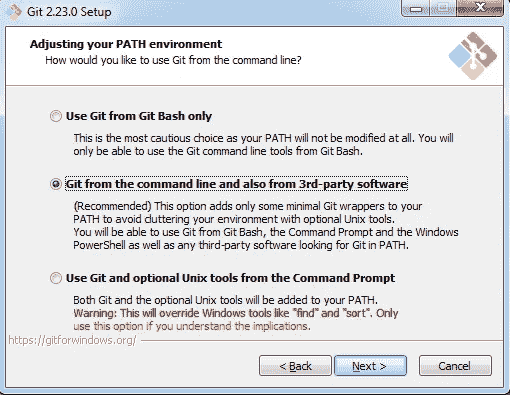
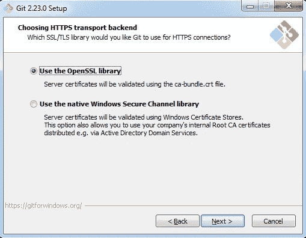
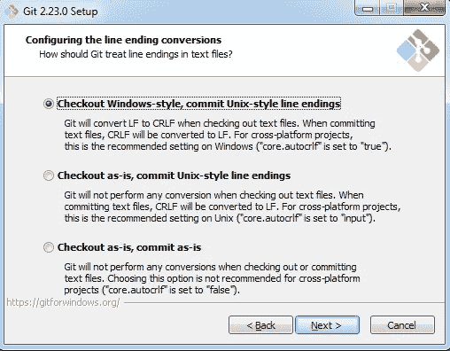
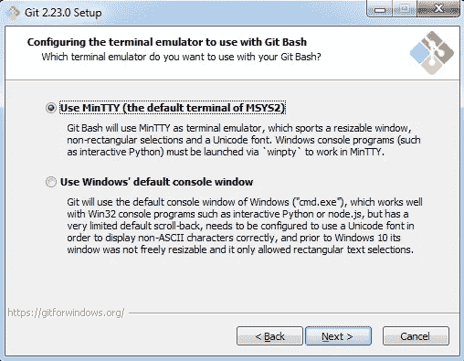
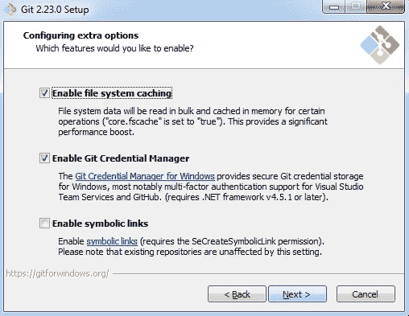

# 从头开始 Git:如何在 Windows 上安装 Git

> 原文：<https://blog.devgenius.io/git-from-scratch-how-to-install-git-on-windows-d3a0bb420340?source=collection_archive---------12----------------------->

## 第 02 条

这是 Git 从头开始文章系列的第二篇文章。如果你想学习什么是 Git？请参考文章 1: [**Git 从无到有:Git** 简介](https://medium.com/@senevirathnehu/git-from-scratch-introduction-to-git-40f959ec5ce3)。

要使用 Git，首先，我们应该在我们的计算机上安装它。所以从这篇文章中，我们来看看如何在 Windows 上安装 Git。

让我们一步一步来。

## 第一步:

使用 https://git-scm.com/download/win 的[链接进入 Git 下载页面。](https://git-scm.com/download/win)

## 第二步:

根据您的计算机选择 32 位或 62 位 Windows 安装程序。

然后将下载 Git 安装包。

## 第三步:

单击下载的文件，然后选择“是”继续。然后你可以看到下面的预览，点击下一步继续。

## 第四步:

在这里，您可以选择任何其他选项，而不是已经选择的默认选项。

## 第五步:

这里也自动选择了默认的命令行选项。想改就改吧。

## 第六步:

如果你想改变，你可以改变它。如果没有，您可以继续下一步。

## 第七步:

选择您想要的功能并继续。

## 第八步:

选择您想要的选项并继续。

## 第九步:

选择所需的功能并继续。

## 第十步:

完成步骤 9 后，文件将被提取。

**恭喜恭喜！！！您成功安装了 Git。**

让我们在下一篇文章中相遇。快乐学习！