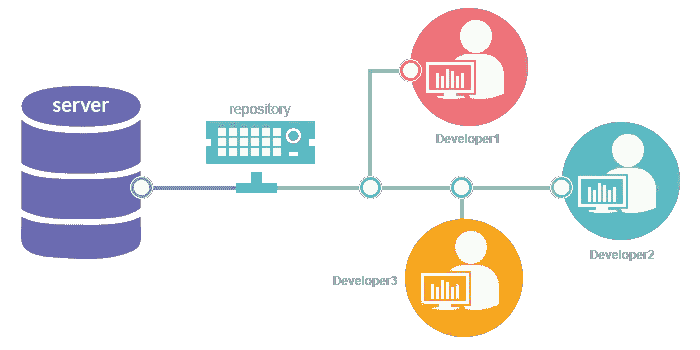

# 从头开始 Git:Git 简介

> 原文：<https://blog.devgenius.io/git-from-scratch-introduction-to-git-40f959ec5ce3?source=collection_archive---------6----------------------->

## 第 01 条

“Git”是软件行业中经常听到的词。因此，让我们通过这个系列文章**从头开始深入 Git。**

作为第一步，本文将向您介绍 Git。

这篇文章包括:

*   [什么是版本控制系统？](https://medium.com/p/40f959ec5ce3#d364)
*   [什么是饭桶？](https://medium.com/p/40f959ec5ce3#bf21)
*   [是什么导致了 Git 的诞生？](https://medium.com/p/40f959ec5ce3#ede6)
*   [Git 的时间表](https://medium.com/p/40f959ec5ce3#d3eb)
*   [发布](https://medium.com/p/40f959ec5ce3#c84e)
*   [为什么取名 Git？](https://medium.com/p/40f959ec5ce3#238b)

在迁移到 Git 之前，最好了解一下什么是版本控制系统？

## 什么是版本控制系统？

如今，我们不会在没有适当备份策略的情况下开始一个项目，因为数据很容易由于磁盘崩溃、病毒、格式错误等原因而丢失。所以作为备份策略，我们使用版本控制，跟踪和管理文本和代码项目的修订。

因此一般来说，

> **版本控制系统是一种管理和跟踪软件或其他内容的不同版本的工具。**

这个版本控制系统，

*   开发和维护内容存储库
*   提供对历史版本的访问
*   在日志中记录所有更改。

版本控制系统

现在让我们转到 Git…

## Git 是什么？

Git 是一个强大、灵活、低成本的版本控制系统**,它使得协作工作变得简单。Linus Torvalds** 创建 Git 是为了帮助开发 Linux 内核，但是现在已经证明它对许多项目都有帮助。

## 是什么导致了 Git 的诞生？

以下是在 Git 之前使用的一些版本控制系统:

*   源代码控制系统(SCSS)
*   修订控制系统(RCS)
*   并行版本系统
*   颠覆(SVN)
*   比特保管员

在 Git 发明之前，Linux 内核是使用商业 BitKeeper 版本控制系统开发的。2005 年，该公司旗下的 Bitkeepr 增加了一些限制。这就需要一个可行的解决方案。

莱纳斯·托沃兹

因为这个问题，Linus 研究了自由软件包并试图找到一个替代方案。但是他发现他需要的一些功能也不在这些软件包中。以下是他想要的在别人身上找不到的特征:

*   促进分布式开发
*   扩展以应对数千名开发人员
*   快速高效地执行
*   保持诚信和信任
*   实施问责制
*   不变
*   原子交易
*   支持和鼓励分支发展
*   完整的存储库
*   简洁的内部设计

这些因素催生了新的版本控制系统，Git 应运而生。

Linus 亲切地称 Git 为“来自地狱的信息管理者”。

## **Git 的时间表**

*   Git 出生于 **2005 年**
*   在**2005 年 4 月 7 日，** Git 成为自托管的。
*   2005 年 4 月 18 日**，**进行了第一次多分支机构的合并。
*   2005 年 7 月 25 日，Linus 将 Git 源代码的维护工作交给了 Junio Hamano。

## **发布**

*   从 2005 年 7 月 11 日**第一次发布的 **0.99** 版本开始，Git 的最新版本到 2022 年 7 月 26 日为 **2.37** ，于 2022 年 6 月 26 日**发布。

## 它为什么被命名为 Git？

Linus 对“Git”这个名字的解释是，“我是一个自恋的混蛋，我用自己的名字命名我所有的项目。”先是 Linux，现在又是 Git，因为 Git 在英式英语俚语中的意思是不讨人喜欢的人。

其他人现在提出了替代的，可能更有吸引力的解释。其中最受欢迎的似乎是 T21 的叶片架。

希望和大家见面第二篇 [**Git 从零开始:如何在 Windows**](https://medium.com/@senevirathnehu/git-from-scratch-how-to-install-git-on-windows-d3a0bb420340) 上安装 Git。在那之前…

快乐学习！