# GIT 和 GITHUB，适合完全的初学者

> 原文：<https://blog.devgenius.io/git-github-for-a-complete-beginner-95a901973687?source=collection_archive---------4----------------------->

**什么是 GITHUB**

GitHub 是一个帮助记录项目的资源库。我们可以简单地称它为帮助保存我们的项目的容器。人们可以随时访问这个容器，进行更改等。它仍然有助于保存我们的文件，直到需要它的时候。GitHub 提供了一个平台，开发者可以在这个平台上为另一个开发者的工作做出贡献。使用它是安全的&作为一名开发者，你最好有一个 GitHub 帐户。如果您还没有帐户，可以访问“GitHub.com”创建一个帐户。

**什么是 GIT**

这是一个开源版本控制系统，使我们能够在 GitHub 页面上对我们的远程 repo 进行更改。首先，从你的浏览器下载“git”，Git 带有**“Git bash”**。git bash 是运行命令的替代终端。但是，下图将在 vscode 文本编辑器上执行，该编辑器还自带内置的集成终端。Git 有一些我们在使用时会遇到的基本命令，让我们讨论一下基本命令的用法。我创建了一个名为“演示”的存储库，下面有插图。让我们从以下内容开始:

**i)** ***创建回购* : :** 让我们从在 GitHub 页面上创建一个新的回购开始。点击带下划线的单词**“新建”**。

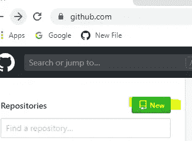

**ii)** ***保存回购* : C** 点击“新建”&它会将您重定向到一个页面，您可以在该页面中为您的回购指定一个您想要保存的标题。例如，让我们用“演示”来保存它。键入 demo，向下滚动&点击“初始化带有自述文件的存储库”。单击下面的创建存储库。

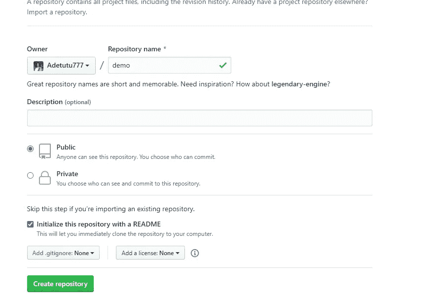

**iii)** ***GIT 克隆* :** 这仅仅意味着将我们在 GitHub 页面上的现有回购复制到我们的本地回购(PC)。要将其克隆到我们的 pc 上，我们只需输入**git clone“URL”**。如下所示，可以复制 URL。点击“克隆或下载&用 HTTPS 复制 URL 克隆”。

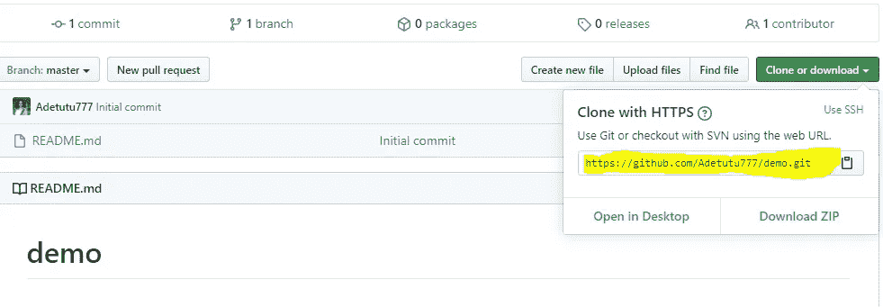

在你的电脑上打开你的命令提示符(CMD)，输入**“git 克隆**[**【https://github.com/Adetutu777/demo.git】**](https://github.com/Adetutu777/demo.git)**(从 GitHub 上新创建的 repo 复制的 URL)。下划线“cd”用于导航到我的电脑，这是我想要保存它的地方。例如，我想把这个文件保存在我的桌面上，在你的 CMD 上输入 **cd desktop** ，它会带你进入桌面文件夹，然后运行这个命令“git clone[https://github.com/Adetutu777/demo.git](https://github.com/Adetutu777/demo.git)”。下一段陈述“克隆到演示”显示了它的克隆过程。一旦它显示完成，然后它终于克隆到您的电脑。在这里，我在我的桌面上克隆了我的**

**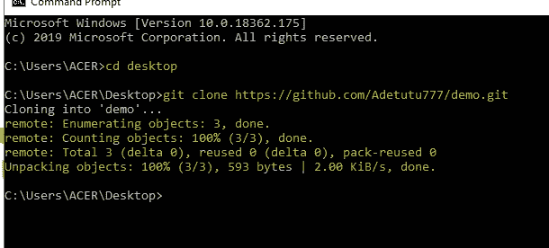**

****iv)** ***创建新文件* :** 新回购现已克隆到我们的 pc 上，让我们在文本编辑器上创建一个新文件，一个“index.html”文件，其中包含一段“Hello world”，以查看对本地回购的影响&远程回购。**

**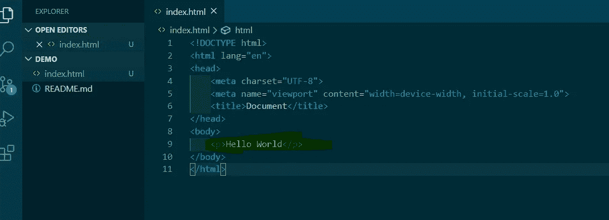**

****v)*****GIT ADD*:**这是在对你的项目进行修改之后你必须做的第一件事。该命令有助于暂存我们刚刚在本地计算机(pc)上所做的更改。您在终端上以这种方式运行命令 **"git add。**(点号)"**

**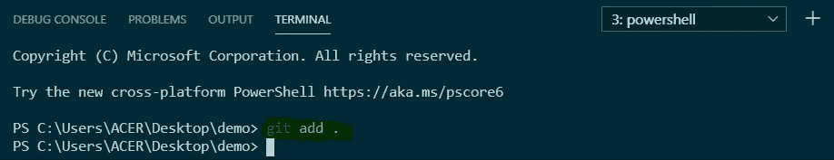**

**git 添加。将添加您正在处理的所有内容，例如，有一个 index.html，style.css & a script.js 文件。让我们假设我们已经对这三个文件进行了修改，git add。帮助暂存对三个文件所做的更改。然而，如果我们只想添加三个文件中的一个，例如，让我们添加一些 CSS 样式到我们的段落，看看它是如何工作的。**

**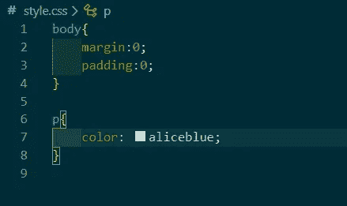**

**为了只对 CSS 文件进行修改，我们只需在终端上运行 **"git add style.css"** 。**

**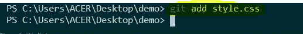**

****VI)******GIT COMMIT:***这是你 git add 之后的另一个重要命令。Git commit 有助于保存在本地 repo 上所做的更改。为此，只需在文本编辑器终端上键入命令**“git commit–m”message "**。此处引号中的消息将显示在您的 GitHub 页面上，一个描述您所做更改的简短单词，例如，在创建的演示页面上，让我们通过键入**git commit–m“first commit”来提交它。*****

***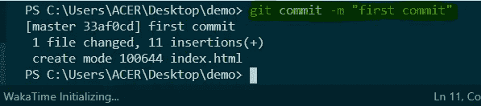***

***vii) ***GIT PUSH:*** 该命令帮助将我们在本地 repo(pc)上所做的每一项更改推送到我们的 GitHub 页面(远程 repo)。记住，我们首先在 GitHub 页面上创建一个新的回购协议，在我们的本地机器上克隆它，在本地机器上的回购协议上创建一个 index.html 文件，我们 git add & git commit。做完这一切后，git push 命令将帮助我们将新的更改推送到 GitHub repo 中。要做到这一点，在你的终端上运行命令**“git 推送源主机”**。***

***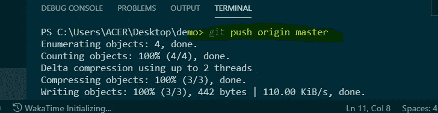***

***重新加载您的 GitHub 页面&查看我们在本地回购上所做的更改，这些更改现在也添加到了我们的 GitHub 回购中。***

***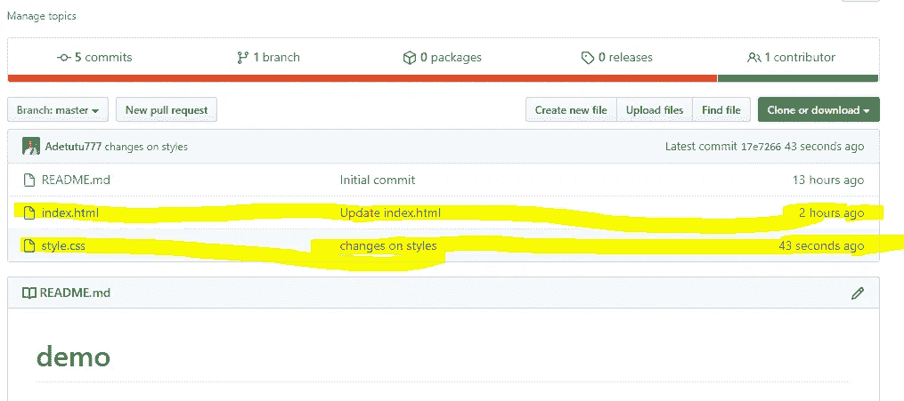***

***VIII)***GIT PULL***:GIT PULL 有助于将我们在远程 repo (GitHub 页面)上的所有新更新获取到我们的本地 repo(pc)。例如，让我们在我们的远程回购(GitHub 页面)上查看 index.html 文件&添加另一个段落，即< p >我是一名开发人员< /p >。***

***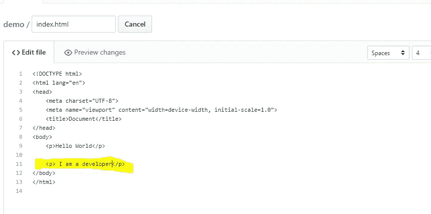***

***为了将这个更新到我们的本地 repo，您可以通过在您的终端上写**“git pull”**来在您的文本编辑器终端上进行 git pull。***

***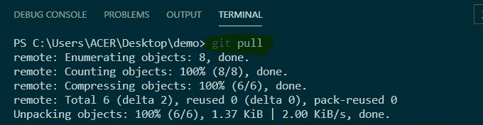********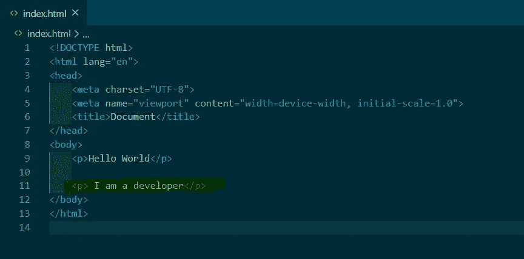*****

*******ix)** ***GIT 状态* :** 这个命令有助于显示到目前为止对你的项目所做的变更。为此，在您的终端上键入“git status”。*****

*****在任何时候，当你在做你的项目时，你可以**【git status】**看到你现在的状态。目前，我们的分支是最新的。每一个变化都是阶段性的，提交&推。*****

*****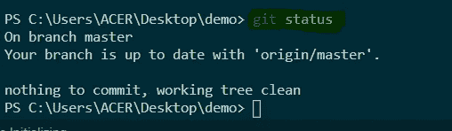*****

> *****这篇文章是为一个完全的初学者写的，他发现在做个人项目的时候很难通过 Git & GitHub 导航。我希望你对此感兴趣和理解，如果是的话，请点击拍手按钮。也欢迎你的评论。*****