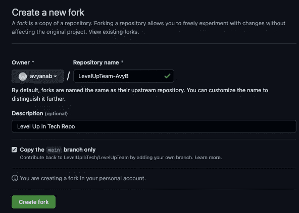
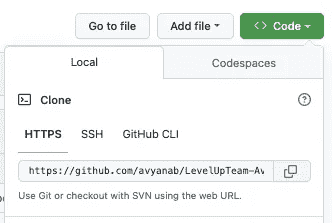
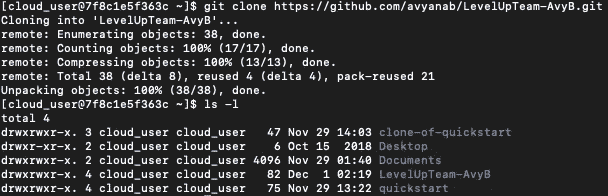
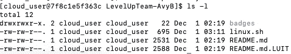
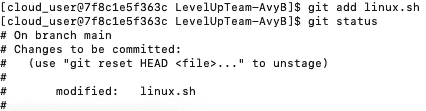
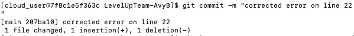
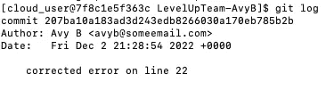
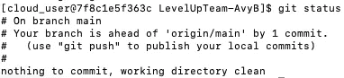
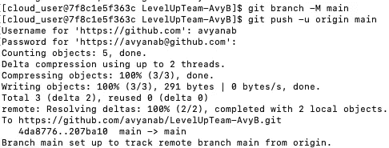

# Git(Hub)基础:Fork、Clone、Push & Pull

> 原文：<https://blog.devgenius.io/git-hub-basics-fork-clone-push-pull-682877ab81e9?source=collection_archive---------1----------------------->


图片来源:[Vecteezy 的 Github 图标矢量](”https://www.vecteezy.com/free-vector/github-icon")

对于准备开始使用 Git 和 GitHub 的人来说，这是一本入门指南。简而言之，我将向您展示如何派生和克隆一个存储库，配置 git，推送文件更改，以及发送一个 pull 请求。

# **一个真正的配对:Git & GitHub**

如果你曾经参与过一个团队项目，那么你就会明白交流有多重要。由于技术上的创新思维，有许多程序可以帮助团队在项目工作时有效地沟通。Git 是一个命令行上的版本控制系统，它允许协作者跟踪变更，同时为小型和大型项目开发代码。GitHub 是一个基于网络的平台，在这个平台上，这些合作者可以存储项目文件、查看文件修订、通过网络分享想法等等。现在，您看到了为什么 Git 和 GitHub 像花生酱和果冻(或者果酱，如果您喜欢的话)一样走到一起。

# **目标**

派生一个存储库，克隆派生的存储库，使用 Vim 编辑存储库目录中的文件，将修改后的文件保存并添加到本地存储库中，提交文件，推送到 GitHub 存储库，并发送一个 pull 请求。

**常用术语:**

*   存储库(又名 repo):这是所有项目文件和修订历史的位置。
*   克隆:将包含来自存储库的所有当前数据。
*   Fork:创建回购协议的副本，以便在不修改原始回购协议的情况下进行更改。

**你需要什么:**

*   GitHub 账号(可以免费注册 [**这里**](https://github.com/signup?ref_cta=Sign+up&ref_loc=header+logged+out&ref_page=%2F&source=header-home) )
*   熟悉命令行和 vim 或首选文本编辑器
*   带有 CentOS7 的服务器
*   一般计算机知识
*   Notes 应用程序或桌面便笺

# 第一步:准备

*   登录您的 GitHub 帐户。
*   创建个人访问令牌(**重要提示**):单击左侧的设置➡️，在底部，单击开发人员设置➡️个人访问令牌➡️生成新令牌➡️复制令牌代码并粘贴到您的桌面便签应用程序或便笺条中，这是一个安全且易于访问的内容&。我们将在第 6 步中使用这个令牌！
*   打开终端并通过 ssh 进入您的服务器
*   使用以下命令安装 git(如果尚未安装),并准备输入您的用户密码:

```
sudo yum install -y
```

# 步骤 2:配置 git

*   我们将使用以下命令配置 git 并设置所有必要的变量:

```
git config --global "user.name"
git config --global "user.email"
git config --global system core.editor vim 
```

*您将在上面引用的部分输入您的首选用户名和电子邮件地址*

*   由于我仍在学习，我喜欢确认以下配置:

```
git config -l
```

*   如果您想查看更多配置选项，可以使用以下命令:

```
git config
```

# 步骤 3:分叉和克隆

*   在 GitHub 上，选择一个回购，叉上。


哪里可以找到叉形按钮

*   命名该存储库，然后单击“创建分叉”:



创建新分叉的示例

*   导航到您的分叉回购，然后单击绿色的**代码**按钮。复制 **HTTPS** 下的唯一网址。



在哪里可以找到 URL

*   使用复制的 URL，打开您的终端并使用以下命令克隆分叉的 repo:

```
git clone <insert repo URL>
```



克隆回购并查看长列表后，您会看到什么

# 步骤 4:文件编辑

*   我们将进入克隆的回购目录。如果您喜欢将事情分开，您可以创建一个新目录，并在该新目录中克隆 repo。

```
cd <directory name>
ls -l
```



改变工作目录和长列表内容后的结果

*   选择要编辑的文件，并输入以下命令:

```
vim <file.name>
```

*   我们将修改后的文件添加到本地存储库中，并使用以下命令检查状态:

```
git add <file.name> 
git status 
```



对文件的更改已暂存，准备提交

# 第五步:提交

*   使用以下命令提交文件:

```
git commit -m "enter message about your change"
```



提交文件后收到的消息示例

*   您可以查看 git 日志，它提供了所做更改的摘要(可选):

```
git log 
```



git 日志的示例。你可以使用<q>退出日志。</q>

*   一旦您成功地提交了所有修改的文件，您可以检查 git 状态，您将会收到如下消息(可选):

```
git status
```



# 第六步:推动

*   确保您在主分支上:

```
git branch -M main
```

*   使用以下命令推送提交的文件:

```
git push -u origin main 
```

*   系统会提示您输入您的 **GitHub 用户名**，然后输入在**步骤 1 中保存的**个人访问令牌**。**



输入上述命令后会出现什么情况

*   回到你在 **GitHub** 上的分叉回购。刷新页面，你会看到你修改的文件已经成功推送！


您应该会在您编辑的文件名旁边看到来自提交的消息

# 步骤 7:拉式请求

*   停留在分叉回购的当前页面，然后单击“拉取请求”按钮。


*   新的拉式请求➡️添加拉式请求的解释➡️提交并等待回购责任人的决定！

# 编码快乐！

Git 和 GitHub 的惊人之处在于，有很多方法可以做同样的事情。我期待着进一步实践，以及找到一些合作项目！

我希望这个指南是有帮助的。欢迎在下面留下反馈或评论。一如既往的感谢您的阅读！

如果你想了解更多关于 GitHub 的信息，这段 20 分钟的视频很有帮助:[https://www.youtube.com/watch?v=nhNq2kIvi9s](https://www.youtube.com/watch?v=nhNq2kIvi9s)