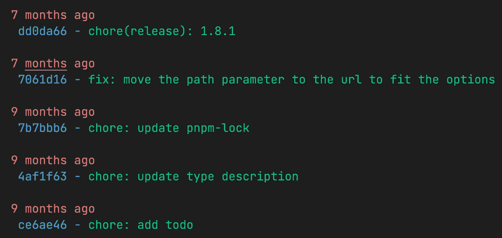
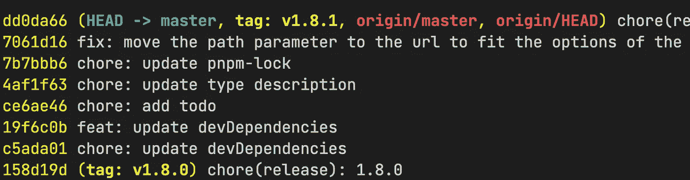

# 你可能不知道的 Git 日志技巧

> 原文：<https://blog.devgenius.io/git-log-tricks-you-might-not-know-4cf2b746d1b7?source=collection_archive---------7----------------------->

## 它很简单，但有些功能很有用


Tobias Tullius 在 [Unsplash](https://unsplash.com?utm_source=medium&utm_medium=referral) 上拍摄的照片

当使用 Git 作为版本控制工具时，如果我们想看到一些提交日志信息，我们可以使用`git log`命令，但是你可能忽略了它有许多强大的功能。在某些情况下，它比 IDE 或代码编辑器提供的 Git 面板更轻便、更易于使用。

# 提交限制

因为它可以列出提交日志，所以通常需要使用一些选项来过滤这些日志集合。

## 1.限制提交输出的次数

默认情况下，它按时间倒序排列所有日志，但是可以使用以下选项限制输出数量:

```
-<number>
-n <number>
--max-count=<number>
```

简单的例子:

```
# Limits the number of commits to show to 3
$ git log -3
```

## 2.按日期筛选提交

显示比特定日期更近的提交:

```
--since=<date>
--after=<date>
```

显示早于特定日期的提交:

```
--until=<date>
--before=<date>
```

简单的例子:

```
**$ git log --after="2022-01-09"****$** **git log --after="2020-01-09" --before="2020-09-20"**# Show the changes during the last two weeks
**$ git log --since="2 weeks ago"** # Shows only today commits
**$ git log --after="today"**
```

## 3.按作者筛选提交

使用正则表达式匹配提交的作者/提交者:

```
--author=<pattern>
--committer=<pattern>
```

简单的例子:

```
**$ git log --author="Name"** # Filter out the author's commits in the past 2 weeks
**$ git log --after="2 week ago" --author="Name"**
```

## 4.过滤合并提交

```
# Print only merge commits
**$ git log --merges** # Show the whole commit history, but skip any merges
**$ git log --no-merges**
```

## 5.自由匹配日志消息

将提交输出限制为日志消息与正则表达式匹配的输出。

```
--grep=<pattern>
```

简单的例子:

```
**$ git log --grep="ISSUE-4"**
```

## 6.按文件或文件夹过滤提交

```
**$ git log main.c** # Show the changes during the last two weeks to the file main.c
**$ git log --since="1 weeks ago" -- main.c** # Show all commits since version v1.8.0 that changed any file in the `src/Request` or `src/Response` subdirectories
**$ git log v1.8.0.. src/Request src/Response**
```

## 7.跟踪指定文本的演变

在`<file>`内，追踪`<start>`、`<end>`或函数名 regex `<funcname>`给出的行范围的演变。

```
-L<start>,<end>:<file>
-L:<funcname>:<file>
```

简单的例子:

```
# Shows how the function main() in the file main.c evolved over time
**$ git log -L '/int main/',/^}/:main.c**
```

## 8.显示分支之间的差异

```
# Show the commits that are in the "develop" branch but not yet in the "master" branch
**$ git log master..develop**
# Equivalent to
**$ git log develop ^master** # Shows all commits that are in any of local branches but not in any of remote-tracking branches for origin
**$ git log --branches --not --remotes=origin** # Shows all commits that are in local master but not in any remote repository master branches
**$ git log master --not --remotes="*/master"**
```

# 提交排序

默认情况下，提交按时间倒序显示。我们可以使用`--reverse`选项以相反的顺序输出。

```
# Display all commits in positive chronological order
**$ git log --reverse**# Limit the number of outputs to 2, and reverse them
**$ git log -2 --reverse**
```

# 提交格式

最后，我们可以使用一些选项来格式化日志消息，比如`git log --pretty=format:"%Cred %ar%n %Cblue %h -%Cgreen %s %n"`



它支持很多语法，可以查看[官方介绍](https://git-scm.com/docs/git-log#_commit_formatting)。

另一个有用的是`--oneline`，是`--pretty=oneline --abbrev-commit`的简写。`git log --oneline`将输出:



# 参考

[1][https://git-scm.com/docs/git-log](https://git-scm.com/docs/git-log)

*感谢阅读。如果你喜欢这样的故事，想支持我，请考虑成为* [*中等会员*](https://medium.com/@islizeqiang/membership) *。它每月收费 5 美元，可以无限制地访问媒体内容。如果你通过* [*我的链接*](https://medium.com/@islizeqiang/membership) *报名，我会得到一点佣金。*

你的支持对我来说非常重要——谢谢。