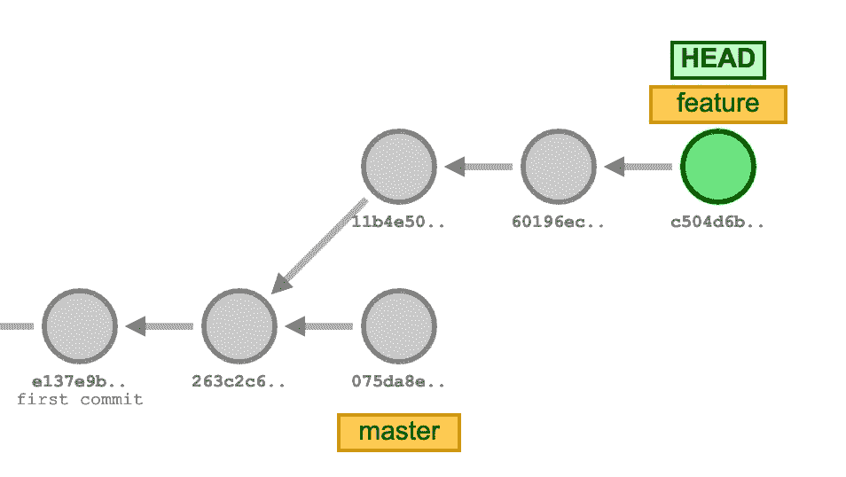
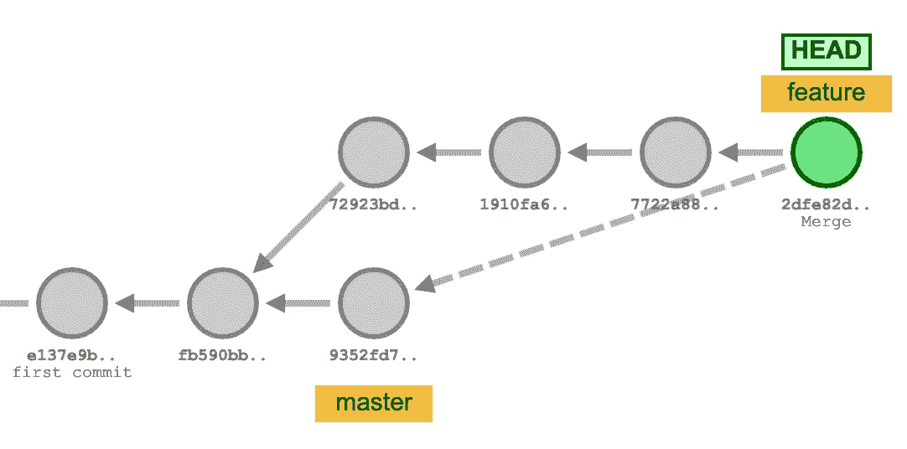
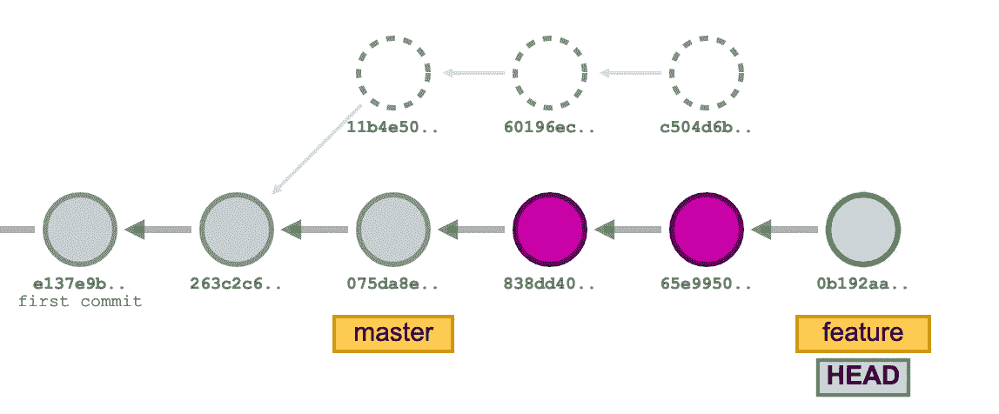

# Git rebase

> 原文：<https://blog.devgenius.io/git-rebase-4f8fab88405a?source=collection_archive---------4----------------------->


[扬西·敏](https://unsplash.com/@yancymin?utm_source=unsplash&utm_medium=referral&utm_content=creditCopyText)在 [Unsplash](https://unsplash.com/?utm_source=unsplash&utm_medium=referral&utm_content=creditCopyText) 上的照片

最后，你完成了新功能，你打开了 **P** ull **R** equest，希望它能很快被合并。不幸的是，现实是，你的公关可能会坐在那里一段时间。与此同时，发展在继续，你的公关目标部门也在更新。

发生这种情况时，可能会产生冲突。这些是 PR 中的代码变更和合并到目标分支中的其他变更之间的冲突。你可以做的是*将来自目标分支的变更*合并到你的 PR 分支中，或者做一个 *rebase* 。

Git merge 和 rebase 服务于相同的目的。它们被设计成将来自一个或多个分支的变更集成到一个分支中。尽管最终目标是相同的，但这两种方法以不同的方式实现它，了解这种差异是有帮助的。

让我们从下面的图表开始，来了解其中的区别。



git 起始图

## Git 合并

对于使用版本控制系统的开发人员来说，合并是一种常见的做法。无论分支是为了测试、错误修复还是其他原因而创建的，合并都会将更改应用到另一个位置。更具体地说，合并获取源分支的内容，并将它们与目标分支集成在一起。在这个过程中，只有目标分支被改变。源分支历史保持不变。

`git merge`命令将把在一个单独的分支上对代码库所做的任何更改合并到您当前的分支中，作为一个新的提交。合并很好，因为它是一个非破坏性的操作。现有的分支不会以任何方式改变。



git 合并图

## Git Rebase

Rebase 是将变更从一个分支整合到另一个分支的另一种方式。它表示将一系列提交移动或合并到一个新的基础提交的过程，这意味着它改变了分支上第一个提交的父级，使它看起来好像是从不同的提交创建的分支。

与合并不同，重定基础使历史变平，因为它将完成的工作从一个分支转移到另一个分支。在这个过程中，不需要的历史被删除。在内部，Git 通过创建一系列新的提交并将它们应用到指定的库来实现这一点。理解这一点非常重要，即使分支看起来一样，它也是由全新的提交组成的。

在 Git rebase 期间将会发生的是，您想要添加到代码库的提交将会在目标分支的顶部重放。



git 基础图

## 合并与重设基础

重定基数和合并的区别在于:

*   历史的结果树结构(通常只有在查看提交图时才能注意到)是不同的(一个有分支，另一个没有)。
*   合并通常会创建额外的提交(例如树中的节点)。
*   合并和重置基础将不同地处理冲突。Rebase 将一次显示一个提交的冲突，而 merge 将一次显示所有冲突。

# 如何使用它

在下一节中，我们将描述各种类型的 rebase 用法。

## 标准基数

```
git rebase <base>
```

上面的 git 命令将当前分支重新定位到目的地`<base>`，它可以是任何类型的提交引用(ID、分支名称、标记或对`HEAD`的相对引用)。运行时，git 执行以下步骤:

1.  标识每个提交是当前提交的祖先，但不是`<base>`的祖先。这可以认为是一个两步的过程:首先，找到`<base>`的最后一个共同祖先和当前提交；称之为祖先提交。其次，收集祖先提交和当前提交之间的所有提交。
2.  确定这些提交中的每一个更改了什么(通过计算更改的增量)，并将这些更改放在一边。
3.  设置当前磁头指向`<base>`。
4.  对于搁置的每个更改，在当前头上重放该更改，并创建新的提交。

一旦完成，`HEAD`(当前提交)，是`<base>`的后代，但是它包含所有的更改，就好像它已经与`<base>`合并了一样。

简而言之:这会将整个特征分支移动到`<base>`分支之上。它通过为原始(特性)分支中的每个提交创建全新的提交来重写项目历史。特征分支的独特变化现在成为`<base>`分支的*线性*历史的一部分。

## 交互式 rebase

交互式重置基础使您可以完全控制项目历史的外观。这给了开发人员很大的自由，因为这让他们更专注于编写高质量的代码，而不用担心他们编写代码时的“混乱”历史。工作完成后，可以重温历史，进行必要的修改。

大多数开发人员喜欢在将功能分支合并到主代码库之前，使用交互式 rebase 来修饰它。这给了他们机会来粉碎无关紧要的提交，删除过时的提交，并确保在提交公共项目历史之前其他一切都是有序的。对于其他人来说，看起来整个特性是在一系列精心设计的提交中开发出来的。

运行带有`-i`标志的`git rebase`开始一个交互式重置会话。

```
git rebase -i <starting commit>
```

这将当前分支重置到`<starting commit>`上，但是使用一个交互式重置会话。这将打开一个编辑器，您可以在其中为每个要重置基础的提交输入命令。这允许在提交被移动到新的分支时改变提交。交互式 rebase 比标准 rebase 更强大，因为它提供了对分支提交历史的完全控制。

进入 rebase 会话时，用户会看到一系列可以用可用命令更改的提交:

```
pick 3718a197 Commit#1
pick 8c8fd68a Commit#2
pick e23b7527 Commit#3
pick 181e3ec4 Commit#4# Rebase 20913a56..2f2b483f onto 20913a56 (4 commands)
#
# Commands:
# p, pick = use commit
# r, reword = use commit, but edit the commit message
# e, edit = use commit, but stop for amending
# s, squash = use commit, but meld into previous commit
# f, fixup = like "squash", but discard this commit's log message
# x, exec = run command (the rest of the line) using shell
# d, drop = remove commit
```

*   Pick ( `p`):您希望保持提交不变(这是默认操作)。重新安排`pick`命令的顺序会改变 rebase 过程中提交的顺序。
*   Reword ( `r`):您想要更改提交的提交消息。类似于`pick`,但会暂停并给你机会修改提交消息。
*   编辑(`e`):您想要更改提交的内容。如果您选择`edit`提交，您将有机会修改提交，这意味着您可以添加、拆分或完全更改提交。您还可以在继续 rebase 之前进行更多的提交。这允许您将一个大的提交分割成较小的提交，或者删除提交中的错误更改。
*   Squash ( `s`):它将提交与前一个合并，保留两个提交消息。squash 命令是我们看到 rebase 真正效用的地方。挤压允许您指定要将哪些提交合并到以前的提交中。
*   Fixup ( `f`):与 squash 相同，但是它保留了前一次提交的提交消息。
*   Exec ( `x`):执行自定义 shell 命令。这并不影响提交本身。
*   Drop ( `d`):删除提交及其内容。这是摆脱承诺的最好方法。

您应该在提交 id 之前写下正确的关键字或其缩写(在括号中)。

## 高级重定基础方案

还有更高级的功能可用于重新设定基础。命令行参数 `--onto`可以传递给`git rebase`。在 git rebase `--onto`模式下，该命令扩展为:

```
git rebase --onto <newbase> <oldbase>
```

`--onto`命令支持更强大的表单或 rebase，允许传递特定的 refs 作为 rebase 的提示。可以这样解释:*Rebase*`*<oldbase>*`*off of*`*<newbase>*`*，但排除* `*<oldbase>*` *共有的任何提交。*

让我们考虑下面的例子:

```
o---o---o---o---o master
         \
          o---o---o---o---o featureA
               \
                o---o---o featureB
```

`featureA`分支为`master`，`featureB`分支为`featureA`。现在假设我们想要将`featureB`中的所有内容，而不是`featureA`中的所有内容，合并到`master`中。所以`featureB`是基于`featureA`的，然而我们意识到`featureB`不依赖于`featureA`中的任何变化，可以直接从`master`中分支出来。

```
git rebase --onto master featureA featureB
```

这将告诉 git 将`featureB`中不与`featureA`共享的部分重归到`master`上。生成的图形如下所示:

```
 o---o---o featureB
                     /
    o---o---o---o---o master
     \
      o---o---o---o---o featureA
```

您还可以使用日志命令的一种高级形式来检查在`featureB`中但不在`featureA`中的提交集:

```
git log --oneline featureB ^featureA
```

这样你就可以确定你做的是对的。

# 配置选项

使用`git config`可以设置一些重设基础属性

*   `**rebase.stat**`:默认设置为假的布尔值。该选项切换可视 diffstat 内容的显示，该内容显示自上次重设基础以来发生了什么变化。
*   `**rebase.autoSquash:**`切换`--autosquash`行为的布尔值。
*   `**rebase.missingCommitsCheck:**`可以设置为多个值，这些值可以改变丢失提交时的 rebase 行为。
    `warn`在交互模式下打印警告输出，警告删除提交
    `error`停止重置并打印删除提交警告消息
    `ignore`默认设置，忽略任何丢失的提交警告
*   `**rebase.instructionFormat:**`一个`git log`格式字符串，将用于格式化交互式的 rebase 显示
*   `**rebase.abbreviateCommands:**`一个布尔值，如果设置为真，`git rebase`将在待办事项列表中使用缩写的命令名

# 理解重定基数的危险

当您执行一个`git rebase`操作时，您通常会移动提交。因此，您可能会遇到合并冲突的情况。这意味着您的两次提交修改了同一个文件中的同一行，而 git 不知道应用哪个更改。

合并失败可能会阻止此过程完全自动化。您必须解决任何此类合并失败并运行`git rebase --continue`。另一个选择是用`git rebase --skip`绕过导致合并失败的提交。要检查原始的`git <branch>`并删除`.git/rebase-apply`工作文件，使用命令`git rebase --abort`代替。

Git rebase 本身并不十分危险。当执行历史重写交互式 rebases 并强制将结果推送到其他用户共享的远程分支时，真正的危险出现了。rebase 会用新的提交替换旧的提交，这看起来像是你的项目历史的一部分突然消失了。这是一种应该避免的模式，因为它有能力在其他远程用户拉取时覆盖他们的工作。

# 摘要

Git rebase 赋予你修改历史的能力，交互式 rebase 允许你这样做而不会留下“混乱”的痕迹。这创造了犯错误、改正错误和改进工作的自由，同时仍然保持一个干净的、线性的项目历史。