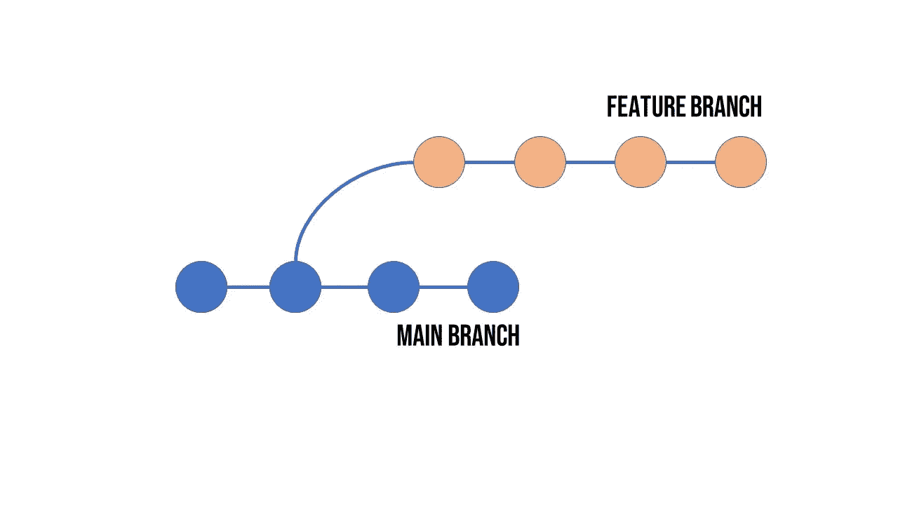
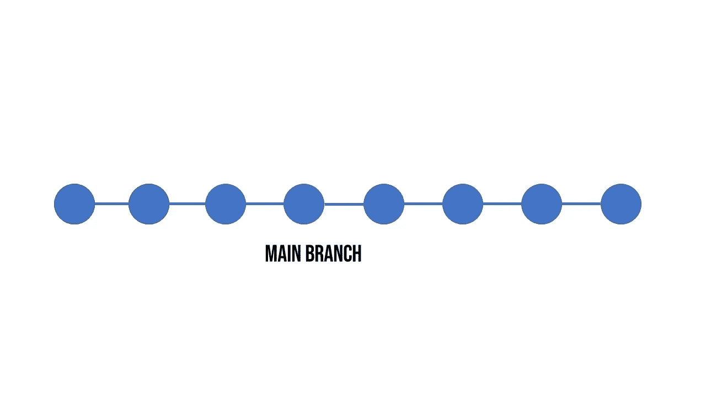

# Git 重置基础— 14 天的 Git

> 原文：<https://blog.devgenius.io/git-rebasing-14-days-of-git-d253d571d002?source=collection_archive---------9----------------------->

今天的学习目标是围绕 Git rebasing，它是什么以及为什么要使用它。

# 什么是 Git Rebasing？

重置 Git 存储库的基础会重写它的历史。它可能是一个有害的命令，所以在使用它时要小心。

通常，出于以下原因之一，您会使用 *git rebase* 命令:

*   编辑以前的提交消息
*   将多个提交合并为一个
*   删除或恢复不再需要的提交

# 为什么我们需要 Git rebase？

重置基础重写了项目的历史。它给你一个更清晰的项目历史。重置基础消除了 git merge 所需的不必要的合并提交。当你回顾你的日志时，它给出了一个非常线性的历史。

# 重设 Git 存储库的基础

我们有一个包含主分支和特性分支的存储库。我们一直在这个特性分支上做不同的事情，并且已经提交了几次。如果我们看这个图表，它会看起来像这样。

Git 存储库历史图表

我们希望将我们已经从功能分支创建的所有提交和酷的新功能带到我们的主分支。但是我们想让历史尽可能的直线化。因此，我们将使用 *git rebase* ，而不是进行 *git 合并*。

我们想要使用的命令是:

第一个命令确保我们在主分支中，第二个命令重新定义主分支以包含 commits from 特性。

我们的 git 图形日志如下所示:

重设图形视图基础后的 Git 存储库

你可以看到我们的历史已经以线性的方式被归入主要分支。

如果我们使用 git merge 命令，我们的存储库历史将会是这样的:

Git 合并图形视图

使用 git rebase 命令会给你一个更清晰的历史，特别是当你有一个大型开发团队在处理不同的特性和 bug 的时候。如果你只使用 *git merge* ，它可以变成一个真正的消息。历史真的变得难以阅读和理解。

Git rebase 并不总是正确的选择，因为它确实改写了历史。作为一个团队，理解 *git rebase* 相对于 *git merge* 的正确用例并恰当地使用它是很重要的。

# 14 天的饭钱

老实说，这个花了一点时间来理解和真正欣赏它的用途。我仍然认为在这件事上我可以挖掘更多的东西。肯定预订标记这一个，所以我可以回来做一些更多的学习。

明天就是藏东西的日子，所以应该会很有趣！请务必[订阅](https://www.techielass.com/newsletter)，和我一起踏上这一步的学习之旅！

你可以跟着这里:[https://github.com/weeyin83/14daysofgit](https://github.com/weeyin83/14daysofgit)

*原载于 2022 年 9 月 30 日*[*【https://www.techielass.com】*](https://www.techielass.com/git-rebasing/)*。*