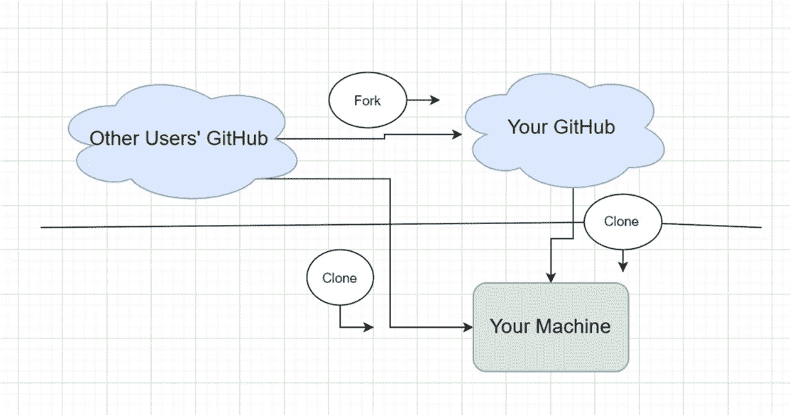

# Git 从别人那里得到回复

> 原文：<https://blog.devgenius.io/git-to-getting-repos-from-others-ff829802ba54?source=collection_archive---------30----------------------->

## GitHub 初学者指南

## 这是我的 GitHub 系列的第三部分。本文将谈及如何克隆和分叉其他用户的回购。


由 Kinng 创建

[在第一部分](https://medium.com/@fengyuan.yap/what-is-github-260412a0dcd7)中，我们讨论了我们应该将代码提交给 GitHub 的内容和原因；[在第二部分](https://medium.com/dev-genius/how-to-git-5ee5a325a8b5)中，我们进一步学习了如何获取并把我们的代码推到 GitHub repo 上。在接下来的第三部分，我们将学习如何“复制”他人的作品并编辑他们的作品。不要因为这不是偷窃而感到不舒服，相反，这是我们作为一个团队共享代码的正常方式。

# 什么是叉和克隆？



正如图中提到的“fork”是从别人的 GitHub 复制到我们的 GitHub，那么我们就把复制的回购从我们的 GitHub“克隆”到我们的机器上。同时，“克隆”将直接下载回购到我们的本地机器，GitHub 将保持不变。

# 他们之间有什么不同吗？

基本上是一样的，除非你想贡献本源(别人的回购)。我通常只`git clone`那些我知道我不会把它上传回原始回购的回购(我们称之为:“拉”请求，我们将在后面讨论)。另一方面，“分叉”那些我想要请求“拉动”请求的回购，并成为项目的贡献者。

而且，他们有不同的执行方式。最简单的“分叉”方式是通过你想要“分叉”的 GitHub repo 页面右上角的按钮。当然，使用终端“分叉”也是可以的，但我并不建议初学者记忆，因为这相当复杂。[请随意查看这里的终端方式。](https://help.github.com/en/github/getting-started-with-github/fork-a-repo)


手表、星形和叉形按钮

除此之外，`git clone`基本上有三种做法:1。二号航站楼。以 zip 文件 3 的形式下载。在 GitHub 桌面应用中打开。它们都很容易学习和运行。2 和 3 与我们处理所有普通文件的方式完全相同。对于 1，在终端上运行`git clone paste_repo_link_here`，回购将作为一个文件夹下载到你的当前目录下。

# 在我们直接从其他人克隆项目的情况下，Git 是否还在跟踪他们的原始所有者？

是的，Git 仍然会跟踪。要删除 Git 并拥有您自己的项目版本，请执行以下操作:

```
cd into_the_cloned_folder
git remote remove origin
```

我们为什么想要保留原始的 git 的目的将在以后的文章中更详细地讨论。通过运行上面的代码，Git 将被重置，并从您克隆的地方开始跟踪项目。

# 等等，当我们需要“克隆”两次时，使用“fork”的目的是什么？

嗯，“fork”会将整个项目 repo 复制到您的 GitHub，这意味着其他人完成的提交之类的记录，一切都保持不变(除了 watch 和 star)。当我们请求 origin 提取并合并我们编辑过的代码版本时，这个特性非常重要。[我们将在下一篇关于分支的文章中深入探讨]。最重要的是，它为我们创建了一个回购:)它节省了我们创建一个回购的时间。

# 示例:

我在 GitHub 上准备了一个示例文件用于演示。[链接](https://github.com/TheKinng96/TxtTestingFile)。

请随意跟随:)让我们编码。

如果你从一开始就关注这个系列，我已经上传了一些新的东西到我的回购中。想象一下，现在我们是一个团队，我已经更新了我们的项目，并将一些文件上传到了云上。现在轮到你检查我做了哪些修改，并做一些编辑。

## 简单的程序:

1.  转到[项目回购。](https://github.com/TheKinng96/TxtTestingFile)
2.  点击 fork，将项目克隆到你的 GitHub 和机器上。(我们也将在以后的文章中使用它。)
3.  做一些改变。[我们在这里很好]

## 我将在这里使用终端。它会喜欢:


在你把它转到你的 GitHub 回购之后。

我将在以后的文章中讨论 SSH 和 HTTPs。简而言之，安全外壳(SSH)是我们的机器与其他机器通信的另一种安全方式。在你正确设置它之前，它需要设置和一些基本知识。请随时用谷歌搜索它们:)


你终端上的代码

在您`git clone [https://github.com/TheKinng96/TxtTestingFile](https://github.com/TheKinng96/TxtTestingFile)`之后，您应该会在您的目录中看到该文件夹。现在打开我给你的哈哈。双击文件夹中的 index.html，应该会显示一个网页。在代码编辑器上随意编辑简单的网页。

## 第一部分和第二部分:

[](https://medium.com/@fengyuan.yap/what-is-github-260412a0dcd7) [## 什么是 GitHub？

### 这是一篇面向初学者的文章，讲述了为什么我们应该使用并上传我们的代码到 GitHub。以下是我对…的回答

medium.com](https://medium.com/@fengyuan.yap/what-is-github-260412a0dcd7) [](https://medium.com/dev-genius/how-to-git-5ee5a325a8b5) [## 怎么 Git？

### 这是我的 GitHub 系列的第二部分。怎么 Git？本文就是为初学者解答这个问题。

medium.com](https://medium.com/dev-genius/how-to-git-5ee5a325a8b5) 

## 不熟悉 CMD？↓↓↓↓

[](https://medium.com/dev-genius/tips-to-know-your-command-prompt-better-75bc218bbab3) [## 更好地了解命令提示符的技巧

### 探索一些有用的 CMD 命令。让 CMD 成为你的伙伴！

medium.com](https://medium.com/dev-genius/tips-to-know-your-command-prompt-better-75bc218bbab3) 

## 感谢您的阅读。随时欢迎评论和分享。下一篇文章将讨论为什么我们需要一个分支，以及如何创建一个分支。在本文中，我们学习了如何派生和克隆，这是一个扩展的主题，但是我们还没有进入我们的克隆项目和原始项目的合并。敬请关注。

[](https://medium.com/dev-genius/what-is-branch-on-github-d3fea06e1702) [## GitHub 上的 Branch 是什么？

### 您现在必须熟悉基本的 Git。本文将介绍 Git 上的分支以及如何将它与您的…

medium.com](https://medium.com/dev-genius/what-is-branch-on-github-d3fea06e1702)