# Git:版本控制系统

> 原文：<https://blog.devgenius.io/git-version-control-system-f257be51912f?source=collection_archive---------21----------------------->


照片由[扬西·敏](https://unsplash.com/@yancymin?utm_source=medium&utm_medium=referral)在 [Unsplash](https://unsplash.com?utm_source=medium&utm_medium=referral) 上拍摄

# 目录

1.  **分支&合并**
2.  **路径选择**
3.  **问题**
4.  **重做提交**

# 分支和合并

## 克隆存储库

Git clone 是一个 Git 命令行实用程序，用于定位现有存储库并创建目标存储库的克隆或副本。

Git clone 用于指向现有的 repo，并在另一个位置的新目录中制作该 repo 的克隆或副本。原始存储库可以位于本地文件系统上，也可以位于远程机器可访问的支持协议上。git clone 命令复制现有的 git 存储库。

*   第一步是访问要克隆的存储库链接。

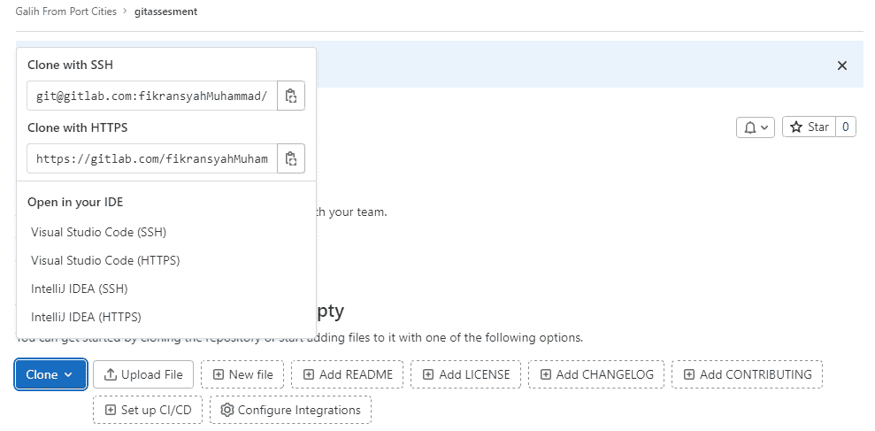

*   您可以选择使用 ssh 克隆或者使用 HTTPS 克隆。不同之处在于，ssh 方法不需要在每次运行 git 命令时都输入密码。
*   接下来复制给定的链接。
*   打开终端，导航到存储库的保存目录

```
root@ThinkPadPC:/# cd /home/galih/Documents/hedon/
root@ThinkPadPC:/home/galih/Documents/hedon#
```

然后运行命令 git clone <url>。此过程需要互联网连接</url>

```
git clone https://gitlab.com/fikransyahMuhammad/gitassesment.git
```

## 创建分支

使用分支的目的是在不干扰主分支开发的情况下支持应用程序特性开发。

repo 在第一次创建时没有分支，所以第一步是推送到 gitlab

*   对项目目录进行任何更改，例如创建文件

```
touch teks.txt
```

*   然后运行以下命令

```
git add . && git commit -m "message" && git push
```

通常，在那之后，你必须包括一个用户名和密码。当你在不包含分支名称的情况下进行 git 推送时，GitLab 会自动创建一个名为 master 的新分支。

*   创建分支的方法是运行命令**git branch【NAMA _ branch】**或**git check out-b【NAMA _ branch】**或**git switch-c【NAMA _ branch】。**不同的是 git 分支不会把头移到新分支。
*   将头部移动到刚刚创建的分支，即

```
git checkout [nama-branch]
```

*   要删除一个分支，请使用 git branch -d [branch_name],但是您不能在您想要删除的分支上
*   将您的更改推送到您的分支

要将您的更改上传到云中，您需要注意几个步骤。

您将使用至少 3 个命令，其中包括 **git add** 、 **git commit** 、 **git push** 。

*   第一步是打开终端
*   将当前工作目录更改为您的本地存储库
*   通过以下命令将文件转移到本地存储库进行提交

```
git add .
```

*   提交您在本地存储库中存放的文件

```
git commit -m "add file"
```

*   将本地存储库中的更改推送到 Gitlab

```
git push [remote-name] [branch-name]
```

## 将您的分支合并到开发中

合并是 Git 将分叉的历史重新组合在一起的方式。git merge 命令允许您将 git branch 创建的独立开发线集成到一个分支中。

Git merge 将把多个提交序列合并成一个统一的历史。在最常见的用例中，git merge 用于合并两个分支。

例如，我们将名为 branch1 的分支合并到主分支中。

首先，我们必须转移到主分支

```
git checkout master
```

之后，我们可以用 git merge 命令进行合并

```
git merge branch1
```

# 修补

因此，问题是当用户希望开发分支进入生产时，在开发人员从功能分支合并到开发分支之后，应该做的是通过将某些提交转移到开发来实现生产，以便最后的更改不会进入生产。

以下是流程场景:

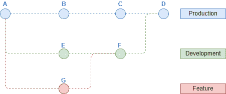

如果我们合并，它将看起来像上面，但我们想要的是如下所示

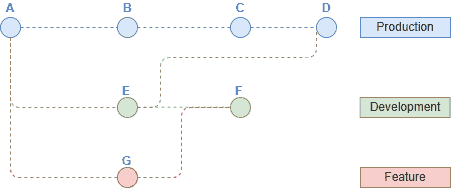

因此，要解决这个问题，您需要 git cherry pick 命令，要使用它，您首先要进入生产环境，然后输入命令**git cherry pick commit reference(E)**

创建一个生产分支，然后进行一些提交。

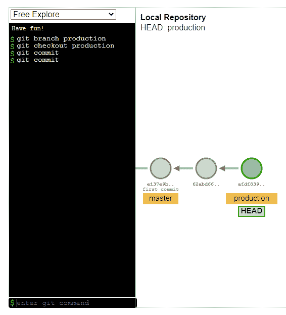

然后创建一个开发分支并进行一些提交。

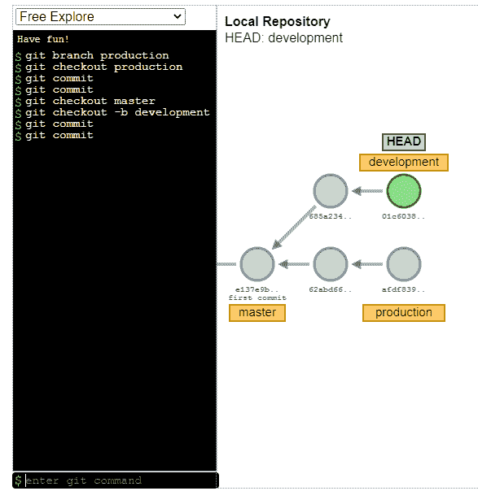

从开发分支创建一个特性分支

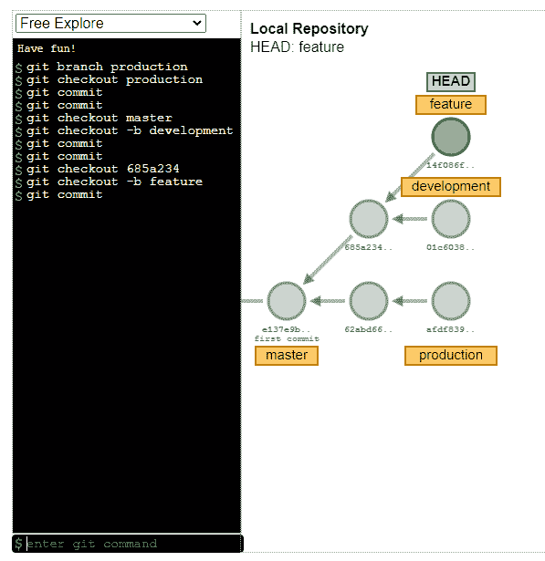

将开发分支与功能合并

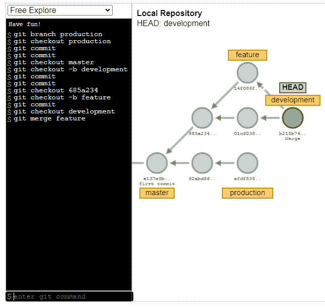

在开发分支的第二次提交时进行挑选

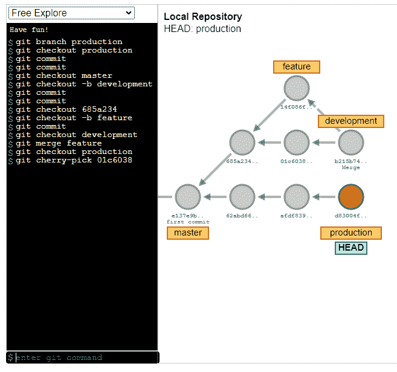

# 问题

问题用于就想法、解决问题和计划工作进行协作。与您的团队和外部合作者分享和讨论建议。

您可以根据自己的需求和工作流程，将问题用于多种用途。

*   讨论一个想法的实现。
*   跟踪任务和工作状态。
*   接受功能建议、问题、支持请求或错误报告。
*   详细说明代码实现。

**创建问题**

在 gitlab 中创建一个项目，然后选择问题菜单

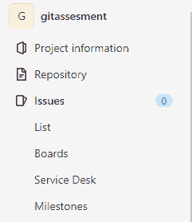

然后，在“问题列表”页面上，如果没有问题，您可以通过点击“创建问题”按钮来创建问题

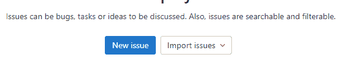

接下来输入新问题的标题和描述

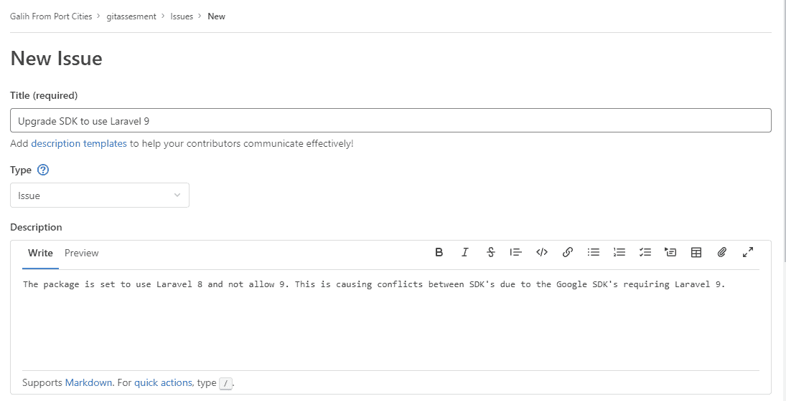

最后，点击页面末端的“创建”按钮，您的问题已成功创建。

**搬家问题**

创建两个项目，然后在第一个项目中创建一个问题，我们的案例将问题从第一个项目移到第二个项目。

第一步是打开第一个项目并选择问题菜单，请选择要移动的问题。

选择问题后，按页面右侧边栏上的“移动”按钮，然后选择要放置问题的项目

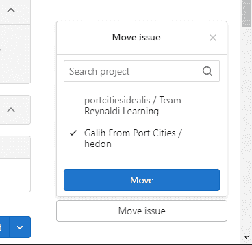

**关闭问题**

关闭问题意味着该问题中的问题已经解决，但是当它关闭时，我们可以随时重新打开该问题。

因此，要关闭该问题，第一步是选择一个仍然打开且您想要关闭的问题。然后在页面的底部有一个关闭问题按钮，按下按钮关闭问题


**删除问题**

问题可以随时删除，方法是删除问题，第一步是选择问题，然后在问题详情上看右上角有三个点，按下这三个点然后选择删除问题

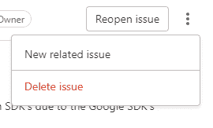

# 重做提交

**Git 结账**

如果我们所做的修订仍然没有被暂存或提交，那么我们可以用 git checkout 命令撤销这些更改。其用法如下:

```
git checkout <filename>
```

更改前的 index.php 文件:

```
echo "nah coba in";
echo "Lah ko gitu";
```

更改后的 index.php 文件:

```
echo "nah coba in";
echo "Lah ko gitu";
echo "Oh ya jelas";
```

让我们试着运行 git diff index.php 命令来看看区别:

```
$ git diff
diff - git a/index.php b/index.php
index 66cb134..3702ac3 100644
 - - a/index.php
+++ b/index.php
@@ -1,5 +1,5 @@
 <?php
echo "nah coba in";
echo "Lah ko gitu";
+ echo "Oh ya jelas";
 ?>
```

从上面的结果中，可以看出我们对 index.php 文件所做的更改。文件的条件仍然不是暂存和提交。我们可以通过键入以下命令来恢复或撤消更改:

git 结帐 index.php

使用上面的命令，我们刚才通过添加代码行所做的更改与“学习回到过去”相呼应；将被取消，该行将从 index.php 文件中删除，index.php 文件将恢复到更改前的状态。

使用以下命令撤消更改后，检查我们的存储库的状态:

```
$ git status
On branch master
nothing to commit, working tree clean
```

**Git 复位**

暂存条件是文件的条件，该文件已被更改并已使用 git add 命令添加，但尚未使用 **git commit** 命令提交。在这种情况下，我们可以使用以下命令撤消更改:

```
git reset <namefile>
```

在我们撤销之前的更改后，通过添加与上面相同的行再次更改 index.php 文件。

```
echo "nah coba in";
echo "Lah ko gitu";
echo "Oh ya jelas";
```

添加以上行之后，我们将使用以下命令来设置 index.php 文件的状态:

```
git add index.php
```

运行 git add 命令后，我们将看到 index.php 文件的状态:

```
$ git status
On branch master
Changes to be committed:
 (use "git restore - staged <file>…" to unstage)
 modified: index.php
```

现在，index.php 文件处于“已转移”状态，要取消对 index.php 文件所做的更改，我们必须首先使用以下命令将文件状态从“已转移”更改为“已修改”:

```
git reset index.php
```

```
$ git status
On branch master
Changes not staged for commit:
 (use "git add <file>…" to update what will be committed)
 (use "git restore <file>…" to discard changes in working directory)
 modified: index.php
no changes added to commit (use "git add" and/or "git commit -a")
```

我们已经成功地将 index.php 文件的状态从“已转移”更改为“已修改”，然后我们只需像以前一样使用命令撤消更改，即:

```
git checkout index.php
```

然后，更改将被删除或撤消，index.php 文件的内容将恢复原样。

**Git 恢复**

**git revert** 命令将恢复过去存在的文件状态，然后它将与当前的最后一次提交相结合。 **git revert** 比 git reset 使用起来更安全。因为这个命令不会删除过去的 **git 日志**记录。

**Git 恢复**

基本上，一个文件可以有三种不同的状态。可以是*未跟踪*、*未登台*或*登台*。未跟踪的文件从未被添加到树中，这意味着它们是全新的。**未转移**文件是已经在树中但已经被修改的文件。这些修改后的更改可以添加到下一个状态文件中，即*暂存的*文件。**暂存的**文件是进入下一次提交的文件。如果您在存储库中键入 git status，您也可以看到这三种状态。

要从分段文件中删除文件，可以使用 restore 命令。

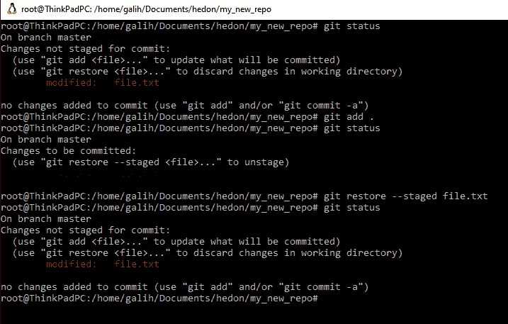