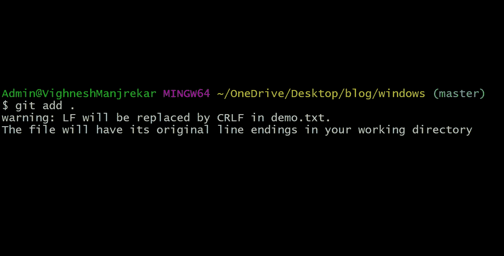
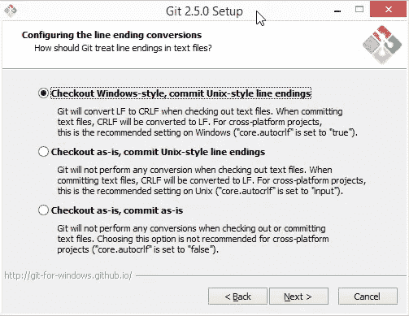
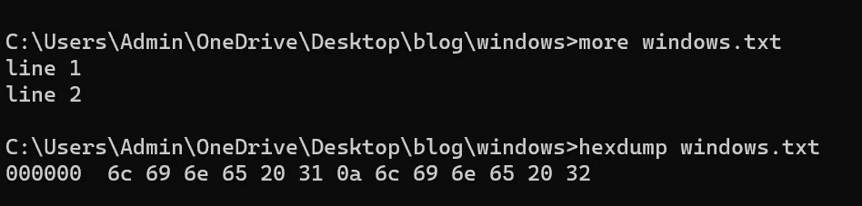
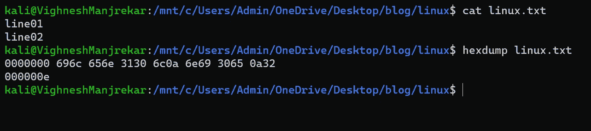

# 饭桶警告:LF 将被 CRLF 取代

> 原文：<https://blog.devgenius.io/git-warning-lf-will-be-replaced-by-crlf-4555c0236e9b?source=collection_archive---------1----------------------->

我正在做某个项目，在 git 中存放文件时，我收到了一些警告。我喜欢写干净无错的代码，所以我决定去这个警告的根源，并找出这到底是什么 LF 和 CRLF

我得到的警告

# 首先，让我们看看事情是如何在幕后运作的？

via [吉菲](https://giphy.com/)

在打字机上打字时，当我们到达一行的末尾时，我们需要返回回车，以便在新的一行开始书写。类似地，在计算机系统中，当我们到达一行或一个新行的末尾时，我们根据操作系统使用 CRLF、LF 或 CR 来表示行的结束和新行的开始，尽管它们都有不同的含义，我们将在下一篇博客中讨论它们。

# 什么是 CR，CRLF，LF？？

简单的答案是它们都被认为是行尾字符。

CR:回车或 CR 将光标移动到同一行的开头，它在早期的 MacOS(最多 9 个)中作为换行符使用。
字符:\r
Ascii: 13
十六进制:0x0D

LF:换行或 LF 将光标向下移动到新行，而不返回到行首。它用于基于 Unix 的系统。
字符:\n
Ascii: 10
十六进制:0x0A

CRLF:回车和换行或者 CRLF 就像结合了两者的力量，它把光标移动到新的一行和同一行的开始。它用于基于 Windows 和非 Unix 的系统中
Character:\ r \ n
Ascii:13 10
Hex:0x 0d 0a

我为什么要在乎？

如果你在同一个系统上工作，这不会是一件痛苦的事情，但是当你在一个像 windows 和 Linux 这样的跨平台开发团队上工作时，有时会给你带来麻烦，因为两个系统考虑不同的换行符。

# git 是如何欺骗我们的？

如果你仔细看，它说“检出窗口风格，但提交 Unix 风格的行尾”，现在你应该明白我们之前讨论的。因此，如果你使用 git 并在一个跨平台的团队中工作，这并不痛苦，因为 git 会为你做所有的工作。

# 饭桶！保持现状就好！！

如果你自己做所有的事情，并且不关心跨平台运行，下面的代码将把行尾按原样放好，然后检查

`git config core.autocrlf false`

# 结论

理解这些事情现在可能对你没有帮助，但是它会让你更接近计算机。非常有趣的是，在现代化的过程中，我们采用了如此多的旧技术概念(打字机参考)。但是现在大多数文本编辑器都知道行尾这个事实，并且会替你处理它，甚至 windows 10 的记事本也会用“LF”替换行尾

在 windows 中

在 Linux 中

我用记事本编辑 windows.txt 文件。看看它如何使用类似于 Linux 系统的“0a”(LF)行尾。

今天到此为止，

保持微笑！继续编码！😀