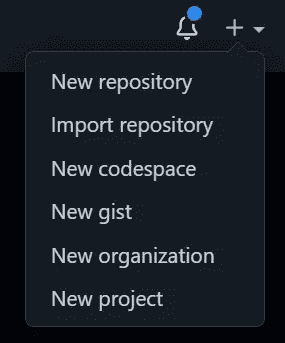
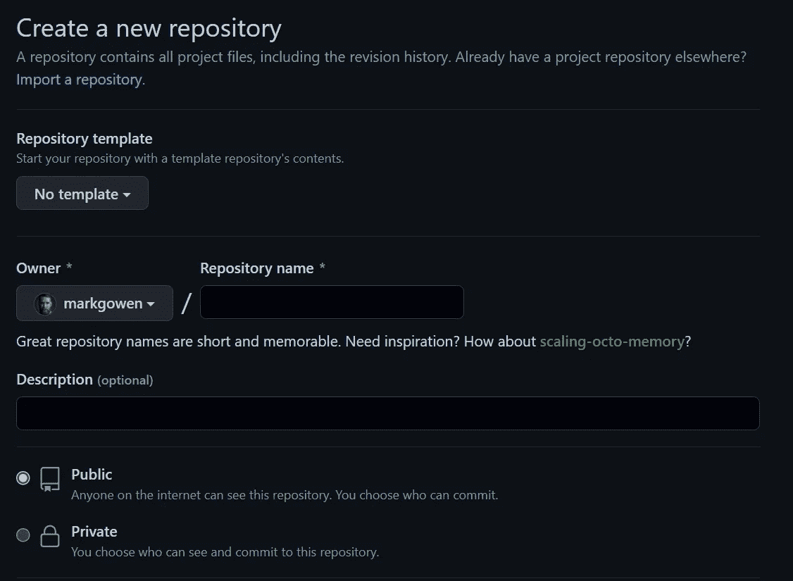
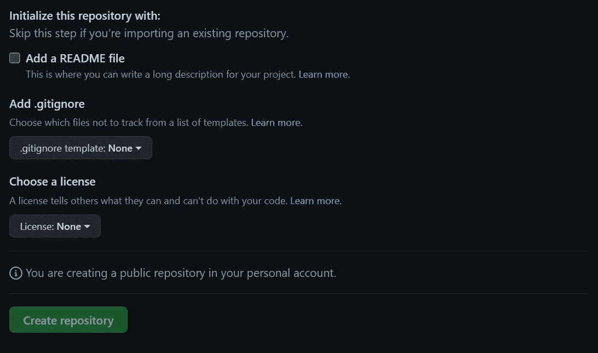
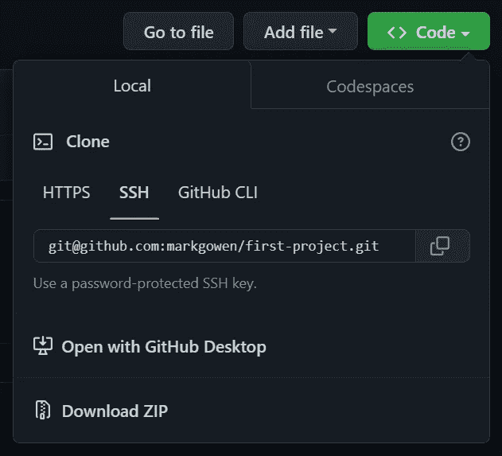
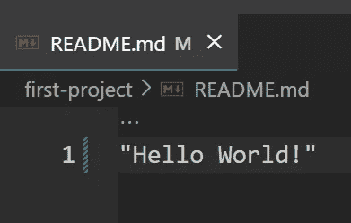
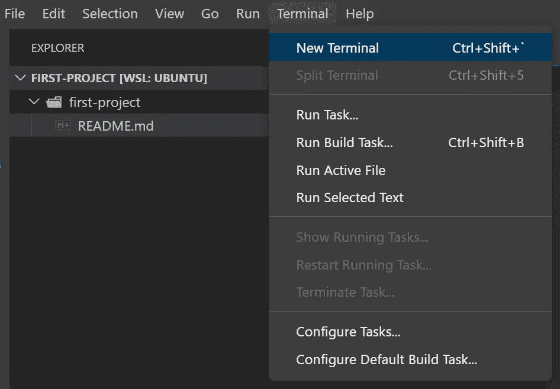
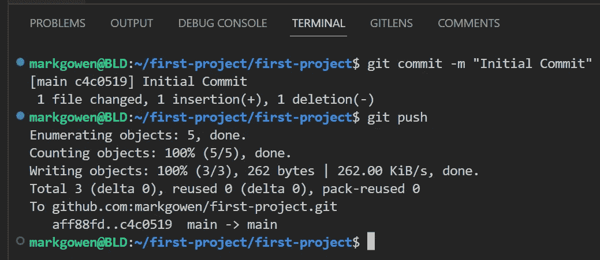

# 趁现在好，赶紧走！

> 原文：<https://blog.devgenius.io/git-while-the-going-is-good-130f553cc4d7?source=collection_archive---------6----------------------->


**什么是 Git，为什么要学习？**

Git 是**一个全世界开发者使用的版本控制系统**。它帮助您跟踪代码的不同版本，并与其他开发人员协作。如果您在一段时间内处理一个项目，您可能希望跟踪哪些更改是由谁以及何时进行的。——【Freecodecamp.org 

当与一个团队一起工作时，许多不同的人会接触到许多你正在处理的相同的代码。为了防止过多的 bug 困扰您的项目，使用和学习 Git 将是非常有益的。

**Git vs GitHub**

Git 是一个版本控制系统，通过您的终端或 IDE 在您的计算机上本地使用。

通过在终端中键入以下命令，可以很容易地检查是否安装了 Git。如果尚未安装，它会提示您安装。

```
git --version
```

GitHub 是一个 Git 存储库托管服务，提供基于 web 的图形界面。它是世界上最大的编码社区。将一个代码或项目放入 GitHub 会给它带来更多、更广泛的曝光。程序员有许多资源可供他们支配。他们可以找到各种语言的代码，并使用命令行界面 Git 来跟踪任何更改。

GitHub 是一个强大而有用的工具，可以让团队在不同的地点和时间一起工作。如果您要查找旧版本，也可以查看项目的所有早期版本。

**如何在 GitHub 上创建存储库**

在我们向您展示如何创建存储库之前，让我们首先从定义什么是存储库开始。一个 Git 库或 repo 就是这个。项目中的 git/ folder。该存储库跟踪对项目中的文件所做的所有更改，构建一段时间的历史记录。

您可以使用 GitHub 访问您的存储库，这将允许您跟踪您或您的团队所做的任何和所有更改。

要创建一个资源库，首先要确保你已经在 [GitHub](http://github.com) 上注册了一个免费账户。完成该过程后，在任何页面的右上角，使用下拉菜单，并选择 New repository。



从那里您将被带到一个新的页面，在那里您可以设置和创建您的新存储库。



您可以为您的存储库起一个名字，建议您给它起一个短而易记的名字。接下来你可以给你的仓库一个描述。试着描述一下你的知识库是关于什么的，或者你的目标是什么。这是可选的。

然后，您可以决定这是一个私有的还是公共的存储库。要了解更多信息，请参见 GitHub 文档中的[“关于存储库”](https://docs.github.com/en/repositories/creating-and-managing-repositories/about-repositories#about-repository-visibility)。

最后，选择使用自述文件初始化该存储库。此时，您也可以选择一个许可证。麻省理工学院的许可证被广泛使用，你可以在这里了解更多关于许可证的信息。



就是这样！您已经成功创建了一个存储库。现在是你做出第一个改变的时候了。

**已经提交…**

一旦你准备好开始你的项目，打开你的 IDE(集成开发环境)。我将使用 [VSCode](https://code.visualstudio.com/) 。

首先，我们需要创建一个目录来存放我们的项目。为此，请打开您的终端，并键入以下内容:

```
mkdir first-project
```

然后，通过执行以下命令导航到该目录。

```
cd first-project
```

现在您已经进入了那个目录，您可以使用 git 连接到您在 GitHub 上创建的存储库。

但是首先，我们需要从 GitHub 获取正确的 URL。转到您的存储库并找到“代码”按钮。应该是这样的:



导航到 SSH 选项卡，找到复制按钮。


让我们回到您的终端，执行下一个命令，然后从您的 GitHub 库粘贴 URL。应该是这样的:

```
git clone git@github.com:markgowen/first-project.git
```

然后 Git 将从 git hub 下载您的存储库，您就可以开始为您的项目编码了。

我们需要首先将目录更改为存储库，并在 VSCode 中打开我们的项目。为此，您可以向终端发出以下命令:

```
cd first-project
code .
```

让我们将“Hello World”添加到 README.md 中，这样我们就可以对项目进行第一次更改，并初始化第一次提交。



现在我们准备进行第一次提交。通过导航到 Terminal 选项卡并选择 New Terminal，可以在 VSCode 中打开 Terminal。



这将在您的 IDE 中打开一个新的终端。这应该出现在屏幕的底部。

现在让我们进行第一次提交。我们首先需要添加对 git 的更改。我们可以通过键入以下命令来实现:

```
git add .
```

接下来，我们将使用消息“初始提交”进行第一次提交。注意，我们使用了-m，它让 git 知道我们包含了一条消息。一旦提交完成，我们需要将我们的提交“推”给 GitHub。



就这样，您对存储库的第一次提交就完成了！使用 Git 和 GitHub 可以让你的编码体验更加愉快，压力也更小。记住要经常提交，这样如果你犯了错误，你就可以很容易地恢复到以前的版本。我希望您喜欢在项目中使用 Git。快乐编码。