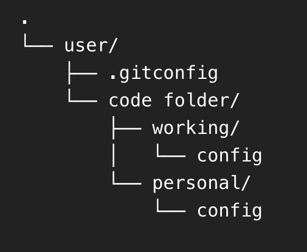
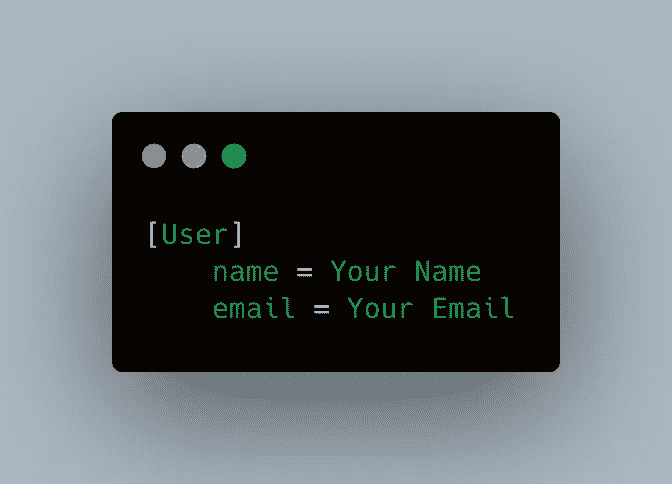
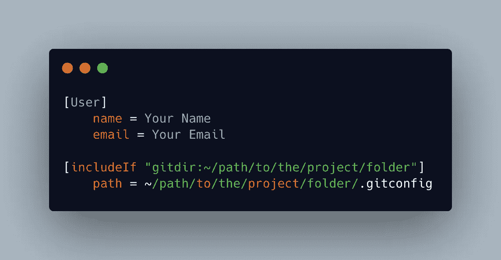
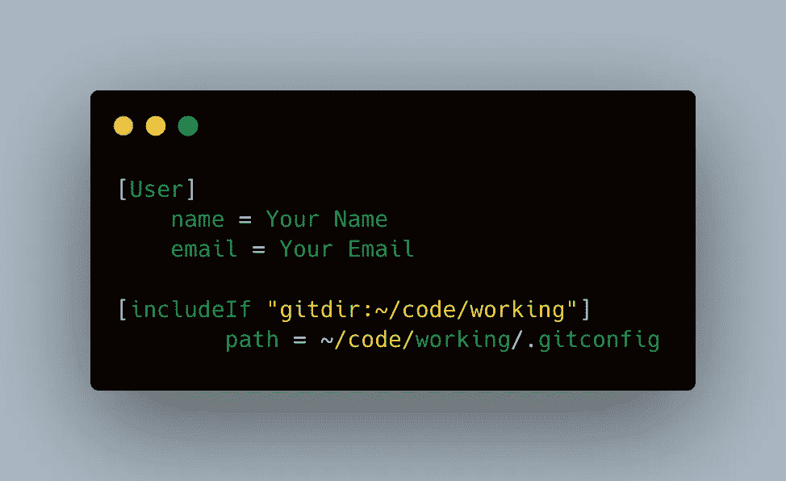
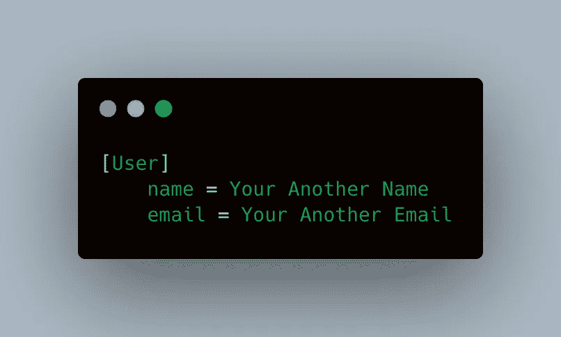

# 有多个帐户的 Git

> 原文：<https://blog.devgenius.io/git-with-multiple-accounts-c05a22148f6?source=collection_archive---------6----------------------->

## PC 设置

有问题要通过不同的 Git 帐户提交，但想使用同一台机器？以下是解决方案。


图片由 Unsplash.com 的 Praveen Thirumurugan 拍摄

## 先决条件

*   安装 Git
*   将你的项目按账户分类，放在同一个文件夹中(可选)

## 文件结构

假设我们有两个项目，需要我们有两个完全不同的账户来完成这项工作:项目`working`和项目`personal`。如果我们设置了 git 全局身份，我们应该在用户文件夹下有一个隐藏的`git config`文件，Windows 是`C:\Users\<your name>\.gitconfig`，Mac 是`/Users/<your name>/.gitconfig`。



文件树

`.gitconfig`是全球帐户配置，如果您已经注册了您的电子邮件和用户名，它应该就在那里。这将是我们希望在大多数提交中使用的默认用户配置。在上面的例子中，我将我的全球身份设置为我的个人帐户，所以我只需要在我的`working`文件夹中设置一个额外的身份。



在里面。gitconfig

如果 Git 刚刚安装，将不会有`.gitconfig`文件，所以只需在您的 root 用户文件夹下创建一个文件，写下全局标识，然后保存它。

要进行检查，请在您的终端中运行`git config --list`。它应该向我们显示用户名和电子邮件。

## 不同帐户的设置配置

为了让 Git 知道我们想要对一个文件夹使用不同的用户配置，我们需要将下面的代码添加到全局`.gitconfig`文件中:

```
[includeIf "gitdir:~/path/to/the/project/folder"]
        path = ~/path/to/the/project/folder/.gitconfig
```

通过这样做，当我们在路径中提交时，Git 现在将寻找不同的 Git 帐户。我们可以有不止一个`includeIf`，可以随意这么做。



在里面。gitconfig

接下来，在我们添加到`includeIf`路径的文件夹中创建一个`.gitconfig`文件。在示例中，我的全局`.gitconfig`看起来像下面的截图。



全球的例子。gitconfig

并且`working`文件夹中的`.gitconfig`会看起来像下面的截图。



在里面。includeIf 路径的 gitconfig

# 就是这样！

配置已完成。继续玩你的 git 账户吧。