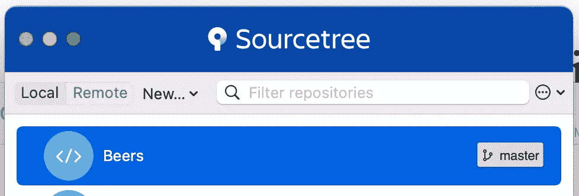
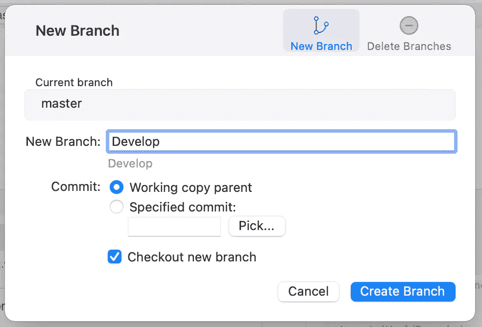
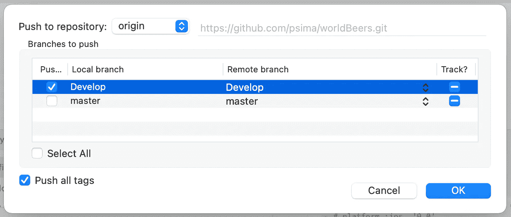
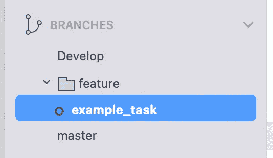
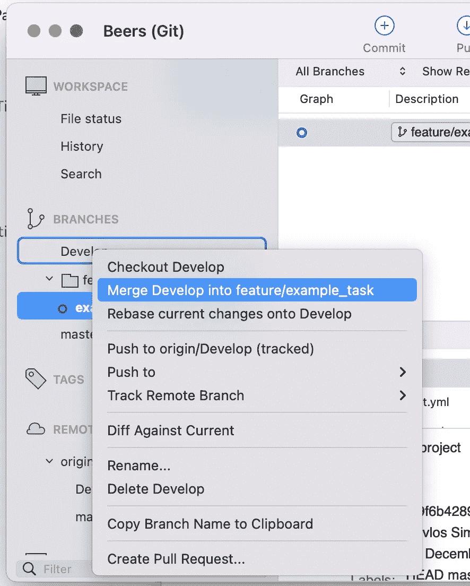
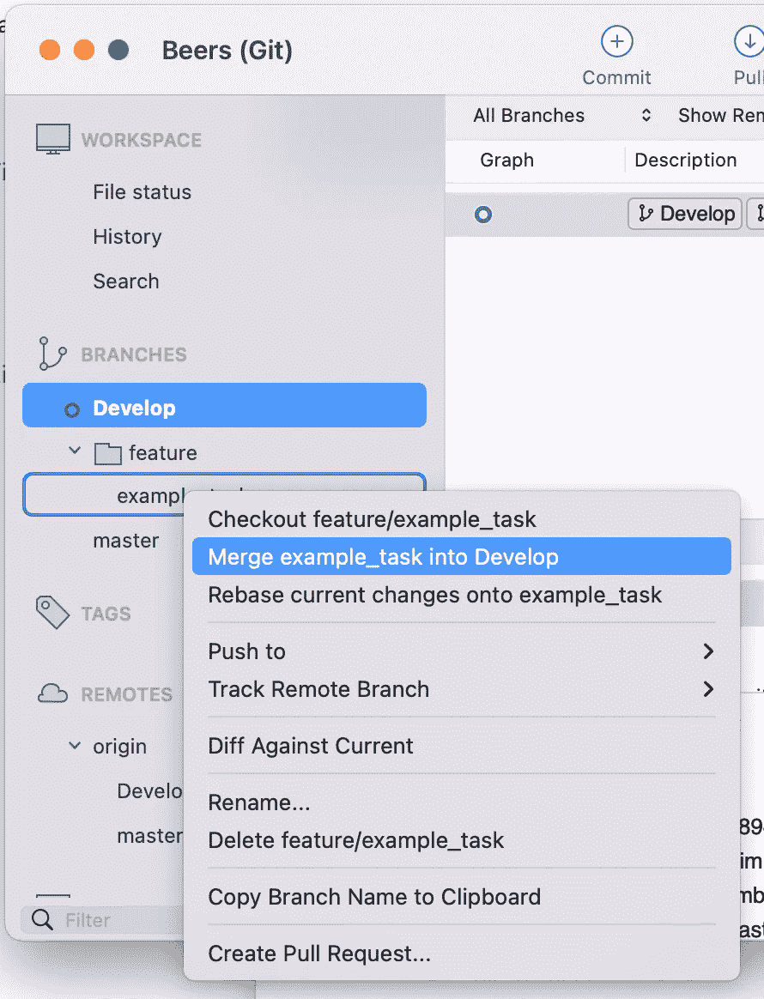
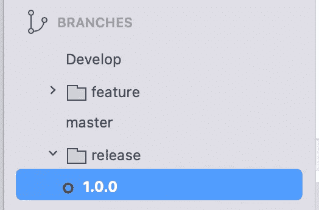
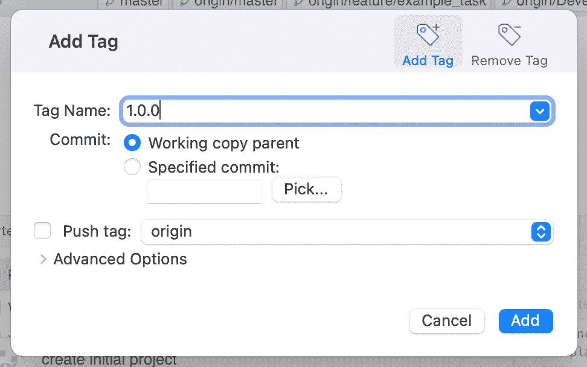

# GitFlow 用一个使用 Sourcetree 的简单例子进行了解释

> 原文：<https://blog.devgenius.io/gitflow-explained-with-a-simple-example-using-sourcetree-7e38857344e?source=collection_archive---------9----------------------->

## 使用 Sourcetree 围绕项目发布设计的严格分支模型，并附有一个简单的例子

照片由来自[佩克斯](https://www.pexels.com/photo/eyeglasses-in-front-of-laptop-computer-1181253/?utm_content=attributionCopyText&utm_medium=referral&utm_source=pexels)的[克里斯蒂娜·莫里洛](https://www.pexels.com/@divinetechygirl?utm_content=attributionCopyText&utm_medium=referral&utm_source=pexels)拍摄

在本教程中，我们将看到如何使用 Sourcetree 在我们的项目中遵循 GitFlow。

我们创建了一个新的仓库，我们的项目将被称为啤酒。

正如你所看到的，你将看到的第一个分支是**大师。**这应该是你的主要分支，你在商店或网站上的代码总是最新版本。

在 GitFlow 中你有 2 个**主分支，**主分支**和**分支。那么让我们稍后创建开发分支 a 来举例说明为什么我们需要这两个分支。

首先，检查主分支，并在源代码树中按下**分支**按钮。应显示以下弹出窗口。输入**开发**作为分支名称，按**创建分支。**

创建分支后，按下按钮“Push ”,将分支推到原点，这样它在远程存储库中也可见

# 主要分支(主/开发)

现在我们已经创建了分支，让我们看看它们的目的是什么。正如我们之前所说的， **master** 通常是我们商店里的最新版本，或者可能是一个在线网站，它应该只在我们的项目上线时更新。

**开发**是所有开发人员在发布前合并他们的任务的分支，它是上线前的最新版本(稳定版)。我们将在后面解释我们应该如何在开发分支上工作/合并。

# 特征分支

现在让我们假设你有一个新的任务要交付给下一个版本。所有的新任务都应该创建在一个名为“feature”的文件夹中，并且总是从 Develop 分支开始。要为任务创建新的分支，请遵循我们为开发分支所做的相同过程，但这一次您可以将“ **feature/my_branch_name** ”作为名称。

在本例中，我们将称之为“特征/示例 _ 任务”。像以前一样创建它并将其推到原点。您的项目分支现在应该是这样的:

如果同一个团队中没有很多人，开发人员可以在同一个 git 文件夹中创建他们的任务(特性)。如果有很多开发人员和不同的团队，那么你可以用你团队的名字来代替“ **feature** ”。

让我们假设你完成了任务。下一步就是合并它去发展。在此之前，您需要将 develop 反向合并到您的分支中，因为可能其他开发人员已经完成了他的任务(并合并到 Develop 中),您需要获取最新的版本。

要进行反向合并，您应该检查 example_task 分支，并右键单击 Develop。应该会显示一个对话框。选择“将开发合并到特征/示例 _ 任务中”

现在您的分支拥有最新的开发代码。是时候把你的部门合并到开发部门了。你应该做和以前一样的事情，但现在签出开发，并做一个例子 _ 任务右键单击。

合并后，最好删除你的分支，这样在特征文件夹中就不会有太多的混乱。

好了，现在所有的开发人员已经完成了他们的任务，他们合并了他们的代码进行开发，现在是时候准备一个将上线的版本了。

下一步是创建一个发布分支。

像以前一样创建一个新的分支，这次我们可以在中称它为**“release/1.0.0 ”,其中 release/是文件夹，1 . 0 . 0 是我们项目的新版本。您的存储库将如下所示:**

让我们解释一下发布分支

# 发布分支

当所有团队都将他们的代码合并到开发中，并且应用程序准备好进行测试时，将使用这个分支。命名应该是这样的:release/1.0.1 哪个 1.0.1 是我们的应用程序版本。

测试中发现的所有可能的 bug 修复都应该合并到这个分支中。

现在让我们假设测试团队在发布版本中发现了一个 bug，我们需要修复它。从这次开始，应该从**发布分支**创建一个新的分支。

# 修补程序分支

只有在之前的分支(版本)在测试中有一些问题，我们需要执行一个 bug 修复时，才会使用这个。这通常从发布分支开始创建。命名应该是 hotfix/my_bug

如果一切正常，修复分支应该合并到发布分支上，然后我们需要删除 my_bug 分支。发布分支不再有 bug，并且得到了测试团队的认可。当我们生活时，我们应该遵循以下步骤:

*   将版本/1.0.0 合并到开发分支
*   将版本/1.0.0 合并到主分支
*   删除版本/1.0.0
*   结账大师
*   创建版本标签

最后一步只是跟踪我们的版本，因为有时我们需要修复特定版本的一些错误。要创建一个**标签**，你可以进入菜单下的存储库，然后点击标签。应该会显示这样的对话框:

同时检查**按钮标签**选项，并按下**添加。**

至此，您已经完成了分支模型。请记住，一旦创建了发布分支，其他开发人员可以继续在他们的分支中工作，并添加要开发的内容，但是他们的任务将包含在当前发布之后。