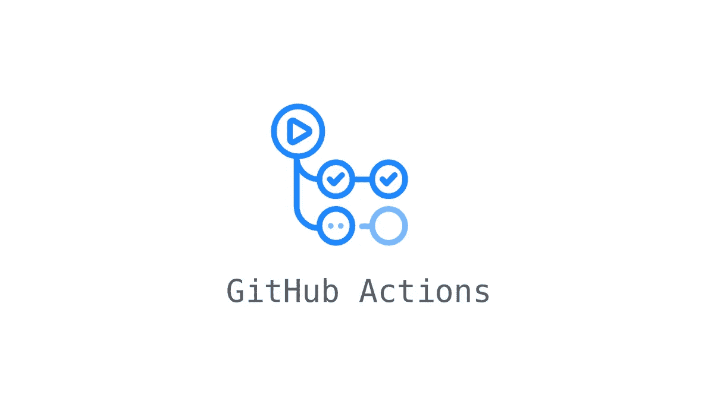
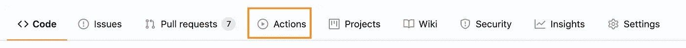
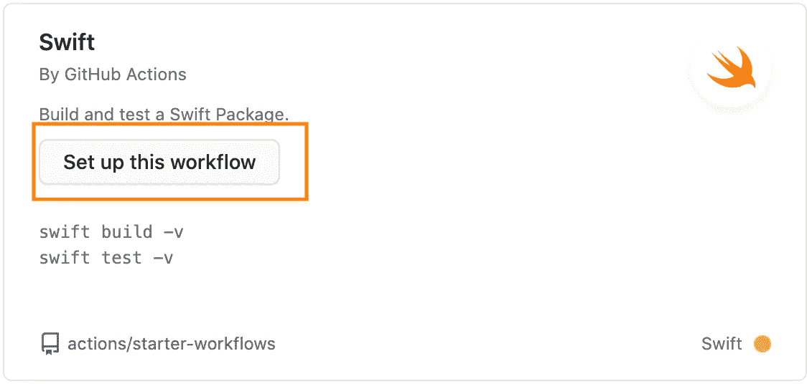
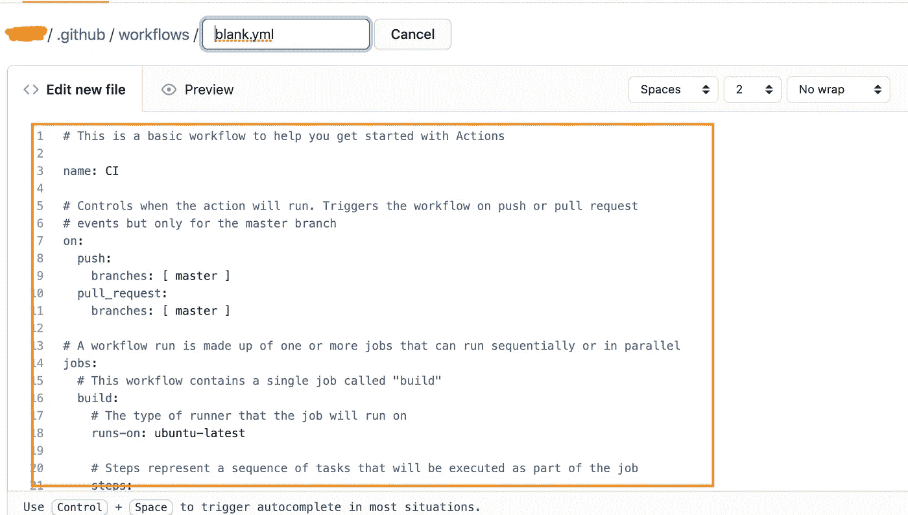
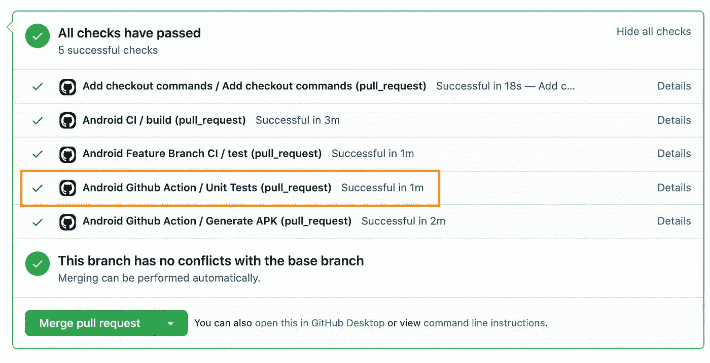
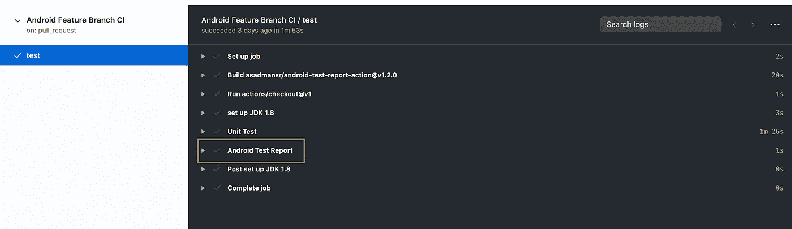
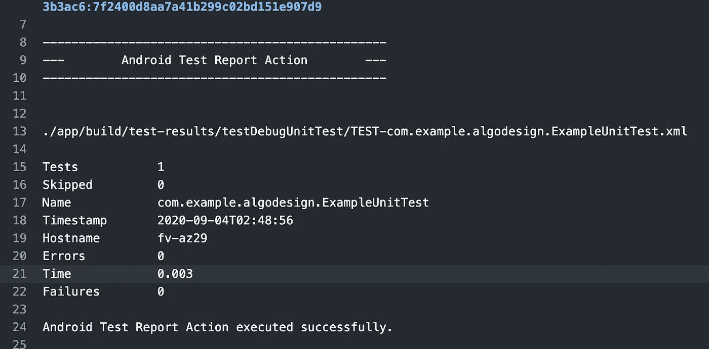

# Android 中单元测试的 GitHub 动作

> 原文：<https://blog.devgenius.io/github-action-for-unit-testing-57faefc9633?source=collection_archive---------1----------------------->

GitHub Actions 使单元测试报告变得简单，让我们来看看是如何做到的


鲁拜图·阿扎德在 [Unsplash](https://unsplash.com?utm_source=medium&utm_medium=referral) 上的照片

GitHub 动作在自动化工作流方面非常流行；如果你想领先一步，在你的库中使用漂亮的 GitHub 动作。



GitHub Actions 现在拥有世界一流的 CI/CD，可以轻松实现所有软件工作流程的自动化。直接从 GitHub 构建、测试和部署您的代码。根据需要进行代码审查、分支管理和问题分类工作。

这里我们将讨论如何为单元测试集成 GitHub 动作，以及使用这个动作的好处。

单元测试是应用测试策略中的实际测试。通过针对您的代码创建和运行单元测试，您可以轻松地验证各个单元的逻辑是否正确。在每次构建后运行单元测试有助于您快速捕捉和修复由应用程序代码变更引入的软件退化。

如果所有的单元测试用例都通过了，我们才能合并我们的 PR，那会怎么样？

在这种情况下，Github Action 可以提供帮助。

我们将在我们的资源库中添加一个令人敬畏的 [Github 动作](https://github.com/asadmansr/android-test-report-action),看看它的神奇之处。

我希望你知道如何将 GitHub 动作添加到你的存储库中，如果不知道，不用担心

**按照步骤:**
转到您想要添加 GitHub 动作的存储库。

1.  **点击操作**



2) **点击设置此工作流程**



3) **现在在这里有一个 blank.yml** 文件，将在这里用主要动作打开；我们必须粘贴我们的行动



**粘贴这个:**

```
name: Android CI
on:
  pull_request:
    branches: [master]

jobs:
  test:
    runs-on: ubuntu-latest
    steps:
      - uses: actions/checkout@v1

      - name: set up JDK 1.8
        uses: actions/setup-java@v1
        with:
          java-version: 1.8

      # Execute unit tests
      - name: Unit Test
        run: ./gradlew testDebugUnitTest

      - name: Android Test Report
        uses: asadmansr/android-test-report-action@v1.2.0
        if: ${{ always() }} # IMPORTANT: run Android Test Report regardless
```

现在请创造公关，看看魔术；突出的一个是我们的单元测试的 GitHub 动作；它不会让你合并 PR，直到所有的测试用例都通过:



如果你想看**测试报告**，我们可以像以前一样勾选进入行动页面


那里列出了我们的 GitHub 操作和相关的工作；在我们的例子中，我们有一个作业名 **test，**，在右边，我们有自己的作业。

现在点击**安卓测试报告。**



您可以在那里看到详细的测试用例报告。



就是这样；如果你喜欢这篇文章，请**鼓掌，别忘了关注最新的博客**。

[](/application-of-singleton-and-delegated-properties-d8ddd18bc7b3) [## 单一属性和委托属性的应用

### 让我们通过学习 Singleton 和 Delegates 属性来实现数据库。

blog.devgenius.io](/application-of-singleton-and-delegated-properties-d8ddd18bc7b3) 

感谢阅读。给我买一杯[咖啡](https://www.buymeacoffee.com/devsoni044)

[](https://www.buymeacoffee.com/devsoni044) [## 德夫·达尔

### 嘿，如果你喜欢我的博客，请支持我

www.buymeacoffee.com](https://www.buymeacoffee.com/devsoni044) 

每次鼓掌计数