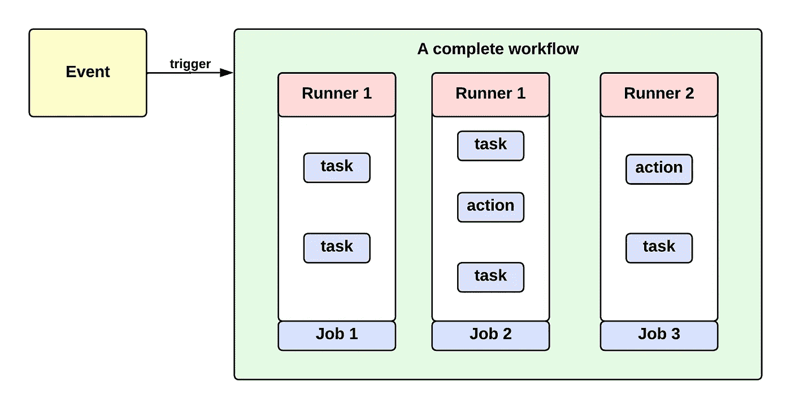
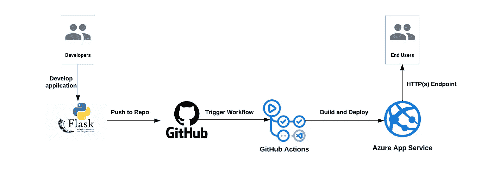
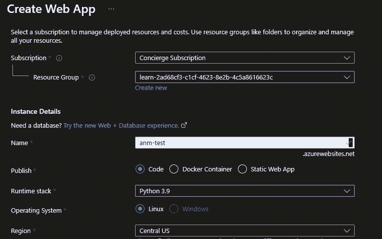
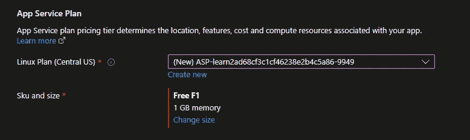
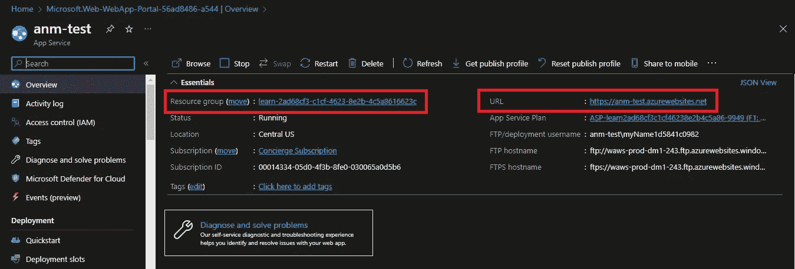
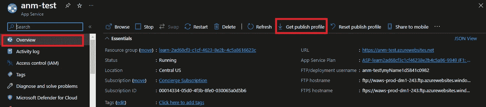
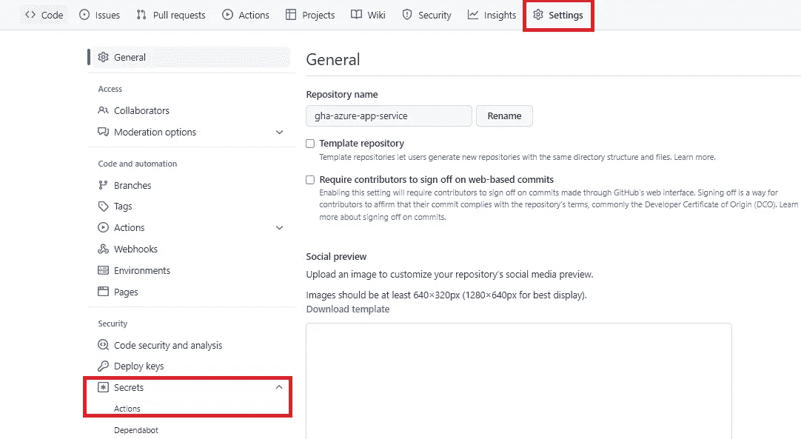
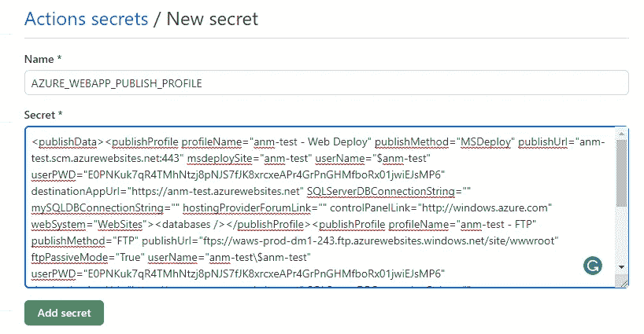
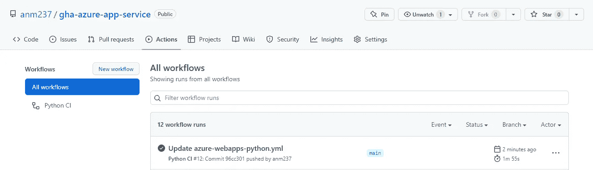
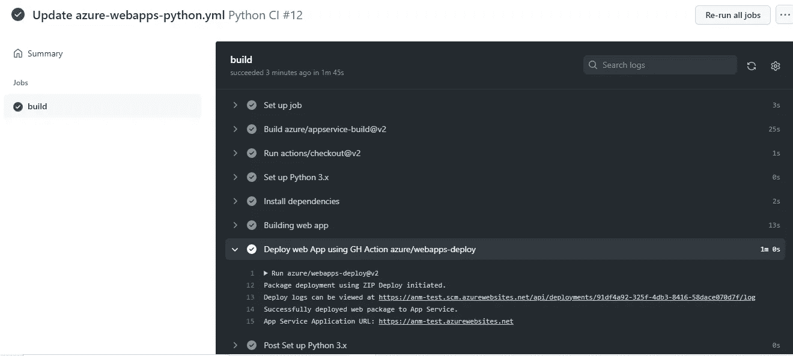

# 使用 Azure 应用服务的 GitHub Actions 101

> 原文：<https://blog.devgenius.io/github-actions-101-with-azure-app-service-24b19c093c25?source=collection_archive---------2----------------------->

在这篇博客中，我将介绍 GitHub 动作的基本概念及其用例。为了更好地理解这些概念，我将在我的存储库中实现一个 GitHub 操作管道，并在 Microsft Azure 上的 Azure App Service (PaaS)上部署一个示例 Python 应用程序。2018 年，GitHub 宣布了一个新的 CI/CD 平台，用于自动化工作流程并缩短开发周期，名为 **GitHub Actions** 。所以让我们简单地从理解什么是 GitHub Actions 和一些相关的技术术语开始。

**什么是 GitHub Actions？**

GitHub Actions 是一个现代化的自动化工具，用于实现 CI(持续集成)和 CD(持续交付/部署)管道。它充当驻留在 GitHub 存储库中的应用程序代码和应用程序将部署到的目标服务器之间的代理。服务器可以是任何东西——虚拟机、Kubernetes 集群、无服务器平台等。GitHub Actions 将执行一系列步骤，如构建、测试、推送到工件注册表，然后将代码工件部署到服务器。有一种系统化的方法来定义这一系列的任务，这样 GitHub Actions 就能理解哪一步必须按照什么顺序来执行。让我们看看 GitHub Actions 是如何理解这些步骤的。

1.  **事件:**代码库中发生的任何事情都是 GitHub 动作的事件。事件可以简单到推送到一个分支、创建一个分支、提出一个拉请求或者检查和关闭一个拉请求。可以定义这些事件来触发 GitHub 操作管道工作流。
2.  **工作流:**工作流是保存在**中的 YAML 文件。github/工作流**。该文件包含 GitHub Actions 将作为管道的一部分执行的作业。
3.  **作业:**作业是一系列由事件触发后在工作流中执行的任务。工作流并行运行多个作业。将作业视为任务的超集。例如，一个名为 build 的作业将会有这样的任务—签出您的存储库，设置运行时，然后为代码库构建工件。
4.  **步骤:**作业的最小单位是一个步骤。这是一项独立的任务。例如，运行一个 shell 脚本或者它可以只是安装包。动作也是步骤，但用于执行复杂的任务。假设它是预定义的预建功能或模块，例如，发送电子邮件通知、部署到无服务器平台等。
5.  **运行者:**无论我们上面讨论了什么，都是自动化管道的组件。但是这条自动化管道通向哪里呢？它在跑步者身上跑。每个运行者执行一个给定的任务。Runners 是无服务器的，托管在云中，但也可以在定制的云环境中自托管。

让我们想象一下，我们上面提到的。

GitHub 动作组件

至此，我们已经介绍了 GitHub 动作的基本理论，让我们从实现开始，彻底理解它。在我们实现之前，让我们看看架构。

应用程序部署的端到端流程

**第一步:创建应用服务**

登录 Azure 门户并导航到 Azure 应用服务。创建新的应用服务。配置资源组名称和应用服务名称，选择运行时为 Python 3.9(因为我们正在部署 Flask 应用程序)，并选择您选择的区域。

选择基于 Linux 的应用服务计划，让 SKU 实例成为 F1(免费)第一层，你会在开发/测试部分找到。

点击查看并创建和创建 Web 应用程序。Web 应用程序需要几分钟才能准备好。准备就绪后，记下资源组名称和 Web 应用程序的公共端点 URL。

应用服务概述

**步骤 2:准备 Python Flask 应用程序**

我们正在 App Service 上部署一个基于 Flask 的应用程序。我写了一个简单的 Flask 应用程序，只有两条路线。将应用程序代码命名为`app.py`

写下将包含要安装的烧瓶包的`requirements.txt`。

确保`app.py`和`requirements.txt`在同一个目录下。将您的代码推送到您个人的 GitHub 存储库中。例如，我的工作存储库:

[https://github.com/anm237/gha-azure-app-service](https://github.com/anm237/gha-azure-app-service)

**步骤 3:生成部署凭证**

我们需要用 Azure App Service 认证 GitHub 动作。只有这样，操作才能部署到应用程序服务。针对 GitHub 操作向 Azure App Services 进行身份验证的推荐方法是使用发布配置文件。我们也可以使用服务主体或开放 ID 连接(OIDC 令牌),但这个过程需要更多的步骤。通过从概览门户下载来生成发布配置文件。一个文件将被下载到您的本地机器上。

下载发布配置文件

**步骤 4:在 GitHub Secret 中保存发布配置文件**

将您的发布配置文件凭据或服务主体另存为 **GitHub 机密**以通过 Azure 进行身份验证。您将在工作流程中访问这个秘密。转到您的工作 GitHub 库。选择设置- >秘密(在左窗格)- >动作。

创建 GitHub 秘密

选择新的存储库密码。创建一个名为**AZURE _ web app _ PUBLISH _ PROFILE 的秘密。**将下载文件的内容粘贴为该密码的值。添加秘密。

发布个人资料机密

**第五步:添加工作流文件**

我们现在知道，需要一个工作流 YAML 文件，以便当事件发生时，它将触发 GitHub 操作的工作流。这个工作流文件驻留在我们 GitHub 的根工作目录下的文件夹`**.github/workflows**` 中，我们将我们的工作流文件命名为`azure-webapps-python.yml`将以下内容粘贴到您的工作流 YAML 文件中。

让我们花一分钟来理解工作流文件。

1.  **名称:**工作流的名称
2.  **on:**GitHub 存储库上的事件。我们将代码`push`带到仓库。
3.  **env:** 我们可以在工作流文件中的任何地方使用的环境或替代变量。AZURE_WEBAPP_NAME 是应用服务名称，AZURE_WEBAPP_PACKAGE_PATH 是添加 python 文件和需求文件的工件的位置，它只是根工作目录。
4.  **作业:**我们将作业名称设为`build`，在它下面我们将定义一系列的任务和动作。
5.  **runs-on:** 云托管的无服务器运行程序的名称，特定的任务或动作将在其上运行。我们要带`ubuntu-latest`号去跑步。
6.  **步骤:**下面定义了一个任务列表。每个连字符“-”都是一个单独的任务。它有一个`uses`部分，利用预先构建的动作，例如签出存储库和设置 Python 环境。在构建应用程序和部署到目标 Azure 应用服务的情况下，它也使用 Azure 模块。在上面的例子中，我们还使用`run`运行了一个简单的 shell 脚本

**第六步:触发工作流**

向您的存储库推送一些更改。导航到操作，您可以看到您的工作流管道被触发。您可以看到触发工作流的提交。

单击您的工作流程，您将能够看到您的工作中定义的每个步骤的日志。

作业步骤的控制台输出

**第七步:在应用服务上测试你的网络应用**

我们成功构建并部署了应用 Python 代码到应用服务。导航到您的 Web 应用程序的公共 URL 并验证输出。

/上的输出 1

输出 2 开/安

跟随我的存储库来实现本教程:

**GitHub:**https://github.com/anm237/gha-azure-app-service

**结论:**

我们用 Azure App Service 实现了一个简单的 GitHub 动作管道。GitHub Actions 是一个新的现代工具，用于设计和实现软件供应链管理的 CI/CD 管道。它是 GitHub 的原生产品，这使得开发人员和 DevOps 团队可以轻松地将存储库和分支与操作管道集成在一起。在 [**市场**](https://github.com/marketplace?type=actions) 中已经有多个样本可用于工作流。用户只需获取模板，并修改和配置 CI/CD 流程所需的步骤。像 Microsoft Azure、Google Cloud 等云提供商已经在市场上准备好了他们的官方动作模板，这增加了对该工具的更多社区支持。这就是我这篇文章的内容。非常欢迎提出建议。