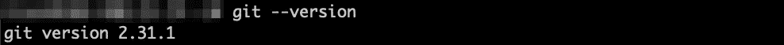
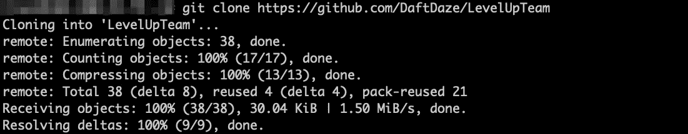
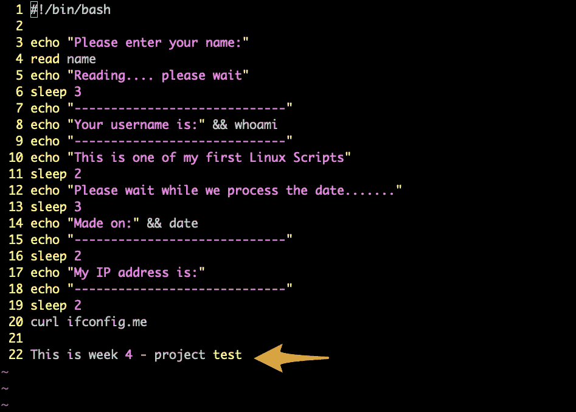

# GitHub 基础知识

> 原文：<https://blog.devgenius.io/github-basics-ef4a19fd60e2?source=collection_archive---------10----------------------->

## 分叉、克隆、提交、推送、拉取


当您与多人协作时，编写代码和跟踪变更会变得相当麻烦。这就是版本控制软件如此重要的原因。今天我们来看看 GitHub 的基础知识。为了进行编辑而不用担心覆盖现有的存储库，我们将把它分支并克隆到我们的本地工作站。一旦我们对分叉的存储库进行了编辑，我们就可以请求与原始存储库合并。

## Git 是什么？

2005 年，Linus Torvalds 开发了 **Git** 作为开源版本控制系统，帮助开发人员在软件开发期间跟踪文件的变化，当时多个程序员合作开发代码。

## 什么是 GitHub？

**GitHub** 是一个网站，在这里你可以托管、跟踪和管理你的 Git 仓库。用户可以很容易地在网站上与其他开发者共享他们的存储库。开发人员可以将远程存储库克隆到他们的计算机上，这样他们就可以在本地版本的项目及其代码历史上工作。

## 先决条件

*   CentOS 流 9
*   GitHub 帐户

## **安装 Git**

步骤 1:更新并安装 Git

让我们更新我们的回购。

```
yum update -y && yum upgrade -y
```

现在安装 **Git** 包。

```
yum install git -y
```


正在安装 Git 包

验证安装。

```
git --version
```



显示安装的 Git 版本

现在让我们设置一些基本配置。我们将设置全局用户名变量和电子邮件地址。确保该电子邮件地址与您的 **GitHub** 账户相关联。您的用户名可以是您喜欢的任何名称。

```
git config --global user.name <username>
git config --global user.email <email_addr>
```


设置用户名和电子邮件变量

## 分叉储存库

通过派生一个存储库，您可以在不改变原始存储库的情况下改变它。让我们将所需的回购转入我们的 GitHub 账户。在本例中，我们将派生以下回购。[https://github.com/LevelUpInTech/LevelUpTeam](https://github.com/LevelUpInTech/LevelUpTeam)

导航至您要分叉的回购，并单击右上角的 ***分叉*** 链接。


如何分叉回购

在下一个屏幕上，您可以更改 fork 的名称和描述。我将保留默认值。点击 ***创建叉*** 完成。


创建分叉

## 克隆分叉存储库

分叉库现在已经在 **GitHub** 上创建了。要在本地访问它，我们必须**克隆**存储库。使用分叉存储库的 URL，在您想要克隆存储库的工作站上输入以下命令。

```
git clone [https://github.com/DaftDaze/LevelUpTeam](https://github.com/DaftDaze/LevelUpTeam)
```



克隆存储库

克隆完成后，您会注意到现在已经有了存储库中所有目录和文件的副本。


显示克隆的目录和文件

## 犯罪

在 Git 中，提交是时间线的构建块。提交是时间线上的快照或里程碑。它们是通过使用 **git commit** 命令来捕获项目的当前状态而创建的。

对于我们的例子，我们将对 ***linux.sh*** 文件进行修改。看起来我们需要编辑第 22 行。



展示我们需要改变的路线

让我们将这一行改为呼应*“这是第 4 周 Github 项目”。*


显示更新的更改

现在我们已经在回购中更改了文件，我们需要添加它，以便我们的提交记录更改。

通过使用 **git add** 命令，您可以从您的工作目录向暂存区域添加变更。Git 知道您希望在下一次提交中包含对特定文件的更改。然而，git add 实际上对存储库没有任何显著的影响——直到运行 git commit，才会记录更改。

运行以下命令添加文件。

```
git add linux.sh
```

您可以通过运行 **git status** 命令来确认该命令是否成功。

```
git status
```


显示 git 状态

让我们使用 **git commit** 命令创建一个提交。你可以认为这是创建一个“保存点”。我们将使用“ **m** ”开关向我们的提交添加一条消息。

```
git commit -m "Edit line 22 to echo project Github"
```


显示 git 提交命令

## **按下**

在 Git 中，推送意味着将代码从一个存储库移动到另一个存储库。这通常用于将代码从本地机器转移到远程机器，或者转移到像 GitHub 这样的存储库托管服务。

现在让我们将更改推送到 GitHub 上的分叉存储库中。

**步骤 1:创建访问令牌**

我们将需要创建一个访问令牌，以便对 GitHub 进行身份验证。这里有一个视频链接，将向您展示这些步骤。[https://www.youtube.com/watch?v=SzrETQdGzBM](https://www.youtube.com/watch?v=SzrETQdGzBM)

导航至**设置****开发者设置**。选择“**个人访问令牌**”>下的**令牌(经典)**，然后在“**生成新令牌**下拉选择“**生成新令牌(经典)**


显示开发者设置

为其命名并定义范围，然后单击“**生成令牌**”。


访问令牌设置

从下一个屏幕复制您的访问代码。


创建了新的访问令牌

**第二步:推**

通过运行以下命令将更改推送到远程存储库。

```
git push origin main
```

它将提示输入远程 GitHub 库的用户名和密码。使用我们刚刚创建的访问令牌作为密码。


成功的推送命令

导航回到 GitHub 上的分叉 repo，然后转到 commits。你会看到已经发生的变化。


显示文件中的差异

## 拉

GitHub **pull** 请求允许您共享您对存储库中的分支所做的更改。一旦打开了一个拉请求，您就可以与协作者就潜在的变更进行交流，并在将变更合并到原始存储库之前添加后续提交。

让我们启动一个**拉**来请求我们的提交与原始存储库合并。从您的分叉回购中点击**拉请求** > **新建拉请求** > **创建拉请求**


您可以在下一页添加评论、解释提交的原因或添加任何其他信息。点击**创建拉取请求**完成。


显示完成的拉取请求

## 结论

是时候结束本教程了。我们已经了解了 GitHub 和 Git 的一些基础知识。我们分叉，克隆，提交，推，拉！