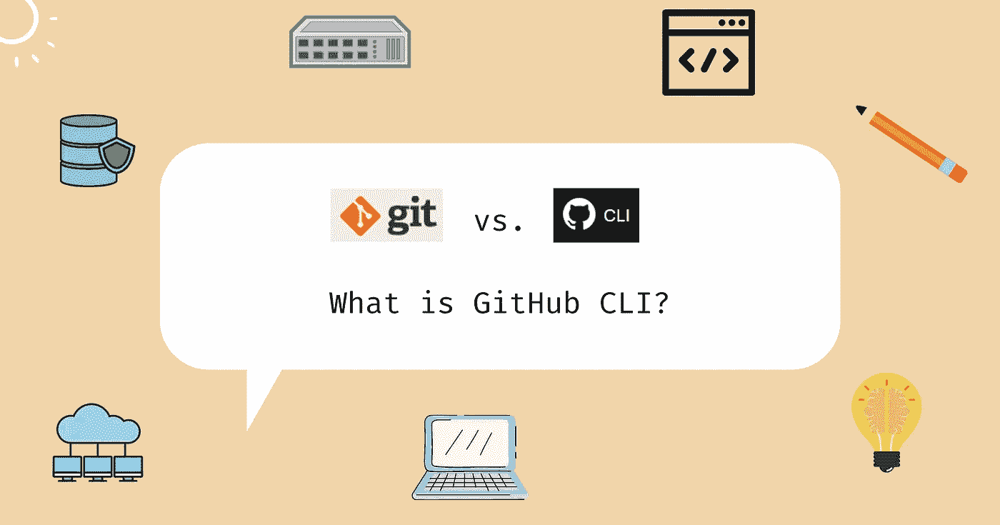

# ❓github CLI 3 分钟

> 原文：<https://blog.devgenius.io/github-cli-in-3-minutes-af9b7c975fa3?source=collection_archive---------12----------------------->

## 把 GitHub 带到你心爱的终端上。



大概你对 Git CLI 已经很熟悉了，但是你听说过 GitHub CLI 吗？

# 什么是 GitHub CLI？和 Git CLI 有什么不同？🍀

GitHub 是一个流行的闭源盈利性软件开发平台，构建在 Git 之上，Git 是一个无货币的分布式版本控制系统。GitHub 不仅限于版本控制能力，它还包括 CI/CD、项目管理工具和其他几项服务。

软件工程师使用 *Git CLI* 执行`git clone`、`git merge`等命令，与本地版本控制系统进行交互。然后，本地更改可以被推送到 GitHub 并托管在其上。同时，GitHub CLI 允许我们从命令行直接控制整个 GitHub 存储库和其他 GitHub 服务，避免使用 web 浏览器并减少我们工作流程中的上下文切换。

安装 Git CLI 的一种流行方式是使用 [Git-scm](https://git-scm.com/) 。


对于 GitHub CLI，可以从[https://cli.github.com/](https://cli.github.com/)安装。


# GitHub CLI 能做什么？🍀

有了许多生产就绪功能(以及更多功能)，您可以将 GitHub CLI 与其他工具(例如 GitHub Actions)或脚本语言结合使用，以创建高度定制的自动化作业。这极大地提高了生产率，改变了我们传统的 web GUI 工作流(不要与 GitHub Actions 工作流混淆)。每个命令支持几个不同的任务和选项。比如在`gh auth`，我们有`login`和`logout`。

截至 2022 年 4 月，GitHub CLI 中有 3 组命令。

*   核心命令

```
gh auth // Authenticate GitHub CLI and Git with GitHub.
gh browse // Open your chosen GitHub repository in the web browser.    
gh codespace // Manage your codespaces.       
gh gist // Manage GitHub gits.
gh issue // Manage GitHub issues.
gh pr // Manage GitHub pull requests.
gh release // Manage application releases.
gh repo // Manage repository-level tasks (e.g., deletion, cloning).
```

*   GitHub 操作命令

```
gh run // List, view, and watch recent workflow runs from GitHub Actions.
gh workflow // List, view, and run workflows in GitHub Actions.
```

*   附加命令

```
gh alias // Set command shortcuts.
gh api // Send an authenticated HTTP request to GitHub API and show the response.
gh completion // Generate shell completion scripts for GitHub CLI commands.
gh config // Manage GitHub CLI configuration settings.
gh extension // Manage GitHub CLI community-maintained extensions.
gh gpg-key // Manage GPG keys registered with your GitHub account.
gh label // Manage GitHub labels.
gh search // Search across all GitHub.
gh secret // Manage GitHub secrets in repositories or organizations.
gh ssh-key // Manage SSH keys registered with your GitHub account.
gh status // Shows your GitHub activities (issues, mentions, etc.)
```

# 包裹🍀

虽然 GitHub CLI 刚刚发布了两年多一点，但它现在已经拥有了普通 GitHub 用户会使用的核心功能。如果你喜欢住在终端空间，GitHub CLI 似乎是一个很好的解决方案。

如果你想了解更多关于 GitHub 的知识，你可能想看看我下面的文章:

*   [GitHub 操作基础——事件、工作流、运行者、作业和操作](https://hungvu.tech/github-cli-in-3-minutes?utm_source=medium.com&utm_medium=referral&utm_campaign=medium_crossposting)
*   [高级 GitHub 操作—条件工作流](https://hungvu.tech/advanced-github-actions-conditional-workflow?utm_source=medium.com&utm_medium=referral&utm_campaign=medium_crossposting)

关于 GitHub CLI 的更多信息，可以看看 [GitHub CLI 的官方文档](https://cli.github.com/manual/)。

[# github](https://hungvu.tech/tag/github)[# devo PS](https://hungvu.tech/tag/devops)[#云](https://hungvu.tech/tag/cloud)[#生产力](https://hungvu.tech/tag/productivity) [#git](https://hungvu.tech/tag/git)