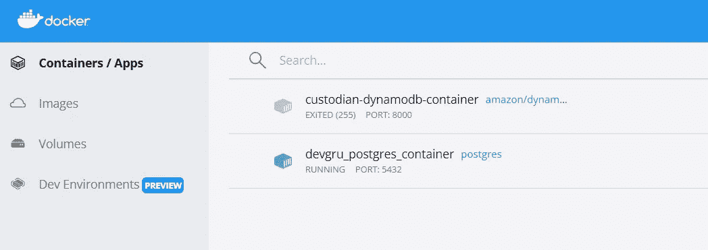

# GitHub 容器注册表:发布 Postgres Docker 图像

> 原文：<https://blog.devgenius.io/github-container-registry-publish-a-postgres-docker-image-c0bdfbd1cd21?source=collection_archive---------17----------------------->


# 为什么是 Postgres？

Postgres 提供以下服务:

*   完全开源
*   使用起来很便宜
*   可靠的
*   安全的
*   可攀登的
*   用 SQL、c 和 plgpsql 编写函数和存储过程的选项

为什么不是 MySQL，Oracle，Sybase，SQL Server 等？目标项目上的 Postgres 实现是一个更大的数据库架构的一部分，该架构包括 MongoDB 和 DynamoDB 的元素。公平地说，我使用了一个可以轻松扩展 AWS 的工具。

互联网上有很多资源提供了关于 Postgres 与竞争对手的客观和一些(微小的)扭曲的观点。既然我们对加入赞成或反对的争论不感兴趣，我建议你挑选对手头的项目有用的。

就我而言，我追求可扩展性、成本和灵活性。

# **假设和前提**

## **你已经安装了 Docker 桌面**

[https://www.docker.com/products/docker-desktop](https://www.docker.com/products/docker-desktop)

## **您拥有 Docker Hub 账户(可选，但很酷)**

[https://hub.docker.com/signup](https://hub.docker.com/signup)

还假设您已经从 Docker Hub 上的官方 Postgres 映像创建了一个容器，并对 DB 进行了一些修改。如果没有，请运行下面的命令开始:

```
docker pull postgres
```

然后您可以继续运行映像，使用您选择的工具访问您导入的服务器(我推荐使用 Eclipse 的 [DBeaver](https://dbeaver.io/) 插件或 [JetBrain 的 DataGrip](https://www.jetbrains.com/datagrip/) )。

创建您的数据库，添加一些表和一些函数或存储过程，我们就可以开始真正的交易了。但首先，让我们考虑几个基本问题。

**为什么要使用 GitHub 容器注册表？**

对于免费帐户，Docker Hub 规定了一个私有存储库的限制。在拉取阈值、访问控制等方面还有其他限制。

本教程将指导我们探索 Github 的容器注册表所提供的可能性(在本文中我们将称之为 GCR)。

> *GitHub 容器注册中心改进了我们在 GitHub 包中处理容器的方式。借助今天推出的新功能，您可以更好地实施访问策略，鼓励使用标准基础映像，并通过在整个组织内更轻松地共享来促进内部采购。— GitHub*

GitHub 容器注册表提供匿名访问，在撰写本文时，GCR 是免费的，并提供无限的图像存储库。

在需要某种级别的隐私和访问控制的地方，GCR 提供了限定范围的访问。

> 为了更好地支持跨团队的协作，并帮助我们的客户强化他们发布的最佳实践，我们还在整个组织中引入了容器的数据共享和细粒度权限。
> 
> *通过向组织发布容器图像，团队可以更容易、更安全地与团队中的其他开发人员共享它们。通过将包的权限与其源代码的权限分开，团队可以将发布限制在较小的用户范围内，或者实施其他发布策略。*

还有更多；使用 GitHub Actions，您可以创建工作流来自动化 GCR 的发布过程。

好了，现在我们准备好了。您的 Docker 桌面容器选项卡应该类似于以下内容:



Docker 桌面在我们从 Docker Hub 获取 Postgres 映像后

至此，我们已经有了 Postgres Docker 容器，并对其进行了一些 DB 更改。这是我们推进 GCR 进程的起点。

但不要太快。让我们为即将发生的事情准备好我们的 Github 简介。首先，我们需要创建一个个人访问令牌(PAT)。

**创建个人访问令牌**

PAT 应为此目的定制创建，其范围权限应基于需要。

1.  访问您的 GitHub 个人资料
2.  单击您的个人资料下方的下拉菜单中的设置


1.  点击开发者设置
2.  选择个人访问令牌
3.  单击生成新令牌
4.  添加一个用于识别此令牌的注释，设置有效期(最长 1 年)并选择相应的范围。GitHub 推荐以下范围选择:

> *选择 read:packages 范围来下载容器图像并读取它们的元数据。*
> 
> *选择 write:packages 范围来下载和上传容器映像，并读取和写入它们的元数据。*
> 
> *选择删除:包范围以删除容器图像。*

完成上述步骤后，单击生成令牌。

记下新令牌，并将其保存在安全的地方。这个令牌从今以后再也不会在 Github 上显示了。如果丢失，您可能需要生成新的令牌。

现在让我们进入下一步，我们将存储和使用 PAT。

**将 PAT 存储在环境变量中**

现在已经创建了 PAT，使用以下命令将其设置为环境变量。我们将这个变量命名为 CR_PAT。我用的是 PowerShell 的 Windows 11。

```
set “CR_PAT=YOUR_GENERATED_TOKEN”
```

现在使用以下命令来确认环境变量:

```
dir env:CR_PAT
```

您应该会得到类似如下的结果:

```
PS C:\Users\Okechukwu Agufuobi> dir env:CR_PATName Value
----                           -----

CR_PAT                         YOUR_PERSONAL_ACCESS_TOKEN
```

*提示:使用 dir env:将列出系统上的所有环境变量:-)*

在 GIT Bash 上运行这个

```
echo $CR_PAT | docker login ghcr.io -u sdg7onado — password-std
 ni
```


现在返回 Powershell 并运行下面的命令来列出我们所有的容器。

```
docker ps -a
```

您应该会看到类似下面的结果


现在，使用上一个窗口中的容器 ID 运行以下命令:

```
docker commit d8a37326cb35 custodian_postgres_env
```

这将我们的容器提交给一个新的图像。图像将在下一步发送到 GCR。您应该会得到这样的结果:

```
sha256:8191303b0XXXXXXXXXXXXXXXXXXXXXXXXXXXXXXXXXXXXXXXXXXXe1c6fa
```

运行以下命令查看所有 Docker 图像:

```
docker images
```


太棒了！现在，您已经准备好了一个 Docker 映像。

下一个命令标记图像，为我们的推送做准备:

```
docker image tag custodian_postgres_env ghcr.io/sdg7onado/custodian_postgres_env:latest
```

您可能希望再次运行 docker images 命令来查看图像的状态。

确认标签后，我们现在运行下面的命令。在此之前，请确保您有一个活跃和稳定的互联网连接。

```
docker push ghcr.io/sdg7onado/custodian_postgres_env:latest
```

push 命令告诉 Docker 将映像推送到 GCR。ghcr 代表 GitHub 容器注册。sdg7onado 是我的 Github ID，最后一部分是图片名称和标签。

如果一切顺利，您应该会看到一个类似这样的窗口

```
The push refers to repository [ghcr.io/sdg7onado/custodian_postgres_env
 50f47d97acf5: Pushed
 3e93c64fbb74: Pushed
 1271062941c7: Pushed
 f763ae8cc88c: Pushed
 efba6dde34b9: Pushed
 5d3ce28a718f: Pushed
 fc03e921344f: Pushed
 5b21fbd19d68: Pushed
 ad809b5894e9: Pushed
 76941029e9a9: Pushed
 9f5f669ea81c: Pushed
 295288988f3a: Pushed
 8baa2c90b0ab: Pushed
 e1bbcf243d0e: Pushed
 latest: digest: sha256:161f61ffXXXXXXXXXXXXXXXXXXXXXXXXXXXXXXXXX74bd1b9a5 size: 3245]
```

就是这样！

您已经将图像推送到 Github 的容器注册表中。如果您遵循这些步骤，您应该会看到类似这样的内容。在 packages 标签下，你会发现你全新的容器图像，准备好与我们地球人分享。


随意探索如何让你的队友尝试拉你的形象。