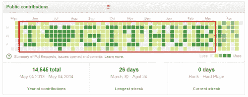

# Github 贡献没有出现？

> 原文：<https://blog.devgenius.io/github-contributions-not-showing-up-ac70ebb602c3?source=collection_archive---------8----------------------->


你日夜不停地提交修改，却仍然不明白为什么你的提交没有出现在 **Github** 上？这可能是因为您有一个与这些提交相关联的未链接的电子邮件。

# 检查您的 Github 电子邮件设置

确保你有一个电子邮件，用于将提交关联到你在 **Github** 上的账户。

1.  点击屏幕右上方的个人资料图标。
2.  一直走到**设置**并点击它
3.  在您的设置/个人资料下的**访问**面板点击**电子邮件**
4.  应该列出您想要用于帐户和提交的电子邮件，否则单击**添加电子邮件地址**。

# **在 Git 中查看您的电子邮件**

要检查哪个电子邮件与您的提交相关联，请打开您的**终端**并键入以下内容来检查哪个电子邮件与您的提交相关联。

```
git config --global user.email 
```

如果你没有在 **Git** 中关联的正确电子邮件，就没有办法将你过去所做的那些承诺与你的 **Github** 账户联系起来，这就是为什么你的贡献没有出现。在 **Git** 中的邮件应该与你的 **Github** 中的邮件相匹配。要更改与这些提交相关联的电子邮件，请键入以下内容:

```
git config --global user.email "*email@example.com*"
```

之后，通过键入与之前相同的命令来确认它已成功链接:

```
git config --global user.email
```

现在，您应该可以在 **Git** 中看到您刚刚链接的邮件。这将把你未来的任何进一步的承诺与你的 Github 联系起来，并显示为贡献。耶！

# 我过去的提交怎么办？我怎样才能让它们显示为具有正确日期的贡献？

首先，要检查与您提交的内容相关联的**作者**或**电子邮件**，您可以通过转到提交 **URL** 并添加 ***来进行检查。把*** 补到它的结尾。就我而言，我甚至没有与之相关的电子邮件，它只是一个**“+”**符号。

其次，为了更新之前提交的**作者/电子邮件**信息，你必须重写你的库的历史。

最后，如果您的回购中有几个贡献者，这是不鼓励的，因为任何分叉或克隆的人都必须获取重写的历史，并将任何本地更改重新存储到重写的历史中。在我的情况下，这些都是只有我作为贡献者的回复，所以我很乐意去，否则，**请谨慎行事！**

# **如何从您之前提交的信息中更新作者/电子邮件信息**

1.  在继续之前，您需要与您的提交相关联的旧电子邮件地址，因此无论在键入:

```
git config --global user.email
```

***在我的例子*** 中，我甚至没有关联的电子邮件，然后我只是键入出现的任何内容，所以它只是一个 **"+"** 符号，作为我的旧电子邮件*。你需要正确的电子邮件来关联这些提交，所以你的 **Github 电子邮件**。*

*2.创建您的回购的全新裸克隆:*

```
*git clone --bare [https://github.com/](https://github.com/)<username>/<reponame>.git
cd <reponame>.git*
```

*3.复制并粘贴以下脚本，根据您收集的信息替换变量:*

** `OLD_EMAIL`
* `CORRECT_NAME`
* `CORRECT_EMAIL`*

```
*git filter-branch --env-filter '    OLD_EMAIL="your-old-email@example.com"   CORRECT_NAME="Your Correct Name"   CORRECT_EMAIL="your-correct-email@example.com"    if [ "$GIT_COMMITTER_EMAIL" = "$OLD_EMAIL" ]   then   export GIT_COMMITTER_NAME="$CORRECT_NAME"   export GIT_COMMITTER_EMAIL="$CORRECT_EMAIL"   fi   if [ "$GIT_AUTHOR_EMAIL" = "$OLD_EMAIL" ]   then   export GIT_AUTHOR_NAME="$CORRECT_NAME"   export GIT_AUTHOR_EMAIL="$CORRECT_EMAIL"   fi   ' --tag-name-filter cat -- --branches --tags*
```

*如果你做的正确，你只需要在脚本开始的时候替换三个东西。最好是在记事本应用程序中，然后再粘贴到您的终端中。*

*4.按 Enter 键运行脚本*

*5.查看新的 **Git** 历史记录中的错误。您也可以键入:*

```
*git log*
```

*并检查这些提交最终是否有正确的电子邮件地址。*

*6.将更正的历史推送到:*

```
*git push --force --tags origin 'refs/heads/*'*
```

*7.清理临时克隆:*

```
*cd ..
rm -rf <reponame>.git*
```

**

*你现在应该看到你的贡献显示在你的个人资料。耶！对我来说，我没有意识到我的提交有问题，直到我看到我的贡献没有绿色，尽管这个月我已经提交了各种提交。无论如何，我希望这对你有所帮助！*