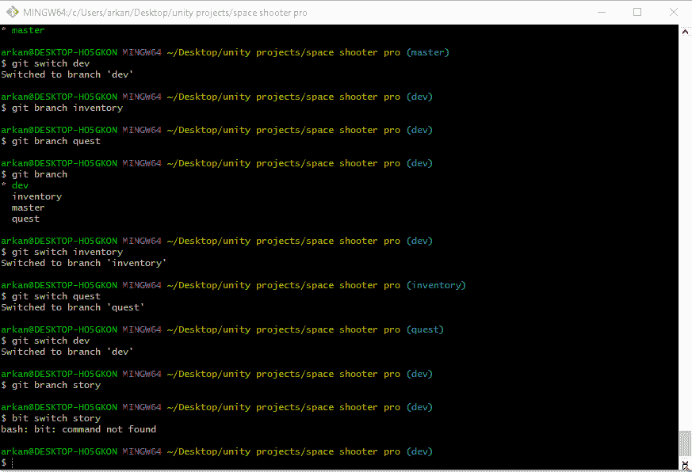
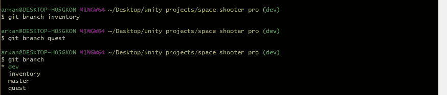
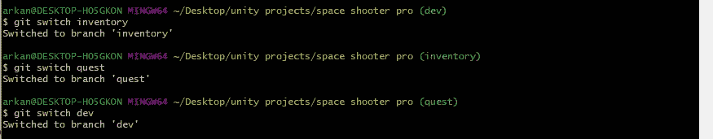
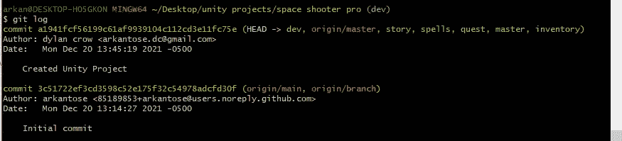
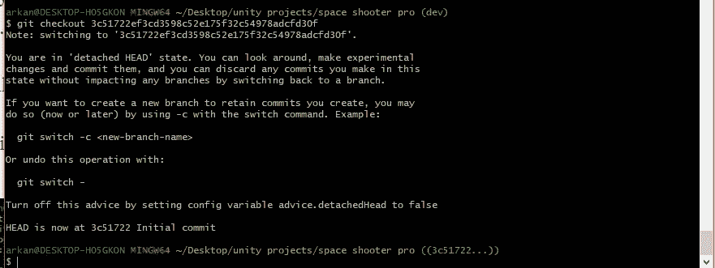

# GitHub“团队合作成就梦想”

> 原文：<https://blog.devgenius.io/github-teamwork-makes-the-dream-work-f2d9d2c65781?source=collection_archive---------13----------------------->

> 你可能会想，“为什么我不能把所有的东西都放在我的仓库的一个分支里呢？”

## 嗯，答案很简单！

一个 Unity 项目有多个分支是有意义的，它让事情 ***有组织*** 。

在本文中，我将解释为什么拥有多个分支是必须的，如何创建它们，如何在它们之间切换，合并它们，以及如何在必要时备份到以前的推送。

# 为什么多个分支机构是必须的？

在您的存储库中有一个分支意味着每个人都将从同一个点进行推和拉。多个人如何同时从事同一个项目？*就是不实用。*

最佳做法是将项目分成不同的部分。最起码，你希望至少有两个分支，即使只有你一个人在项目中工作。

# 主分支和开发分支

至少有了这两个分支，你就有能力拥有一个*开发(development)* 分支，在那里你可以积极地进行更新，然后拥有*主*分支，让你的最终产品面向公众。

否则，如果你在一个团队中工作，最好将项目分成不同的部分，并将每个部分分配给个人。这使得事情保持有组织和更有效地生产。

## 一个例子可以是一个基本的 RPG:

可能的分支:

*   掌握
*   偏差
*   探索
*   库存
*   演员
*   延伸文件系统

*使用不同的分支可以保持整体整洁！*

# 如何创建多个分支:

在 git 中创建一个分支非常简单。您只需输入以下命令:

$ git 分支<name of="" branch=""></name>

打字:

$ git branch ----这个命令将给出您当前拥有的所有分支的列表。

# 如何在它们之间切换:

在分支之间切换的命令是

$ git 开关<name of="" branch=""></name>

从上图可以看出；每次切换时，您都可以看到它以蓝色字体反映在目录路径的末尾。

# 如何合并分支:

首先，您希望确保切换到您想要添加代码的分支。

第二，你打字

$ git 合并<branch name=""></branch>

键入要从中提取信息的分支机构的名称。

请记住，在推送之前，必须添加和提交任何信息。如果您没有添加和提交信息并推送它；您的存储库不会反映您的任何更新。

# 如何备份到以前的推送。

当您将新信息推送到您的存储库时；将会有一个带有 id 的日志，您可以使用它来“回滚”您的代码。

使用以下命令调出您的推送日志

$ git 日志

然后使用命令

$ git 结帐<the commit="" i.d.=""></the>

这将使你的 unity 进入一个你可以编辑的临时状态。您可以使用命令将这些编辑保存为新的分支名称

$ git 开关-c<new-branch-name></new-branch-name>

或者，您可以使用命令将当前分支重置回之前的状态

$ git 重置-硬<the commit="" i.d.=""></the>

这将重置你的分支，之后的所有内容都将丢失，所以使用这个命令时一定要非常小心。

> 享受“分支”和尝试新事物；)