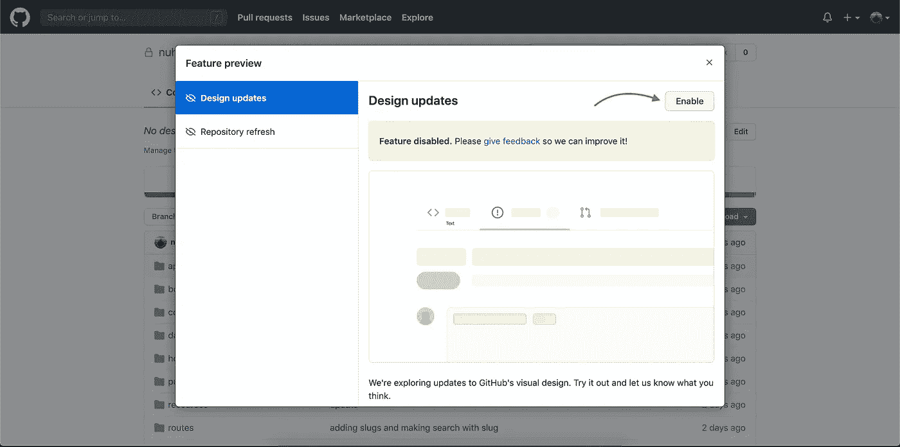

# GitHub 的设计更新

> 原文：<https://blog.devgenius.io/githubs-design-update-e073b9fa2154?source=collection_archive---------35----------------------->

在科技领域，“好奇心永远不会杀死猫”，不像许多人声称的那样，在其他行业也是如此。今天在浏览我的 GitHub 简介时，我发现了一个新的 GitHub 设计更新，并启用了它。

嘣，我对新的用户界面/UX 感到惊讶，因为人们现在可以很容易地关注他们的追随者，追随者和喜欢。老实说，我更惊讶的是他们如何避免将新的更新推给每个人，而是只在请求时才启用它。

以下是之前的 GitHub 配置文件:

设计更新前 GitHub 配置文件的外观

要启用新的设计更新，请执行以下步骤；

第 1 步:单击右上角的个人资料功能区，由您的个人资料图片表示

第 2 步:点击“功能预览”

第 3 步:点击启用

看哪，新的惊人的更新，

新的更新标记在红色矩形中

# 您还应该知道，存储库页面已经用新的布局进行了更新，以提升功能和项目信息。我还雇用你，使更新和享受新功能。

*最初发表于*[*【https://nuhuibrahim.com】*](https://nuhuibrahim.com/blog/recent-githubs-design-update)*。*