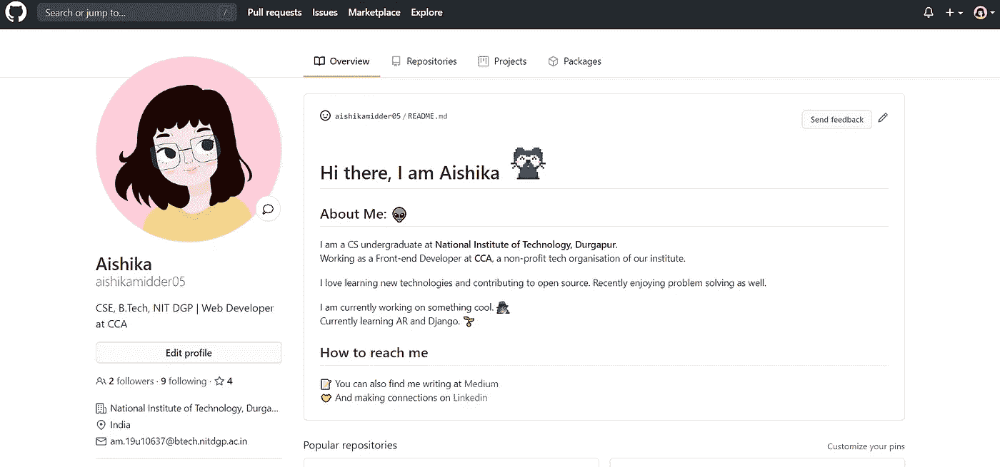
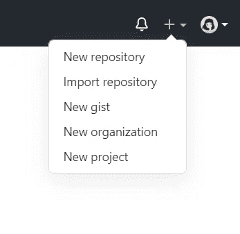
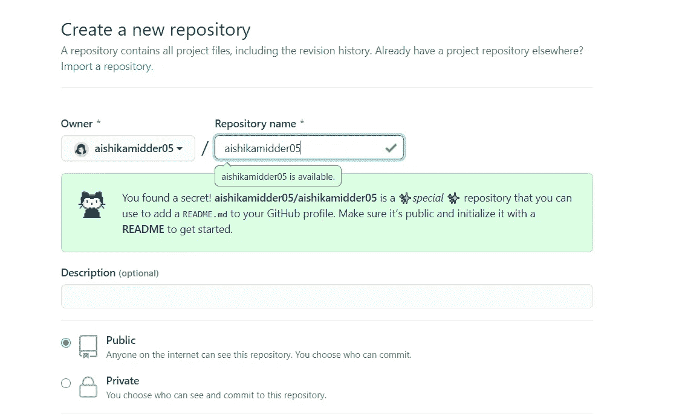
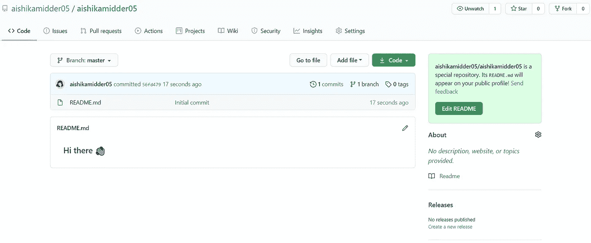
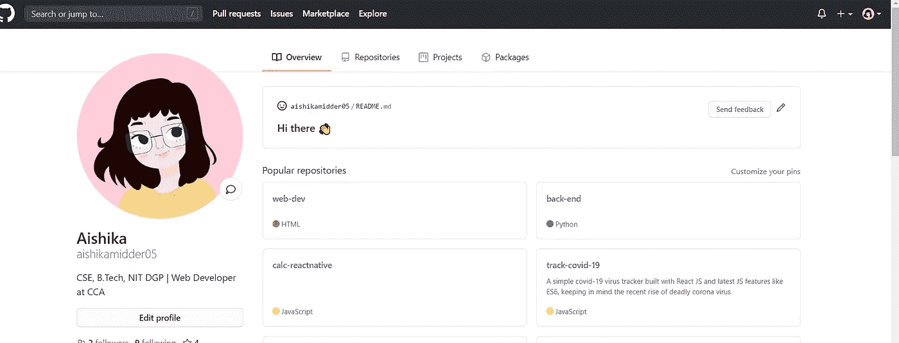
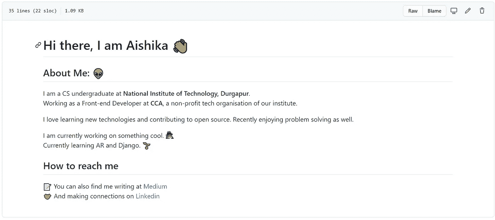
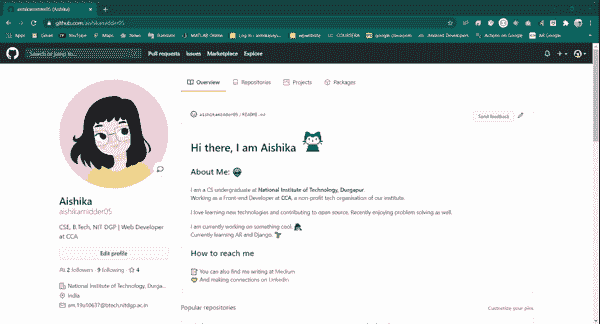

# GitHub 最新的个人资料自述功能太酷了——以下是如何创建你自己的个人资料

> 原文：<https://blog.devgenius.io/githubs-latest-profile-readme-feature-is-so-cool-here-s-how-to-create-your-own-261cf843be6c?source=collection_archive---------10----------------------->

> 就在前几天 **GitHub** 非常悄悄发布了一个很酷的新功能:**简介自述。**这一新功能允许用户创建一个配置文件级的自述文件，并在他们的 GitHub 配置文件上显著显示。通过这篇文章，我将带您了解这个新特性，并帮助您访问它。

> 那么，我们为什么需要这个新的个人资料自述文件功能呢？

Github 新的个人资料级 README 功能允许用户显示比他们的个人资料更多的内容，支持 GitHub 的 markdown，这实质上意味着你可以通过添加表情符号、段落、图像、链接等使内容更具视觉吸引力。？).

配置文件自述文件更加清晰可见，因为它位于固定存储库上方，并且根据您的喜好在网页折叠上方占据尽可能多的空间。对我个人来说，自述文件似乎是对许多 GitHub 用户已经熟悉的惯例的一个很好的扩展。

# 那么，如何给自己做一个呢？

让我们首先进入 github 个人资料主页，在这里我们将创建一个新的资源库。

这里，我们将创建一个与您的 GitHub 用户名同名的存储库。例如，我的用户名是 aishikamidder05，所以我将创建一个同名的 GitHub 存储库。

***看那个！我发现了一个秘密！*** *呜*你也发现了一个秘密，因为你正在和我一起读这个！特呵呵呵

使用自述文件初始化此存储库并创建您的存储库。像这样的东西会出现。

所以，现在如果你回到你的 github 个人资料页面，你将能够在你的个人资料顶部看到这条可爱的“你好”信息。

Tada！你做到了！但是看起来很空白，不是吗？让我们在新制作的自述文件中进行更改。

点击右边的小铅笔，开始编辑你的自述文件。我是这样编辑我的-

Github 有自己的应用标题、段落、表情符号、链接和最重要的可爱的猫 gif 的 markdown(*你可以放任何你想要的 gif，事实上，我只是对猫着迷*)。

如果你不太熟悉 Github 的 markdown，这里有一个链接，你可以自己去看看: [GitHub Docs Markdown](https://docs.github.com/en/github/writing-on-github/basic-writing-and-formatting-syntax)

不管怎样，我觉得我的梦想少了点什么，于是我弥补了。

你能看见这只微笑的可爱的猫吗？你一定觉得它很可爱。^_^

希望你今天学到了一些有价值的东西！可以查看我的 [github 链接](https://github.com/aishikamidder05)。

如果你喜欢这个故事，请点击👏按钮并分享，帮助其他人找到它！欢迎在下方留言评论。

*再见！*