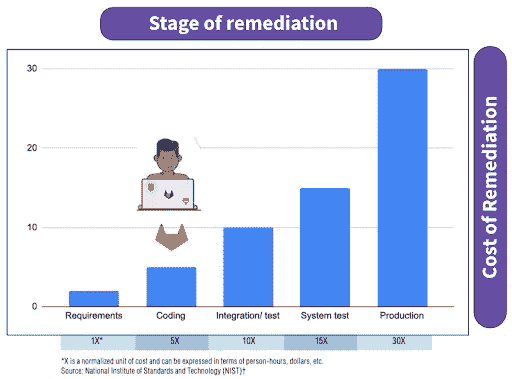
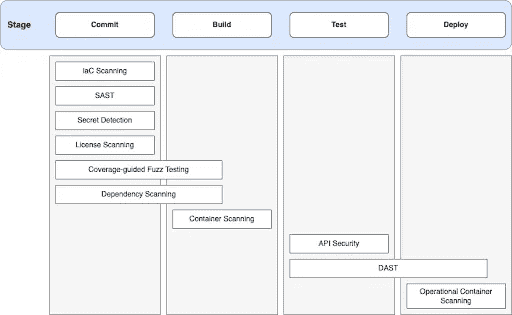

# GitLab for DevSecOps:价值是什么，怎么用？

> 原文：<https://blog.devgenius.io/gitlab-for-devsecops-what-is-the-value-and-how-to-use-it-9f1e376cf1a9?source=collection_archive---------8----------------------->

随着软件供应链需求的不断增长，开发和运营对于软件开发生命周期来说一直是必不可少的。但是最近，DevSecOps 已经成为应用程序开发过程中的新标准。所以让我们试着去理解它是什么，它的重要性，以及它与 DevOps 有什么不同。


潘卡杰·帕特尔在 [Unsplash](https://unsplash.com?utm_source=medium&utm_medium=referral) 上的照片

# 触及表面

在深入了解 DevSecOps 是什么之前，我们需要了解 DevOps 是什么。SDLC 中最早的方法之一是瀑布模型，在这种模型中，产品开发从构思和设计到开发、测试和部署依次进行。流程中的每个后续阶段只能在获得前一步骤的输出后开始。

这种实践通常会消耗更多的时间来完成，并且对变更的响应性较低，尽管这种方法可以用在具有明确定义的需求的场景中，以及在将来不太可能发生变更的场景中。

为了解决时间限制，引入了[敏捷方法](https://www.atlassian.com/agile)。它基于迭代和增量开发，不需要预先的问题定义，通常通过持续的反馈来处理项目重组。虽然敏捷方法提高了开发速度，但是 DevOps 才是真正加速开发过程的。

后者涉及开发和 IT 团队之间的协作。这里的主要工作是自动化敏捷方法中涉及的过程。与典型的 dev-QA-ops 组织相比，开发人员在 DevOps 中不会把代码扔到墙上。相反，在 DevOps 设置中，团队负责监督整个过程。

# DevSecOps 是安保 DevOps 吗？

开发新手通常会认为 DevSecOps 只是增加了安全性的 DevOps。然而，事实并非如此。

简而言之，DevSecOps 是 DevOps 的更新版本或迭代版本，其基础构建在 DevOps 之上，并在开发和运营流程中加入了额外的安全层，而不是将其作为次要组件。

随着功能发布和更新推出频率的增加，最终的安全性测试被证明是一个瓶颈，因此为了消除这种低效率，DevSecOps 将安全性集成到了开发阶段。

# DevSecOps 的 Gitlab

众所周知，GitLab 是一个流行的存储库托管和版本控制系统，可以用来高效地构建软件，从规划到生产。GitLab 主要关注 CI/CD 和 DevOps。与 GitHub 的一个显著区别是 [CI/CD 安全性](https://armosec.io/blog/ci-cd-security)。它为集成和部署提供了安全性，这使它成为 DevSecOps 青睐的平台。

由于 DevSecOps 强调在开发的每个阶段都包含安全性，GitLab 提供了一些特性来帮助团队实现这一点。让我们看看在哪里以及如何使用 GitLab 的特性和工具链来将安全性完全集成到 DevOps 中。

# 在 CI/CD 管道中集成安全性

以前，安全性测试是在开发周期的最后阶段对应用程序进行的。这将导致巨大的补救成本，无论是货币价值还是工时，使整个过程变得乏味。



[来源](https://about.gitlab.com/topics/devsecops/)

拥有 GitLab 内置的[综合扫描仪](https://circleci.com/blog/sast-vs-dast-when-to-use-them/#:~:text=SAST%20scans%20the%20application%20code,stimulates%20an%20outside%20attacker's%20perspective.)，包括 SAST、DAST 等。，漏洞可以在创建时就被发现并修复。当开发人员仍然在迭代他们的代码时，自动化的安全测试在 CI 管道中执行，并且结果被发送给他们。调查结果仅限于新发现的漏洞，这使得开发人员可以非常清楚和实际地修复他们引入的安全问题，而不必对已经存在的大量 bug 和技术债务负责。

# 依赖性管理

考虑到现在软件开发中使用的大量开源组件，手动维护依赖关系是一个困难的过程。

为了有效地管理这种依赖关系，可以使用“依赖关系列表”来审查项目的依赖关系和关键细节。导航到您的项目并选择**安全性&合规性>依赖项列表**。

通过单击依赖项名称旁边的箭头或显示存在多少已知漏洞的标记，可以查看该依赖项的已知漏洞。列出了每个漏洞及其描述和严重程度。

# 补救策略

通常，安全专业人员必须持续监控主要漏洞修复的状态。调查结果包含在一个工具中，但开发团队负责进行必要的更正，导致两个团队之间频繁的冲突和无效的沟通。然而，使用 GitLab 的单一工具，安全专业人员可以直接从他们的仪表板查看特定漏洞的补救状态。此外，两个团队可以使用 GitLab 问题合作进行更正。

在持续集成阶段，通过分析应用程序的各个部分，包括源代码、依赖项、基础设施等，实施不同的安全策略。



[来源](https://docs.gitlab.com/ee/user/application_security/?_gl=1*1yzbs05*_ga*Mzk5MzI3NTgxLjE2NjkzMDUwNTg.*_ga_ENFH3X7M5Y*MTY2OTMxMTAxMi4zLjEuMTY2OTMxMTM0Ni4wLjAuMA..)

要启用测试和扫描，请将以下代码添加到您的`.gitlab-ci.yml`

```
include:
  - template: Security/Dependency-Scanning.gitlab-ci.yml
  - template: Security/License-Scanning.gitlab-ci.yml
  - template: Security/SAST.gitlab-ci.yml
  - template: Security/Secret-Detection.gitlab-ci.yml
```

# 对我有什么好处？

我们看到了 GitLab 在增强 DevSecOps 方面的各种优势和解决的问题，那么这些特性提供了什么好处呢？嗯，不止一个。

客户和企业中的其他利益相关者需要快速、可靠和安全的软件。因此，开发团队必须使用最新的协作和安全工具，例如自动化安全测试、持续集成和交付(CI/CD)以及漏洞修补，才能跟上发展。DevSecOps 的主要目标是增加开发、安全和运营团队之间的协调，以提高组织效率，并使团队专注于为公司增加价值的任务。

此外，当在项目接近完成时发现安全缺陷时，开发团队可能会经历严重的延迟，因为他们急于修复问题。然而，DevSecOps 策略允许开发人员在项目工作时修复缺陷，这促进了安全代码编写，并减少了安全审查期间的来回奔波。这使得企业能够更快地交付软件，并确保它更具成本效益和安全性。

# 结论

DevSecOps 不仅仅是 DevOps 的一个附加安全性；它在开发生命周期的每个阶段都考虑到了安全性。GitLab 为整个 [SDLC](https://www.synopsys.com/glossary/what-is-sdlc.html) 提供了一个单一的平台，能够通过安全扫描发现单点解决方案无法发现的漏洞和其他缺陷。

GitLab 在 CI/CD 管道中提供嵌入式安全性。此外，快速识别、检测和分类有助于更快地解决 bug 和漏洞，从而使应用程序的安全性比以往任何时候都更低。