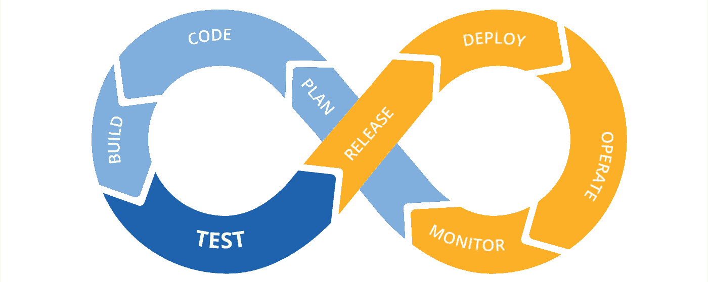
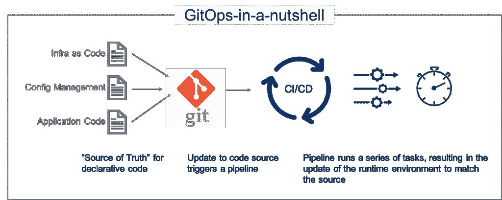
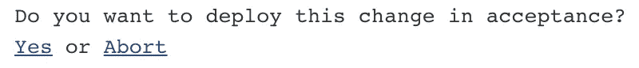
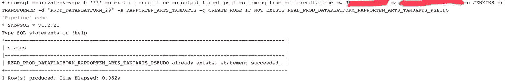
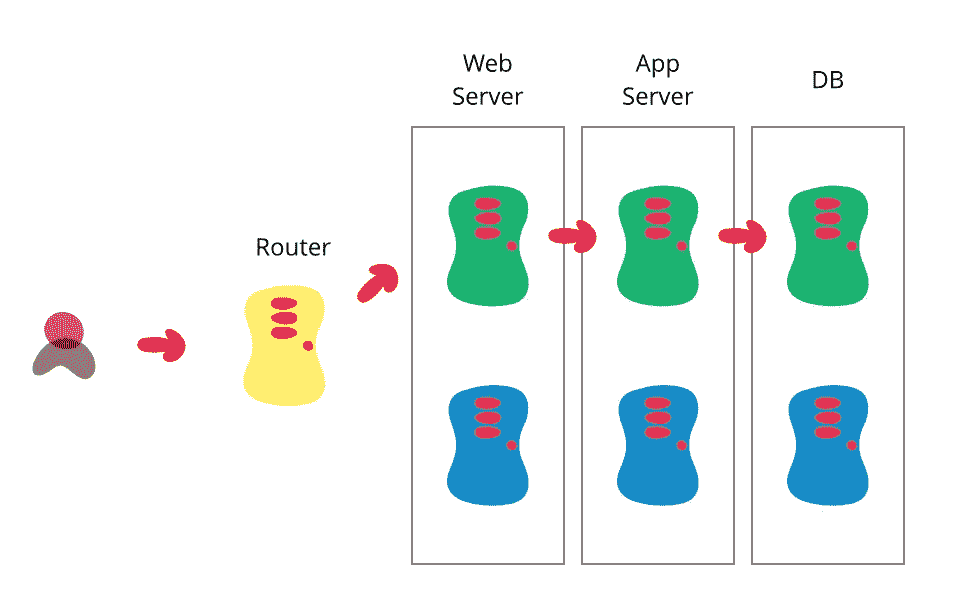
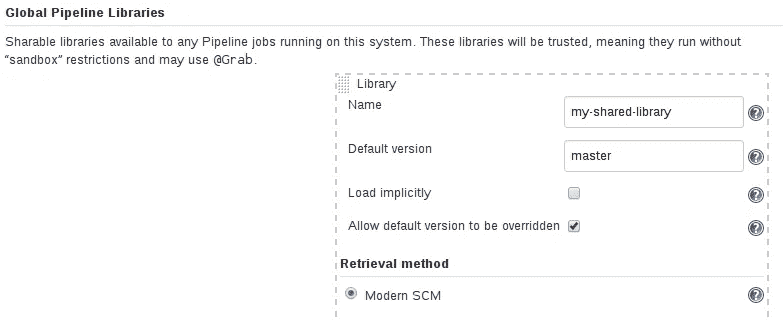
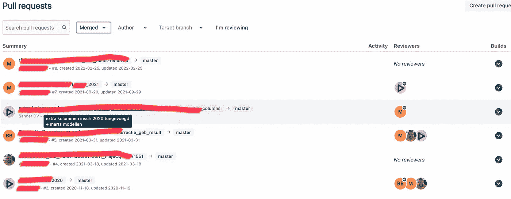

# GitOps for data —在 AWS 上与 Jenkins、Snowflake 和 dbt 一起实践

> 原文：<https://blog.devgenius.io/gitops-flow-for-data-hands-on-with-jenkins-snowflake-and-dbt-on-aws-16258e575ec3?source=collection_archive---------7----------------------->



你有没有想过用 GitOps 和 Jenkins 一起部署数据管道？在这个实践教程中，我们将使用 AWS、Snowflake 和 dbt 在 Groovy 中创建我们自己的领域特定语言。

这个想法是创建我们自己的抽象，开发者不需要理解 GitOps 流背后的复杂性。开发人员只需提供一个小的声明性数据管道文件。

不泄漏任何命令逻辑意味着我们可以在不影响现有 dbt 项目的情况下不断改进 GitOps 代码。

**读者注意:如果你对 Jenkins、git、dbt 和 snowflake 有基本的了解，这篇文章可能才有意义。**

# GitOps 工作流程



让我们描述一个典型的数据管道开发工作流程:

客户要求在现有的数据产品中加入这一新的闪亮功能，这将使我们的公司如虎添翼。

开发人员快速启动并从主分支(生产)创建一个特性分支。开发人员可能会召集一些同事，一起开始创建这个全新功能的第一个原型。

开发人员现在创建一个拉取请求，由其他同事和客户审阅。在一些来回和一些代码变更之后，拉请求被评审者接受。

最后，开发人员将代码与主分支合并，并将代码部署到生产中。

> **我们想让这个工作流程完全自动化！**

我们的 GitOps 流程应满足以下要求:

*   每个开发分支都有自己的游乐场，主分支上的代码将投入生产。
*   在进入生产之前，不允许直接提交给 master 来强制通过 pull 请求执行代码和客户审查。
*   每一次生产部署都应该标记一个新的版本号。
*   工作流应该由简单的 DSL 驱动，易于分析工程师学习。不需要每个开发人员都成为开发运营专家。
*   每个分支都应该为数据产品的开发者和用户提供最新的文档

# 创建我们自己的 DSL

首先考虑如何使用你的代码总是明智的。所以首先我们要设计自己的 [DSL(领域特定语言)](https://www.jetbrains.com/mps/concepts/domain-specific-languages/#:~:text=What%20are%20Domain%20Specific%20Languages,from%20the%20field%20or%20domain.)。我们希望让其他开发人员开始构建自己的数据管道变得尽可能简单。

可以通过提供 Jenkinsfile 来配置数据管道。当代码被推送到 git repo 时，这个文件将被 Jenkins 获取。

```
[@Library](http://twitter.com/Library)('dbt-snowflake-jenkins-shared-library')def acceptance = [
  account: "<your snowflake account>",
  database: "<your snowflake database>",
  role: "<your snowflake role>",
  warehouse: "<your snowflake warehouse for the CI build>",
  schema: "<your snowflake schema>",
]def production = [
  account: "<your snowflake account>",
  database: "<your snowflake database>",
  role: "<your snowflake role>",
  warehouse: "<your snowflake warehouse for the CI build>",
  schema: "<your snowflake schema>",
  containerConfig: [
    imageName: "<the name of the docker image for the daily refresh>",
    warehouse: "<your snowflake warehouse for the daily refresh>"
  ],
]dbt.transform(acceptance, production) {
  sh 'dbt seed'
  sh 'dbt run'
  sh 'dbt run-operation some_random_operation'  
  sh 'dbt test'
}
```

就是这样！我们首先需要加载我们的库(接下来我们将创建它)。然后，我们指定生产和验收数据库，并指定将用于每日刷新的容器。

在下一部分中，我们将指定在本地运行 dbt 项目时需要手动运行的所有命令。这些命令使用 Jenkins 作为 shell 命令执行

# 现在让我们创建库

Jenkins 共享库是内置的 [Groovy](https://groovy-lang.org/) ，这是一种基于 JVM 的语言，具有创建您自己的领域特定语言的良好特性。在 [Groovy 文档](http://docs.groovy-lang.org/docs/latest/html/documentation/core-domain-specific-languages.html)中，你可以读到更多关于它的内容，但是这里让我们保持简单。

Jenkins 共享库的文件夹结构非常简单。您只需要提供一个 vars 文件夹和一个可选的 resources 文件夹。在 vars 文件夹中，我们将放置我们自己的构造并定义我们的 DSL 的行为。

以下代码将放在 vars/dbt.groovy 下

```
def transform(Map acceptance, Map production, Closure body) {
  node('snowflake-dbt-agent') {
    checkout scm

    stage('Build') {
      deps()
    }
  }

  if (env.BRANCH_NAME != 'master') {
    node('snowflake-dbt-agent') {
      stage('Deploy to Development') {
        unstash 'binary'

        runBuildAndSwap(acceptance, true, body)
      }
    }

    Boolean approved = askApprovalForAcceptanceDeployment()
    if (!approved)
      return

    node('snowflake-dbt-agent') {
      stage('Deploy to Acceptance') {
        unstash 'binary'

        runBuildAndSwap(acceptance, body)

        documentation.deployDocumentationWebsite(acceptance)
      }
    }
  } else {
    node('snowflake-dbt-agent') {
      stage('Deploy to Production') {
        unstash 'binary'

        runBuildAndSwap(production, body)

        documentation.deployDocumentationWebsite(production)

        if (production.containerConfig) {
          container.setupContainer(production)
        }

        String tag = semver.increment()

        if (production.containerConfig) {
          container.publishContainer(production.containerConfig as Map, tag)
        }
      }
    }
  }
}def deps() {
  withDBT() {
    withGitConfig {
      if (fileExists('dbt_project.yml')) {
        sh 'dbt --version'
        sh 'dbt deps'
      }
      stash includes: '**', name: 'binary', useDefaultExcludes: false
    }
  }
}

def withDBT(Closure body) {
  withEnv(["DBT_PROFILES_DIR=$WORKSPACE"]) {
    body()
  }
}

def withGitConfig(Closure body) {
  withCredentials(
    [
      sshUserPrivateKey(
        credentialsId: '9facfa3e-8ca0-4288-9156-b24a1e2cec6f',
        keyFileVariable: 'SSH_KEY',
        passphraseVariable: '',
        usernameVariable: '')
    ]
  ) {
    // just some hack to allow people to use https git urls in dbt packages
    sh """
      cp $SSH_KEY ~/.ssh/id_rsa
      chmod 700 ~/.ssh/id_rsa
      git config --global url.\"git@bitbucket.org:\".insteadOf https://bitbucket.org/
    """
    body()
  }
}def runBuildAndSwap(Map environment, Boolean isDevBranch = false, Closure body) {
  snowflake.withSnowflakeRoleSecurity(environment) {
    if (isDevBranch) {
      environment = snowflake.createDevelopmentEnvironmentConfig(environment)
    }
    snowflake.withSchemaSwap(environment) {
      executeDBTCode(environment, body)
    }
  }

}

def executeDBTCode(Map environment, Closure body) {
  withDBT() {
    try {
      body()
    } finally {
      // ensure log files are saved as artifact
      archiveArtifacts '**/*.log'
    }
  }
}

def askApprovalForAcceptanceDeployment() {
  try {
    timeout(time: 1, unit: "HOURS") {
      input(message: 'Do you want to deploy this change in acceptance?', ok: 'Yes')
    }
  } catch (ignored) {
    // don't mark this build as failed!
    currentBuild.result = 'SUCCESS'
    return false
  }
  return true
}
```

所以让我们解释一下我们正在做什么。在这个文件中，我们编写了开发人员在 Jenkinsfile 中描述的逻辑:

```
dbt.transform(acceptance, production) {
  sh 'dbt seed'
  sh 'dbt run'
  sh 'dbt run-operation some_random_operation'  
  sh 'dbt test'
}
```

我们将检查这是在哪个分支上执行的，主服务器将进入生产环境，而特性分支将进入分支环境。上述逻辑在相关环境中执行。

每次运行都将部署一个 dbt 文档网站，并有选择地将一个容器发布到容器注册中心，以便为主分支刷新数据。



当构建成功时，代码也可以被部署到验收环境中(因为我们的客户喜欢一个固定的数据库 URL 来进行测试，而不是总是为每个特性去另一个数据库)。这是通过[输入步骤](https://www.jenkins.io/doc/pipeline/steps/pipeline-input-step/)完成的。

# 现在让我们看看雪花集成

这段代码将放在 vars/雪花. groovy 下

```
import groovy.json.JsonSlurperObject executeQuery(String query, String outputFormat = "psql") {
  query = query.replace("'", "\'\\\'\'")
  query = query.replace('"', '\\\"')
  database = "$SNOWFLAKE_TRANSFORM_DATABASE".replace('"', '\\\"')
  def timing = outputFormat != "json"
  def friendly = outputFormat != "json"
  String output = sh(
    script: "snowsql --private-key-path $SECRET_P8 -o exit_on_error=true -o output_format=$outputFormat -o timing=$timing -o friendly=$friendly -w $SNOWFLAKE_TRANSFORM_WAREHOUSE -a $SNOWFLAKE_ACCOUNT -u $SNOWFLAKE_USER -r $SNOWFLAKE_TRANSFORM_ROLE -d $database -s $SNOWFLAKE_TRANSFORM_SCHEMA -q '$query'",
    returnStdout: true
  ).trim()
  if (outputFormat == "json") {
    def jsonSlurper = new JsonSlurper()
    return jsonSlurper.parseText(output)
  }
  echo output
}Object executeQueryAndFetchResult(String query) {
  return executeQuery(query, "json")
}def executeQueryBatch(String file) {
  database = "$SNOWFLAKE_TRANSFORM_DATABASE".replace('"', '\\\"')
  sh "snowsql --private-key-path $SECRET_P8 -o exit_on_error=true -w $SNOWFLAKE_TRANSFORM_WAREHOUSE -a $SNOWFLAKE_ACCOUNT -u $SNOWFLAKE_USER -r $SNOWFLAKE_TRANSFORM_ROLE -d $database -s $SNOWFLAKE_TRANSFORM_SCHEMA -f $file"
}def withSnowflakeConfig(Map environment, Closure body) {
  withCredentials(
    [
      file(credentialsId: 'b34d8331-8049-4aca-940f-587fe625dd68', variable: 'SECRET_P8'),
      string(credentialsId: 'bee435f7-28e4-4f1f-a174-9c7066a1e288', variable: 'SECRET_PASSPHRASE')
    ]) {
    def config = [
      // dbt
      "DBT_PROFILES_DIR=$WORKSPACE", // snowflake db
      "PRIVATE_KEY_PATH=$SECRET_P8",
      "PRIVATE_KEY_PASSPHRASE=$SECRET_PASSPHRASE",
      "SNOWFLAKE_ACCOUNT=${environment.account}",
      'SNOWFLAKE_USER=JENKINS',
      "SNOWFLAKE_TRANSFORM_DATABASE=\"${environment.database}\"",
      "SNOWFLAKE_TRANSFORM_SCHEMA=${environment.schema}",
      "SNOWFLAKE_TRANSFORM_ROLE=${environment.role}",
      "SNOWFLAKE_TRANSFORM_WAREHOUSE=${environment.warehouse}" // snowsql
      "SNOWSQL_PRIVATE_KEY_PASSPHRASE=$SECRET_PASSPHRASE",
      "PATH=/home/jenkins/bin:$PATH",
    ]
    withEnv(config) {
      body()
    }
  }
}def withDatabaseSwap(Map environment, Closure body) {
  withSwap(environment, false, body)
}def withSchemaSwap(Map environment, Closure body) {
  withSwap(environment, true, body)
}def withSwap(Map environment, Boolean swapSchema, Closure body) {
  def buildDatabase = "\"${environment.database}_$BUILD_NUMBER\""
  def database = "\"${environment.database}\""
  def schema = environment.schema as String // creating the build database
  createDatabaseAndSchema(buildDatabase, schema) // creating the target database
  createDatabaseAndSchema(database, schema)withEnv([
    "SNOWFLAKE_TRANSFORM_DATABASE=$buildDatabase",
    // if the schema will be swapped, the reader roles need access rights on the target database!
    // if the database will be swapped, the reader roles need access rights on the build database!
    "SNOWFLAKE_TRANSFORM_SWAP_DATABASE=${swapSchema ? database : buildDatabase}",
  ]) {
    if (swapSchema && environment.role != "TRANSFORMER") {
      throw new Exception("Schema swap is only supported with TRANSFORMER role")
    }
    try {
      body() lock(resource: environment.database, inversePrecedence: true) {
        if (!swapSchema)
          executeQuery "ALTER DATABASE $database SWAP WITH $buildDatabase"
        else {
          executeQuery "ALTER SCHEMA $database.$schema SWAP WITH $buildDatabase.$schema"
        }
      }
    } finally {
      executeQuery "DROP DATABASE $buildDatabase"
    }
  }
}def withSnowflakeRoleSecurity(Map environment, Closure body) {
  def readRole = "READ_${environment.database.toUpperCase()}_${environment.schema.toUpperCase()}"
  def readPseudoRole = "${readRole}_PSEUDO"withEnv([
    "READER_ROLE=$readRole",
    "READER_ROLE_PSEUDO=$readPseudoRole",
  ]) {
    withSnowflakeConfig(environment) { setupSnowflakeSecurity(environment) executeQuery "CREATE ROLE IF NOT EXISTS $readPseudoRole"
      executeQuery "CREATE ROLE IF NOT EXISTS $readRole"
      executeQuery "GRANT ROLE $readPseudoRole TO ROLE $readRole" body()
    }
  }
}def setupSnowflakeSecurity(Map environment) {
  def role = environment.role def warehouse = environment.warehouse withEnv([
    "SNOWFLAKE_TRANSFORM_ROLE=ACCOUNTADMIN"
  ]) {
    executeQuery "CREATE ROLE IF NOT EXISTS $role"
    executeQuery "CREATE WAREHOUSE IF NOT EXISTS $warehouse WITH WAREHOUSE_SIZE = XSMALL"
    executeQuery "GRANT USAGE ON WAREHOUSE $warehouse TO ROLE $role" executeQuery "GRANT CREATE DATABASE ON ACCOUNT TO ROLE $role"
    executeQuery "GRANT CREATE ROLE ON ACCOUNT TO ROLE $role"
    executeQuery "GRANT EXECUTE TASK ON ACCOUNT TO ROLE $role" executeQuery "GRANT ROLE $role TO USER jenkins"

    if (environment.refresh_warehouse) {
      def refreshWarehouse = environment.refresh_warehouse
      executeQuery "CREATE WAREHOUSE IF NOT EXISTS $refreshWarehouse WITH WAREHOUSE_SIZE = XSMALL"
      executeQuery "GRANT USAGE ON WAREHOUSE $refreshWarehouse TO ROLE $role"
    }
  }
}def createDatabaseAndSchema(String database, String schema) {
  // create the database of the environment
  executeQuery "CREATE DATABASE IF NOT EXISTS $database"
  executeQuery "CREATE SCHEMA IF NOT EXISTS $database.$schema"
}def setupGrants(List<String> schemas, String role, Boolean includeViews = false) {
  executeQuery "CREATE ROLE IF NOT EXISTS $role"
  // in case it's database swap the database should be the build database, in case of the schema swap, access should already be granted
  executeQuery "GRANT USAGE ON DATABASE $SNOWFLAKE_TRANSFORM_SWAP_DATABASE TO ROLE $role"
  for (schema in schemas) {
    executeQuery "GRANT USAGE ON SCHEMA $SNOWFLAKE_TRANSFORM_DATABASE.\"$schema\" TO ROLE $role"
    executeQuery "GRANT SELECT ON ALL TABLES IN SCHEMA $SNOWFLAKE_TRANSFORM_DATABASE.\"$schema\" TO ROLE $role"
    executeQuery "GRANT SELECT ON ALL VIEWS IN SCHEMA $SNOWFLAKE_TRANSFORM_DATABASE.\"$schema\" TO ROLE $role"
  }
}def createDevelopmentEnvironmentConfig(Map environment) {
  def branchSuffix = ''
  if (env.BRANCH_NAME != 'master') {
    branchSuffix = '_' + env.BRANCH_NAME
  }
  def clone = environment.clone()
  clone["database"] = "${environment.database}${branchSuffix}" return clone
}
```

所以我们先做一些可以在雪花上执行查询的辅助函数。

```
// execute a query without caring about the output
executeQuery "CREATE ROLE IF NOT EXISTS $role"// do something with the results of a 
echo executeQueryAndFetchResult "SELECT current_user()"
```

这是您将在 Jenkins 的日志中看到的内容:



然后我们创建执行蓝绿色部署所需的所有逻辑。蓝绿色部署确保数据库永远不会处于不一致的状态。如果整个项目构建正确，并且所有测试都成功，那么所有数据都只在产品或特性分支上发布。发布是通过整个数据库或单个模式的原子交换来完成的。



# 发布文档网站

这段代码将放在 vars/documentation.groovy 下。

```
def deployDocumentationWebsite(Map environment) {
  withCredentials([
    [
      $class: 'AmazonWebServicesCredentialsBinding',
      accessKeyVariable: 'AWS_ACCESS_KEY_ID',
      credentialsId: '2710c8d6-315b-45e3-8f92-7eb363e6e173',
      secretKeyVariable: 'AWS_SECRET_ACCESS_KEY'
    ]
  ]) {
    def cfnStack = libraryResource 'io/innover/jenkins_dbt_snowflake/cfn-doc-website.yml'
    def documentationConfig = environment.documentationConfig
    writeFile(file: "cfn-doc-website.yml", text: cfnStack)
    def appName = documentationConfig.appName
    def domainName = '<your parent domain name here>'
    def fullDomainName = "${appName}.docs.dataplatform-onderwijs.vlaanderen.be"
    def bucketName = "${appName}.docs"
    cfnUpdate(
      stack: "${appName}-documentation-website",
      file: 'cfn-doc-website.yml',
      params: [
        DomainName       : domainName,
        FullDomainName   : fullDomainName,
        BucketName       : bucketName,
        AcmCertificateArn: '<your cerficate arn here>'
      ],
      timeoutInMinutes: 30
    )
    s3Upload(file: 'target', bucket: bucketName, path: '')
  }
}
```

将您的 cloudformation 模板存储在 resources/io/innover/Jenkins _ dbt _ snow flake/cfn-doc-website . yml 中。在我们的示例中，我们使用 Cloudfront 网站，通过 IP 白名单和私有 S3 存储桶进行保护。

# 发布用于每日刷新的容器

然后，可以使用 AWS 步骤功能或气流 DAG 对该容器进行调度。

以下代码位于 vars/container.groovy 下。

```
import groovy.json.JsonOutputdef setupContainer(Map environment) {
  withCredentials([
    [
      $class: 'AmazonWebServicesCredentialsBinding',
      accessKeyVariable: 'AWS_ACCESS_KEY_ID',
      credentialsId: 'AWS_DATAPLATFORM_CREDENTIALS',
      secretKeyVariable: 'AWS_SECRET_ACCESS_KEY'
    ]) {
    def cfnStack = libraryResource 'io/innoverio/jenkins_dbt_snowflake/cfn-nightly-refresh.yml'
    Map containerConfig = environment.containerConfig as Map
    def warehouse = containerConfig.warehouse
    def imageName = containerConfig.imageName
    def repo = "nightly-refresh/$**{**imageName**}**"
    writeFile(file: "cfn-nightly-refresh.yml", text: cfnStack)
    def secretJson = [
      SNOWFLAKE_ACCOUNT            : "${environment.account}",
      SNOWFLAKE_TRANSFORM_DATABASE : "${environment.database}",
      SNOWFLAKE_TRANSFORM_ROLE     : "${environment.role}",
      SNOWFLAKE_TRANSFORM_WAREHOUSE: "${warehouse}",
      SNOWFLAKE_TRANSFORM_SCHEMA   : "${environment.schema}"
    ]snowflake.withSnowflakeConfig(environment) {
      withEnv([
        "SNOWFLAKE_TRANSFORM_ROLE=ACCOUNTADMIN"
      ]) {
        snowflake.executeQuery "CREATE WAREHOUSE IF NOT EXISTS $warehouse WITH WAREHOUSE_SIZE = XSMALL"
        snowflake.executeQuery "GRANT USAGE ON WAREHOUSE $warehouse TO ROLE ${environment.role}"
      }
    }cfnUpdate(
      stack: "${imageName}-nightly-refresh",
      file: 'cfn-nightly-refresh.yml',
      params: [
        VPCToDeployIn        : '<your vpc>',
        Subnet               : '<your subnet(s)>',
        SecurityGroupName    : "securityGroup-${imageName}-nightly",
        ClusterName          : "dbt-runner-${imageName}",
        ECRRepositoryName    : repo,
        Image                : "${repo}:latest",
        SnowflakeSecretName  : "${imageName}-nightly-refresh-secret",
        SnowflakeSecretString: JsonOutput.toJson(secretJson),
        ScheduleExpression   : containerConfig.schedule ?: ''
      ]
    )
  }
}def publishContainer(Map containerConfig, String tag) {
  node('master') {
    deleteDir()
    unstash 'binary'
    docker.withRegistry('[<registry url>'](https://045879944372.dkr.ecr.eu-west-1.amazonaws.com'), '<credentials id>') {
      def customImage = docker.build("ov-nightly-refresh/${containerConfig.imageName}")
      customImage.push('latest')
      customImage.push(tag)
    }
  }
}
```

同样，您应该创建自己的云形成模板，并将其放在 resources 文件夹下，以便将构建 docker 映像部署到您的 repo。您可以使用 AWS step 函数和 cron 调度轻松地在这里添加调度逻辑。

在我们的例子中，我们已经创建了跨越多个 dbt 项目的多个气流 Dag，并确保项目以正确的顺序执行。

# 版本控制

最后，我们的共享库还支持 vars/semver.groovy 下的语义版本控制。

```
String increment() {
  node('snowflake-dbt-agent') {
    withCredentials([sshUserPrivateKey(credentialsId: '9facfa3e-8ca0-4288-9156-b24a1e2cec6f', keyFileVariable: 'SSH_KEY', passphraseVariable: '', usernameVariable: '')]) {
      sh """
        cp $SSH_KEY ~/.ssh/id_rsa
        chmod 700 ~/.ssh/id_rsa
        git config --global url.\"git@bitbucket.org:\".insteadOf https://bitbucket.org/
      """
      unstash 'binary'
      sh 'semver-increment'
      return sh (
        script: 'git describe --abbrev=0 --tags',
        returnStdout: true
      ).trim()
    }
  }
}
```

semver-increment 脚本将检查提交的版本是否包含标签，如果不包含，它将找到旧标签并根据 [semver 规范](https://semver.org/)增加补丁版本。上面的代码然后返回新的标签作为输出。

# 创建一个詹金斯代理

要运行上述命令，我们需要创建一个 docker 容器，其中包含所有必需的组件(snowsql、dbt 和 semver)。

你可以在 Github 上看看[我们的代理](https://github.com/innoverio/jenkins-dbt-snowflake-agent)。

要配置 docker 代理，请看一下 [Jenkins 文档](https://www.jenkins.io/doc/book/using/using-agents/)。存在多种选择，在我们的例子中，我们通过 AWS Fargate 运行它们。

# 发布库

在 [jenkins docs](https://www.jenkins.io/doc/book/pipeline/shared-libraries/) 中，您可以找到如何在 jenkins 实例上发布您的共享库。



这很简单，你只需要把你的 git repo url 放在那里，然后你就可以在 Jenkinsfile 中引用你的共享库了。

```
[@Library](http://twitter.com/Library)('dbt-snowflake-jenkins-shared-library')
```

# 我们完了！



我们一起为您的 GitOps 数据部署构建了这个简单的 Jenkins 共享库:

*   每个开发分支都有自己的协作平台。
*   团队中每个人都容易理解的简单 DSL 隐藏了 GitOps 工作流的复杂性。
*   进行蓝绿色部署，永远不要中断或破坏工作环境。
*   为每个开发分支建立一个最新的 dbt 文档网站
*   每个生产部署都使用语义版本标签进行标记

请在评论中告诉我这个实践教程对你有什么帮助。