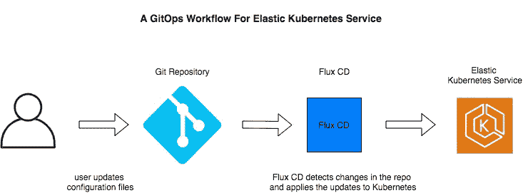

# GitOps:Kubernetes 的现代运营

> 原文：<https://blog.devgenius.io/gitops-modern-ops-for-kubernetes-7aa35578c9de?source=collection_archive---------24----------------------->

## 什么是 GitOps？

现代软件开发实践集中在三个主要活动上:

*   使用 Git 等工具进行源代码管理
*   使用 Jenkins 或 CodeBuild 等工具自动构建和测试应用程序
*   使用 CodeDeploy 等工具实现自动化代码部署

将自动化的想法带到下一个层次，[连续部署](http://entradasoft.com/blogs/gitops-modern-ops-for-kubernetes)的实践通过在新代码成功通过构建和测试阶段后立即自动部署新代码，进一步扩展了管道。

CI/CD 相结合的方法处理流程中的每一步，从提交代码更改的那一刻起，一直到部署，其巨大优势是您的应用程序可以在任何环境中工作，无论是开发、集成、试运行还是生产环境！

[GitOps](http://entradasoft.com/blogs/gitops-modern-ops-for-kubernetes) 利用这些久经考验的原则，允许我们应用与代码相同的哲学来处理对[基础设施的变更。如果基础设施是作为代码来管理的，那么为什么不将代码存储在 Git 这样的源代码控制系统中，并在每次提交更改时自动触发对基础设施的更新呢？](http://entradasoft.com/blogs/gitops-modern-ops-for-kubernetes)

GitOps with Kubernetes 通过声明式连续交付系统提供了下一级的基础设施——即代码和不可变的基础设施。配置的声明式风格和主动协调模型扩展了 Kubernetes 应用程序的部署、监控和生命周期管理的平台核心优势。

**全文:**[http://entradasoft . com/blogs/gitops-modern-ops-for-kubernetes](http://entradasoft.com/blogs/gitops-modern-ops-for-kubernetes)

**GitOps 的特点是:**

*   容器化集群和应用程序的部署、管理和监控的最佳实践。
*   以开发人员为中心的应用管理体验，其中使用 Git 的全自动 CI/CD 管道/工作流用于开发和运营。
*   使用 Git 修订控制系统来跟踪和批准应用程序的基础架构和运行时环境的变更。

## GitOps 的基本原则

在我们开始讨论如何将 GitOps 作为一种方法来实现之前，有必要仔细了解一下这种方法的基本原则。

1.  关于基础设施的一切都是以声明的方式描述的。所有服务器配置都被定义为事实，并完全整合到 Git repo 中，以获得最大的可靠性。声明性也意味着应用程序声明是完全版本化的。
2.  系统状态在 Git 中被版本化。这就是为什么用 GitOps 从错误中恢复非常容易的主要原因之一。您可以用一致的方式回滚到某个版本。您只需要花几分钟时间，而不是花几个小时进行灾难恢复。
3.  变更需要审批，但审批通过的可以在系统中实施。在实施之前，不需要单独的部署工作流或新代码的预打包。一切都会自动发生。
4.  正确性和安全性作为流程的一部分得到维护。不需要将单独的安全性和完整性工作流合并到 CI/CD 管道中。基础设施作为一种代码被增强到一个全新的水平。

## 库贝内特斯的吉托普

Kubernetes 中的 GitOps 围绕着一个理解起来很重要的关键概念——Kubernetes 是一个声明性系统。而且比你可能听说过的任何 CI/CD 工具(Jenkins 等)都多。)，Kubernetes 和它的声明性属性使得 GitOps 在黄金时间和大规模上成为可能。

作为一个声明式系统意味着 Kubernetes 对理想的集群配置有一个最终的了解，并且总是努力使之与当前的情况相匹配。它会持续监控系统的当前状态并将其与所需的指定状态进行比较，并自动确保系统能够保持其最佳的请求配置。

正是 Kubernetes 的这种声明性属性使得所有配置文件都可以由 Git 进行版本控制，因为开发人员可以指定他们希望看到的系统的“最终状态”。基于 Git 流程的标准化使整个系统更容易管理，如果需要，可以恢复/回滚到以前的版本。这包括应用程序和基础设施，因为它们本质上都是代码，可以用 id 和时间戳进行版本控制，并对更改进行审计。

## 包扎

GitOps 在您的存储库和您的实际环境之间建立了一座桥梁，允许您使用版本控制不仅管理您的应用程序代码，还管理您的环境和流程。GitOps 允许开发者管理他们代码的操作。

**阅读更多:**[http://entradasoft . com/blogs/gitops-modern-ops-for-kubernetes](http://entradasoft.com/blogs/gitops-modern-ops-for-kubernetes)