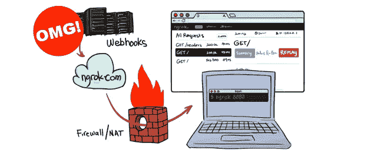
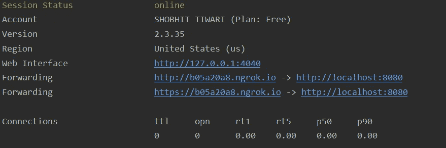

# 使用 Ngrok 向节点应用程序提供公共访问

> 原文：<https://blog.devgenius.io/giving-public-access-to-your-node-application-using-ngrok-3587c8064709?source=collection_archive---------0----------------------->

有时，您需要将对本地托管的节点应用程序的访问权授予其他人或客户端。也许您正在将您的计算机用作服务器，并希望托管一个 web 应用程序。因此，在本文中，我们将学习如何使用 Ngrok 做同样的事情。本文面向对 Node.js 和 Express.js 有基本了解的读者

Ngrok 基本上是一个多平台隧道软件，它在公共端点(如互联网)和本地运行的网络之间建立安全连接

首先，您需要在 Ngrok 中创建一个帐户。一旦您在仪表板中创建了一个帐户，您就会在左上角找到一些选项。

它们在列表中有所提及-

1.  状态
2.  内向的; 寡言少语的; 矜持的
3.  作家（author 的简写）
4.  组
5.  管理
6.  碧岭

选择授权

在 auth 部分，您会发现一个 Auth 令牌。只需复制并保存在某个安全的位置。我们稍后将使用该令牌。

现在，在终端中使用以下命令创建一个文件夹并启动节点环境。

**npm 初始化**

现在安装以下依赖项

**NPM I g-s ngrok express node mon**

成功安装后，创建一个 Javascript 文件 server.js，并将代码添加到文件中

之后，在命令行中使用以下命令

ngrok authtoken

<authtoken>是您之前保存的令牌。</authtoken>

最后打开两个终端。在一个终端中，使用该命令在本地运行应用程序

nodemon 服务器

在下一个终端中，使用以下命令为公共用户创建隧道。

ngrok http 8080

您可以使用任何端口。在您的终端中，您会看到类似这样的内容

使用带有 ngrok.io 的地址 url 来运行您的应用程序。

我希望你们喜欢这篇文章，请鼓掌。