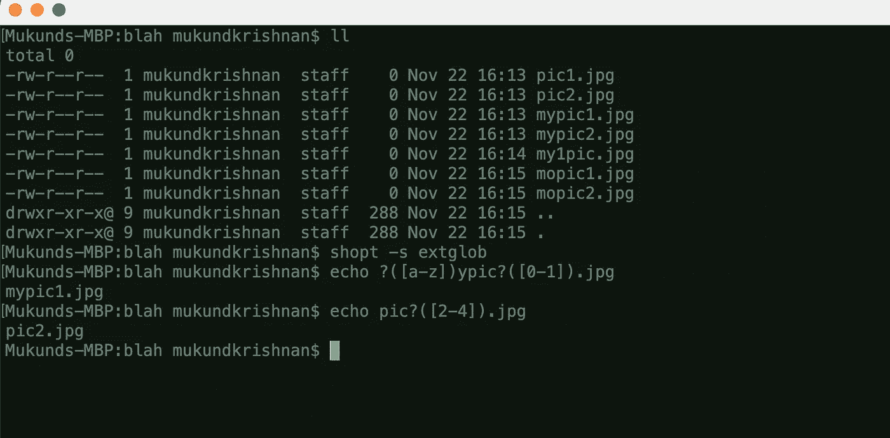
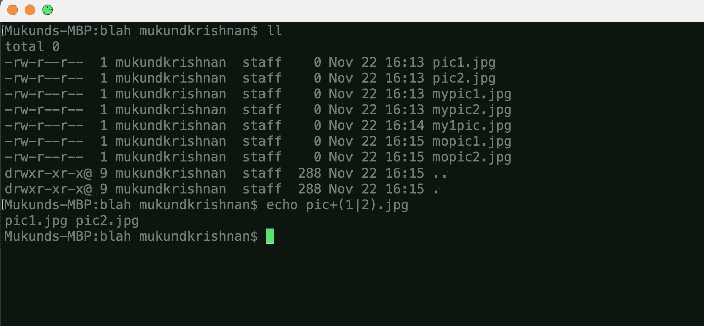
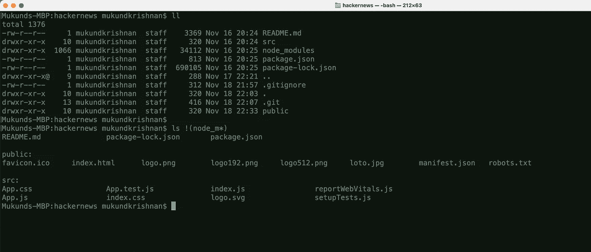
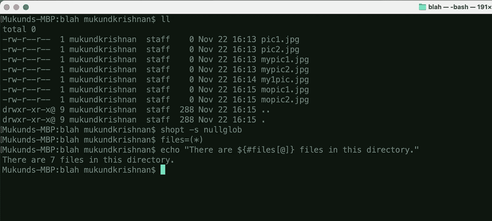
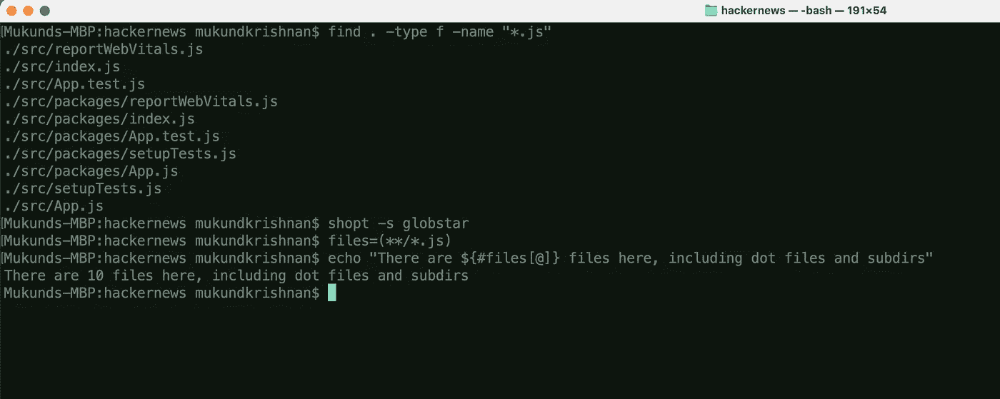

# Bash 中的 Globbing 模式

> 原文：<https://blog.devgenius.io/globbing-patterns-in-bash-e3ddafef8f33?source=collection_archive---------2----------------------->

我把我的灵魂放在/dev/null


由[马库斯·斯皮斯克](https://unsplash.com/@markusspiske?utm_source=medium&utm_medium=referral)在 [Unsplash](https://unsplash.com?utm_source=medium&utm_medium=referral) 上拍摄

在基于*nix 的操作系统中，成组模式或路径名扩展通常被称为通配符。其中一个角色的出现？字符串中的“*”或“[”被称为通配符模式。路径名扩展扩展了' * '，'还是那个“？”。将所述通配符模式扩展成路径名列表的操作称为 Globbing。我们几乎每天都在使用这个，却没有意识到。举个例子，

使用通配符时，需要记住以下几点。

*   一个'？'(不在括号内)匹配任何单个字符。
*   ' * '(不在括号之间)匹配任何字符串，包括空字符串。

Globbing 可以扩展，称为扩展 globbing。为此，首先需要启用它。

globbing 的手册页提供了许多关于路径名扩展的细节。以下是有效 globs 的一些子模式。

```
?(pattern)   Matches zero or one occurrence of the given pattern
*(pattern)   Matches zero or more occurrences of the given pattern
+(pattern)   Matches one or more occurrences of the given pattern
@(pattern)   Matches one of the given patterns
!(pattern)   Matches anything except one of the given pattern
```

列表中的模式由|字符分隔。



匹配给定模式的一个匹配项



匹配模式的一个或多个匹配项

最容易被忽视的是有助于忽略或消除模式的模式。



忽略特定目录中的文件

> `rm !(*.jpg|*.gif|*.png)`将删除不是 jpg 或 gif 或 png 的文件。

除了`extglob`，还有其他几个，比如`nullglob`、`globstar`等等。



空球

要找到一个文件夹中递归的 JavaScript 文件的数量，可以做`find . -type f -name “*.js” | wc -l`。使用`globstar`也可以达到同样的效果。



shopt -s 全球之星

 [## 通配符

### 各种命令行实用程序使用标准通配符(也称为 globbing 模式)来处理多个…

tldp.org](https://tldp.org/LDP/GNU-Linux-Tools-Summary/html/x11655.htm)