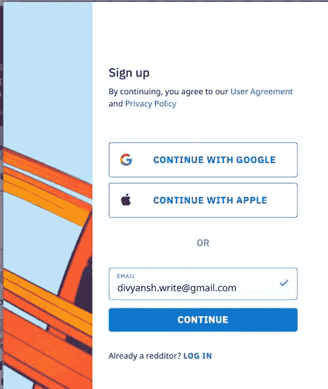
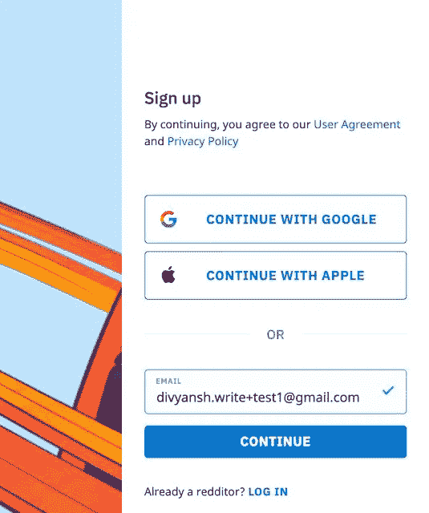
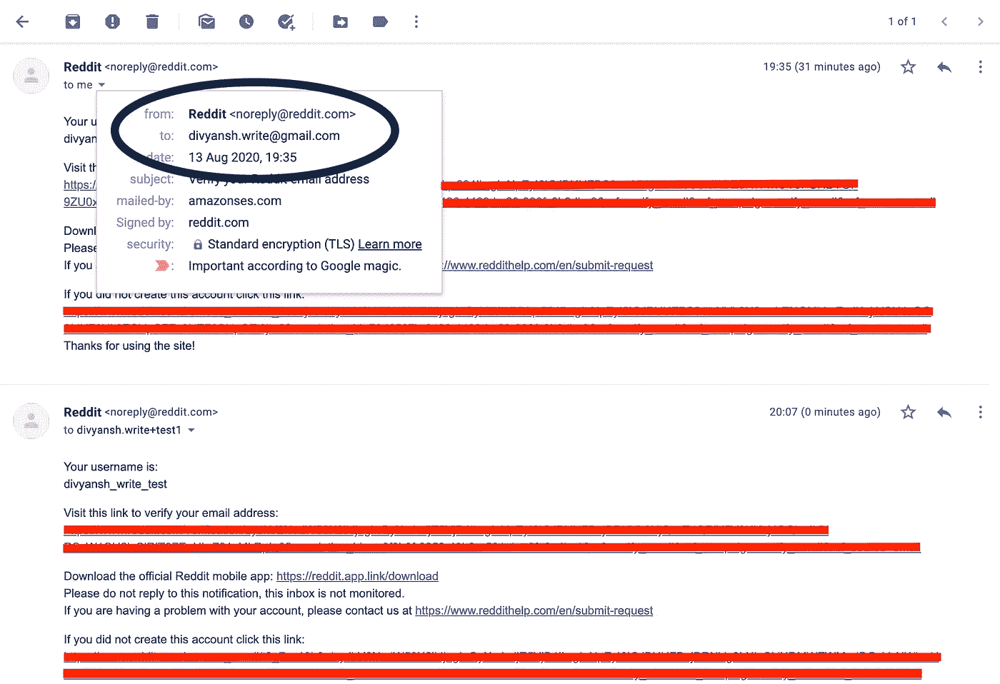
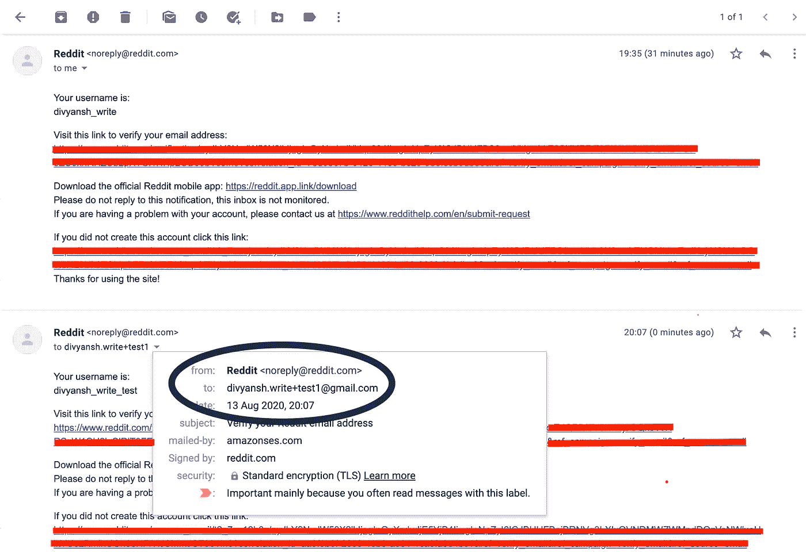

# Gmail 别名:多个帐户使用一个帐户

> 原文：<https://blog.devgenius.io/gmail-alias-multiple-accounts-using-a-single-account-c4e4c9319da4?source=collection_archive---------3----------------------->

Gmail Alias 允许您使用单个 Gmail 帐户在任何平台上创建多个用户帐户。

# 怎么会？

假设我们在 Reddit 上注册了一个电子邮件 id:*。*

**

*现在，我们想在 Reddit 上再创建一个帐户，而不需要再创建一个 Gmail 帐户。所以我们报名用的是【divyansh.write+test1@gmail.com】的**T5***

**

*注意 id 的 **+test1** 部分；这是化名。我们从未创建任何 Gmail 账户*divyansh.write+test1@gmail.com。*尽管我们使用的是别名账户*，*但它的所有电子邮件仍会转到我们的主要账户*divyansh.write@gmail.com。**

**

*给 divyansh.write@gmail.com 发电子邮件*

**

*给 divyansh.write+1@gmail.com 发电子邮件*

# *怎么有用？*

*这对于软件测试人员来说非常方便，他们需要使用合法的电子邮件 id 在他们的平台上注册。这样，他们就不必在每次需要测试时都创建新的 Gmail IDs，比如注册流程。*

*是的，它可以通过使用别名注册为新用户来延长免费试用期。但是，我强烈劝阻。为人们的工作支付报酬。*

# *注意:*

*别名在某些网站上可能不起作用。我建议用 Gmail 别名来测试你自己的产品。我举了 Reddit 的例子，因为它是众所周知的，别名在那里工作。Reddit 是我们的朋友，不要发垃圾邮件。*