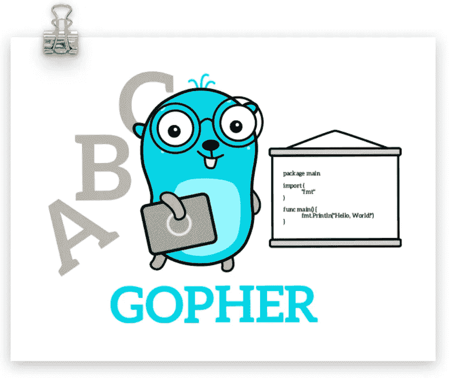

# 开始构建与开始运行

> 原文：<https://blog.devgenius.io/go-build-vs-go-run-baa3da9715cc?source=collection_archive---------0----------------------->

## go build 构建命令并将结果保存在当前工作目录中。

**例如:**

> 去建主建筑，去

上述程序将能够变成一个可执行文件，将始终打印出“你好世界”。如果我们希望我们的程序再次运行，我们不必再次编译程序，我们只需运行可执行文件。因此，如果我们想要用户交互的快速代码，我们将编译一次程序并使用可执行文件。

> 去主路，去

如果我们想修改我们的程序？编译另一个可执行文件，然后运行该文件并不理想。想象一下，如果我们每次都必须这样做，只是为了检查一个小的变化或修复一个错误！😱

令人惊讶的是，还有一个命令很方便，那就是后面跟有 Go 程序名称的`go run`命令。`go run`命令结合了代码的编译和执行。这允许快速检查更新代码的输出。

`go run`不会在我们当前的文件夹中创建一个可执行文件。

**2020 年 5 月 2 日更新:**

另一位了不起的围棋开发者 [Pascal Dennerly](https://twitter.com/pascaldoesgo) 分享了他的项目经验，即执行程序运行所花的时间与运行可执行程序所花的时间相同，无可否认，它们都适合 L2 缓存。

> 转到 build -o 目录路径

Go 社区很牛逼。另一个 Go 开发者 [Peter Hellberg](https://twitter.com/peterhellberg) 向我介绍了另一个参数——o 后跟 go build 允许输出二进制文件到指定的位置