# 用于 Kubectl 插件的 Go 代码生成器

> 原文：<https://blog.devgenius.io/go-code-generator-for-kubectl-plugins-42543dd63525?source=collection_archive---------10----------------------->

## 构建 cobra 代码生成器，一步生成基于 client-go 的 kubectl 插件


来自 unsplash， [@kimtunger](https://unsplash.com/photos/m8SYncCFoVo)

在编码中，我们总是试图采用一些代码生成器来避免重复工作并提高生产率。当然，Go 社区也不例外，在那里各种工具被开发和共享，比如前面提到的[kube builder 提供的命令行工具](https://medium.com/swlh/kubernetes-operator-for-beginners-what-why-how-21b23f0cb9b1)。

作为平台开发人员，我们为用户提供了特定的代码生成工具，旨在

*   使用户能够专注于业务，加速他们的开发过程。
*   统一框架和库。它不仅使您不必在框架选择上犹豫不决，并使学习曲线变平，而且通过提供统一的版本升级计划减少了可能的安全漏洞。
*   更有利于代码维护。

在开始为 kubectl 插件设计 Go 命令行代码生成器之前，让我们先了解一些基本概念。

# Kubectl 插件

[kubectl 插件](https://kubernetes.io/docs/tasks/extend-kubectl/kubectl-plugins/)是基于 kubectl 的一些可扩展的命令行工具，支持除默认功能之外的功能，比如扩展查询，一些`kubectl get`和`kubectl get -o wide`无法显示的状态和规范字段等。

kubectl 插件并不局限于 Go，而是可以存在于任何合格的脚本或代码中。但是，它们中的许多都是在 Go 中实现的，因此它们可以与像 [client-go](https://github.com/kubernetes/client-go) 这样的包进行交互，以丰富它们的功能。👉请阅读 [*从头构建一个 Kubectl 插件*](https://medium.com/p/34daa9de15fd) 以实现*。*

# Go 命令行工具

用 Go 实现 CLI 工具很常见，它不仅支持`mod`和`help`命令，还支持很多 Kubernetes 相关的工具，比如 kubebuilder 和 [controller-runtime](https://github.com/kubernetes-sigs/controller-runtime) 。

实现 Go 命令行的最流行的方法。

*   土豪[旗包](https://pkg.go.dev/flag)。
*   “致命的”cobra， [spf13/cobra](https://github.com/spf13/cobra) ，最流行的 Go 命令行包，它提供了那些不可或缺的命令行特性，包括子命令、标志、可配置参数，被 Kubernetes、Etcd、Hugo 等使用。
*   一个更新的 Go 命令行包 urfave/cli ，功能类似于 cobra，但更方便。

Go 标志包在功能方面有缺陷，比如缺少子命令支持，只支持`-f`标志而不支持`--flag`，所以它很少用于实现命令行工具。详情请参考 pkg.dev 上的[示例](https://pkg.go.dev/flag#example-package)

相反，`spf13/cobra`或者`urfave/cli`都可以支持 99%的场景。由于这两者在用法上非常相似，我将以 cobra 为例，带您完成下面的练习。

## 命令行工具代码结构

Go 在代码实现方面有相当宽松的规范，允许我们将所有的`.go`文件放在根目录下。然而，正如我们需要将文件放在一个合理的文件夹(包)中以保持文件的可读性一样，这同样适用于命令行工具代码。

下面是一个设计良好的命令行工具代码结构。

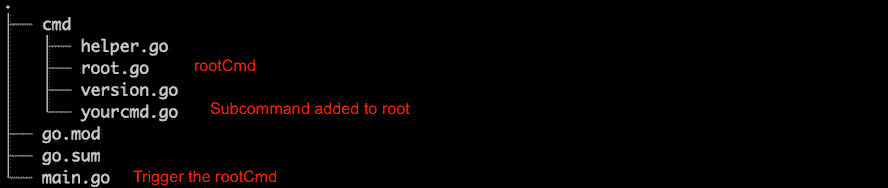

如图所示，root 命令下有一组相关的子命令，以`$name rootCmd subcommand --flags params`的格式调用。例如，`go help`是一个根命令，支持包括`mod`、`build`等查询。

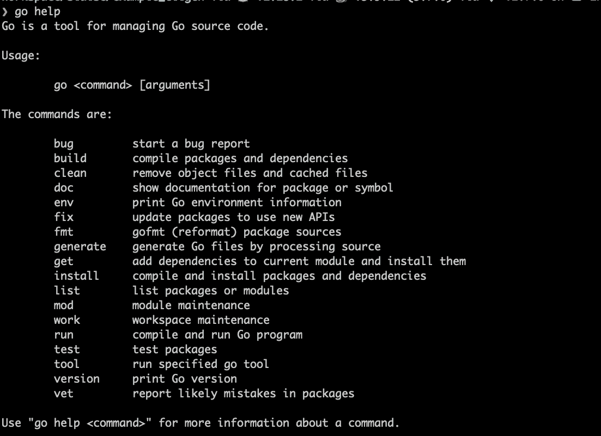

使用 cobra 时，我们应该尝试以类似的方式构建代码。

# 使用 cobra

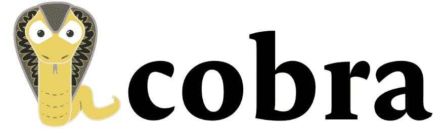

Cobra 功能丰富，这也解释了为什么它如此受 28K Github 明星的欢迎。

## 创建基于 cobra 的代码

Cobra 是命令行包中的佼佼者，因为它有代码生成器， [cobra-cli](https://github.com/spf13/cobra-cli) ，它有助于代码构建和健康的代码结构。

*   安装 cobra。

```
# Before Go 1.16 you should use go get
go install github.com/spf13/cobra@latest
```

*   安装 [cobra-cli](https://github.com/spf13/cobra-cli/tree/main/cmd) ，快速生成基本 cobra 命令行工具的代码。

```
go install github.com/spf13/cobra-cli@latest
mkdir cligen; cd cligen
```

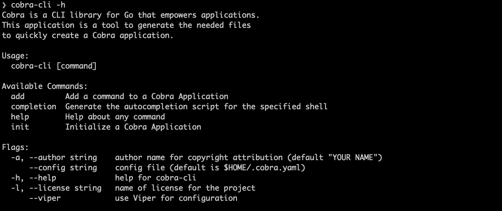

*   生成一个名为`cligen`的工具。

```
cobra-cli init -a slaise -l MIT cligen
```

我们得到一个包含`cmd/root.go`、`main.go`和`LICENSE`的 Go `cligen`。

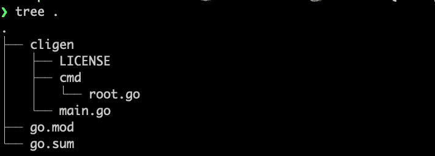

*   添加一个名为`kubectlgen`的子命令。

```
# it will create a kubectlgen.go inside cmd/
​​cobra-cli add kubectlgen
```

新生成的`kubectlgen`子命令中的内容如下。

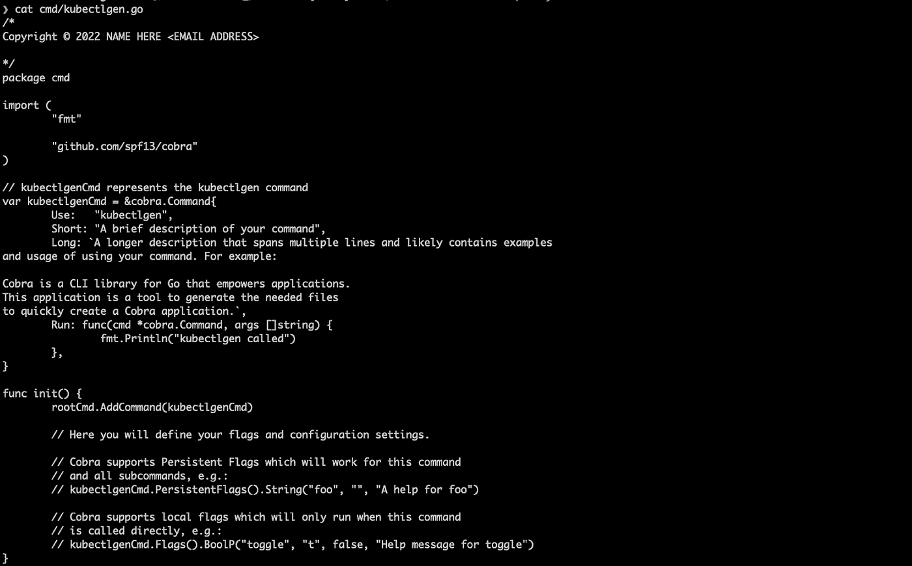

`cobra-cli`帮助构建命令行代码框架，我们可以在此基础上进行重新开发。在未来代码生成工具的实现中借鉴 cobra-cli 的优点时，要绕开它的缺点。

*   无法生成`go.mod`文件。只有预先存在`go.mod`文件，才能成功运行`cobra-cli init`。
*   只包含最简单的 cobra 特性，比如`init`方法。

## 眼镜蛇特征

cobra 主要有 **5 个特性**，这些特性在命令行工具设计中非常有用。

*   **自动生成根命令和子命令的帮助信息**，包括命令描述、可选标志、用法等。其格式符合 bash 命令帮助信息的标准。
*   自动提供未识别命令的**错误信息**。
*   完全兼容长短标志(POSIX)，如`-d`和`— debug`。
*   支持命令嵌套，即根命令的子命令可以有自己的子命令。
*   自动支持命令完成。

眼镜蛇的 **3 个最重要的概念**是`Commands`、`Flags`和`Args`。

`**Command**`是 cobra 的核心，除了自动生成中的三个基本特性`Use`、`Short`、`Long`之外，还支持几十个附加特性，比如最常用的`Aliases`、`SuggestFor`、`Example`、`Version`。另外，`kubectlgen`子命令已经默认提供了`Run`方法，可以直接编写命令的逻辑。并且可以依次运行一套`Run`相关的方法。

*   *持续预运行*
*   *预运行*
*   *运行*
*   *运行后*
*   *持续后期运行*

每个函数使用相同的参数并提供其对应的`xxxE`版本函数，这些函数使用 error 作为返回参数，比如`RunE func(cmd *Command, args []string) error`。

`**Flags**`对于命令行工具也是必不可少的，cobra 支持持久和本地标志类型。

“持久”意味着标志可用于分配给它的命令以及该命令下的每个子命令。“全局”是根命令上的永久标志。

相反，命令的“本地”标志仅适用于该特定命令。

在底层，cobra 使用 spf13 的另一个包 [pflag](https://github.com/spf13/pflag) 来解析标志。每个命令本身有两个`flagSet`，支持`usage`和`sort`等基本功能，并包含后续的 arg 信息，分别用于存储持久标志和局部标志。

同时，我们也可以将标志设置为“必需的”。

```
rootCmd.PersistentFlags().StringVarP(&config, "config", "c", "", "Config File(required)")rootCmd.MarkPersistentFlagRequired("config")
```

`args`是一个字符串片，可以在验证、读取或转换后使用。

有了以上所有的 cobra 知识和包含生成的`kubectlgen`子命令的根命令，我们就可以完成我们的代码生成工具了。

# 实现 CLI 生成器

## 代码功能

首先，让我们列出一个 kubectl 插件应该包含哪些我们可以预先设计并自动生成的“模板化”代码。

*   一个`go.mod`文件
*   `kubernetes.clientset` 和`discovery.DiscoveryClient`的生成方法。

一个 kubectl 插件通常以两种方式使用`client-go`包:通过`kubernetes.clientset`访问`Pods`和`Deployments`等原生资源，或者通过`discovery.DiscoveryClient`访问其他 CRD 资源。因此，我们最好在模板中包含这两个方法的生成。

*   配置对象

我们通常使用一些标志和参数来访问和操作集群资源，这些标志和参数需要存储在一个 config 对象中。因此，我们可以生成一个最简单的版本。

*   `rootCmd`代码
*   默认的实现包括像`help` 和`version`这样的支持命令。

现在我们将 cobra 和 client-go 相关的内容分离到一个合理结构的不同包中，生成一个项目如下。

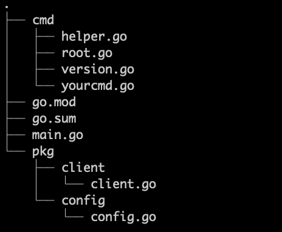

## Go 模板

然后，是关于如何生成代码？我想`cobra-cli`已经给了我们一个很好的答案， **Go 模板**！

Go 模板用于解析模板文件，以便动态构建我们想要的最终文件。解析中，处理`{{ . }}`变量或嵌套变量，传入参数。参数可以是`map`或`strcut`。模板代码通常有两行。

```
t, err := template.ParseFiles(“tempalte.tmpl”)err = t.Execute(io.Writer, data)
```

我们可以在`cobra-cli`中找到非常好的例子，比如生成`main.go`的`cobra-cli init`命令调用`[MainTemplate](https://github.com/spf13/cobra-cli/blob/6049ad32caa8b81f554509863266de3099279264/tpl/main.go#L16)()`方法来获取模板内容，然后在`[Project.Create()](https://github.com/spf13/cobra-cli/blob/7c6e26ac0939450323b7dd4acf8d8280dde3879e/cmd/project.go#L45)`方法中调用它。

## 代码实现

最后，针对实际情况，设计了一个 kubectl-plugin 代码生成器，由 cobra 实现，集成 go-template 生成一个包含 cobra 命令、基本客户端 go 配置和客户端创建方法的 Go-code 框架。

**创建一个模板文件**

当前模板文件包含`go.mod.tpl`、`main.go.tpl`等。，所需的参数主要从命令行标志传入，如工具名称。

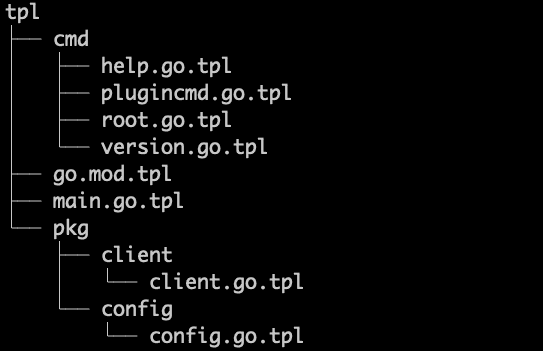

`main.go.tpl`如下图所示。`name`是生成的目录和 Go 包的名称。

```
package mainimport "{{ .name }}/cmd"func main() {
  cmd.Execute()
}
```

**完善** `**kubectlgen**` **命令并解析模板**

有三个步骤要走。

*   添加标志，包括模板解析所需的信息。

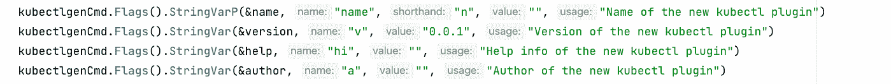

*   创建新工具的文件目录，该目录与模板中的目录结构一致。

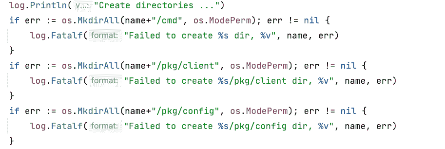

*   解析模板并将解析后的内容输出到相应的文件中。

两种方法:`createFileFromTemplate`用于创建模板对象；`templateGenerate`用于解析模板并将内容输出到文件。

**添加** `**version**` **和** `**help**` **命令**

这两个命令都是辅助的。cobra 提供的`help`命令非常好用，我们也可以用`version.go.tpl`和`help.go.tpl`模板定制。

## 试验

运行`go build -o cligen`编译，然后测试。

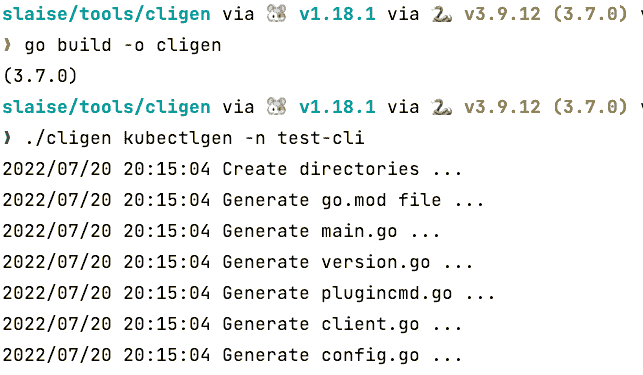

打开`test-cli`目录中的文件，可以看到`name`已经被替换为`test-cli`。

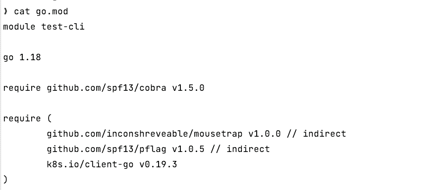

# 未来的步骤

这个代码生成器目前还处于雏形阶段，只有生成功能。我们可以做更多的事情来帮助它成长。

*   添加许可证文件
*   添加默认的 GKE 支持，支持根据标志的`gcloud`认证。
*   模板化`Pod`和`Deployment`等原生资源的查询，增加子命令支持。
*   模板化不同的 CRD 查询，并添加子命令支持。
*   将`dynamic`和`clientset`支持的不同资源分成不同的命令组。

你还能想到什么吗？如果实现了，这将是加速 kubectl 插件编写的催化剂。参见 [github](https://github.com/slaise/cligen) 上的完整代码。

感谢阅读！

# 参考

[https://kubernetes . io/docs/tasks/extend-kube CTL/kube CTL-plugins/](https://kubernetes.io/docs/tasks/extend-kubectl/kubectl-plugins/)

[https://pkg.go.dev/flag#section-documentation](https://pkg.go.dev/flag#section-documentation)