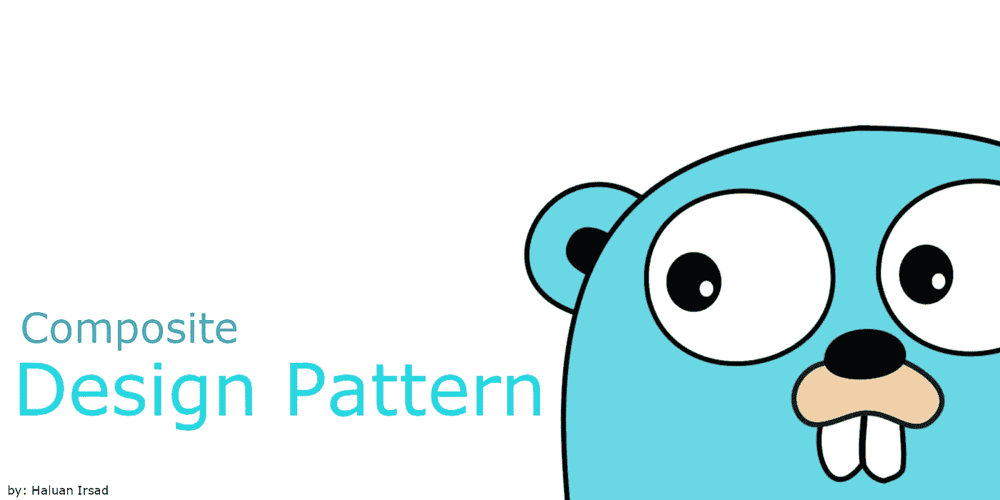
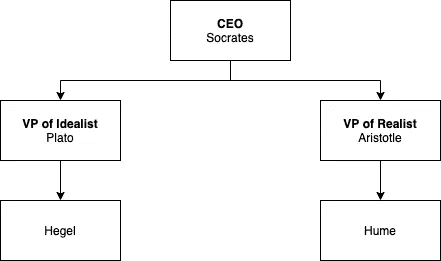
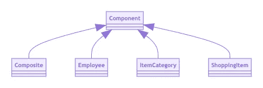

# go-复合模式

> 原文：<https://blog.devgenius.io/go-composite-pattern-393caaa0b105?source=collection_archive---------11----------------------->



# **先决条件**

在阅读本文之前，请确保您对 [Go 接口](https://medium.com/@haluan/interface-in-go-language-fe3c13ce1355)有很好的理解。

# **简介**

复合模式属于结构设计模式。基于*设计模式*【Gamma 等人】一书，这个模式的意图是:

> 将对象组成树结构来表示部分-整体层次结构。Compositelets 客户端统一处理单个对象和对象的组合。
> 
> —设计模式[Gamma 等人]第 163 页

这种模式对于动态构建对象结构非常有效。描述它的最简单方法是想象一组对象组成一个层次结构。例如，它可以是一个组织的层次结构。

在本文中，您将了解到:

*   如何实现基本组合模式来构建组织层次结构
*   如何为另一个层次问题重用复合模式

# **实现**

我们从虚构的朋友康德开始这段旅程，他是一家网店公司的程序员。他的任务是建立公司的组织层级。

康德开始编写组件接口，这是他的代码的基础:

然后，他继续创建继承了*组件*接口的员工模型:

**为了简单起见，我们将使用控制台打印，并通过直接硬编码值来简化输入。此外，我们可以忽略通常在 Go 中使用的成功/错误(结果，错误)模式。**

在康德写完雇员模型之后，他开始写复合结构。这个结构成为**层次定义的基础**。Kant 意识到，可以将组织层次结构视为类似于一个树形数据结构，因此他创建了用于添加和显示组织人员的逻辑，如下所示:

让我们歇一会儿，因为我会解释康德在那里做了什么。

```
type Composite struct {
   component Component
   leaves    []Component
}
```

正如我们看到的，复合结构有两个属性:

*   组件:树的根/组织的头
*   树叶:树/组织下属的树叶

另外，请注意以下代码:

```
func (c Composite) Display() {...
```

该代码将使*复合*结构继承*组件*接口。

此外，康德刚刚意识到，在他工作的公司，有这么多的部门，每个部门可能有子部门。



以简单的方式划分公司层级

因此，他开始构建如下所示的公司层级结构:

康德做了什么:

*   建立理想主义者副总裁办公室的等级制度
*   建立现实主义副总裁办公室的等级制度
*   建立公司的层级结构，增加首席执行官和两个副总裁办公室

我们记得，在 **composite.go** 中我们有`Display()`:

```
func (c Composite) Display() {
   c.component.Display()
   if len(c.leaves) == 0 {
      return
   }
   fmt.Println("===List of Subordinates===")
   for _, leaf := range c.leaves {
      leaf.Display()
   }
   fmt.Println("===End===")
}
```

因此，该方法将迭代并打印组件，并从以下位置离开:

*   理想主义者的副总裁
*   现实主义副总裁
*   首席执行官(公司级别)

如果我们在`main.go`中运行`composite.ShowEmployeeHierarchy()`，结果将是:

**理想主义者副总裁办公室:**

```
=====Display Office of VP of Idealist=====
ID: ID-2
Name: Plato
===List of Subordinates===
ID: ID-4
Name: Hegel
===End===
```

现实主义者副总裁办公室:

```
=====Display Office of VP of Realist=====
ID: ID-3
Name: Aristotle
===List of Subordinates===
ID: ID-5
Name: Hume
===End===
```

**首席执行官办公室:**

```
=====Display Company=====
ID: ID-1
Name: Socrates
===List of Subordinates===
ID: ID-3
Name: Aristotle
===List of Subordinates===
ID: ID-5
Name: Hume
===End===
ID: ID-2
Name: Plato
===List of Subordinates===
ID: ID-4
Name: Hegel
===End===
===End===
```

# 复用性

在康德完成他的任务后，他的项目经理找到他，问他是否能以分层的方式建立购物目录。30 分钟后是最后期限。也许对于一些程序员而不是他自己，会抗议截止日期。但是，因为这个康德，我们敬爱的程序员，他只是点点头，然后用笑脸把脸转回到他的电脑上。

我们记得，康德已经创造了`composite.go`，这是解决购物项目目录的可靠方案。

他需要做的一件事只是编写产品目录，让我们把它抽象成这样:

*   **项目类别模型**

该模型继承了*组件*接口。

*   **购物物品型号**

该模型继承了*组件*接口。

*   **撰写购物目录**

通过重用`composite.go`，这段代码非常简单。

然后在 30 分钟过期之前，康德打电话给他的总理。他的项目经理和团队为他鼓掌，因为他能快速完成新任务。

# 结论

在我们观察康德所做的之后，我们可以通过实施复合设计模式获得很多好处。



**我们得到适应性**，代码有清晰的路径来定义层次结构。通过利用接口，我们可以隐藏代码的实现细节，使其适应变化。

**我们得到可重用性**，代码可以重用到另一个问题上。只要问题有相似的模式。

我们得到了敏捷性，敏捷性是软件开发的一个重要点。我们有自适应的代码和可重用的组件，这将随着时间的推移给我们带来优势，避免每次出现新功能时都要重新发明轮子，这与我们昨天所做的事情有着共同的问题。

复合图案可与[装饰图案](https://medium.com/swlh/go-decorator-pattern-2379974077b1)结合。

> 当 decorators 和 composites 一起使用时，它们通常会有一个公共的父类。所以 decorators 必须支持像 Add、Remove 和 GetChild 这样的组件接口操作。—设计模式[Gamma 等人]第 173 页

使用设计模式的好处是，我们可以将一个设计与另一个设计合并，这将在适应性、可重用性和敏捷性方面给我们带来巨大的好处。

通过定义细粒度的代码和可重用的组件，团队生产力可以指数级地增长，从而为公司的利益创造新的特性。

我想现在你已经对复合模式如何有益于康德的作品有了一些了解。现在，因为康德可以更快更灵活地做任何事情来丰富许多功能，他的队友开始叫他伊曼纽尔·坎(没有`t`)。

*额外说明:Gopher 是 Go Language 吉祥物(在本文中用作图片封面的一部分)，由 Renee French 创作。知识共享署名 3.0 许可。*