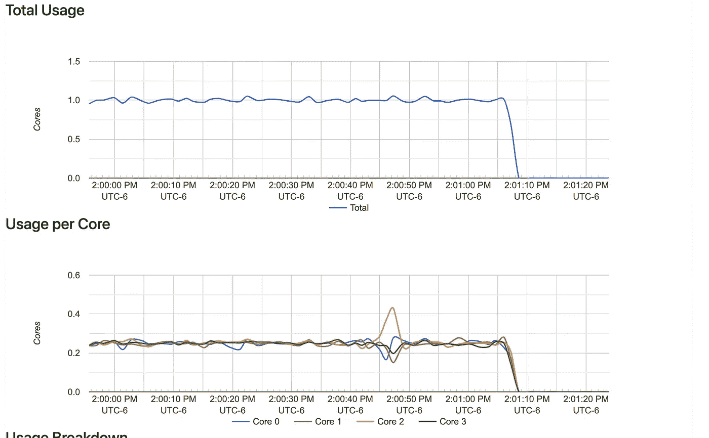

# 在 CPU 受限的环境中进行并发测试

> 原文：<https://blog.devgenius.io/go-concurrency-testing-in-cpu-constrained-environments-8788052b7560?source=collection_archive---------5----------------------->

让我们探讨一些复杂的 go 并发编程错误和竞争条件。

在 [Unsplash](https://unsplash.com?utm_source=medium&utm_medium=referral) 上[给](https://unsplash.com/@laurentmedia?utm_source=medium&utm_medium=referral)拍照

在将 go 应用程序的 CI/CD 管道从基于 VM 的 jenkins 部署迁移到基于 kubernetes 的 Jenkins 部署时，我遇到了一个问题，即现有的单元测试会挂起，直到 10 分钟超时。单元测试通过了基于 VM 的 Jenkins 工人和本地。但是它在 kubernetes 的 Jenkins 工人身上一直失败。我没有参与这个 kubernetes Jenkins 集群的设置，老实说，我没有太关注它。但是我确实记得在组织的其他地方，他们对在 Kubernetes 上运行的所有东西分配资源限制非常严格。
这恰好非常重要。

## 设置

单元测试是为了测试一些并发代码。被测试的逻辑是代码是否会通过信道发送消息。
测试设置如下:

单元测试实例化了一个 go 例程来侦听“*GetQueueMetadataUpdateChannel()*的返回通道。当它得到那个消息时，它会沿着` *resultCh* '把它发送出去。为什么是间接的？
由于通道不是缓冲通道，并且代码正在执行[非阻塞发送](https://gobyexample.com/non-blocking-channel-operations)，测试必须启动一些东西来侦听“*GetQueueMetadataUpdateChannel()*”通道。
测试的下一部分调用了一些代码，这些代码将在更新通道上生成一条消息。

“ *QueueRequest()* ”方法导致在上述更新通道上发送消息。在调用` *QueueRequest()* 之后，我们阻塞，等待结果通道上的消息。现在，暂停一下，看看你是否能发现问题？
提示，它每次都在我的笔记本电脑上工作。

## 发生了什么

在一次罕见的耐心较量中，我决定让挂起的 jenkins 作业运行很长时间，直到某个超时。从日志中我可以看到运行` *go 测试。/…* `一直工作到一个特定的单元测试。超时输出实际上非常有用。
第一条消息:

> 死机:10m0s 后测试超时

接下来是大量的 goroutine 堆栈跟踪。最后一个是我需要看到的:

堆栈跟踪中的第 61 行是 gist1 中的第 7 行。所以代码阻止了发送。这让我很困惑，但我知道这与` *QueueRequest()* '调用的时间有关。我的假设是 jenkins 环境必须运行在单个 CPU 内核或 CPU 受限的环境中。在 Jenkins 中，CPU 必须忙于处理“ *QueueRequest()* ”中的代码，永远没有时间执行 go 例程代码。
如果是这种情况，我应该能够在本地复制它——请记住，我不知道这个 Jenkins 集群的设置，也无权探索它。我运行了两个测试:首先，我将一个` *go 测试*`运行限制在一个 CPU 内核上。
然后我试着用`*—CPU = 1*`用 docker 模拟了` *resources.limits.cpu: 1* `的等价物。
注意:` *—在 docker 或等效的 kubernetes 配置中，CPU = 1*`意味着在理想情况下，你的容器每秒将获得 1 个 CPU 秒。下面的截图也将证明这一点。
第一次测试:

果然，我把单元测试挂了。
您可以看到只有一个内核处于活动状态:

安装依赖项时，容器 CPU 处于最大利用率

原谅错别字；图像上的上述标签应为“CPU sets-CPU ”,而不是“CPU sets-CPU”。

接下来，我尝试设置 1 个 CPU 共享的限制:

同样的悬挂行为。
在这里，您可以看到容器使用了所有 4 个内核，但每个 CPU 仅用了`. 25 `到`. 3 `秒。

CPU 使用率下降，但是单元测试挂起

然后，仅仅为了进行一个健全性测试，我尝试给容器 2 个 CPU，它通过了。

## 修复

下面是我为提高代码的持久性以处理 CPU 受限环境而做的更改。

这些变化是为了

*   创建一个错误通道，
*   使结果通道被缓冲，
*   并让单元测试在检查结果通道时检查错误通道。

我天真地尝试了这段代码:

那不行，还有很多问题:
[` *选择*`语句是非确定性的！！！在这种情况下，我们需要使用嵌套的 select 语句。另外，在我没有预料到的时候，` close()'被调用了！
`close()`使从 a 通道的接收返回类型的零值，而不是阻塞(](https://go.dev/ref/spec#Select_statements)[源](https://go.dev/ref/spec#Close))。
结果是 goroutine 填满了错误通道，然后 select 将阻塞。

此外，执行线程直接进入` *QueueRequest()* `调用，从未让 go 例程开始它的 for 循环。这导致“ *QueueRequest()* ”调用在测试中的 go 例程获得 CPU 时间之前终止了更新通道。
由于` *QueueRequest()* `关闭了没有接收方的通道，一旦 go 例程开始，它就从更新通道返回一个零值消息。

以下是实际的解决方案:

这不是很漂亮，但让我们走过它。
首先，我们检查更新通道是否仍然打开。
接下来，我们尝试沿着结果通道发送消息。如果失败，我们将进入默认情况。
注意:` *select* `的不确定性是指如果结果通道有一个监听器，错误通道有一个监听器，那么它会随机选择任一种情况。这导致 select 有时选择发送错误消息，有时将更新发送到结果通道。
我们通过在“ *default* ”分支中嵌套另一个非阻塞发送来解决这个问题。如果没有一个监听器监听“errCh*errCh*”,那么我们将会恐慌，因为这是一种意想不到的行为。最后，我们必须让单元测试线程休眠一毫秒。这给了 go 调度程序时间来实际启动 go 例程。所发生的情况是，单元测试将到达 go 例程，但是单元测试线程将继续消耗整个 CPU 周期，因此执行在单元测试线程上进行到“ *QueueRequest()* ”。一旦` *QueueRequest()* `在更新通道上进行非阻塞发送，它将发现通道没有侦听器，并关闭它(注意，这是它们的编码方式，不是 golang 特有的)。执行将返回到单元测试，在那里我们从结果通道中选择一条消息。显然不会有，所以单元测试会永远挂起。

## 结论

我们在这里学到了两件有趣的事情。
当用` *go func() {}()* 初始化 go 程序时，该程序不会立即执行。相反，调用线程保持执行优先级，直到它暂停(睡眠、阻塞 IO 等。).只有这样，go 例程中的代码才会得到执行。这样措辞的话，似乎有点显而易见。但是在编写代码时，我很容易忽略这一点，特别是考虑到在多核机器上，go 例程确实与单元测试的线程并行执行。
其次，我们了解了 go 并发性的一些细微差别，这些差别在 golang 介绍材料中没有解释(我在看你，Go by example:)。`*选择*`是非确定性的。此外，在 go 中使用` *close()* `通道意味着您仍然可以从它那里“接收”消息，它只是返回零值，而不会阻塞。这似乎是一件特别容易绊倒的事情。
教训是，当有疑问时，使用接收的 2 变量形式:` *msg，open := < -ch* `。

你怎么想呢?我能换一种方式解决这个问题吗？有问题吗？我总是很高兴有一个对话，所以评论或伸出手！