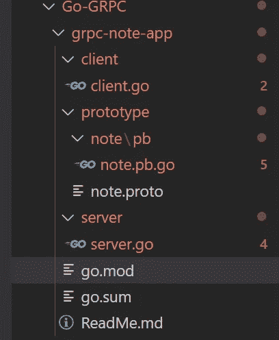
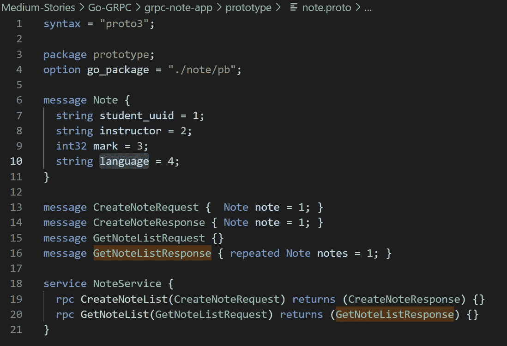
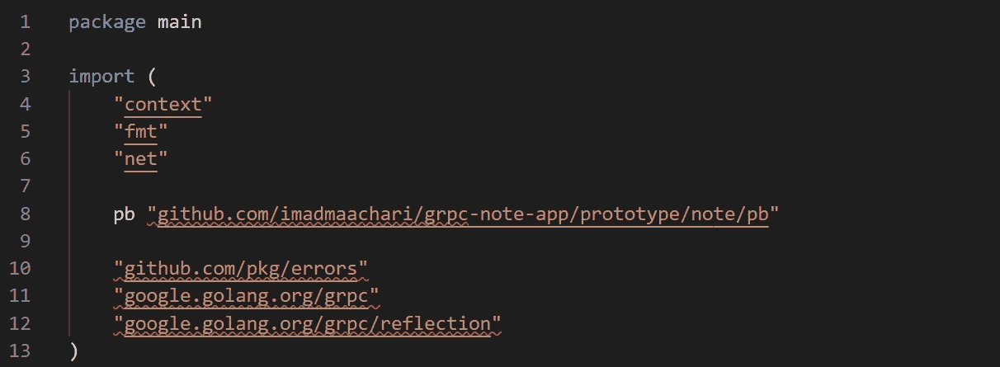
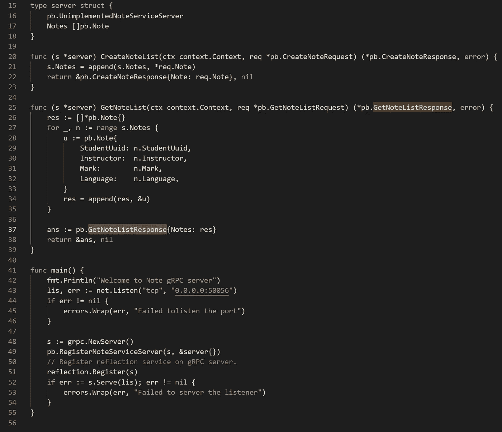
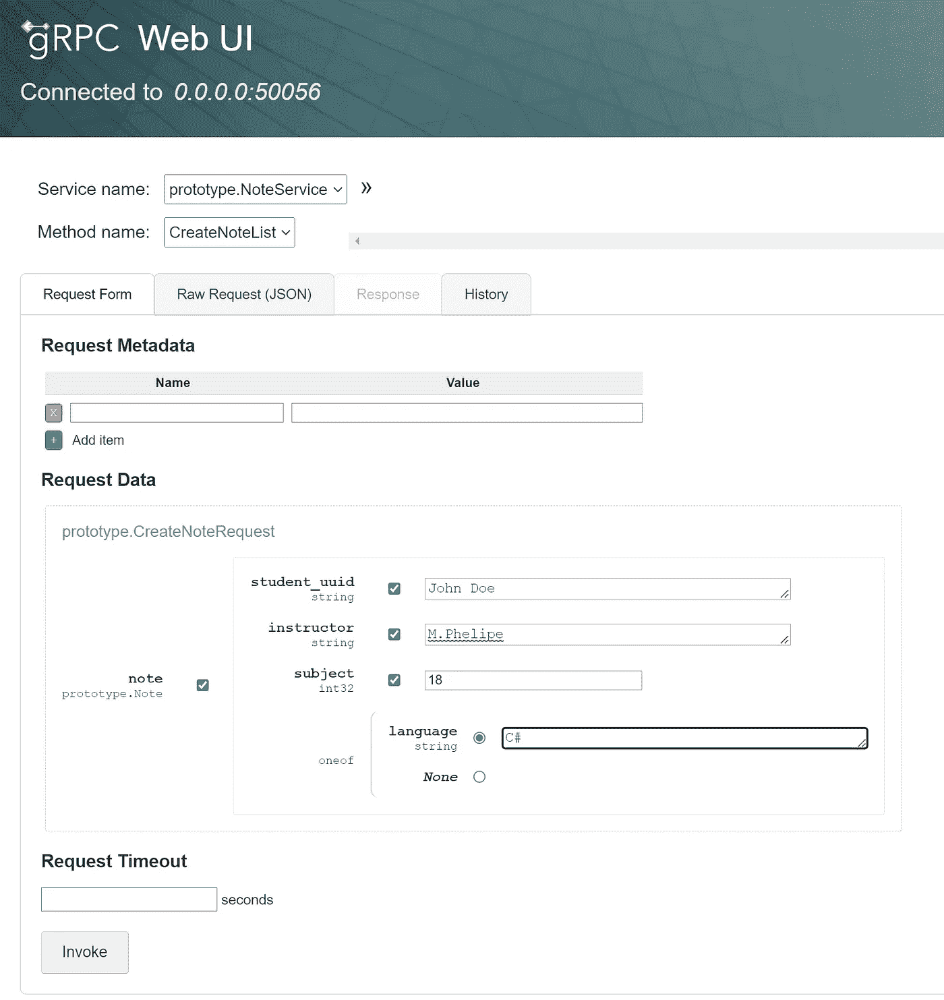
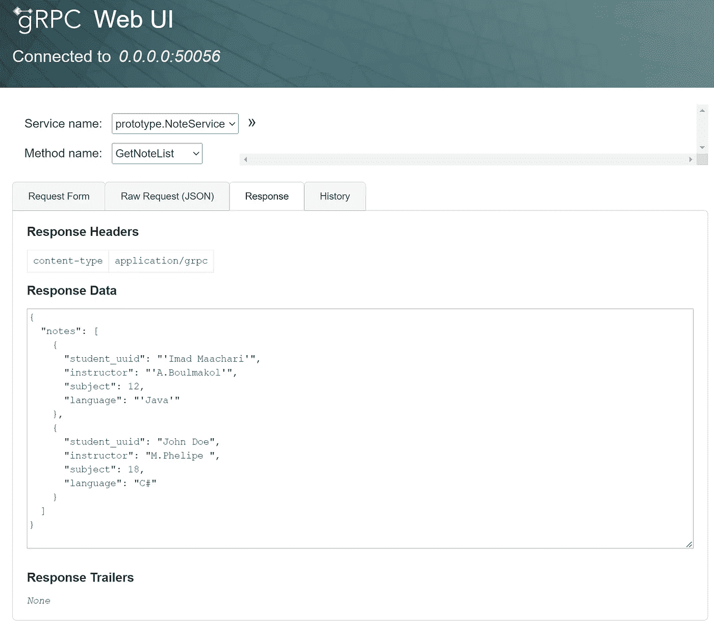
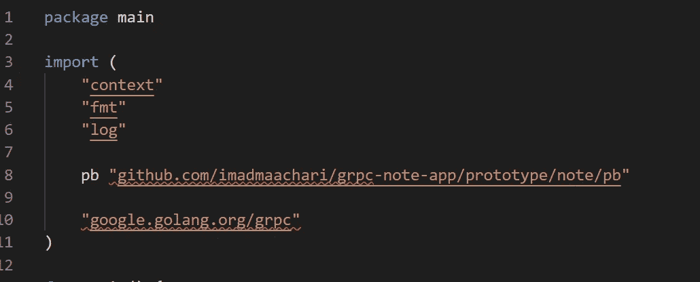
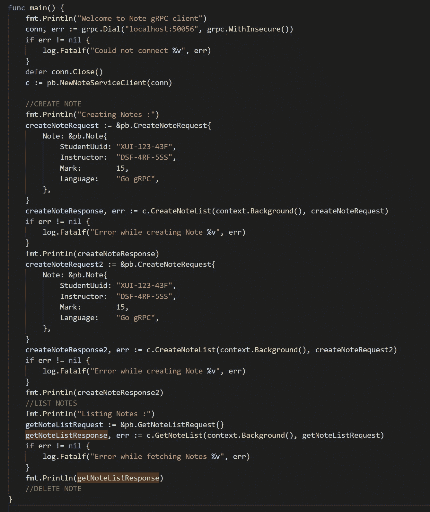
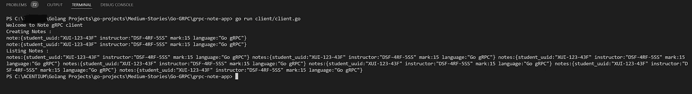

# 围棋 GRPC 基础和关键概念

> 原文：<https://blog.devgenius.io/go-grpc-fundamentals-and-keys-concepts-a6340ac929c?source=collection_archive---------7----------------------->

## gRPC 概念及示例


美国宇航局在 [Unsplash](https://unsplash.com?utm_source=medium&utm_medium=referral) 拍摄的照片

# 介绍

**gRPC** 是 Google 开发的高性能远程过程调用框架，帮助构建和消费远程服务。

这篇文章着眼于如何创建一个简单的包含 gRPC 服务器和客户端的 gRPC 应用程序。这篇文章将与你分享如何从头开始构建 gRPC 服务的基础知识。

> 请点击查看完整代码

# gRPC

如前所述，gRPC 是一个 RPC 框架，它利用 HTTP/2 和协议缓冲区(又名 Protobuf)，使其成为微服务的快速和安全的协议。

但是等等！这是什么 HTTP/2 和协议缓冲区？

## HTTP/2

gRPC 是为使用 HTTP/2 而设计的，HTTP/2 是 HTTP 的一个主要修订版，与 HTTP 1.x 相比提供了显著的性能优势。

它支持双向流:一旦建立了连接，客户机或服务器就可以推和拉数据。

> 查看这个[演示](http://www.http2demo.io/)，比较 HTTP/2 和 HTTP/1 的性能

需要注意的是，**T11**HTTP/2**并不是 gRPC 独有的。许多请求类型，包括带有 JSON 的 HTTP APIs，都可以使用 HTTP/2，并从其性能改进中受益。**

## 协议缓冲区

gRPC 是一个基于**合同的**设计工作流，这意味着我们首先需要定义我们的消息的*结构。消息使用协议缓冲区(强类型、基于二进制)序列化，这是一种高效的*二进制*消息格式。Protobuf 在服务器端和客户端序列化非常快。这导致更有效的小消息有效负载。服务定义是以声明方式定义的，用于生成客户机和服务器存根(使用 protocol)。与 JSON(松散类型、基于文本)相比，协议缓冲区可以减小传输的有效载荷的大小，从而降低带宽成本。*

## gRPC 方法类型

gRPC 服务可以有不同类型的方法来描述服务如何发送和接收消息。gRPC 方法类型有:

*   **一元**:方法是一元类型，客户端向服务器发送一个请求，然后得到一个响应，就像普通的函数调用一样。当返回响应时，一元调用完成。

```
**rpc** SayHello(HelloRequest) **returns** (HelloResponse);`
```

*   **服务器流:**服务器流方法是客户端向服务器发送一个请求，然后获得一个流来读回一系列消息。当方法返回时，服务器流调用完成。

```
**rpc** LotsOfReplies(HelloRequest) **returns** (stream HelloResponse);
```

*   **客户端流式传输:****客户端流式传输方法是客户端编写一系列消息并发送给服务器。一旦客户端写完消息，它就等待服务器读取消息并返回响应。**

```
**rpc** LotsOfGreetings(stream HelloRequest) **returns** (HelloResponse);
```

*   ****双向流:**双向流，双方使用读写流发送一系列消息。这两个流独立运行，因此客户端和服务器可以按照他们喜欢的任何顺序进行读写。**

```
**rpc** BidiHello(stream HelloRequest) **returns** (stream HelloResponse);
```

**让我们把手弄脏吧🤩**

## **先决条件**

*   **去**
*   **Protobuf 编译器**

**除此之外，我们将在下面安装一些 gRPC 专用工具。注意，我们将使用一些特定于**窗口**的命令。**

**安装 Protobuf 编译器:**

**要从预编译的二进制文件中安装[最新版本的](https://developers.google.com/protocol-buffers/docs/downloads#release-packages)协议编译器，请从[github.com/google/protobuf/releases](https://github.com/google/protobuf/releases)下载与您的操作系统对应的 zip 文件。然后，更新您的环境变量以包含到`protoc`可执行文件的路径(例如。c:\ Tools \ protocol-3 . 18 . 0-win 64 \ bin)。**

**安装 Go 特定的 gRPC 依赖项:**

```
go install http://google.golang.org/protobuf/cmd/protoc-gen-go@v1.26
go install http://google.golang.org/grpc/cmd/protoc-gen-go-grpc@v1.1
```

# **项目设置**

## **项目结构**

**没有商定的项目结构。我们将使用 Go 模块，并从初始化一个新项目开始。所以我们的业务问题是这样的——我们有一个 notestore，我们想通过 RPC 函数公开它的 crud 函数。**

**我们可以为服务器创建一个名为`server`的新文件夹，并初始化它，如下所示:**

```
go mod init grpc-note-app
```

**这是这篇文章最后的样子。**

****

**项目结构**

## **使用创建服务定义。原型文件**

**请注意，常见的模式是保持。单独文件夹中的原型文件。以便从服务器和客户端都可以访问它。**

****

**note.proto 文件**

> **需要注意的一点是**选项**关键字**的使用。**它告诉 protoc 我们想把生成的存根放在哪里。在某些情况下，根据用于生成存根的语言，您可能会发现多个选项语句。**

**此外，在我们的示例中，我们有 5 条消息来表示注释实体。请求和响应，我们定义了一个名为 NoteService 的服务，它有两个 RPC，分别名为 CreateNoteList 和 GetNoteList，可以从客户端调用。**

## **生成我们的存根**

**创建服务契约(IDL)后，我们可以分别为服务器和客户机生成 Go 存根。**

```
protoc prototype/*.proto -I. --go_out=plugins=grpc:prototype
```

**接下来，让我们创建服务器来响应任何传入的请求。**

## **创建 gRPC 服务器**

**我们初始化名为 main 的包，以及实现服务器所需的所有依赖项:**

****

**服务器主包**

**让我们在服务器文件夹中创建服务器文件。**

****

**gRPC 服务器**

*   **我们首先定义一个结构，它将实现我们的服务器 RPC 方法，稍后我们的客户机将调用这些方法。**
*   **在 main 函数中，我们使用 net 在 TCP 端口 50056 上创建一个侦听器。倾听法。我们创建一个新的 gRPC 服务器实例，注册我们的 noteServer。最后但同样重要的是，我们为我们的 note 服务器提供服务，并开始响应传入的请求。**

## **与服务器交互**

**通常，当与 HTTP/1 之类的服务器交互时，我们使用 REST 工具(Postman，cURL)与 API 交互，发出请求并检查响应，然而，使用 gRPC，我们无法做到这一点(您可以向 HTTP/2 服务发出请求，但这些请求是不可读的)。为此我将使用 [gRPC-UI](https://github.com/fullstorydev/grpcui) 。**

**您可以使用下面的命令安装它:**

```
go install github.com/fullstorydev/grpcui/cmd/grpcui@latest
```

**安装后，您可以运行服务器和 grpc-ui(您应该指向 grpc 服务器端口):**

```
go run server/server.go
grpcui -plaintext 0.0.0.0:50056
```

**我们如何确定服务的端点？注意，您需要在 gRPC 服务器上注册反射服务(启用反射)**或**提供 proto 文件的路径。**

> **//在 gRPC 服务器上注册反射服务。**
> 
> **反思。登记册**

**现在我们准备好接受客户的请求了。**

**以下是使用 gRPC-IU 运行测试的一些截图:**

****

**创建便笺 RPC**

****

**获取注释 RPC 列表**

## **创建 gRPC 客户端**

**现在，我们可以创建 gRPC 客户端了，为此，我们需要编辑 client/cli 文件夹中的 client.go 文件。**

**我们初始化名为 main 的包，以及所有需要的依赖项:**

****

**客户端主包**

**定义我们的主要功能:**

*   **初始化 gRPC 客户端**
*   **连接到 gRPC 服务器**
*   **调用服务器 RPC 函数**

****

**gRPC 客户端**

## **让我们测试我们的 gRPC 服务器和客户机**

**启动我们的 gRPC 服务器:**

```
go run server/server.go
```

**然后，在终端的另一个选项卡中，启动 gRPC 客户端，它调用我们所有的服务器 RPC 函数:**

```
go run client/cli/client.go
```

****

**gRPC 客户端调用**

# **摘要**

**我们已经发现了 gRPC 在 Go 语言中的使用，以及构建 gRPC 项目所需的配置工具。此外，我们还研究了如何使用 Go 创建一个简单的 gRPC 服务器和客户端。在接下来的故事中，我们将使用更复杂的模式深入 gRPC，包括流特性。**

**请随意评论和反馈。好书，✌️.**

# **链接**

*   **[协议缓冲区——开发者谷歌](https://developers.google.com/protocol-buffers)**
*   **[gRPC](https://www.grpc.io/)**
*   **[协议缓冲速成班](https://youtu.be/46O73On0gyI)**
*   **[的原型提示](https://jbrandhorst.com/post/go-protobuf-tips/)**