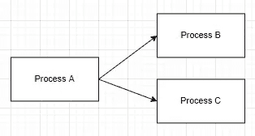
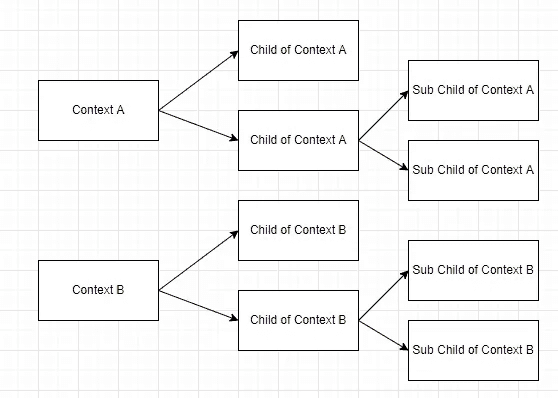
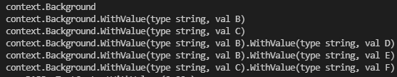
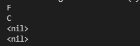

# Go:上下文包介绍

> 原文：<https://blog.devgenius.io/go-introduction-to-context-package-2e5c844e1ae3?source=collection_archive---------5----------------------->

来自 GO 的强大软件包


来源:freecodecamp

# **什么是语境？**

Context 是携带**值**、**取消信号**、**超时信号**、& **截止信号**的数据。有了上下文，我们就更容易在过程之间传递价值或信号。

# 为什么语境很重要？

有了上下文，当我们想要取消所有的进程时，我们只需要向上下文发送一个信号。因此，所有进程将自动取消。GO-lang 几乎每个部分都在使用数据库、http 服务器、http 客户端等上下文。即使在 Google 中，当使用 Go 进行开发时，上下文也是必需的，并且总是发送给每个函数。

# 上下文是如何工作的？



上下文工作的示例

例如，如果你想从进程 A 中取消某个进程，并将其发送到另一个进程，所有的另一个进程将检测到从进程 A 发出的信号并取消该进程。

# 如何营造语境？

因为上下文是一个接口，所以要创建一个上下文，我们需要一个适合契约接口的结构。但是在上下文包中，我们可以使用任何函数来创建上下文，而不是手动创建上下文。

**创建上下文有两个功能:**

1.  **语境。**后台()
    创建空上下文，永不取消，永不超时，并且没有任何值。
2.  **语境。TODO()**
    创建类似 Background()的空上下文，但通常在我们不清楚要使用的上下文时使用。

# 创建空上下文

这是在 go 中初始化空上下文的例子。请查看控制台中打印的内容。上面的代码将打印**上下文。背景** & **上下文。TODO** 在你的控制台上。

# 父子上下文

上下文采用了**父子**概念。这意味着，当您创建一个上下文时，您可以从现有上下文创建一个子上下文。父上下文可能有许多子上下文，但子上下文只允许有一个父上下文。这个概念类似于面向对象编程中的继承概念。

# 父子上下文之间的关系



父上下文和子上下文概念示例

父上下文和子上下文将始终相互连接。当你对上下文 A 做了什么，上下文 A 的所有子元素和子元素都会受到影响，但是不会影响到不同继承路径的上下文 B。您可以从父上下文的子上下文和子上下文中访问父上下文中的数据。但是不允许从另一个继承路径上下文中访问数据。

# 上下文是不可变的

上下文是不可变的对象，这意味着在上下文被创建后，你不能再改变上下文。如果你给上下文添加值，并设置一个新的超时或其他任何东西。将自动创建一个新的子上下文，更改将应用于新的子上下文，而不会影响现有上下文。

# 有价值的上下文

默认情况下，上下文没有值。您可以向上下文添加一个值对(key-value)。当您向上下文添加新值时，将自动创建一个新的子上下文。这意味着原始的上下文没有改变。为了给上下文添加值，可以使用 function。

```
**context.WithValue(parent, key, value)**
```

具有值的上下文示例



尝试运行上面的示例代码并查看结果，您将在控制台中看到每个子上下文都将连接到它自己的父上下文。

# 访问父上下文值

子上下文可以访问自己父上下文的值，不能从不同的继承路径访问。请查看并尝试下面的代码。

```
fmt.Println(contextF.Value("f"))
fmt.Println(contextF.Value("c"))
fmt.Println(contextF.Value("b"))
fmt.Println(contextA.Value("b"))
```



上述代码的结果

你试过密码了吗？请看代码的结果。

*   第一行代码试图访问它自己值，确切地说，你可以从它自己的上下文中访问值。
*   第二行代码试图访问它自己的父上下文，这个方法仍然是允许的，你可以访问它自己的父值。
*   第三行代码试图用不同的父上下文访问上下文，你不能从不同的父上下文访问值。
*   第四行代码试图访问它自己子值，父上下文不能从它自己的子上下文中访问值。

# 带取消的上下文

您也可以将**取消信号**添加到上下文中。Cancel 信号通常在你想取消 goroutine 的执行时使用，你可以发送 cancel 信号到你想取消的 goroutine 的上下文中。要使用取消信号创建上下文，您可以使用此函数。

```
context.WithCancel(parent)
```

# 超时的上下文

除了让代码手动取消 goroutine 之外，您还可以为取消信号设置超时。当程序时间超时时，goroutine 将自动取消。当您想要查询数据库或 API 时，上下文超时是合适的，但是您需要设置最大超时。要创建超时上下文，您可以使用此函数。

```
context.WithTimeout(parent, duration)
```

# 有截止日期的上下文

除了为取消某个 goroutine 设置超时之外，您还可以为上下文设置截止时间。使用截止日期，您可以设置截止日期的时间，而不是设置超时之类的持续时间，例如今天中午 12:00。要创建带截止日期的上下文，您可以使用此功能。

```
context.WithDeadline(parent, time)
```

带有**取消的**上下文**，超时，&截止时间**将返回 **2 值**，还有**一个新的子上下文**和**取消功能**。要取消上下文或流程，您只需添加下面的代码，cancel 函数将在上下文或流程完成后调用。

```
defer cancel()
```

> 参考:
> [Golang 上下文由程序员扎曼现](https://www.youtube.com/watch?v=8S5cWNrMNNY&t=736s)