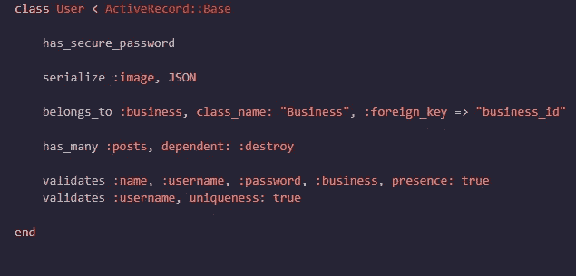

# 本地化:React/Redux 应用程序

> 原文：<https://blog.devgenius.io/go-local-react-redux-app-72c785adb93?source=collection_archive---------3----------------------->


Miikka Luotio 在 [Unsplash](https://unsplash.com?utm_source=medium&utm_medium=referral) 上拍摄的照片

我花了很长时间想让它正常工作。这篇博文将会深入探讨。我开发了一个应用程序，允许当地企业主注册一个账户，并为他们的企业发布公告。我承认它现在不是最好看的应用程序，但我想在未来应用更多的风格，并添加更多的功能，比如搜索功能。

# Ruby on Rails 设置

后端 API 是使用 Ruby on Rails 构建的。为前端应用程序构建 API 时，有几件事情要做。首先，您必须在命令行中输入以下内容来启动一个新的 Rails API:

```
rails new your_app --api
```

如果您想使用 Postgresql 这样的数据库，您可以将它添加到命令中，这样 Rails 就知道它将为您的 API 使用什么数据库。如果您选择使用 SQLite，可以将其留空，这是 Rails 通常使用的默认数据库。

```
rails new your_app --api -d=postgresql
```

构建 API 时，需要对 config 文件夹进行一些修改。首先，在 initializers 文件夹中是您的 cors.rb 文件，您必须修改它以便能够使用 localhost:3000 和 localhost:3001。因为您的前端正在呈现来自数据库的信息，所以它们必须连接。


不要忘记你的方法！

如果您像我一样使用 Postgresql，这里是我遇到的主要故障排除问题和解决方案。

# Postgresql 故障排除

1.  数据库连接错误

*   在 database.yml 下，您必须将端口号更改为 5432 或 5433。确保它们的默认端口号和开发端口号相同。


系统默认值


发展

*   不要忘记为生产设置数据库！


数据库生产

*   完成所有这些工作后，保存文件并在 Linux CLI 或 VSCode 终端中输入:

```
sudo service postgresql restart
```

系统会提示您输入管理员密码，之后它应该会重启并与您的 Rails API 一起工作。

最后，在 config 文件夹的 application.rb 中，需要相应地设置这个特定的文件，以便能够将 Rails 用作 API，只需确保 config.api_only = true！


# 控制器、模型、串行化器

这是我的应用程序模型之一，用户:



一个用户(也称为企业所有者)与一个拥有 business.id 的业务模型相关联，business . id 与他们的 user.id 一致。Id[0]链接到业务。Id[0]，然后使用序列化程序显示其余信息。

我使用 Rails 制作了后端 API，并像这样构建了数据库模式:


除了我的数据库之外，我还将 FastJsonapi 用作序列化程序，下面是 UserSerializer 的一个示例:


用户显示他们的 has _ many association of:posts，这将显示他们由于 PostSerializer 而发布的帖子。除此之外，由于用户属于一个企业，它还显示他们的企业属性。记住序列化器的结构很重要，因为一旦设置了 Redux 存储，知道使用哪种状态就变得至关重要。

# 反应/还原/路由器

React 是一个 Javascript 框架，它运行于公共文件夹中 index.html 文件的附加根目录

。让它显示信息的重要生命周期方法是组件中的 render()方法。为了让它与 Redux 一起工作，必须对下面的 index.js 文件进行一些导入。

提供商允许我的全局状态{store}连接到我的<app>。Store 是我的全球化状态，它包含了我的所有 reducer(root reducer)。composeEnhancer 允许我在浏览器中使用 Redux tools 扩展来查看状态变化和调试潜在问题。Thunk 中间件允许我的应用程序与我的后端 API 和我的前端应用程序异步运行。Router 允许我使用路径路由，这样当我转到像“/profile/1”这样的 url 时，它会使用唯一的配置文件 URL Params ID 1 来呈现配置文件(稍后将深入讨论这个问题！).</app>

这是我的 App.js 文件:


getAllUsers 操作


getAllUsers 动作->减速器


getCurrentSession 操作


获取当前会话操作->当前用户缩减器

行动和减速器齐头并进。动作描述了你想做什么，它是一个返回对象的函数。动作用 ES6 语法编码，在这种情况下，它是一个异步函数。这意味着当我的前端从后端获取数据时，它将继续检查错误并返回我所要求的 user.data，而不是等待它一次性完成所有操作。

在这种情况下，它将返回用户对象。

Reducer 描述了动作如何将一个状态转换到下一个状态。它将检查我做了哪些操作，然后修改存储。这个动作和 reducer 将当前登录的用户作为一个对象返回，然后用登录的用户和所有注册的用户更新存储的状态。

我还在这里设置了我的确切路线，包裹在<switch>中。Switch 所做的是，当我转到特定路径时，专门渲染那些组件，这样，我就不会渲染出所有其他路径。</switch>

我在我的应用程序中也有，如果用户登录，那么一个导航条组件将呈现。否则，如果用户会话不是活动的，那么它将呈现<join>组件，提示用户登录或注册一个帐户。</join>


登录或注册前的主页。


将发布新帖子的登录用户。


编码为功能组件的后置组件

我的登录、注册和发布表单都是功能组件。我决定这样做的原因实际上是因为易于测试。我不用担心“这个”。我可以确定它确实做了它的初衷，那就是让一个新用户发帖。我还映射了这个组件的状态，以确保用户发帖被登录(因为登录的用户有一个:id)。它将获取 current_user 状态和表单的状态，这样它就知道是谁在发帖以及帖子说了什么，这样它就会被发送到后端，作为一个条目保存在我的 PGSQL 数据库中。

最后一行是“连接”。它所做的是将 mapStateToProps 连接到我的特定 Redux 操作，以便可以保存到 store 中。Store 包含我的全球化状态，这意味着它还将保存所有用户的帖子。如果您查看 Redux DevTools 状态，您会看到用户的关系和属性:


嵌套数据！

这显示了用户 id 1。你可以看到他们的属性和他们到目前为止发表的所有帖子。


明信片组件，所有条目都可以滚动浏览。仍在进行中的工作，并希望加强它。


明信片的代码结构。

对于这个组件，我使用了一个基于类的组件，因为我必须使用生命周期方法 componentDidMount 来获取 post 的属性，这样它就可以显示用户发布的所有帖子。我在这里使用了一个 map 函数来检查每篇文章，以确保它与用户属性和与用户相关联的 id 相匹配。因此，如果帖子与帖子的用户数据状态匹配，那么它将返回用户的帖子。我还映射了用户和帖子的道具。如果我不这么做，就会发生这样的事:


所有的帖子都没了！

我的条件语句将返回一张卡片，上面写着“没有制作任何内容”。我的 Redux Devtools 也展示了这一点:


即使保存了帖子，也没有用户将它们关联起来。因此，除非有 user :id，否则帖子不会呈现。


一个用户的个人资料页面显示他们的用户名和地址。(不是实际地址)


配置文件的父组件。

profile 组件也是一个类！我在这里也使用了一种生命周期方法来获取所有注册用户的道具。然后它将使用键 history 和 match 呈现 ProfileCard 的子组件。历史记录的作用是在应用程序中保存状态。

我遇到的一件奇怪的事情是当我检查我的控制台时。直到我添加历史时，道具才被添加，因为在我的应用程序中的某个点，历史没有持续并被清除。匹配键还有助于将它作为一个属性传递给 ProfileCard 组件，以便它能够基于用户 id 进行呈现。这是当您在开发工具中查看组件时的样子，您将看到路由器属性检查它是否匹配:


子组件，ProfileCard。

在 ProfileCard 组件中，我必须使用. find 方法，这样它就可以根据(this.props.match.id)找到用户对象的 id。与明信片一样，如果我不将状态映射到道具，那么 ProfileCard 将无法呈现。

我之所以特别强调这些组件，是因为我必须进行故障排除和采取步骤来调试它们。现在都完成了，但我希望对这个项目进行更多的改进，并改进我实现的样式组件 CSS，使它看起来像这样。

## 这就是我的项目！

_____________________________________________________________

# 社会联系

[LinkedIn](https://www.linkedin.com/in/shirlend)

[GitHub](https://www.github.com/Ro5hi)

[推特](https://www.twitter.com/len_deta)

[Instagram](https://www.instagram.com/_sceptral_)

[YouTube](https://www.youtube.com/channel/UC_0nik4oj1T1Q160XVr0ZlA?view_as=subscriber)