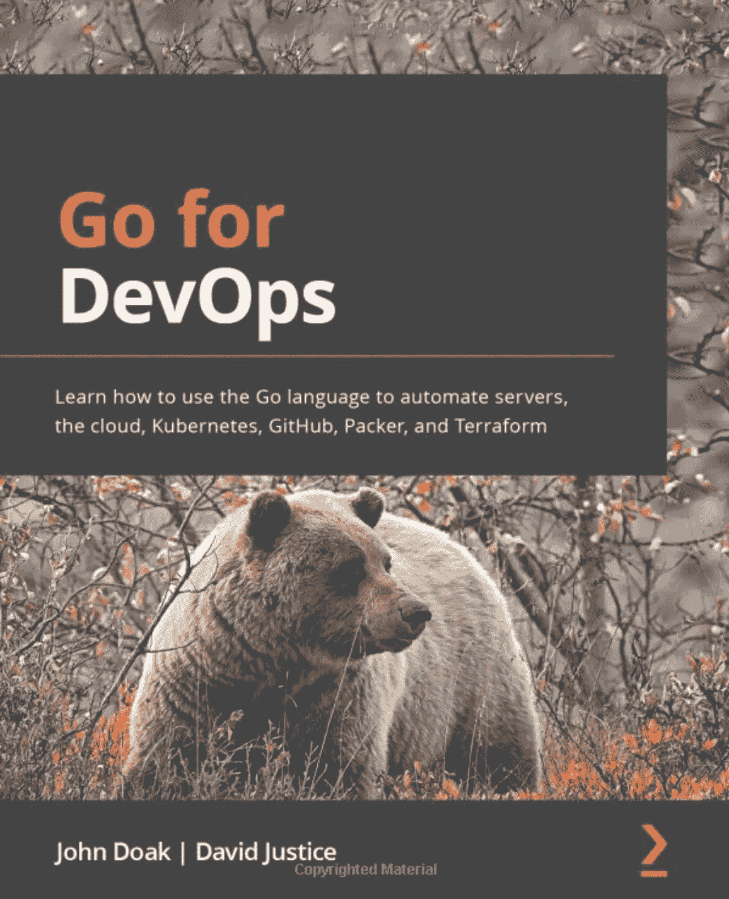

# Go:使用 Shell 脚本支持通用二进制文件

> 原文：<https://blog.devgenius.io/go-support-universal-binaries-using-shell-script-ec9478ac716?source=collection_archive---------4----------------------->


马库斯·斯皮斯克在 [Unsplash](https://unsplash.com?utm_source=medium&utm_medium=referral) 上的照片

# 介绍

你有没有想过用一个二进制文件编写一个可以在多个平台上运行的围棋程序？我一直有点希望 Go 会有“胖”的二进制文件，就像我们从 PowerPC 转换到 Intel 时旧 Mac 的二进制文件一样，让你可以在任何一个平台上运行。

那么，如果我们想发布我们的 Go 程序，使它能从一个可执行文件中支持多种平台/操作系统组合，我们今天能做些什么呢？

可信的旧 shell 脚本。

# 广告

如果你对使用 Go 进行 DevOps 工作感兴趣，可以在亚马逊上查看我的书: [Go For DevOps](https://www.amazon.com/Go-DevOps-language-Kubernetes-Terraform/dp/1801818894/ref=cm_cr_arp_d_pdt_img_top?ie=UTF8) 。

作者(不是出版商)的收益将捐给无国界医生组织，一个伟大的组织。

# 让我们把这个解决掉

实际上，我讨厌大多数用例的 shell 脚本。它们容易出错，测试也很痛苦。我的 shell 脚本的主要用例是围绕一个片状测试运行一个 **for** 循环，试图让它再次跳闸。

但是像任何事情一样，也有例外。sh 在每个 Unix 平台上都有，因此它的通用性使它非常适合这种用途。

# 是什么原因让我写了这个？

我最近遇到有人试图使用 shell 将数据推送到一个拥有多种语言 SDK 的服务中。但是那个人不想让他们要支持的所有系统都有不同的二进制文件，也不想安装其他运行时(Python、.网，…)。这意味着在那个平台的 REST 流上做一些逆向工程，在 shell 中做一些复杂的体操，同时调用 *cURL。*

我想一定有更好的方法，于是就做了这个演示。这个想法来自于谷歌和脸书用来打包 Python 程序进行分发的方法。

# 这个想法

我们将在一个 shell 脚本中封装多个 Go 二进制文件，shell 脚本将检测操作系统/平台，并将我们想要的二进制文件解码到正确的位置并调用它。我们可以将 shell 脚本的参数直接传递给二进制文件。

如果您有足够多的二进制文件或大型程序，这会使 shell 脚本变大。另一个版本可以让脚本从 GitHub 或其他地方下载正确的版本以节省空间。但是在这个演示中，我们将只是烘焙二进制文件。

这个演示的所有代码都可以在这里找到:[https://github.com/johnsiilver/shellembed](https://github.com/johnsiilver/shellembed)

# 包装脚本

为了使这一切工作，我们需要一个脚本来包装我们的 Go 二进制文件，然后在调用时打开它们。

```
#!/bin/bash 
# define the tasks that need to be done with the extracted content
process_tar() {
    cd $WORK_DIR"/bin"
    # do something with the extracted content
    eval "./hello_${os}_${arc} $@"
}
```

首先定义一个函数，我们稍后将调用这个函数 *process_tar()* 。该函数将进入我们稍后创建的工作目录，并对工作目录中的二进制文件运行 *eval* 命令，向其传递脚本传递的参数( *$@* )。

```
# line number where payload starts
PAYLOAD_LINE=$(awk '/^__PAYLOAD_BEGINS__/ { print NR + 1; exit 0; }' $0)
```

接下来，我们使用 *awk* 扫描我们所在的脚本文件，并记录具有 *__PAYLOAD_BEGINS_ 的行号。*这之后的所有内容都将是我们的 Go 二进制文件，它们已经在 shell 脚本的末尾放入了压缩的 *tar* 格式。

```
# Determine the os and arch.
if [[ "$OSTYPE" == "linux-gnu"* ]]; then
  os="linux"
elif [[ "$OSTYPE" == "darwin"* ]]; then
  os="darwin"
else 
  echo "unsupported OS: " + `uname -a` 
  exit 1
fiif [[ `uname -m` == "arm64" ]]; then  
  arc="arm64"
elif [[ `uname -m` == "x86_64" ]]; then 
  arc="amd64"
else 
  echo "unsupported arch: " + `uname -m` 
  exit 1
fi
```

我们希望支持运行在 x86_64 和 arm64 处理器上的 Linux 和 Darwin。我们使用 *$OSTYPE* 和 *uname* 来确定我们的 OS 和平台。如果存在任何其他组合，我们给出一个错误。

```
# make our directory if it doesn't exist.
mkdir -p /tmp/helloshell
WORK_DIR=/tmp/helloshell
```

然后，我们创建一些工作目录，将提取的 tar 文件转储到其中，以获取 Go 可执行文件。

```
# extract the embedded tar file
tail -n +${PAYLOAD_LINE} $0 | tar -zpx -C $WORK_DIR >/dev/null 2>&1# perform actions with the extracted content
process_tar $@exit 0
__PAYLOAD_BEGINS__
```

然后，我们创建一些工作目录，将提取的 tar 文件转储到其中，以获取 Go 可执行文件。

然后我们*解包*我们的 Go 可执行文件，并从上面执行我们的 *process_tar()* 函数。

现在我们有了一个脚本，如果我们支持这个平台，它可以解包一些 Go 二进制文件并运行它们。但是我们如何将 Go 二进制文件放到脚本中呢？

# 为平台脚本构建

下面是一个小脚本，它为我们想要的每个操作系统/平台组合构建我们的二进制文件，然后将它们嵌入到一个名为 **run.sh.** 的文件中。这个文件是 **hello.sh** 的副本，其中 Go 二进制文件嵌入为压缩的 *tar* 文件。

这个构建器脚本将被命名为 **build_for_platform.sh**

```
#!/bin/bashexport GOOS=linux 
export GOARCH=amd64 
go build -o bin/hello_linux_amd64export GOOS=linux 
export GOARCH=arm64 
go build -o bin/hello_linux_arm64export GOOS=darwin
export GOARCH=amd64 
go build -o bin/hello_darwin_amd64export GOOS=darwin
export GOARCH=arm64 
go build -o bin/hello_darwin_arm64
```

第一部分只是在一个名为 *bin/* 的目录中构建我们的 Go 二进制文件，并根据操作系统和平台对它们进行索引。

```
tar -czvf hello.tar.gz bin/
```

下一部分创建我们的 *bin/* 的 *tarball*

```
cp hello.sh run.sh
cat hello.tar.gz >> run.sh
```

现在我们创建我们的 **hello.sh** 副本作为 **run.sh** 并将我们的 tarball 附加到 **run.sh** 的末尾。

```
rm hello.tar.gz
rm -rf bin/
```

最后，我们做一些清理工作。

# 如果你愿意，就敲鼓吧

您现在可以简单地运行:

```
./build_for_platform.sh
```

这将创建您的 **run.sh** 文件。

现在让我们执行我们的 **run.sh** 并给它传递一个参数(它将打印出一个名称):

```
./run.sh John
```

这会输出类似这样的内容(输出取决于平台):

```
hello John from: darwin/arm64
```

# 结论

正如您从上面看到的，使用 shell 脚本为所有支持的平台创建通用的二进制文件是可能的。如果您希望保持 shell 脚本较小，您可以让它简单地下载您需要的二进制文件，并使用相同的参数进行调用。

但是当你不想依赖网络的时候，这是一个很好的方法。

如果你想看更多我写的东西，你应该在亚马逊上看看我的书: [Go For DevOps](https://www.amazon.com/Go-DevOps-language-Kubernetes-Terraform/dp/1801818894/ref=cm_cr_arp_d_pdt_img_top?ie=UTF8)

你也可以在 medium 或我在 golangsre.com[的博客上找到更多关于各种主题的文章。如果你想从一些互动视频课程中学习围棋，请访问我的免费网站 golangbasics.com](http://golangsre.com)。

