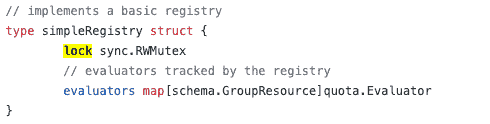
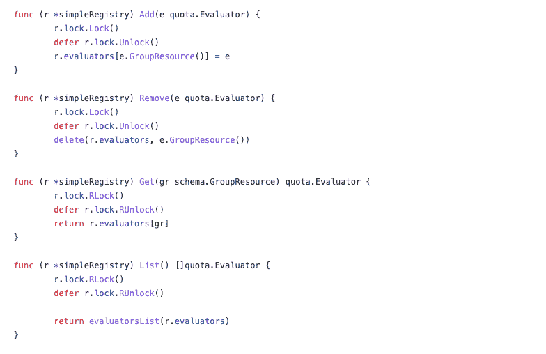
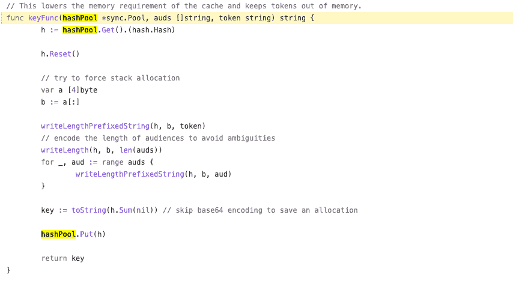

# 去同步 101

> 原文：<https://blog.devgenius.io/go-sync-101-39777f75a434?source=collection_archive---------0----------------------->

## 遍历互斥和其他同步工具

在 Go 1.18 中，最吸引眼球的`generics`，被认为是 Go 问世以来最大的语法“进化”。但是，不应该忽视 API 的其他变化，例如`sync`包的`Mutex`和`RWMutex`API 中添加了 [TryLock](https://pkg.go.dev/sync#Mutex.TryLock) 。

在阅读[同步文档](https://pkg.go.dev/sync)时，我发现自己对它很陌生，甚至对`Mutex`或`WaitGroup`也是如此，这促使我仔细研究 Go sync，并回顾其不同类型的定义及其包含的功能。


来自 unsplash， [@picsbyjameslee](https://unsplash.com/photos/tn85IH-sbhw)

# 通常

sync 包是 Golang 并发实现不可或缺的一部分，与其他语言相比，Go 使用简单的锁。更好的解释:Java 同步可以通过`synchronized`关键字、`ReentrantLock`和`volatile`来实现；而 Go 摆脱了复杂性，只支持两种类型，`Mutex`和`RWMutex`。在 1.18 之前，其实只有一套方法，`Lock`和`UnLock`，如果你把`RLock`和`RUnlock`看成核心相同，只是形式不同的话。

所以 sync 包里总共只有 7 种。除了`Locker`接口和`Mutex`外，其余`RWMutex`、`Cond`、`WaitGroup`、`Pool`和`Once`都是构建在`Mutex`之上的 sync 类型，以支持特殊场景。

# 互斥（体）…

毫无疑问，sync 包的核心是[互斥](https://github.com/golang/go/blob/41d8e61a6b9d8f9db912626eb2bbc535e929fefc/src/sync/mutex.go#L25)，一个排他锁的实现，几乎所有的 sync 逻辑都是基于它构建的。它有 3 个来自 API 端的函数。

*   [锁](https://github.com/golang/go/blob/29bbca5c2c1ad41b2a9747890d183b6dd3a4ace4/src/sync/mutex.go#L74)。获取锁，或者在锁被占用时排队等待，并且线程变成阻塞状态。现在，我们让处理器逻辑来决定线程是否以及何时可以获得锁。而互斥体源中的*正常*和*饥饿*两种模式，在一定程度上可以决定队列中线程的优先级，涉及到将哪个线程放入队列，是否允许新加入的线程自旋等。简而言之，**互斥对于各种“竞争者”是公平的。**
*   [解锁](https://github.com/golang/go/blob/29bbca5c2c1ad41b2a9747890d183b6dd3a4ace4/src/sync/mutex.go#L205)。根据当前锁的不同情况释放锁，并尽可能“公平”地转移锁的所有权，像锁一样提供两种路径，快速和慢速。
*   [试锁](https://github.com/golang/go/blob/29bbca5c2c1ad41b2a9747890d183b6dd3a4ace4/src/sync/mutex.go)。以轻量级的方式获得锁，避免阻塞线程。这种方法在其他语言中也很常见，比如 Java 中的`ReentrantLock`，Python 中的`Lock.acquire(False)`。但在 Go 中，经过 2013 年以来 9 年的鏖战却依然在 API 上打上了提醒的标记，终于被带入现实([提议](https://github.com/golang/go/issues/45435))。

> 请注意，虽然 TryLock 的正确用法确实存在，但这种用法很少见，而且 TryLock 的使用通常是在互斥体的特定使用中出现更深层次问题的迹象。

我非常同意提案中提出的一些案例。TryLock 很有用！想象一个需要同步更新的缓存:你希望后续更新的请求可以尽快退出，以缩短“愚蠢”的等待，因为这个缓存可以通过接受过时的数据来加快进程。这是一个非常常见的权衡。

```
lock sync.Mutexfunc(c *cache) Get(key string) interface{}{
  if ( needUpdate && lock.TryLock) {
    c.update() // update takes 5 seconds
    lock.Unlock()
}
  return c.map.Get(key)
}
```

当然，`channel`也可以达到同样的效果，或者在 Golang 设计师看来更“Go”。然而，没有人能否认 TryLock 在这种情况下更简单、更优雅。

记住这一点，你会很容易陷入 bug。

> 互斥体在第一次使用后不得复制。

不要试图复制互斥变量，甚至是包装互斥变量的结构实例，这将导致错误`*written by concurrent Map*`。参考此[示例](https://eli.thegreenplace.net/2018/beware-of-copying-mutexes-in-go/)了解更多信息。

# RWMutex

RWMutex 基于 Mutex，适用于读多写少的同步场景。本质上，它通过给互斥体增加一个额外的`semaphore`来配备更多的读锁。

*   [锁](https://github.com/golang/go/blob/29bbca5c2c1ad41b2a9747890d183b6dd3a4ace4/src/sync/rwmutex.go#L133)，一次阻塞操作，读写都需要等待一次被占用。
*   [解锁](https://github.com/golang/go/blob/29bbca5c2c1ad41b2a9747890d183b6dd3a4ace4/src/sync/rwmutex.go#L190)，解锁阅读器，解锁内部互斥锁。
*   [RLock](https://github.com/golang/go/blob/29bbca5c2c1ad41b2a9747890d183b6dd3a4ace4/src/sync/rwmutex.go#L56) ，get `readerSem`，不影响任何并发的`read`操作，同时阻塞`write`操作(Lock)直到`read`结束。`RWMutex`支持`1<<30` `read` goroutines 的同时访问，降低了等待读锁的可能性。
*   [RUnlock](https://github.com/golang/go/blob/29bbca5c2c1ad41b2a9747890d183b6dd3a4ace4/src/sync/rwmutex.go#L103) ，从`readerCount`中减去一。并且当它是最后一个读取器时，如果存在的话，解除阻塞`write` goroutine。
*   [尝试锁定](https://github.com/golang/go/blob/29bbca5c2c1ad41b2a9747890d183b6dd3a4ace4/src/sync/rwmutex.go#L76)，尝试获取`readerSem`。
*   [TryLock](https://github.com/golang/go/blob/29bbca5c2c1ad41b2a9747890d183b6dd3a4ace4/src/sync/rwmutex.go#L158) ，调用互斥体的`TryLock`。如果`readerCount`当前不为 0，则失败且`Unlock`；否则，锁定`readersem`和`writersem`。

`RWMutex`在 Go 中的应用甚至比`Mutex`更广泛，尤其是在实现与地图相关的简单缓存时，比如在 Kubernetes APIServer 代码中使用一个`RWMutex`来确保同步访问[注册表](https://github.com/kubernetes/apiserver/blob/92392ef22153d75b3645b0ae339f89c12767fb52/pkg/quota/v1/generic/registry.go#L27)中的一个`Evaluator`地图。



然后像`Add`和`Get`这样的操作分别调用相应的 Lock 和 RLock 方法。



和`Mutex`一样，`RWMutex`用完后不要复制。

警惕👇

在实践中找到最合适的`Mutex`。`RWMutex`增加了几种信号量同步的操作，提供了比互斥更多的功能。但是互斥锁在性能上胜出。更多详情见本[发行单](https://github.com/golang/go/issues/38813)。

# 锁柜

[Locker](https://github.com/golang/go/blob/29bbca5c2c1ad41b2a9747890d183b6dd3a4ace4/src/sync/mutex.go#L33) 接口在`mutex.go`中定义，其值由两个方法`Lock`和`Unlock`组成。同时，`RWMutex`实现了自己的`RLocker`。

作为一个灵活的锁，这个接口可以作为一个字段封装到其他结构中，使得开发者可以在`Mutex`、`RWMutex`中传递它，甚至可以自定义它。比如在 Kubernetes 中，Locker 保证了 [watchCacheInterval](https://github.com/kubernetes/apiserver/blob/15bcfedb6be8749a8d1e9340af8d95705892e9b9/pkg/storage/cacher/watch_cache_interval.go#L97) 的同步，而`watchCache’s` [RWMutex](https://github.com/kubernetes/apiserver/blob/09e974dbce4a2dbbac618210414fdf0d1054aab9/pkg/storage/cacher/watch_cache.go#L635) 实际上是传入的。

# Cond

`Cond`是一个同步条件变量，通常与`Mutex`结合使用。它本质上是等待某个特定条件的线程的同步机制，内部包含一个`Locker`。

```
cond := sync.NewCond(&sync.Mutex{})
```

*   [等待](https://pkg.go.dev/sync#Cond.Wait)，暂停当前 goroutine。
*   [信号](https://pkg.go.dev/sync#Cond.Signal)，唤醒正在等待的 goroutine。
*   [广播](https://pkg.go.dev/sync#Cond.Broadcast)，唤醒所有等待的 goroutines。

但是`Cond`在围棋中很少使用，因为`channel`。[这里的](https://github.com/golang/build/blob/master/livelog/livelog.go)是我从这张[发行票](https://github.com/golang/go/issues/20491)中找到的一个例子，讨论为`Cond`增加文件和例子。读起来挺有意思的。

对 Java 的`wait`或者`notify`的理解可以帮助你更好的把握`Cond’s`本质。Golang 使用运行时 [notifyList](https://github.com/golang/go/blob/29bbca5c2c1ad41b2a9747890d183b6dd3a4ace4/src/sync/cond.go#L27) 实现等待队列。

# 等待组

[WaitGroup](https://pkg.go.dev/sync#WaitGroup) ，与`Cond`相反，在 Go 中非常流行，允许一个或多个 goroutines 被一组执行`groutinues`阻塞。

它的内部实现与互斥无关，而是由一些原子操作一个[计数器](https://github.com/golang/go/blob/29bbca5c2c1ad41b2a9747890d183b6dd3a4ace4/src/sync/waitgroup.go#L29)和信号量。

*   [添加](https://pkg.go.dev/sync#WaitGroup.Add%5C)，添加增量同步等待程序。
*   [Done](https://pkg.go.dev/sync#WaitGroup.Done) ，一个 goroutine 执行完毕后，计数器减 1，由`Add`方法实现。
*   [Wait](https://pkg.go.dev/sync#WaitGroup.Wait) ，内部通过无限 for 循环实现，当计数器返回 0 时退出，使被阻塞的 goroutine 继续执行。

常见的 WaitGroup 代码模板如下。

```
wg := &sync.WaitGroup{}
for i := 0; i < n; i++ {  // n number of executing goroutines
wg.Add(1)
go func() {
  // execute logics
  wg.Done()  // declare finished
}()
}
wg.Wait()  // main goroutine is blocked and wait for all goroutines to finish
```

`waitGroup`用于 APIServer 中的`bufferedBackend`来并发处理[事件。](https://github.com/kubernetes/apiserver/blob/92392ef22153d75b3645b0ae339f89c12767fb52/plugin/pkg/audit/buffered/buffered.go#L234)

需要提醒的是，如果你将太多的 go routine 加入 waitGroup，那么一小部分 go routine 不能正确调用`Done`将导致整个程序被阻塞。

# 一次

[一次](https://pkg.go.dev/sync#Once)顾名思义，是针对并发编程中某些事情只需要做一次的场景，比如初始化配置，或者读取输入信息。

Once 只有一个 [Do](https://pkg.go.dev/sync#Once.Do) 方法，并且只接受一个`func`参数。

在执行中，a `Mutex`和`uint`保证[一次](https://github.com/golang/go/blob/29bbca5c2c1ad41b2a9747890d183b6dd3a4ace4/src/sync/once.go#L14)只执行一次，执行后单元从 0 变为 1。

Go doc 最后提供了一个完美的例子。

```
func main() {
  var once sync.Once
  onceBody := func() {
  // some heavy operations
  }
  done := make(chan bool)
  for i := 0; i < 10; i++ {
    go func() {
    once.Do(onceBody) // onceBody will only be called once.
    done <- true
    }()
  } for i := 0; i < 10; i++ {
    <-done
  }
}
```

# 泳池

[池](https://pkg.go.dev/sync#Pool)，临时对象池，用于存放暂时不用但以后会用到的对象，可以被多个 goroutines 共享。

> Pool 的目的是缓存已分配但未使用的项，以便以后重用，减轻垃圾收集器的压力。也就是说，它使得构建高效、线程安全的自由列表变得容易。但是，它并不适用于所有的自由列表。

在某些情况下，它可以节省内存开销并减少 GC 压力。

*   `Get`，用钥匙从池中获取一个对象。
*   `Put`，将一个密钥和一个对象放入池中。

这是一个很好的官方插图。

```
var bufPool = sync.Pool{
  New: func() any {
  return new(bytes.Buffer)
  },
}func Log(w io.Writer, key, val string) {
  b := bufPool.Get().(*bytes.Buffer)
  b.Reset()
  // Replace this with time.Now() in a real logger.
  b.WriteString(timeNow().UTC().Format(time.RFC3339))
  b.WriteByte(' ')
  b.WriteString(key)
  b.WriteByte('=')
  b.WriteString(val)
  w.Write(b.Bytes())
  bufPool.Put(b)
}
```

对于大量调用`Log`方法的场景，我们从 Pool 中获取一个`Buffer`，然后将它放回以减少`Buffer`的创建，例如，Kubernetes 中令牌验证过程中的散列操作。将临时散列键存储在[池](https://github.com/kubernetes/apiserver/blob/706a6d89cf35950281e095bb1eeed5e3211d6272/pkg/authentication/token/cache/cached_token_authenticator.go#L222)中是一个好主意，可以节省散列操作的内存开销。



# 地图

[Map](https://pkg.go.dev/sync#Map) 是一个并发 Map 实现。两种最常见的适用场景是:

> 当给定关键字的条目只被写入一次，但被读取多次时，如在只增长的缓存中。
> 
> 当多个 goroutines 读取、写入和覆盖不相交的键集的条目时。

它包括以下 API。

*   [加载](https://pkg.go.dev/sync#Map.Load)，找到按键对应的值。
*   [加载并删除](https://pkg.go.dev/sync#Map.LoadAndDelete)，找到`Key`对应的值，删除`Key`。
*   [LoadAndStore](https://pkg.go.dev/sync#Map.LoadOrStore) ，找到`Key`，如果有则返回`Value`；否则将`Key`和`default`包含在地图中。
*   [范围](https://pkg.go.dev/sync#Map.Range)，遍历地图执行一次`func`。它是无序的，不阻塞映射，可以执行`Load`和`Store`这样的方法。
*   [存储](https://pkg.go.dev/sync#Map.Store)，在地图中保存`Key`和`Value`。

一般来说，`sync.Map`比`map + RWMutex`实现的同步映射更高效，尤其是在读操作较多而并发写操作较少的情况下。然而，在有许多并发写入和锁竞争的情况下，这些开源缓存存储算法胜过了`sync.Map`。

最新的`sync.Map`可能会像这个[提案](https://github.com/golang/go/issues/51972)建议的那样改变，融入类似`Swap`的方法。

# 结束了

反映了 Go 的哲学，“要简单”，`sync`包使用有限的代码，提供基于互斥和原子操作的有用工具。

记住这个概念，你就能更好地掌握 Go sync 包。无论你是在阅读源代码还是在一些同步场景下自己开发，都要简化代码或问题，从同步包中寻求工具最终解决。

感谢阅读！