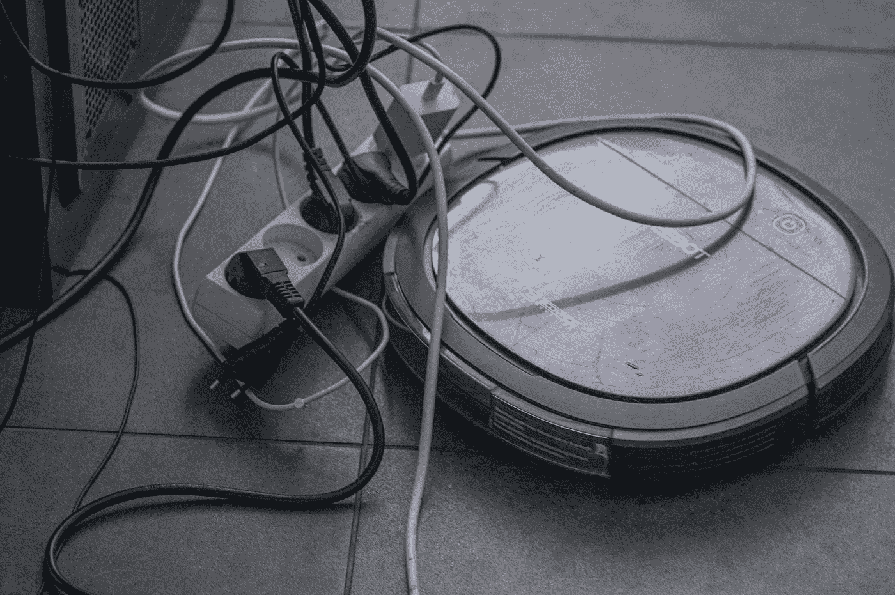

# 转到:低水平良好，高水平一般不好

> 原文：<https://blog.devgenius.io/go-to-good-at-a-low-level-generally-bad-at-a-high-level-43d1e850ac10?source=collection_archive---------5----------------------->


照片由 [Shardar Tarikul Islam](https://unsplash.com/@tarikul_islam?utm_source=medium&utm_medium=referral) 在 [Unsplash](https://unsplash.com?utm_source=medium&utm_medium=referral) 上拍摄

早在 1968 年，Edsger Dijkstra 给 ACM 的*通讯编辑写了一封现在很有名的信，通常被总结为“去发表被认为有害的声明”。该出版物是计算机械协会(ACM)的时事通讯。*

这一定意味着 Go To 总是不好的，你永远不应该使用它。如果你真的读了这封信(我在最后提供了几个副本的链接)，你会发现 Dijkstra 写的要比这微妙得多。

# 背景

您可能已经知道，Go To 语句是从程序中的一行到另一行的无条件转移。在 Go To 的早期，目标行是由其行号指定的。举个例子，

```
140 GOTO 210
210 FOR N = 1 TO 10
220 C etc.
```

当计算机运行到第 140 行时，程序执行将跳转到第 210 行。为了使线路 140 有价值，需要在线路 140 和线路 210 之间有一些线路，比如线路 150 到 200。否则我们可以删除第 140 行。

但是为了让 140 和 210 之间的代码行有价值，它们必须在程序执行的某个路径上运行。大概是这样的:

```
130 IF CONDITION GOTO 150
140 GOTO 210
150 C something to do if CONDITION is true
160 C etc. to 200
210 FOR N = 1 TO 10
220 C etc.
```

但是如果我们要这样做，我们也可以重构一个 if 块:

```
130 IF CONDITION THEN
150 C something to do if CONDITION is true
160 C etc. to 200
209 END IF
210 FOR N = 1 TO 10
220 C etc.
```

根本不需要去。

当然，这是假设我们使用的语言允许多行 If 块。如果语言不允许这样的块，第 130 行可能必须重写为

```
130 IF NOT CONDITION THEN GOTO 210
```

并且必须删除第 209 行。与带有两个 Go To 语句的示例相比，这仍然是一个改进。一般来说，如果你必须使用 Go To，最好尽可能少地使用它们。

有些 BASIC 方言既允许“`GOTO`”，也允许“`GO TO`”。其他当代编程语言已经去，但称之为别的东西。效果是一样的:它提供了一个简单的方法来解决眼前的困难，通常会在以后制造另一个困难。

Go To 的一个问题，尽管肯定不是最紧迫的，是行号被认为是神秘的。

行号是什么是显而易见的，但是当回顾一个程序时，你实际上必须向上或向下滚动到目标行才能看到它是什么。在那之后，你可能想回到目的地，但是你可能已经失去了你的思路。

所以单词标签被引入，允许你给一个目标标上更有意义的东西，比如“`existing`”或者“`error`”。

QBasic 和 Visual Basic 都有标签。大概 90 年代以来基本的所有方言都有标签。与 FORTRAN 类似，是 FORTRAN 90 添加了标签。我觉得 C++从来不用行号，总是用标签做目的行。

# 限制范围

程序员似乎更关心 Go To 语句被用来跳转到整个长程序的可能性。所以在某些语言中，Go To 的范围在某种程度上是有限的。

例如，在 C++中，Go To 语句可以跳转到定义它们的函数中的任何地方，但是在任何情况下都不允许跳转到另一个函数。

Go To 语句不得调用跳过必要初始化的跳转。例如，这不会编译:

```
goto label;
Fraction oneHalf (1, 2);
label: cout << oneHalf;
```

跳过`oneHalf`的初始化意味着计算机不知道当它到达标记行时`oneHalf`应该是什么。所以即使其他都检查过了，这个也不会编译。

编译器必须跟踪常量和变量的声明时间。你们中的一些人可能会想，编译器必须对任何流控制结构进行检查。这是真的。

但是你，作为程序员，也需要意识到这些事情，而 Go 会让你更难跟踪这些事情，更难理解由于这些错误而出现的错误和警告。

对于 C++中的其他流控制结构，您可以使用大括号和缩进对齐来帮助您理解这些事情。以 C++中的 Try-Catch 为例，在这个玩具例子中，假设`level`是一个已经在适当的范围内事先声明的`int`，

```
try {
    int a = 2 * level;
    if (level < MINIMUM) throw level;
    int b = level / a;
} catch (int e) {
    cout << (a + b);
}
```

是的，你可以在 C++里抛出任何东西。但这是另一天的咆哮。今天这里的重点是`a`和`b`都在 Catch 块的范围之外。如果您希望它们都在 Catch 块的范围内，您必须将它们的声明增加到更低的缩进级别。

如何缩进定位语句？我猜你不知道。所以你没有缩进的视觉线索来帮助你理解作用域和初始化。

# Java 视角

Java 语言承诺“编写一次，在任何地方运行”也就是说，在安装了 Java 运行时环境(JRE)的任何地方运行。

Java 开发工具包(JDK)中的编译器获取 Java 语言源代码，并将其编译成“字节码”，不是针对任何特定的物理芯片，而是针对 Java 虚拟机(JVM)，它是 JRE 的一部分。

Java 语言是一种高级语言，能够用几行代码表达像 Intel 8086 或 Motorola 68000 这样的芯片需要几十行汇编语言才能表达的东西。

JVM 指令集比任何物理芯片的指令集都要复杂，但它仍然是相当低级的。以 Java 语言中的这个简单函数为例:

```
 public static double circleArea(double radius) {
        return Math.PI * radius * radius;
    }
```

我认为那是正确的。如果将它加载到文本编辑器中，它会编译成看起来像乱码的 JVM 字节码。使用 javap 工具(JDK 的一部分)，您可以对字节码有所了解:

```
public static double circleArea(double);
    Code:
       0: ldc2_w #3 // double 3.141592653589793d
       3: dload_0
       4: dmul
       5: dload_0
       6: dmul
       7: dreturn
```

没有我想象的那么长。不过，有点神秘。

现在考虑这样的事情:

```
 while (counter > 0) {
        // TODO: Whatever needs to be done with counter
        counter--;
    }
```

它可能会编译成这样:

```
 **3:** iload_1
       4: **ifle          89**
       7: // the stuff called for by the TODO
      81: iinc          1, -1
      85: **goto          3**
      **89:** // maybe some kind of return
```

第 4 行的`ifle`指令是条件跳转:如果栈顶的值小于等于 0，程序执行会跳转到第 89 行。否则，它前进到第 7 行。

在第 85 行，有一个到第 3 行的无条件跳转，它加载了一个局部变量(高层源代码中的`counter`),这样它就可以与 0 进行比较，以确定是否再次迭代 While 循环。

所以本质上，While 循环的右花括号被转换成了一个`goto`,它导致了 While 循环条件的测试。

JVM 指令集也有`goto_w`操作码，可以进行比`goto`更远的跳转。然而，如果您注意不要在 Java 源代码中编写过长的“方法”，编译器可能永远都不需要使用`goto_w`，因为`goto`可以走得很远。

Dijkstra 呼吁从所有“高级”编程语言中消除 Go To 语句，他解释说这意味着“除了普通的机器代码之外的一切”。

Dijkstra 不喜欢 Java，他认为它“一团糟”，“需要广泛的广告宣传和积极的推销才能被商业接受”，并认为 Haskell 是一种更好的语言。

我不知道他是否意识到或者欣赏 Java 的创造者是如何注意到他 1968 年关于 Go To 语句的信的(很不幸他在 2002 年去世，那时 Scala 还没有发明)。

当然，我假设 Dijkstra 会认为 Java 虚拟机(JVM)的操作码足够接近“普通机器码”,不会像高级语言那样受到 Go 的限制。

虽然`goto`在 JVM 指令集中有一个操作码，并且在 Java 语言中是一个保留字，但是它没有任何与之相关联的语法。

也许 Java 的更高版本会有 Go To 语句。然而，更有可能的是，在 Java 语言中声明`goto`为保留字的意图是表明 Java 永远不会有 Go To 语句。

您的集成开发环境(IDE)，如 IntelliJ IDEA 或 Apache NetBeans，会将一个“`goto`”(不在注释或`String`文字中)识别为保留字，并将其样式化为与其他保留字相同，例如`for`、`while`或`try`。

但是 IDE 也会将“`goto`”标记为编译错误，下面有一条红色的曲线，表示源文件无法编译。

这让我想起了运算符重载，这是另一个没有被纳入 Java 的 C++特性(除了在非常有限的特殊情况下的`String`连接)。

Java 的创始人认为操作符重载容易被滥用，使得程序可读性更差。例如，`operator*()`对于一个`URLConnection`对象可能意味着什么？

运算符重载的支持者反驳说，仅仅使用 ASCII 字符，例如`zsedrcxft()`，给函数起一个没有意义或者反直觉的名字也是一样容易的。

同样的，有人说应该由程序员来决定何时以及如何使用这个特性。Java 的创造者剥夺了 Java 程序员在这个问题上的选择权。

编写了 Java 1.3 编译器并发明了 Scala 的 Martin Odersky 在 Scala 中加入了运算符重载，但没有转到。然而，如果你真的想在 Scala 中使用，你可以使用第三方库。去想想。

# 一般化

高级语言中 Go To 的主要问题是它模糊了程序流程。这在底层并不是一个大问题，因为程序流已经被大量小的、底层的细节以及对标志、寄存器、堆栈等的考虑所掩盖。

想象一下，在一碗意大利面中，有一个 spaghetto 的颜色不同于其他所有的 spaghetto。然后，在其他意大利面中追踪一个 spaghetto 的路径就变得容易了。

但是，如果没有那一个不同颜色的 spaghetto，你真的无法追踪任何特定 spaghetto 的路径，因为它在被吃掉之前与其他 spaghetto 在一起，而不打扰它，也许让它变冷。

没有人确切地知道谁首先使用了术语“意大利面条式代码”，这可能是几乎同时出现在几个不同的人身上的想法之一。

我想到了另一个形象的比喻:纠结的电线。假设您有一个电源板，除了一个插座外，其他每个插座都插有设备。但是现在你需要拔掉其中一个设备。



由[埃琳娜·莫日维洛](https://unsplash.com/@miracleday?utm_source=medium&utm_medium=referral)在 [Unsplash](https://unsplash.com?utm_source=medium&utm_medium=referral) 上拍摄的照片

问题是，电源线都缠在一起了。似乎只有两个选择:拔掉所有东西，理顺电缆，这可能是太多的工作了；或者只拔掉一个设备，如果你能找出它的插头是什么，让它的电源线与其他设备纠缠在一起，这可能会在以后引起很多问题。

甚至像 BASIC 这样简单的高级编程语言也提供了几乎在所有情况下都更好的选择。

早在 1995 年，我用微软 QBasic 编写了一个简单的小行星导航游戏。今天回过头来看，我震惊地发现里面有三个`GOTO`的实例。今天早些时候看了几分钟后，我意识到我用 Go To 语句写的实际上是一个不透明的 If-Else 块。

可能我以为 QBasic 不允许多行 If-Else 块。但是后来在同一个程序中，我写了多行 If-Else 块。这显然是年轻的重构失败。

我对 Go To 的使用实际上相当平淡:在一个将近八百行的程序中只有三行。但是他们出现得早，也许会立刻给人一种不优雅的印象。

在网上，我找到了一个更老的游戏的源代码，这是一个由迈克·梅菲尔德用 HP Basic 语言编写的*星际旅行*主题游戏。那个游戏里很多跳跃都没那么远。然而，我发现了一个 Go-Of 语句，它似乎比普通的 Go-Of 语句更糟糕。

```
1270  PRINT "COMMAND:";
1280  INPUT A
1290  GOTO A + 1 OF 1410, 1260, 2330, 2530, 2800, 3460, 3560, 4630
```

根据`A + 1`的值，程序执行分支到选定的行号。QBasic 有一些类似的东西，On-Go To，但是参考手册推荐使用 Select-Case(这显然很像 Java 中的 Switch-Case)。

也许在高级语言中，唯一真正需要 Go To 语句的时候是在跳出深度嵌套循环的时候。但是如果你正在处理深度嵌套的循环，那么 Go 可能是你最不需要考虑的问题。

# 最后

你需要从底层入手，甚至包括 JVM(Java、Scala 等)。)和公共语言运行库(CLR，for C#，Visual Basic 等。)，这两种芯片都比任何物理芯片都高，如英特尔 8086 或摩托罗拉 68000。

在更高的层次上，像编译成 JVM 字节码或 CLR 通用中间语言的语言，甚至像 GW-BASIC 和 HP BASIC 这样的 BASIC 老方言，Go To 几乎总是以一种笨拙的方式编写语言已经提供的控制结构。

If，For，While，Select-Case 等。，这些都提供了更清晰的构建程序的方法，这样当程序变成“遗留代码”时，就不会引起维护的噩梦

然后编译器(或解释器，如果适用的话)可以将这些复杂的程序流控制结构翻译成运行时或芯片可以理解的必要的条件和无条件跳转指令，从而使程序员能够看到全局。

# 外部链接

*   [迪杰斯特拉书信的正文](https://homepages.cwi.nl/~storm/teaching/reader/Dijkstra68.pdf)。那不是你现在能找到它的唯一地方，但是它在结果上是相当高的。
*   [迪杰斯特拉的信](http://www.u.arizona.edu/~rubinson/copyright_violations/Go_To_Considered_Harmful.html)由亚利桑那大学再版。
*   [Java 语言和 Java 虚拟机从 Java 6 到 Java 17 的规范](https://docs.oracle.com/javase/specs/)。