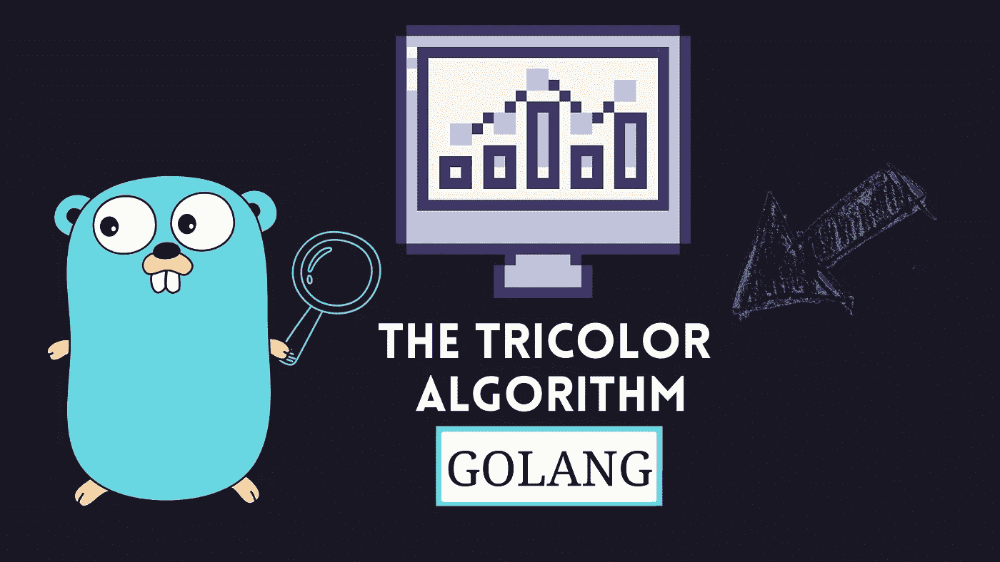

# 围棋三色算法讲解

> 原文：<https://blog.devgenius.io/go-tricolor-algorithm-explained-ec1e7cc20c80?source=collection_archive---------6----------------------->

在这篇文章中，我们将学习三色算法是如何工作的，以及它的工作过程。

Go 垃圾收集器的操作基于三色算法。

请不要以为三色算法不是 Go 独有的，它也可以用在其他编程语言中。

严格地说，围棋中使用的算法的官方名称是三色标记-扫描算法。它可以与程序并发工作，并使用写屏障。这意味着当 Go 程序运行时，Go 调度程序负责应用程序和垃圾收集器的调度。这就好像 Go scheduler 必须处理一个具有多个 goroutines 的常规应用程序一样！

这种算法背后的核心思想来自埃德格·w·迪克斯特拉、莱斯利·兰波特、a·j·马丁、c·s·斯霍尔滕和 e·f·m·斯蒂芬斯，并在一篇名为《动态垃圾收集:合作练习》的论文中首次得到阐述。

三色标记和清除算法背后的主要原理是，它根据算法指定的颜色将堆中的对象分成三个不同的集合。现在是时候讨论每种颜色的含义了。这个黑色集合的对象保证有指向白色集合的任何对象的指针。

然而，白色集合的对象可以有指向黑色集合的对象的指针，因为这对垃圾收集器的操作没有影响。灰色集合的对象可能指向白色集合的一些对象。最后。白色集合的对象是垃圾收集的候选对象。

请不要忘记，没有对象可以直接从黑色集合到白色集合，这允许算法操作，并且能够清除白色集合上的对象。此外，黑色集合中的对象不能直接指向白色集合中的对象。

因此，当垃圾收集开始时，所有对象都是白色的，垃圾收集器访问所有根对象，并将它们涂成灰色。根是应用程序可以直接访问的对象，包括全局变量和堆栈上的其他东西。这些对象主要依赖于特定程序的 Go 代码。

之后，垃圾收集器挑选一个灰色对象，使其变黑，并开始查看该对象是否有指向白色集合中其他对象的指针。这意味着当一个灰色对象被扫描以寻找指向其他对象的指针时，它被涂成黑色。如果扫描程序发现这个特定对象有一个或多个指向白色对象的指针，它会将该白色对象放入灰色集合中。只要灰色集合中存在对象，这个过程就一直持续下去。之后，白色集合中的对象是不可达的，可以拒绝它们的内存空间。因此，在这一点上，白色集合的元素被称为垃圾收集。

请注意，如果灰集的对象在垃圾收集周期中的某个点变得不可达，它将不会在这个垃圾收集周期中被收集，而是在下一个垃圾收集周期中被收集！虽然这不是一个最优的情况，但也没那么糟糕。

在这个过程中，正在运行的应用程序被称为 mutator。mutator 运行一个名为 write barrier 的小函数，每次修改堆中的指针时都会执行这个函数。如果堆中某个对象的指针被修改，这意味着该对象现在是可访问的，那么写屏障会将其着色为灰色，并将其放入灰色集中

变异函数负责不变量，即黑色集合的元素没有指向白色集合的元素的指针。这是在写屏障功能的帮助下完成的。如果不能实现这个不变量，将会破坏垃圾收集过程，并且很可能以一种非常糟糕和不可取的方式使程序崩溃！

Go 垃圾收集也可以应用于通道等变量。当垃圾收集器发现通道不可达时，也就是通道变量不能再被访问时，它将释放其资源，即使通道尚未关闭。

Go 允许您通过放置一个运行时来手动启动垃圾收集。Go 代码中的 GC()语句。但是，请记住运行时。GC()会阻塞调用者，也可能阻塞整个程序，特别是当你运行一个非常繁忙的有很多对象的 Go 程序时。这主要是因为当其他一切都在快速变化时，您不能执行垃圾收集，因为这将不会给垃圾收集器机会来清楚地识别白色、黑色和灰色集合的成员。这种垃圾收集状态称为垃圾收集起始点。

请注意，Go 垃圾收集器一直在由 Go 团队进行改进。他们试图通过减少对三组数据进行扫描的次数来提高速度。然而，尽管进行了各种优化，算法背后的总体思想仍然是相同的。

[我的博客](https://programmingeeksclub.com/)

感谢阅读🙂