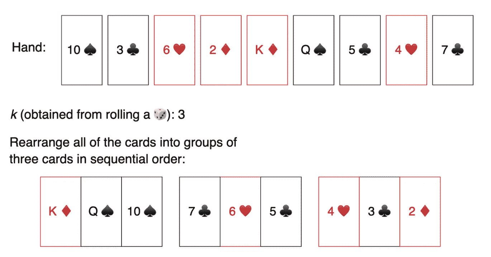
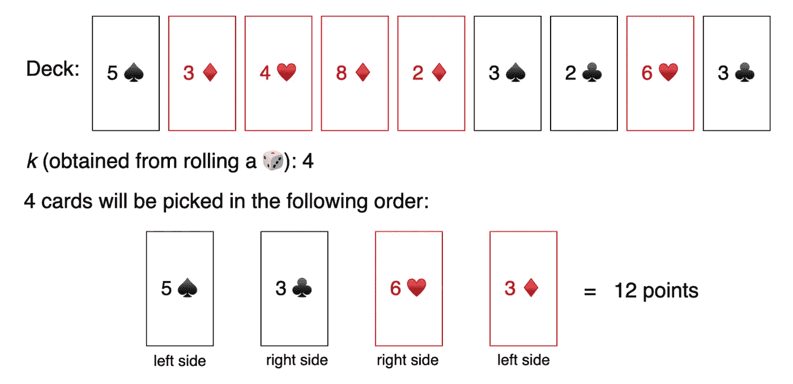

# 围棋教程:用 Golang 构建一个卡牌游戏

> 原文：<https://blog.devgenius.io/go-tutorial-build-a-card-game-with-golang-111cee17ed2?source=collection_archive---------3----------------------->


Golang，或 Go，是许多顶级科技公司使用的流行编程语言。如果你梦想为这些顶级公司之一工作，对他们使用的编程语言有经验是很重要的。学习任何编程语言的最好方法是一头扎进去，获得真实的实践经验。一个可靠的编码项目组合可以帮助展示你在编程语言方面的技能和经验。今天，我们将带您了解一个真实的围棋组合项目。

我们开始吧！

**我们将讲述**:

*   项目描述
*   建筑特色 1
*   建筑特色 2
*   项目总结和相关面试问题
*   后续步骤

# 项目描述

纸牌游戏在全世界都很流行，不同年龄的人都玩不同的纸牌游戏。比方说，你为一家初创公司工作，该公司希望创建一个 web 应用程序来玩不同的纸牌游戏。他们想设计常见的游戏，如扑克和纸牌，也想创造自己独特的游戏。所有的游戏都可以在单人或多人模式下进行。由于会有单人选项，所以你的团队需要创造一个“对手”来对抗用户。

该项目的第一部分包括实现一个功能，帮助用户**玩一种扑克**。你将不得不设计的功能，以便它可以确定是否一个给定的手牌是一手顺子或不是。项目的第二部分包括为一款名为 *Fizzle* 的**定制卡牌游戏**创建一个功能。你将不得不设计的功能，使用户可以找到最大的点，可以通过挑选出一套 10 张随机卡卡。

# 特征

*   **功能 1** :判断是否可以拿到一手顺子。
*   **特点 2** :从一组十张随机牌中找出可以获得的最大点数。现在你知道了背景，让我们开始制作第一个特性吧！

# 建筑特色 1

对于功能#1，我们正在开发一个与一手顺子有关的扑克游戏变体。在传统扑克中，玩家有五张牌(称为 ***手牌*** )。通常，一手顺子牌由五张顺序排列的牌组成，如 *9* 、 *8* 、 *7* 、 *6* 和 *5* 。

在我们新推出的扑克游戏中，数字 k 将由掷骰子决定。如果骰子掷出 1，应该再掷一次。这样， *k* 将始终在 2–6 的范围内。只有在使用给定手牌中的所有牌可以组成 *k* 套牌的情况下，**手顺子**才有可能。

# 例子



在上面的例子中，我们可以看到我们拿到了一手九张牌。骰子掷出一个 3，那么 *k* 就是 **3** 。然后，卡片被分成三组。每组包含三张按顺序排列的卡片。在实现过程中，我们将在一个数组中接收这些卡片，就像`{10, 3, 6, 2, 13, 12, 5, 4, 7}`一样。杰克牌、国王牌和王后牌分别用 11、12 和 13 表示。掷骰子后的数字是整数。如果能形成一手直道，模块应返回`true`。如果不能形成一手顺子，就应该返回`false`。

# 解决办法

解决方案背后的共同直觉是尝试和**形成大小为*k** *的组，从最低的牌开始。一旦确定了最低的牌，只有最低的牌在*k 大小的*组的底端，才有可能拿到一手顺子。例如，如果 *k* 是 *4* ，最低的牌是 *2* ，我们知道该组将是 *2、3、4、5* 。如果我们找不到这一组，这手牌就不是顺子牌。

让我们开始编写特性代码吧！我们将把解决方案分成几个步骤。在我们开始之前，我们需要导入适当的包，这样我们可以在最后测试我们的代码。

```
package main
import (
  "fmt"
  "sort"
)
```

**第一步**:设置功能。

```
func isHandOfStraights(hand []int, k int) bool{
```

**第二步**:检查手中的牌数是否能被 *k* 整除。如果没有，我们就不能创建组，所以返回`false`。

```
 if len(hand) % k != 0{
    return false
 }
```

**第三步**:统计给定手牌中每张牌的出现次数。

```
 count := make(map[int]int)
 for _, i := range hand{
   count[i] = count[i] + 1
 }
```

**第四步**:对列表进行排序，从排名最低的卡片开始遍历。我们可以使用哈希映射，将卡号存储为键，将出现次数存储为值。

```
 sort.Ints(hand)
 i := 0
 n := len(hand)
```

**步骤 5** :使用运行 *k* 次的嵌套循环。

```
 for i < n {
       current := hand[i]
       for j := 0; j < k; j++ {
```

**步骤 5.1** :检查当前卡片和下一张 *k-1* 卡片(按升序排列)是否在`count`地图中。如果不存在，返回`false`。

```
 if _, ok := count[current + j]; !ok || count[current + j] == 0 {
       return false
}
```

**步骤 5.2** :当找到每张需要的卡片时，减少其在`count`中的出现次数。

```
 count[current + j]--
    }
```

**步骤 5.3** :找到一个完整的组后，使用 while 循环找到下一个组的最小卡片，并确定`count`中的下一张卡片的出现次数是否超过零。

```
 for i < n && count[hand[i]] == 0{
          i++
       }
    }
```

**第 6 步**:如果所有卡片都被分类成组，返回`true`。

```
 return true
}
```

现在，让我们用两只手来测试我们的功能。

```
package main
import (
  "fmt"
  "sort"
)
func isHandOfStraights(hand []int, k int) bool{
    if len(hand) % k != 0{
        return false
    }

    count := make(map[int]int)
    for _, i := range hand{
        count[i] = count[i] + 1
    }

    sort.Ints(hand)
    i := 0
    n := len(hand)

    for i < n {
        current := hand[i]
        for j := 0; j < k; j++ {
            if _, ok := count[current + j]; !ok || count[current + j] == 0 {
                return false
            }
            count[current + j]--
        }
        for i < n && count[hand[i]] == 0{
            i++
        }
    }
    return true
}

func main() {
    hand := []int{5,2,4,4,1,3,5,6,3}
    k := 3
    fmt.Println(isHandOfStraights(hand, k))

    hand2 := []int{1,9,3,5,7,4,2,9,11}
    k = 2
    fmt.Println(isHandOfStraights(hand2, k))
}

=> true
=> false
```

# 建筑特色 2

对于第二个功能，我们正在开发一款名为 *Fizzle* 的定制卡牌游戏。在这个游戏中，庄家洗一副牌，然后将所有面朝上的牌展开。然后，玩家轮流掷骰子。摇出来的数字是 *k* 。然后玩家将轮流从这副牌中**取出 *k* 张**牌，但他们只能从牌的左侧**或右侧**中选择牌。目标是选出分数最高的牌。每张牌都有与其号码相对应的分值，正面牌:杰克、皇后、国王和王牌分别有 11、12、13 和 14 分。

我们想为 *Fizzle* 玩家创建一个功能，该功能分析该副牌的当前状态和玩家掷出的数字，并且**决定玩家在该回合可以获得的最高分数**。

# 例子



在上面的例子中，玩家选择卡`5`、`3`、`6`和`3`来获得可能的最大点数。在实现过程中，我们会得到一副数组形式的卡片，就像`{5, 3, 4, 4, 2, 3, 4, 6, 3}`。我们掷骰子后得到的数字将作为整数给出。该模块应该返回整数形式的最大点数。

# 解决办法

为了实现这一功能，我们需要测试**每一种可能的组合**，在这些组合中 *k* 张牌可以从左侧或右侧从这副牌中取出。我们不能从右边(或左边)挑第*n *张牌，除非从右边(或左边)挑第(*n* — 1)张牌。如果我们从右边选了 1 张 k — 1 张，那么从左边选 1 张，以此类推。我们可以通过**找到所有可能的组合，假设滑动窗口**的大小为 *k* 从右向左环绕。输出将是通过尝试所有可能的组合找到的最大和。

让我们开始编码这个特性吧！我们将把它分成几个步骤。在我们开始之前，我们需要导入适当的包，这样我们可以在最后测试我们的代码。

```
package main
import (
  "fmt"
  "math"
)
```

**第一步**:设置功能。

```
func maxPoints(deck []int, k int) int{
    left := 0;
    right := len(deck) - k
    var total, best int
    total = 0
```

**第二步**:假设右边的 *k* 牌给我们最大点数。

```
for i := right; i < len(deck); i++ {
        total += deck[i]
    }
    best = total
```

**步骤 3** :使用运行 *k* 次的循环，测试所有组合。

```
 for i := 0; i < k; i++ {
```

**第四步**:去掉右边卡片的点，加上左边的点。

```
 total += deck[left] - deck[right]
```

**第五步**:将`total`点与当前`best`点进行比较，保留最大值。

```
 best = int(math.Max(float64(best), float64(total)))
        left++
        right++
    }
    return best
}
```

现在，让我们用一副样板来测试我们的功能。

```
package main
import (
  "fmt"
  "math"
)
func maxPoints(deck []int, k int) int{
    left := 0;
    right := len(deck) - k
    var total, best int
    total = 0
    for i := right; i < len(deck); i++ {
        total += deck[i]
    }
    best = total
    for i := 0; i < k; i++ {
        total += deck[left] - deck[right]
        best = int(math.Max(float64(best), float64(total)))
        left++
        right++
    }
    return best
}

func main() {
    deck := []int{5,3,4,4,2,3,2,6,3}
    k := 4
    fmt.Println(maxPoints(deck, k))
}

=> 17
```

# 项目总结和相关面试问题

恭喜你。你坚持到了项目结束。在整个项目中，我们学习了如何:

*   通过按**连续顺序**对牌进行分组，建立一个可以识别一手顺子的功能
*   使用**滑动窗口技术**构建一个功能来查找具有最大分值的牌

我们今天解决的问题也是顶级科技公司面试中常见的问题。在我们有了构建项目的经验之后，您现在可以识别具有相同模式的问题，并使用我们今天实现的技术来解决这些问题。让我们来看看几个与**相关的面试问题**，我们可以用类似的方法来解决:

*   将数组分成 K 个连续数字的集合
*   从数组的任意一端找出最大和

# 后续步骤

构建一个强大的编码组合可以让你亲身实践真实世界的软件开发问题。作为一名 Go 开发者，强大的产品组合是让你在竞争中脱颖而出的好方法。我们今天只完成了一个项目，但是还有更多真实世界的项目，你可以继续工作，以了解更多关于软件开发世界的知识，并帮助你更好地准备你的 Go 面试。一些更多的项目想法包括:

*   改善用户在网飞上查找观看内容的体验
*   为 Google 日历实现生产力增强功能
*   优化亚马逊上面向客户的功能

*快乐学习！*