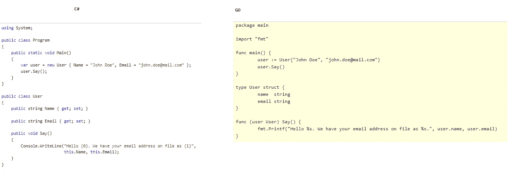

# go-使用函数的各种方法

> 原文：<https://blog.devgenius.io/go-various-ways-to-use-functions-e89e073f7570?source=collection_archive---------6----------------------->


琼·加梅尔在 [Unsplash](https://unsplash.com/s/photos/functions?utm_source=unsplash&utm_medium=referral&utm_content=creditCopyText) 上的照片

我最近开始涉猎 go 语言，我对该语言中函数的大量使用方式印象深刻！这个故事探讨了这个问题。我开始这一旅程的一些原因是为了更好地理解#kubernetes 源代码，不仅如此，我现在已经赶上了 GO，因为这种语言非常简单。

go 中的函数可能有也可能没有返回类型。如果 go 中的函数没有返回类型，它将遵循以下模式:

```
func theFuncName(param1 data-type, param2 data-type) { // ...}
```

另一方面，如果有返回类型，它遵循下面的模式。

```
func theFuncName(param1 data-type, param2 data-type) return-data-type { // ...}
```

所以，现在让我们开始探索可以在 GO 中编写的各种类型的函数。我将简要地讨论一下我对使用函数的每一种方法的理解。

1.  **一个简单的功能**

第一种类型是带有返回值的函数的最简单版本。这个函数称为 simpleFunc，它接受两个整数 x 和 y 作为参数，并返回这两个数字的和作为结果。

**2。命名函数**

在这种类型中，返回值是预先命名的。除此之外，它类似于第一种方法

**3。返回多个值**

GO 的一个有趣特性是能够从一个函数返回多个值。这个例子说明了。在这种情况下，3 个数字被传递给称为多值的函数，它们被平方，所有的结果立即返回！

请注意，返回类型被指定为(int，int，int)是为了表明该函数一次返回 3 个值。

**4。返回多个值，名为**

这个方法类似于前面的方法，唯一的不同是返回值被命名为。

**5。可变函数**

如果你来自 C#世界，你已经熟悉这种类型的函数，它们被称为可变参数数量。不过，可变函数听起来更酷:-)

在这种情况下，函数 variadicFunc 接受可变数量的整数，由 **nums …int** 表示。GO 中的“…”表示一个范围，在这种情况下是整数范围。因此，for 循环用于遍历并相加每个数字，以得出所有传递的数字的总数。注意 for 循环中的 _，n。第一个参数是索引，第二个参数是数字本身。在这种情况下，我不关心索引，所以我使用 _ 来丢弃它。

**6。作用于结构的函数**

作用于对象的函数也可以称为“方法”。如果你来自 C#世界，你一定很熟悉 POCO's 这个词，它是普通老式 C#对象的简称。在 GO 的例子中，结构被用来实现同样的功能。还要注意，C#也有结构。这个函数演示了如何定义一个函数来作用于一个结构的实例。

在这个例子中，定义了一个名为 **SomeStruct** 的结构。现在，**using a point**是一个旨在对 **SomeStruct** 的实例进行操作的函数。这种函数的格式是:

```
func (var-name *struct-name) theFuncName(param1 data-type, ...) return-type { // ...}
```

这种方法的一种变体是定义一个不使用指向结构的指针的函数。在这种情况下，可以在不使用 new 的情况下创建结构的新实例，如下所示:

```
someStruct := SomeStruct{"John Doe"}
```

下面是 C#和 GO 的横向比较。在这两种情况下，都有一个用户类/结构和一个对类/结构的属性进行操作的方法。我从另一个媒体帖子中获得了这个灵感，一旦我再次找到它，我会链接到它。



**7。函数返回函数**

GO 函数也可以返回类似于变量的函数。在 C#的世界里，你可以把这想象成返回一个**Action<T>或者一个 **Func < T，V>。****

如果你注意到的话，函数定义的编写方式仍然适用。然而，在这种情况下会返回一个函数。即 **func(int，int) int** 。接受两个整数并返回一个整数的函数。请注意，返回的函数不包含名称。

**8。匿名函数**

GO 还有匿名函数，可以同时定义和调用。在这种情况下，一个函数只需打印一条消息，然后一次性定义并调用它！

**9。延期功能**

对 **defer** 关键字的支持是我最喜欢的 GO 语言之一。defer 关键字可用于标识函数运行结束后必须运行的内容。多酷啊。！

考虑这样一种情况，您正在打开一个文件进行读/写。假设这个程序永远不会终止。鉴于此，如果读/写该文件的函数必须关闭该文件。如果没有完成，其他试图读/写该文件的程序将会失败。发生这种情况的原因是，如果开发人员在函数快结束时忘记关闭文件。在 GO 中使用 defer 关键字可以很容易地避免这种情况。

例如，考虑下面的函数:

```
package mainimport "fmt"func main() {
 defer fmt.Println("I am done!")
 fmt.Println("This is the first line")
 fmt.Println("This is the second line")
 fmt.Println("This is the third line")
}
```

该函数的输出如下所示。注意我是如何完成这一行的！仅在**主**功能中的所有内容执行完毕后打印。

```
This is the first line
This is the second line
This is the third line
I am done!
```

下面的例子还演示了关键字 **defer** 的行为。

10。异步功能

这是我在 GO 语言中的另一个最爱。如果你来自 C#世界，你必须熟悉 **async/await** 模式来编写异步代码。在 GO 语言中使用**同步**包也可以达到同样的效果。

考虑下面的例子。

在第 8 行有一个类型为 **sync 的变量。定义了 WaitGroup** ，称为 **wg** 。第 12 行使用 Add 函数表示 1 函数将异步启动，稍后将使用 **Wait** 方法等待该方法完成。 **go** 关键字用于指示函数 **asyncFunc** 必须异步执行，如第 14 行所示， **Wait** 方法用于异步方法完成。

还要注意 defer 关键字是如何使用由 **WaitGroup** 提供的 **Done** 方法来表示完成的。

11。传递一个函数指针

在这种类型中，对变量的引用通过使用&来传递。我学到的一件有趣的事情是，与 C/C++不同的是，问题中变量的地址不是被发送，而是它的一个副本。

12。将切片传递给功能

这种类型处理两种不同类型的整数数组——一种大小不固定，另一种大小固定。在固定整数数组的情况下，值就地更新

13。参考通过

Go 有个叫 maps 的东西，类似于 C#里的字典。要在 GO 中定义一个字符串和整数的字典，您可以执行以下操作。

```
items := map[string]int{ "coins": 1, "pens": 2, "chairs": 4 }
```

映射稍有不同，因为传递映射传递的是有问题的变量的地址，而不是类型 11 中提到的副本。

14。将函数作为参数传递

这是 GO 语言提供的另一个很酷的特性。就像函数如何返回函数一样，GO 中的函数也可以将函数作为参数。

在这个特殊的例子中， **squareFunc** 接受一个整数并通过平方输入返回一个整数，它作为参数传递给另一个也接受整数的函数。 **f func(int) int** 参数是被传递的函数，它可以像任何其他 GO 函数一样被调用

15。关闭

GO 中的闭包是匿名函数，也可以自动保存对定义在其主体之外的变量的引用

最后，这里是包含所有功能的要点。

我是围棋界的新手，所以如果我有什么错误，请留言告诉我。感谢阅读！