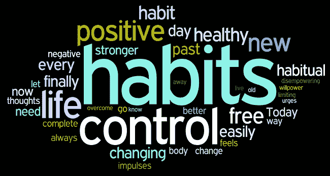
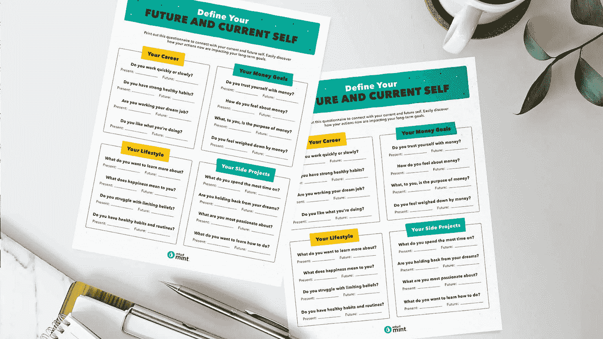
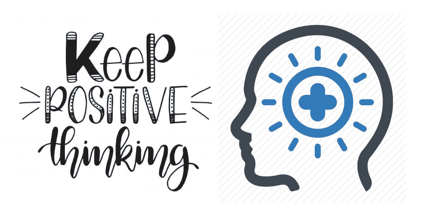

# 目标设定对你不起作用？试试这 8 种选择

> 原文：<https://blog.devgenius.io/goal-setting-doesnt-work-for-you-try-these-8-alternatives-7a3cf34a2992?source=collection_archive---------5----------------------->

[**来源**](https://prolifiko.com/obstacle-thinking/)

你是那种定义了目标却努力去实现的人吗？你并不孤单。许多人发现**目标设定**很难，因为它并不适用于每个人。

你为什么允许自己失败？答案因人而异。一些最普遍的是:

*   目标不明确
*   设定遥不可及的目标
*   只定义长期目标
*   将你的目标以消极陈述的形式表达出来
*   没有任何方法可以让你负责
*   当你犯错时，你会变得气馁
*   你不承认你的成就

此外，目标很难转化为日常行动，我们中的一些人不会记录每天的进展。

但是，不用担心。

有许多方法可以确保你到达你想去的地方，这八种目标设定的替代方法将确保你找到最适合你的方法。无论你喜欢渐进式方法还是更全面的方法，这些想法都可以帮助你朝着正确的方向前进。

今年尝试几个，一定要尝试，这样你才能找到最适合你的需求和目标的！

# **目标设定的 8 大备选方案**

## **1。任务列表**

[**来源**](https://flow-e.com/blog/google-task-list/)

虽然有些人喜欢设定目标，有些人喜欢写清单，但这里有一个结合两者的方法。首先列出你今年所有的短期和长期目标。然后添加其他你需要完成的日常任务。关键是不要强迫自己检查任务；如果一项任务能在不到五分钟的时间内完成，就应该立即完成。如果需要更长时间，那就把它安排在你的“要做的事情”清单上。

每天至少做一项每一类的任务(如果可能的话，做更多)。如果你已经落后或者开始做一些与最初计划完全不同的事情，那没关系！

这只是意味着在那段时间里有其他更重要的事情，这可能不会经常发生。是的，有时工作或家庭中会出现问题或变化——当它们发生时，回去并相应地安排任务，直到事情恢复正常。

只要有可能，试着在日历上(在线的或实体的)专门为商业计划安排时间，这样你就不会因为个人承诺而分心。

## **2。每周评论**

[**来源**](https://dansilvestre.com/weekly-review/)

每周回顾是检查你的进展并确保你正在实现目标的好方法。一开始很容易有动力，但随着你越来越接近实现目标，你可能会发现保持动力越来越难——一旦你实现了目标，就很难不沾沾自喜。

这正是每周评论如此重要的原因；通过记录你走了多远，以及你是否朝着你的目标取得了进展，每周回顾通过不断提醒你需要做什么和完成什么来激励你。

设定最适合你的时间长度也很重要。许多人选择设定太长或太短的目标，这都会带来麻烦。如果你选择了一个太长的目标，很容易在完成之前就筋疲力尽并放弃——你可能对达到目标感觉很好，但如果花费的时间比预期的长，那就可能虎头蛇尾。

## **3。养成迷你习惯**

[**来源**](https://www.9skips.com/create-mini-habits-to-build-habits/)

我们最喜欢的建立新习惯的方法之一是把它们变成小习惯。小习惯迫使你通过保持小目标来发展自律。如果你尝试某事太难，太快，然后因为太大而放弃，那不是失败。这是一个教训。

所以，如果你觉得设定目标对你不起作用，你不能控制自己过度沉迷于某些事情或行为——试着用迷你习惯来代替！在一张纸上写下五件事，并确保这些是你当天唯一的任务！在每项任务完成之前，不要让其他任务或义务发挥作用！

但是我们知道这不是每个人都能做到的。有些人的生活需要更多的结构。如果你是这些人中的一员，试着使用一个清单！从一个小目标开始，每天列一个清单，直到你完成它。这种方法非常适合那些想确保自己成功设定目标，但又不想被目标压垮的人。就像有一张纸，上面写着，你能行！每一天都要保持足够的灵活性，对自己现实一点。如果查看清单是你经常做的事情，一定要在手机或其他设备上设置提醒，这样你就可以专注于需要完成的事情，而不是分心。

## **4。自我日志**

[**来源**](https://mint.intuit.com/blog/how-to/future-self-journaling/)

当成为一个更好的自我管理者时，写个人日记会非常有帮助。当你留意自己的行为和想法时，它会让你反思自己，以帮助激励行为的改变。一些人用纸和笔写日记，而另一些人更喜欢用手机或电脑。方法由你决定！

**尝试按照以下步骤开始:**

(a)诚实地列出你目前的行为和品质

(b)确定需要改进的领域

(c)每次选择一个领域进行改进

(d) **设定足够具体的目标**来衡量进展

请你信任的朋友和家庭成员指出你拥有的积极品质。与你亲近的人可以成为反馈和洞察你优势的绝佳来源。一旦你发现了一些好的品质，想想你如何扩展它们或者将它们付诸行动。像设定目标一样，自我分析会帮助你成为更好的自我管理者。

试试最好的**在线时间报告**工具结合 **GPS 时间追踪**让你在任何地方以最简单的方式领先于你的目标。

## **5。构建您的愿景板**

[**来源**](https://www.elizabethrider.com/how-to-make-a-vision-board-that-works/)

设定目标最有力的替代方法之一是使用愿景板。网上有很多文章解释如何创建一个，但简而言之，这是你的梦想和愿望的视觉表现——贴在海报上，用文字和图片直观地传达你想从生活中得到什么。这是一个神奇的方法，把你对自己的所有希望都集中在一个地方！然后，每次你看着它，你都会有一种愉快的感觉，知道如果你足够努力，这些事情就会发生。

这里有一个关于愿景板的大秘密:那种温暖模糊的感觉实际上是你的大脑在释放内啡肽，因为你在给它一些具体的目标。看，当我们设定一个目标时，我们只是在我们的头脑中建立了一个期望，即需要发生什么才能让我们达到期望的状态。

## **6。关注意图而非目标**

[**来源**](http://willpowerpersonaltrainer.com/setting-intentions-instead-of-goals/)

根据心理学家的说法，专注于你的意图比目标更能帮助你完成你想要的。意图创造了自我决定的正反馈循环。如果你在实现目标上有困难，试着专注于你的意图:写下你打算做什么，以及你打算什么时候去做。例如，下周我将每天下午 4-5 点举重。

意图比**目标设定**更实质，因为你定义了它，强调了坚持。不要专注于你是否达到了目标——专注于保持你的意图！这也能增加追求其他目标的信心。

## **7。保持积极的心态**

[**来源**](https://www.superthirty.com/importance-of-positive-thinking)

如果你有积极的态度，没有什么能阻止你达到目标。有些人纠结于他们的**目标设定**和**目标跟踪**，因为他们过于担心可能会出错，并把自己置于失败前的心态。预料障碍，尽可能处理好；如果有必要，根据这些障碍调整你的计划。即使一切都按计划进行，也会有障碍需要克服——但是积极思考有助于在它们出现时变得更容易管理。

不要忘记你正在努力的目标，并且要注意积极的态度可以帮助你保持正确的方向。最好的方法是监控你的进步，写下你的目标，让你可以很容易地看到你已经走了多远。

## **8。为成功制定步骤**

[**来源**](https://www.youtube.com/watch?v=9nB3d4TY6ns)

有一个行动计划。但更重要的是，要有一个游戏计划。写下你成功的步骤，并付诸实施以实现每个目标。在此基础上，你可以规划出何时开始实现每个目标，以及成功所需的资源或工具。这将有助于确保你的目标保持在正确的轨道上，同时也保持事情的乐趣！

确保你为每个目标设定了一个时间框架，如果在你前进的道路上有任何你想要实现的里程碑，确保这些都包括在内。你还应该包括完成每个目标所需的资源或工具。有一个成功的游戏计划将会让你(和其他人)更容易知道你的目标是什么，事情是如何进展的。你甚至会发现，记录进步本身就是一种激励！

# **收尾思路**

那么，如果目标设定对你不起作用，你该怎么办？幸运的是，有很多选择。我们在这里列出的八个是一个很好的起点。试一试，看看哪些最适合你。然后不断完善和适应，直到你找到帮助你实现最大目标的系统。

为了快速实现你的商业目标，你也可以尝试一下 [**在线时间管理软件**](https://www.workstatus.io/best-time-tracking-software-online?utm_source=guest-post&utm_medium=devgenius-rn&utm_campaign=RN) ，它可以为你提供**实时报告**你日常工作和任务的完成情况，而无需设定任何目标。

简单地输入你需要做的任务，然后在你完成时核对。它会自动计算你的生产力分数，这样你就可以看到你每天做得有多好。此外，它还有内置工具，如带 GPS 的[**时间跟踪器**](https://www.workstatus.io/best-gps-time-tracking-software-online?utm_source=guest-post&utm_medium=devgenius-rn&utm_campaign=RN) 和进度条，帮助你保持专注和动力。

所以，如果你正在寻找一个目标设定的替代方案，那么看看这里最好的时间管理软件。

感谢阅读！！