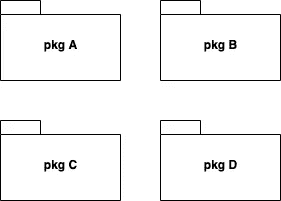
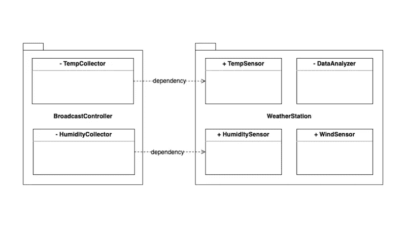

# 上帝的视觉 UML 中的包图

> 原文：<https://blog.devgenius.io/gods-vision-the-package-diagram-in-uml-2981f14299b4?source=collection_archive---------10----------------------->

# 上帝的远见

我记得几个月前发表的一篇文章描述了一个复杂系统的属性。其中之一是“**相对本原**”，这表明从观看者的视角来看，存在不同层次的抽象。

同样，当我们试图描述对象之间的交互时，有必要使用一些工具来帮助我们了解总体情况。在 UML 中，我们通常应用“T4”包的概念来描述软件开发中最大的对象。

# 定义

> 一个包图代表了分组的 UML 元素和基本要素:符号、可见性和依赖性

作为 UML 最大的抽象符号，包中包含了不同的元素。它可以揭示元素的可见性，让其他协作包知道它可以提供什么样的功能来满足需求。

此外，可见性意味着元素之间的依赖关系，因此我们可以扩展包之间的连接来描述系统的范围。简而言之，包图帮助开发人员快速了解项目的概况，它描述了抽象的最高层次；以有效的方式深入细节。

# 包装图的要点

在我看来，一个包图需要解决三个要素:符号、可见性和依赖性。每一个都展示了我们如何识别它的属性以及与其他物体的相互作用。

*   **符号**

如果你看一下 [draw.io](https://github.com/jgraph/drawio) 中的 UML 图，它被表示为一个**矩形，左上角有一个标签**，如下所示。

*   **能见度**

通常来说，一个包包含了其内部的各种对象；它必须向外部元素公开一些内部属性才能访问。因此可见性成为我们需要考虑的另一个话题。通常，我们会使用加号/减号(+/-)来表示一个属性是否可访问。

" **+** ":表示属性是公共的，对包含的包以及相邻的包可见。
" **-** ":表示一个属性是私有的，除了包含包之外，对相邻包不可见。

以上图为例，有两个包: **BroadcastCollector** 和 **WeatherStation** ，每个包都包含几个标记为 public/private to others 的类。在气象站中，它公开了 **TempSensor** 和**moisture sensor**类，供其他外部元素访问它们的服务。

相反，类 **DataAnalyzer** 仅对其包含的包可见，这意味着它的服务只能由内部元素访问。

*   **属地**

同样，可见性也意味着可能的依赖性。例如，**湿度采集器**依靠**湿度传感器**提供数据显示在屏幕上，这意味着前者依赖于后者。

它在某种程度上定义了客户和供应商之间的“合同”。元素 A 依赖于元素 B，在 UML 中，我们用一条带开放箭头的虚线来描述它们之间的关系。虚线的尾部代表客户，而空心箭头代表供应商。

# **蔻驰的低语**

学术理论和实际实践一样重要。这些天我不仅在读这本书:[面向对象的分析和设计及其应用](https://www.amazon.com/Object-Oriented-Analysis-Design-Applications-3rd/dp/020189551X)，而且还在寻找合适的材料来体验如何在这些工程方法的帮助下设计一个系统。

有些人可能会说 OOAD 已经过时了，应该被抛弃，并尝试采用其他方法来代替。然而，在你真正进入这个领域之前，永远不要低估它对你的影响；自己操作所有的知识。

作为一名敏捷教练，我必须承担起责任，在任何可能的领域汲取帮助团队成长的核心方法。

—

如果你认可我与你分享的价值，请做如下:
1。**拍**条
2。**订阅**我最新内容
3。**在其他平台关注**我了解更多信息
-IG:[@ ur _ Agile _ coach](https://www.instagram.com/ur_agile_coach/)
-播客(中文):[敏捷火箭](https://player.soundon.fm/p/7f7dc3df-d738-405c-8cf9-02157a92ec61)
- Youtube: [你的敏捷蔻驰](https://www.youtube.com/channel/UCzD0wQmD1n4MuTKk-JocACA)
- LinkedIn: [吴宗祥](https://www.linkedin.com/in/tsung-hsiang-wu-8542409b/)

如果您需要咨询或其他形式的合作，请发送邮件至:**urscrummaster@gmail.com**