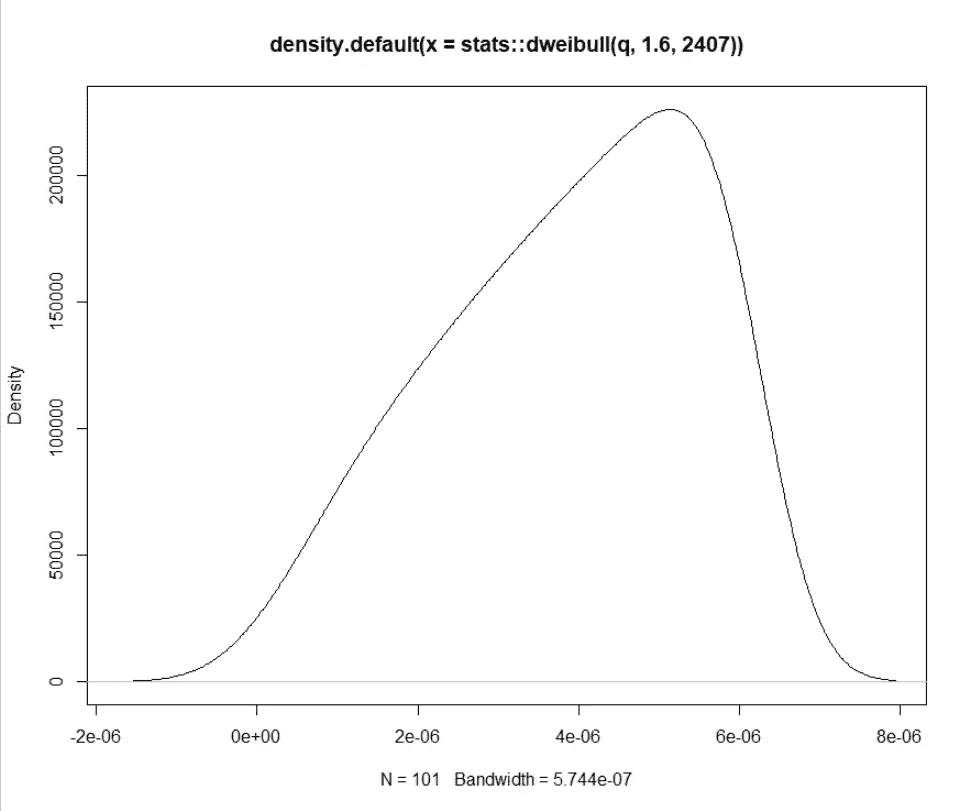
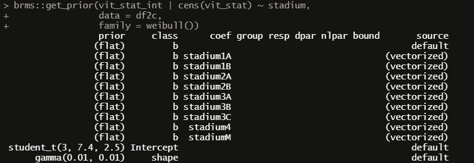
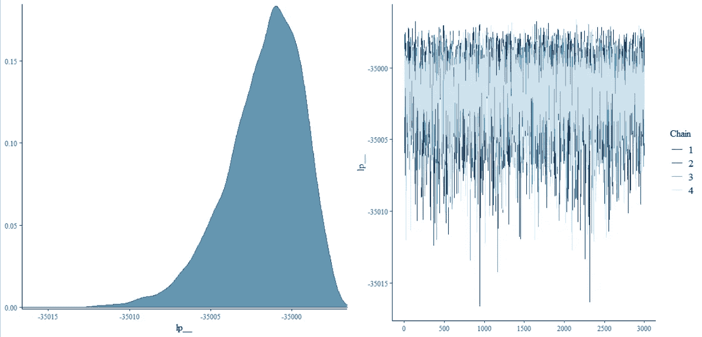
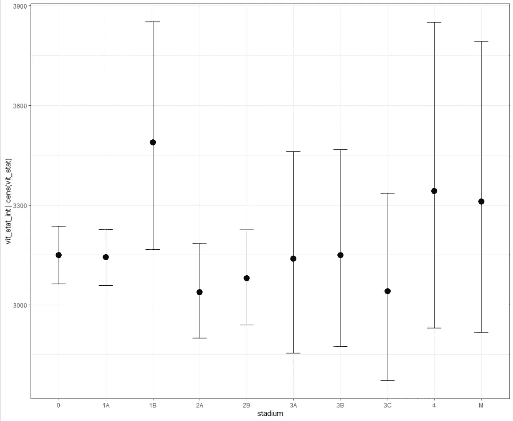

# 超越考克斯

> 原文：<https://blog.devgenius.io/going-beyond-the-cox-8503b6d358b6?source=collection_archive---------6----------------------->

## 使用合成乳腺癌数据的贝叶斯参数生存模型

我目前正在做一个项目，在这个项目中，我将贝叶斯方法应用于时间-事件数据，这将产生一个参数模型。我在过去已经发布了许多关于贝叶斯方法的例子，也展示了如何在 SAS 和 r 中应用生存模型。参数模型也是其中的一部分。

现在，我在处理上述项目时感到兴奋的是，样本量很小，这使得贝叶斯模型非常适合应用，因为它们是知识构建的数学框架。给定已知的先验，可能性的样本大小的影响要比只对数据本身应用可能性估计的影响小得多。

我不能透露我正在研究的事件发生时间数据，但我也在过去的[中发表了一篇关于荷兰癌症登记处的文章，他们综合了他们的数据:](https://pub.towardsai.net/analysis-of-a-synthetic-breast-cancer-dataset-in-r-1aba3cfe5a87)

> 这篇文章是关于我分析一个包含 6 万乳腺癌患者记录的合成数据集。这是真实的数据(就结构而言)，但没有泄露任何患者隐私。你可以请求数据的网站可以在这里找到并且是荷兰语的。这方面的伟大之处在于，这些数据集不仅允许我们在不知道患者是谁的情况下分析患者数据，还允许我们在具有临床结构的数据上测试新的算法或方法。因此，如果你在合成数据上开发一些东西，它肯定会在(新的)病人数据上有价值。

这个合成数据不是小样本问题的例子，但它确实表明，拥有大量数据并不会使建模变得容易得多。这里我想展示的是应用贝叶斯和参数生存方法的框架。现在，我在最初的帖子中也这样做了(不是贝叶斯部分，但我应用了参数部分)，最后我没有进一步使用参数模型:

> 因此，参数生存模型并没有真正给我带来什么，也许数据对这种建模来说并不太好。乳腺癌的存活率很高，参数化的存活率模型远远超出了现有的数据。很可能太远了。所以，让我们坚持我们所拥有的，并达成协议。

我重新做这个的原因不是因为我想展示我这次是否能以贝叶斯的方式做这件事(我已经做了，我们会看到，当时的评估仍然有效)，这需要我更深入地研究参数模型本身，但也将向你展示研究有多困难。在完美的世界中，有一个完美的旧知识库，我可以从中获取新模型的超参数。

那是完美的世界。我们生活在一个不完美的世界里。

让我们开始吧！

```
library(readxl)
library(DataExplorer)
library(survival)
library(survminer)
library(tidyverse)
library(brms)
library(tidybayes)
library(ggplot2)
library(knitr)
library(ciTools)
library(dplyr)
library(purrr)
library(ggfortify)
library(rstanarm)
```

以上只是我加载的一些库。我从一开始就加载像 *dplyr* 这样的库，因为它们以后会给我带来问题，但是随着时间的推移，我发现将库和函数一起加载更有用。读者不仅可以看到我使用的是什么库，而且还避免了不同包之间功能冲突的问题。我还没有完善这种艺术，所以请与我共勉。

好的，我们正在处理事件时间数据，所以我们需要事件，事件时间和感兴趣的因素，如果我们感兴趣的话。就像我说的，数据是合成的，在 4000 天似乎有一个硬停，也就是 11 年左右。

```
df<-IKNL%>%
  dplyr::filter(vit_stat_int>0)
plot(density(df$vit_stat_int))
ggplot(df, aes(vit_stat_int, 
               fill=factor(vit_stat)))+
  geom_density(alpha=0.5)+
  theme_bw()
```


事件的时间范围从 0 到 4000。在经历( **vit_stat = 1** )和没有经历( **vit_stat = 0** )该事件的人之间存在分布差异

让我们对生存数据进行建模。

```
f1 <- survfit(Surv(vit_stat_int,vit_stat) ~ 1, 
              data = df)
ggsurvplot(f1, data = df,
           conf.int = TRUE,
           risk.table = TRUE,
           xlab = "Days", 
           ylab = "Overall survival probability",
           ggtheme = theme_bw())
```


这是迄今为止我见过的最奇怪的生存曲线，但话又说回来，有近 6 万人包括在内。

上面曲线的奇异性是截尾的一个直接函数。事实上，有如此多的审查在进行，以至于这条曲线一点也不像生存曲线。让我们删除被审查的数据，只保留那些有事件的数据。这很可能会在以后的分析中伤害我们(因为我们将有一组经历过或没有经历过该事件的人，即使他们有相同的预后标记)，但现在我没有。这篇文章不是要解决这个难题，而是向你展示一种接近它的方法(完全知道它并不完美)

```
df2<-df%>%
  dplyr::filter(vit_stat==1)f2 <- survfit(Surv(vit_stat_int,vit_stat) ~ 1, 
              data = df2)
ggsurvplot(f2, data = df2,
           conf.int = TRUE,
           risk.table = TRUE,
           xlab = "Days", 
           ylab = "Overall survival probability",
           ggtheme = theme_bw())
```


这看起来更像一条生存曲线。在这个过程中，我们还删除了大约 48k 的观察。

我们可以重新使用这个新的数据框架，并根据肿瘤分期进行生存分析，这是我们将关注一段时间的事情。这种选择在一定程度上是随意的，但仍然具有教育意义，因为肿瘤分期将会分割曲线，并为我们提供了一个更详细地观察威布尔参数模型的机会。选择威布尔分布的原因是，尽管它非常有限，因为它在过去经常被使用(并且总是发现非常有限)。

```
f3 <- survfit(Surv(vit_stat_int,vit_stat) ~ stadium, 
              data = df2)
ggsurvplot(f3, data = df2,
           conf.int = TRUE,
           risk.table = TRUE,
           xlab = "Days", 
           ylab = "Overall survival probability",
           ggtheme = theme_bw())
```


这张非常好的图显示了随着时间的推移，每个肿瘤阶段的存活概率都在下降。到目前为止，Stage=0 非常突出，其余的阶段显示出一些重叠。几乎所有阶段在 11 年时似乎都达到零概率，这将意味着现在长期乳腺癌幸存者是可能的。在我看来，这似乎不太可能。

最简单的“建模”方法是选择一系列模型，从非常简单的(如指数模型)到更高级的(如广义伽玛模型)，然后看看哪一个“最适合”。这不是真正的建模，但也不是胡说八道。

```
fs1<-flexsurv::flexsurvreg(Surv(vit_stat_int,vit_stat) ~ stadium, 
                             data = df2,
                             dist = "weibull")
fs2<-flexsurv::flexsurvreg(Surv(vit_stat_int,vit_stat) ~ stadium, 
                        data = df2,
                        dist = "exponential")
fs3<-flexsurv::flexsurvreg(Surv(vit_stat_int,vit_stat) ~ stadium, 
                        data = df2,
                        dist = "lognormal")
fs4<-flexsurv::flexsurvreg(Surv(vit_stat_int,vit_stat) ~ stadium, 
                        data = df2,
                        dist = "gamma")
fs5<-flexsurv::flexsurvreg(Surv(vit_stat_int,vit_stat) ~ stadium, 
                        data = df2,
                        dist = "gengamma")
AIC(fs1,fs2,fs3,fs4,fs5)
par(mfrow = c(2, 2)) 
plot(fs1)
plot(fs3)
plot(fs4)
plot(fs5)
```


考虑到它可以携带的参数数量，可以预料到,**广义伽玛**的性能最好，但是**威布尔**次之，所以我们将使用它。


黑色显示观察线，红色显示预测线。没有为顶部的 Stage=0 线准备模型，该线仅在大约前三年后开始出现第一个死亡率。这并不奇怪，因为分布模型(参数模型)只能使用这么多参数。

让我们更深入地研究威布尔模型。我将在后面的阶段对这个模型做更多的解释，但是现在最好意识到它的功能有两个参数(形状和比例)。我们还会看到，不同的 R 函数显示不同的输出，这并不总是很容易辨别这个模型的行为。

一种快速查看它的方法是使用 [PQRS](https://pqrs.software.informer.com/) 工具，这种工具又快又脏(但最终也使事情变得不容易，因为这里比例=a，形状是 b。在许多其他符号中，比如在[维基百科](https://en.wikipedia.org/wiki/Weibull_distribution)，你会发现不同的符号(lambda 和 kappa)，这还不是最后一种。更糟糕的是，许多分布都有形状和比例参数。在处理生存模型时，我可以完全理解为什么这么多人喜欢均值和标准差的简单性，但这在这里行不通，因为我们必须处理加速失效时间模型。衰减率是形状和比例的函数。

让我向您展示模型在输出上的差异。

```
df2<-df%>%
  dplyr::filter(vit_stat==1)%>%
  dplyr::select(vit_stat_int, vit_stat, stadium)%>%
  drop_na()
fs1_1<-survreg(Surv(vit_stat_int,vit_stat) ~ stadium,
               dist='weibull',
               data = df2)
summary(fs1_1)
fs1<-flexsurv::flexsurvreg(Surv(vit_stat_int,vit_stat) ~ stadium, 
                             data = df2,
                             dist = "weibull")
fs1
```


您可以在左侧看到来自 **survreg** 的输出，在右侧看到来自 **flexsurvreg** 的输出。他们对参数的描述不同，但他们的估计并没有什么不同。

从左边的输出，我们得到一个截距(7.78)，它是形状参数，和一个对数标度(-0.5123)。从右边的输出中，我们得到一个刻度(2407)和一个形状(1.67)。现在，来自左输出(7.78)的形状的指数将某种程度上重新创建右输出(2392)的形状，因此差异不是那么大。事实上，这两个模型确实是一致的，这很好，但是它们使用的参数不同。更糟糕的是，PQRS 也是如此。


左边是来自 PQRS 的威布尔分布的 pdf。右边是来自维基百科的 PDF。我假设 PQRS 的 **b** 实际上是**形状**参数，但我不太确定。

让我们试一试，看看 PQRS 有什么反馈。我将从**flex surv**(*shape*= 1.6， *scale* =2407)的输出开始，因为这是最直接的。


来自 PQRS 的 PDF。

让我们将这个输出与 R 中内置函数的输出进行比较，其中之一是来自基本 **stats** 包的 *dweibull* 。

```
q<-seq(0,1,by=0.01)
plot(density(stats::dweibull(q,1.6,2407)))
```



远远不一样。

如果我们使用来自 survreg 包的值，让我们看看会得到什么。

```
plot(density(stats::dweibull(q,7.78,0.599)))
```


完全不同的东西

我将把它留在这里，因为这并没有真正的帮助，过一会儿再来看。为了更好地解释如何处理来自该模型的参数，因为它们实际上只有两个参数(尽管我们也将看到一个在*身份链接*上，另一个在*日志链接*上，并且不是每个包都以相同的方式报告它们)。

但首先，让我们完成威布尔模型的前一部分，并得到它们的置信区间和预测区间。

```
with_ints <- ciTools::add_ci(df2, fs1_1, names = c("lcb", "ucb")) %>% ciTools::add_pi(fs1_1, names = c("lpb", "upb"))
knitr::kable(head(with_ints))
```


为了更好地绘制它们，我将表示它们，并观察观察区间和置信区间/预测区间的行为。

```
with_ints%>%
  group_by(stadium)%>%
  summarise(OS_obs_m       = mean(vit_stat_int), 
            OS_pred_m      = mean(mean_pred), 
            OS_pred_lcb_m  = mean(lcb), 
            OS_pred_ucb_m  = mean(ucb), 
            OS_pred_med_m  = mean(median_pred), 
            OS_pred_lpb_m  = mean(lpb), 
            OS_pred_upb_m  = mean(upb))%>%
  ggplot(., aes(x=stadium, y=OS_obs_m, group=1)) +
  geom_point()+
  geom_line()+
  theme_bw()+
  geom_ribbon(aes(ymin = OS_pred_lcb_m, 
                  ymax = OS_pred_ucb_m, 
                  fill = "Confidence Intervals"), alpha=0.8)+
  geom_ribbon(aes(ymin = OS_pred_lpb_m, 
                  ymax = OS_pred_upb_m, 
                  fill = "Prediction Intervals"), alpha=0.2)+
  labs(fill="Type of Interval", 
       x="Tumor Stage", 
       y="Time to Event")
```


置信区间看起来很好，除了奇怪的阶段=0，但是预测区间清楚地显示了健康数据在预测谁将活到什么程度方面有多困难。范围是巨大的，当然，这是一个很好的方式来显示(除了这个模型太简单的事实)个性化预测还有很长的路要走。**(是的，有人可能会说，预测的传播实际上会保证包含更多的预测因素，因此它确实为狩猎提供了一个案例，但现实往往是，更复杂的模型也使生活变得更复杂)**。

当然，使用威布尔模型模拟生存数据的方法不止一种，这里我们看到了一个不同的包。还显示了来自 **survreg** 的相同结果(这并不奇怪，因为这个函数是对 **survreg** 算法的包装)。

```
WeiSurv<-SurvRegCensCov::WeibullReg(Surv(vit_stat_int,vit_stat) ~ 
                               stadium,
                             data=df2)
WeiSurv$summary
```


```
SurvRegCensCov::WeibullDiag(Surv(vit_stat_int,vit_stat) ~ 
                              factor(stadium),
                            data = df2)
```


和累积危害的记录。

好吧，前面的例子并没有真正揭示威布尔参数的功能，我不想在这里复制和粘贴公式，你可以在任何地方找到。我想提供的是一种观察威布尔模型的方法，看看它能做什么。我现在会告诉你怎么做。

首先建立一个模型，然后建立威布尔模型，并使用其参数。我将使用 **survreg** 模型。现在，在下面的代码中，我将使用 alpha 和 lambda(是的，我意识到我并没有使这部分变得更容易)，但是请专注于我提取的内容，因为我需要的只是形状和比例。您会看到协变量只影响其中一个参数，即形状参数。在**调查**中，规模将保持稳定。然后进行大量的指数运算，给出模型的加速失效形式。

```
DayOfEvent = Surv(df2$vit_stat_int,df2$vit_stat) 
Model0 = survreg(DayOfEvent~stadium,
                 dist='weibull', 
                 data=df2)
summary(Model0)
betahat = Model0$coefficients
b0 = betahat[1]
b1 = betahat[2]
b2 = betahat[3]
b3 = betahat[4]
b4 = betahat[5]
b5 = betahat[6]
b6 = betahat[7]
b7 = betahat[8]
b8 = betahat[9]
sigmahat = Model0$scale
alpha = 1/sigmahat
lambda0 = exp(-b0)
lambda1 = exp(-b0-b1)
lambda2 = exp(-b0-b2)
lambda3 = exp(-b0-b3)
lambda4 = exp(-b0-b4)
lambda5 = exp(-b0-b5)
lambda6 = exp(-b0-b6)
lambda7 = exp(-b0-b7)
lambda8 = exp(-b0-b8)
t = seq(from=0,to=10000,length=10000)
f0 = alpha*lambda0^alpha * t^(alpha-1) * exp(-(lambda0*t)^alpha)
f1 = alpha*lambda1^alpha * t^(alpha-1) * exp(-(lambda1*t)^alpha)
f2 = alpha*lambda2^alpha * t^(alpha-1) * exp(-(lambda2*t)^alpha)
f3 = alpha*lambda3^alpha * t^(alpha-1) * exp(-(lambda3*t)^alpha)
f4 = alpha*lambda4^alpha * t^(alpha-1) * exp(-(lambda4*t)^alpha)
f5 = alpha*lambda5^alpha * t^(alpha-1) * exp(-(lambda5*t)^alpha)
f6 = alpha*lambda6^alpha * t^(alpha-1) * exp(-(lambda6*t)^alpha)
f7 = alpha*lambda7^alpha * t^(alpha-1) * exp(-(lambda7*t)^alpha)
f8 = alpha*lambda8^alpha * t^(alpha-1) * exp(-(lambda8*t)^alpha)
plot(t,f8,pch=' ',xlab='Day of Event',ylab='Density') # Empty plot
title('Estimated Density of Event')
lines(t,f0,lty=2, col="red")
lines(t,f1,lty=1, col="orange")
lines(t,f2,lty=1)
lines(t,f3,lty=1)
lines(t,f4,lty=2, col="blue")
lines(t,f5,lty=1)
lines(t,f6,lty=1)
lines(t,f7,lty=1)
lines(t,f8,lty=2, col="green")
```


最后，我们得到了密度函数。

但是，更有意义的是，实际构建生存函数。

```
KM = survfit(DayOfEvent~df2$stadium, type="kaplan-meier")
summary(KM)
plot(KM, xlab='t', ylab='Survival Probability', lwd=2)
title(expression(paste(hat(S)(t),': Kaplan-Meier and Maximum Likelihood
Estimates')))
x = 1:4000
lambda0 = exp(-b0)
lambda1 = exp(-b0-b1)
lambda4 = exp(-b0-b4)
lambda8 = exp(-b0-b8)
alpha=1/sigmahat
sigmahat = Model0$scale
Shat0 = exp(-(lambda0*x)^alpha)
Shat1 = exp(-(lambda1*x)^alpha)
Shat4 = exp(-(lambda4*x)^alpha)
Shat8 = exp(-(lambda8*x)^alpha)
lines(x,Shat0,lty=2,lwd=2, col="red") 
lines(x,Shat1,lty=2,lwd=2, col="orange") 
lines(x,Shat4,lty=2,lwd=2, col="blue") 
lines(x,Shat8,lty=2,lwd=2, col="green")
```


在这里，您可以看到来自威布尔模型的观察值和预测值。

现在，我可以想象最后一部分移动得有点快，所以我所做的是写一个函数，向你展示如何，给定形状，比例和时间，模型的不同部分可以建立起来。在这里，我只是用形状和比例，没有字母的字母表。

```
weifun<-function(shape,scale){
  t   = seq(0,4000,1) 
  h   = shape/scale*(t/scale)^(shape-1)
  cdf = 1-exp(1)^-(t/scale)^shape
  pdf = shape/scale*(t/scale)^(shape-1)*exp(1)^-(t/scale)^shape
  St  = 1 - cdf
  h2 = pdf/St
  c   = (t/scale)^shape
  dataFrame <- as.data.frame(do.call(cbind, 
                                     list(t,shape,scale,h,h2,cdf,
                                          pdf,St,c)))
  colnames(dataFrame)<-c("Time","Shape",  
  "Scale","Hazard","Hazard2","CDF","PDF","Survival", "Cumulative")
  return(dataFrame)}
```

让我们应用前面的 **flexsurvreg** 的输出，并使用它所描绘的形状和比例。我总是发现这比我发现的其他数学函数更直观。


```
df<-weifun(1.6692, 2407)
g1<-ggplot(df, 
           aes(x=Time))+
  geom_line(aes(y=Survival))+
  theme_bw()+
  labs(x="Time", 
       y="Survival Probability", 
       col="Function")
g3<-ggplot(df, 
           aes(x=Time))+
  geom_line(aes(y=Hazard))+
  theme_bw()+
  labs(x="Time", 
       y="Hazard Rate", 
       col="Function")
g2<-ggplot(df, 
           aes(x=Time))+
  geom_line(aes(y=PDF))+
  theme_bw()+
  labs(x="Time", 
       y="Density")
g4<-ggplot(df, 
           aes(x=Time))+
  geom_line(aes(y=Cumulative))+
  theme_bw()+
  labs(x="Time", 
       y="Cumulative Hazard")
gridExtra::grid.arrange(g1,g2,g3,g4, ncol=2)
```


这似乎还差不多。

现在，如果您确实希望使用 survreg 包的输出，您必须稍微调整一下这些值。

```
df<-weifun(1/0.599, exp(7.78)) --> coming from survreg
df<-weifun(1.6692, 2407)       --> coming from flexsurv
```

无论如何，让我们继续。与任何模型一样，一旦创建了模型，您就可以使用从数据中分解出来的内容来开始寻找您在数据中找不到的细节。例如，对于每个阶段，一年后的预测生存概率是多少。置信限是自举的。

```
fs1<-flexsurv::flexsurvreg(Surv(vit_stat_int,vit_stat) ~ stadium, 
                           data = df2,
                           dist = "weibull")
summary(fs1, type= "survival", t = 365.25, B = 10000)
```


我们也可以请两年。

```
summary(fs1, type= "survival", t = 730.5, B = 10000)
```


现在，我们有了参数，我们有了根据这些参数进行模拟的函数，我们可以看看我们做了什么，以及它如何符合数据。下面你可以看到我在绘制阶段 0、1A 和 m 的威布尔曲线

```
weifun<-function(shape, scale, time){
  t   = seq(0,time,1) 
  a   = shape
  b   = scale
  h   = a/b*(t/b)^(a-1)
  cdf = 1-exp(1)^-(t/b)^a
  pdf = a/b*(t/b)^(a-1)*exp(1)^-(t/b)^a
  St  = 1 - cdf
  St2 = exp(-(t/b)^a)
  c   = (t/b)^a
  c2  = -log(St)
  dataFrame <- as.data.frame(do.call(cbind, 
                                     list(t,a,b,h,cdf,
                                          pdf,St, St2,c, c2)))
  colnames(dataFrame)<-c("Time","Shape", "Scale","Hazard","CDF", 
                         "PDF","Survival", "Survival2", "Cumulative", "Cumulative2")
return(dataFrame)}df_0<-weifun(exp(fs1$coefficients[1]),
                exp(fs1$coefficients[2]),
                max(8000))
df_1A<-weifun(exp(fs1$coefficients[1]),
               exp(fs1$coefficients[2] + 
                     fs1$coefficients[3]), 
               max(8000))
df_M<-weifun(exp(fs1$coefficients[1]),
              exp(fs1$coefficients[2]+
                    fs1$coefficients[11]), 
              max(8000))plot(KM, xlim=c(0,8000))
lines(df_0$Time, df_ref$Survival, col="green", lty=2, lwd=5)
lines(df_1A$Time, df_1A$Survival, col="blue", lty=2, lwd=5)
lines(df_M$Time, df_M$Survival,   col="red", lty=2, lwd=5)
```


正如你所看到的，威布尔做了一个很好的近似，但它不接受 11 年的死亡上限。现在，考虑到女性(和男性)很早就患上乳腺癌，而且人们确实活了下来，我也没有，所以这是合成数据的局限性。

现在我们已经确定了如何对数据建模，我想转向贝叶斯方面。基本上，它所做的是通过包括对数据建模所必需的每个超参数的先验来扩充先前的分析。寻找和定义先验是任何贝叶斯分析中最困难的部分，现在我将坚持使用我找到的出版物。考虑到关于乳腺癌数据建模的大量文献，这篇论文是不够的，但它确实在我认为与我们纳入的人群有很大相似度的人群中使用了威布尔模型。话说回来，在这样的环境中寻找和定义先验是临床医生的工作，而不是像我这样的建模者。

```
df2c<-df2%>%dplyr::select(vit_stat_int,vit_stat,stadium)%>%
  drop_na()brms::get_prior(vit_stat_int | cens(vit_stat) ~ stadium,
                data = df2c,
                family = weibull())
```



在这里，您可以看到 **brms** 软件包为使用肿瘤分期作为预后因素的威布尔模型定义了哪些参数。请注意，形状没有明确定义，截距实际上是不包含协变量的比例参数。

下面您将看到从出版物中估计的参数。


[https://www . tand fonline . com/doi/ABS/10.1080/03610918 . 185554865journalCode=lssp20](https://www.tandfonline.com/doi/abs/10.1080/03610918.2020.1855449?journalCode=lssp20)

就像我说的，定义先验是贝叶斯模型最重要的部分，我们这里有一组不同于文献中定义为模型中的因素的可能先验。更好的是，我希望有每个*阶段*的参数估计，但是我没有。我在文献中有一些东西叫做*等级*和*节点*和*大小*，它们一起确实组成了[**TNM 分类**](https://www.cancer.gov/about-cancer/diagnosis-staging/staging) ，但这并没有直接翻译成我下面所拥有的。所以我把它混合了一下，想看看我会有什么样的结局。**注意**:所以这不是一个定义前科的好方法。虽然我的先验比不使用先验或弱先验要好，但它们很难辩护，因为我所做的翻译过程只是在关键级别(如*阶段* 1、2 或 3)组合来自*等级*、*节点*或*大小的先验。你可以清楚地看到这一点，因为在某些阶段，我使用了完全相同的先验知识。这绝对不是好事。*

```
 fit_BRM_factor <- brms::brm(vit_stat_int | cens(vit_stat) ~ 
                              stadium,
       prior = c(
       prior(normal(2.68e-06,0.033),class = Intercept),
       prior(normal(1.378,0.004),   class = shape),
       prior(normal(0,0.005),       class = b, coef=stadium1A), 
       prior(normal(0.255,0.078),   class = b, coef=stadium1B),
       prior(normal(0.634,0.206),   class = b, coef=stadium2A),       
       prior(normal(0.634,0.206),   class = b, coef=stadium2B),  
       prior(normal(0.618,0.328),   class = b, coef=stadium3A),  
       prior(normal(0.618,0.328),   class = b, coef=stadium3B)  
       prior(normal(0.618,0.328),   class = b, coef=stadium3C), 
       prior(normal(0.618,0.328),   class = b, coef=stadium4),
       prior(normal(0.618,0.328),   class = b, coef=stadiumM)),
                            data = df2c, 
                            family = weibull(),
                            chains = 4, 
                            cores = 6,
                            iter = 6000, 
                            warmup = 3000,
                            seed = 2)summary(fit_BRM_factor)
plot(fit_BRM_factor)
pairs(fit_BRM_factor)
bayesplot::mcmc_areas(fit_BRM_factor, pars = c("b_stadium1A","b_stadium2A",                                        "b_stadium3B","b_stadiumM"))
plot(fit_BRM_factor, variable='lp__')
```


模型运行，没有显示任何收敛问题。我没想到会有这么多数据和这么丰富的前科。


一切都好。


一切都好。

下面，你可以看到对几个阶段的估计，这是先验和数据的函数。显然，对于 1A 阶段，后验参数估计比 2A、3B 或 m 阶段更明确



对数似然估计。模型看起来在最小值附近非常接近。

从所有的抽样中，我们可以建立条件估计。例如，用于肿瘤分期。

```
ce<-conditional_effects(fit_BRM_factor, surface = TRUE)
pl_ce<-plot(ce, rug=TRUE, theme=theme_bw())
pl_ce
```



在这里，你可以看到肿瘤分期是时间到事件的函数。第一阶段有相当多的洗牌，但最后两个阶段也有相当大的差距。还有堰台 1B。

让我们更好地检查形状和比例的估计。就取样方式而言，它们不应该真的彼此相关，而事实似乎并非如此。

```
tidy_draws(fit_BRM_factor) %>%
  dplyr::mutate_at(vars(b_Intercept), exp) %>%
  ggplot(aes(x = b_Intercept, y = shape)) +
  geom_point(alpha = 0.1) +
  geom_density_2d(colour = "red", size = 1) +
  xlab("Scale") +
  ylab("Shape") +
  ggtitle("Right-censored weibull(shape, scale)") +
  theme_bw()
```


另一件有趣的事情是检查我们从 **flexsurv** 获得的形状和比例样本的表现。看来，先验确实有影响，这是可以预料的。这就是为什么 priors 在这里。

```
tidy_draws(fit_BRM_factor) %>%
  mutate(scale = exp(b_Intercept) / (gamma(1 + 1 / shape))) %>% ## Different scale transformation that I know of 
  dplyr::select(scale, shape)%>%
  ggplot(., 
         aes(x=shape, 
             y=scale))+
  geom_point(alpha=0.3)+
  geom_vline(xintercept = exp(fs1$coefficients[1]), lty=2, col="red")+
  geom_hline(yintercept = exp(fs1$coefficients[2]), lty=2, col="red")+
  theme_bw()
```


```
tidy_draws(fit_BRM_factor) %>%
  dplyr::mutate_at(vars(b_Intercept), exp) %>%
  dplyr::select(b_Intercept, shape)%>%
  summary()
```


规模和形状的总结。

当然，我们可以通过在角上添加密度曲线来提高绘图。

```
fit_BRM_factor_draws<-posterior_samples(fit_BRM_factor)%>%
  mutate(scale = exp(b_Intercept) / (gamma(1 + 1 / shape))) %>%
  dplyr::select(shape, scale)mtf_plot <- fit_BRM_factor_draws %>%
  ggplot(aes(x = shape, y = scale)) +
  geom_point(
    colour = "#453781FF",
    size = 2,
    alpha = 0.1) +
  geom_hline(aes(yintercept = fit_BRM_factor_draws[1,2]), 
  size = .5, alpha = .3) +
  geom_vline(aes(xintercept = fit_BRM_factor_draws[1,1]), 
  size = .5, alpha = .3) +
  labs(
    title = "Credible Parameters for Shape and Scale",
    subtitle = "Run-Out Data Treated as Right-Censored",
    x = expression(eta ["shape"]),
    y = expression(beta ["scale"])) ggExtra::ggMarginal(mtf_plot,type = "density",
                    color = "white",
                    alpha = 0.7,
                    fill = "#453781FF")
```


现在我们有了这些数据，是时候好好利用它们了，那就是根据我们的估计建立生存曲线。请记住，由于我们在混合中包括了先验，生存曲线的形状不必再模仿数据的形状。我们拥有的数据是荷兰的，是合成的，是在特定环境下特定时间范围内的。我们知道我们使用的前科有不同的背景。这并不意味着分析是错误的，尽管许多临床医生会认为对荷兰人来说荷兰的数据是最好的。这取决于你对数据是什么和应该做什么的看法，以及你对分析如何工作的理解。尽管我在这里所做的有着天然的局限性，而且这个案例与其说是一个治疗信息练习，不如说是一个恰当的例子，但是体验一下知识是如何转变的还是很好的。

首先，让我们建立肿瘤 0 期的存活曲线，我称之为基线存活概率。

```
reps=1000
posterior_samples(fit_BRM_factor) %>%
  dplyr::select(-lp__) %>%
  dplyr::rename("mu" = b_Intercept)%>%
  mutate(scale = exp(mu) / (gamma(1 + 1 / shape))) %>%
  dplyr::select(shape, scale)%>%
  dplyr::slice_head(n = reps)%>%
  dplyr::mutate(plotted_y_data = 
                  purrr::map2(
                    shape, scale,
                    ~ tibble::tibble(
                      t = seq(0, 10000, length.out = 1000)))) %>%
  tidyr::unnest(plotted_y_data) %>%
  mutate(model = "RecurrenceFU [Baseline Weibull]", 
         h   = shape/scale*(t/scale)^(shape-1),
         cdf = 1-exp(1)^-(t/scale)^shape,
         pdf = shape/scale*(t/scale)^(shape-1)*exp(1)^-(t/scale)^shape,
         St  = 1 - cdf,
         c  = -log(St))%>%
  ggplot(., aes(x=t)) +
  geom_line(aes(y=St, group=(scale)),alpha = 0.2, size = 1) +
  labs(
    x = "Time",
    y = "St",
    title = "Credible Baseline Survival Probability",
    subtitle = "Curves sampled from the posterior") +
  scale_color_viridis_d(end = .8) +
  theme_bw()+
  theme(legend.position = "none")
```


预测很粗糙，但我已经知道它不会模拟我们看到的数据。因为这些数据不符合任何标准的参数生存模型。

我们可以通过包括肿瘤分期来扩展这项工作。就像我之前说的，协变量只影响其中一个参数，这就是我在这里要做的。

```
reps=100
posterior_samples(fit_BRM_factor) %>%
  dplyr::select(-lp__) %>%
  dplyr::rename("mu" = b_Intercept)%>%
  mutate(stage0 = exp(mu),
         stage1A = exp(mu + b_stadium1A),
         stage1B = exp(mu + b_stadium1B),
         stage2A = exp(mu + b_stadium2A),
         stage2B = exp(mu + b_stadium2B),
         stage3A = exp(mu + b_stadium3A),
         stage3B = exp(mu + b_stadium3B),
         stage3C = exp(mu + b_stadium3C),
         stage4  = exp(mu + b_stadium4),
         stageM  = exp(mu + b_stadiumM)) %>%
  dplyr::select(shape, stage0, stage1A,
                stage1B,stage2A,stage2B,stage3A,
                stage3B,stage3C,stage4,stageM)%>%
  dplyr::slice_head(n = reps)%>%
  tidyr::pivot_longer(!shape, names_to="Stage", values_to = "scale")%>% 
  dplyr::mutate(plotted_y_data = 
                  purrr::map2(
                    shape,scale,
                    ~ tibble::tibble(
                      t = seq(0, 10000, length.out = 1000)))) %>%
  tidyr::unnest(plotted_y_data) %>%
  dplyr::group_by(Stage)%>%
  mutate(model    = "OS [Weibull]", 
         h   = shape/scale*(t/scale)^(shape-1),
         cdf = 1-exp(1)^-(t/scale)^shape,
         pdf = shape/scale*(t/scale)^(shape-1)*exp(1)^-(t/scale)^shape,
         St  = 1 - cdf,
         c  = -log(St))%>%
  ggplot(., aes(x=t, y=St,
                group=as.factor(Stage),
                color=as.factor(Stage))) +
  geom_line() +
  labs(
    x = "Time",
    y = "Survival Probability",
    title = "Credible OS Survival Probability per stage",
    subtitle = "Curves sampled from the posterior", 
    col="Treatment") +
  theme_bw()+
  facet_wrap(~Stage, ncol=2)
```


以及各阶段的生存曲线。因为形状从不改变，所以曲线都倾向于具有相同的形状(双关语！).就像我之前说的，威布尔分布是一个很好的分布，但它是有限的。

我们也可以画出危险。

```
reps=100
posterior_samples(fit_BRM_factor) %>%
  dplyr::select(-lp__) %>%
  dplyr::rename("mu" = b_Intercept)%>%
  mutate(stage0 = exp(mu),
         stage1A = exp(mu + b_stadium1A),
         stage1B = exp(mu + b_stadium1B),
         stage2A = exp(mu + b_stadium2A),
         stage2B = exp(mu + b_stadium2B),
         stage3A = exp(mu + b_stadium3A),
         stage3B = exp(mu + b_stadium3B),
         stage3C = exp(mu + b_stadium3C),
         stage4  = exp(mu + b_stadium4),
         stageM  = exp(mu + b_stadiumM)) %>%
  dplyr::select(shape, stage0, stage1A,
                stage1B,stage2A,stage2B,stage3A,
                stage3B,stage3C,stage4,stageM)%>%
  dplyr::slice_head(n = reps)%>%
  tidyr::pivot_longer(!shape, names_to="Stage", values_to = "scale")%>% 
  dplyr::mutate(plotted_y_data = 
                  purrr::map2(
                    shape,scale,
                    ~ tibble::tibble(
                      t = seq(0, 10000, length.out = 1000)))) %>%
  tidyr::unnest(plotted_y_data) %>%
  dplyr::group_by(Stage)%>%
  mutate(model    = "OS [Weibull]", 
         h   = shape/scale*(t/scale)^(shape-1),
         cdf = 1-exp(1)^-(t/scale)^shape,
         pdf = shape/scale*(t/scale)^(shape-1)*exp(1)^-(t/scale)^shape,
         St  = 1 - cdf,
         c  = -log(St))%>%
  ggplot(., aes(x=t, y=h,
                group=as.factor(Stage),
                color=as.factor(Stage))) +
  geom_line() +
  labs(
    x = "Time",
    y = "Hazard Rate",
    title = "Credible OS Hazard Rate per stage",
    subtitle = "Curves sampled from the posterior", 
    col="Treatment") +
  theme_bw()+
  facet_wrap(~Stage, ncol=2)
```


以上所有听起来和看起来都不错，尤其是涉及到采样时，但是我们需要检查我们的模型有多可信。我之前说过，从数据上看，后验可能会有变化，因为有先验。检验先验生存能力的一个好方法是从中抽取样本并进行模拟，我将在另一篇博客文章中做这件事。就目前而言，我只想过一遍数据，和大家分享一下做贝叶斯分析的经验。这意味着你会遇到偏离可能性的后验概率。事实上，你需要期待！

```
surv_obs = fortify(survfit(Surv(vit_stat_int,vit_stat) ~ 1,
                           data = df2)) %>% 
  dplyr::select(tstart=time, surv) %>% 
  tibble::add_case(tstart = 0, 
                   surv = 1)reps=100posterior_samples(fit_BRM_factor) %>%
  dplyr::select(-lp__) %>%
  dplyr::rename("mu" = b_Intercept)%>%
  mutate(scale = exp(mu) / (gamma(1 + 1 / shape))) %>%
  dplyr::select(shape, scale)%>%
  dplyr::slice_head(n = reps)%>%
  dplyr::mutate(plotted_y_data = 
                  purrr::map2(
                    shape, scale,
                    ~ tibble::tibble(
                      t = seq(0, 10000, length.out = 1000)))) %>%
  tidyr::unnest(plotted_y_data) %>%
  mutate(model = " OS [Baseline Weibull]", 
         h   = shape/scale*(t/scale)^(shape-1),
         cdf = 1-exp(1)^-(t/scale)^shape,
         pdf = shape/scale*(t/scale)^(shape-1)*exp(1)^-(t/scale)^shape,
         St  = 1 - cdf,
         c  = -log(St))%>%
  ggplot(., aes(x=t)) +
  geom_line(aes(y=St, group=as.factor(scale), col="Weibull")) +
  geom_line(data = surv_obs, aes(x=tstart, y=surv, col="KM"))+
  labs(
    x = "Time",
    y = "St",
    title = "Credible Baseline Survival Probability",
    col= "Model",
    subtitle = "Curves sampled from the posterior") +
  scale_color_viridis_d(end = .8) +
  theme_bw()+
  theme(legend.position = "bottom")
```


这里可以看到，不包括**阶段**的模型，并不遵循观测数据。这是因为观察到的数据确实想达到 11 年的上限。这是模型所不同意的。事实上，似乎远远超过 10k 天，有些人应该还活着。那是 27 年后。我看不出这有什么错，但是差距是相当大的，所以让我们看看**阶段**。

```
surv_obs = fortify(survfit(Surv(vit_stat_int,vit_stat) ~ 
                             stadium,
                           data = df2)) %>% 
  dplyr::select(tstart=time, surv, strata) %>% 
  tibble::add_case(tstart = 0, 
                   surv = 1)
reps=100
posterior_samples(fit_BRM_factor) %>%
  dplyr::select(-lp__) %>%
  dplyr::rename("mu" = b_Intercept)%>%
  mutate(stage0 = exp(mu),
         stage1A = exp(mu + b_stadium1A),
         stage1B = exp(mu + b_stadium1B),
         stage2A = exp(mu + b_stadium2A),
         stage2B = exp(mu + b_stadium2B),
         stage3A = exp(mu + b_stadium3A),
         stage3B = exp(mu + b_stadium3B),
         stage3C = exp(mu + b_stadium3C),
         stage4  = exp(mu + b_stadium4),
         stageM  = exp(mu + b_stadiumM)) %>%
  dplyr::select(shape, stage0, stage1A,
                stage1B,stage2A,stage2B,stage3A,
                stage3B,stage3C,stage4,stageM)%>%
  dplyr::slice_head(n = reps)%>%
  tidyr::pivot_longer(!shape, names_to="Stage", values_to = "scale")%>% 
  dplyr::mutate(plotted_y_data = 
                  purrr::map2(
                    shape,scale,
                    ~ tibble::tibble(
                      t = seq(0, 10000, length.out = 1000)))) %>%
  tidyr::unnest(plotted_y_data) %>%
  dplyr::group_by(Stage)%>%
  mutate(model    = "OS [Weibull]", 
         h   = shape/scale*(t/scale)^(shape-1),
         cdf = 1-exp(1)^-(t/scale)^shape,
         pdf = shape/scale*(t/scale)^(shape-1)*exp(1)^-(t/scale)^shape,
         St  = 1 - cdf,
         c  = -log(St))%>%
  ggplot(., aes(x=t)) +
  geom_line(aes(y=St, group=as.factor(scale), col="Weibull")) +
  geom_line(data = surv_obs, aes(x=tstart, y=surv,group=strata, col="KM"))+
  labs(
    x = "Time",
    y = "St",
    title = "Credible Baseline Survival Probability",
    col= "Model",
    subtitle = "Curves sampled from the posterior") +
  scale_color_viridis_d(end = .8) +
  theme_bw()+
  theme(legend.position = "bottom")
```


这里我们有每个阶段的卡普兰-迈耶和威布尔模型。很明显，我们看到的和之前情节中看到的一样。

让我们把图表分开，但是要这样做，我还必须对分析本身进行修改。

```
surv_obs = fortify(survfit(Surv(vit_stat_int,vit_stat) ~ 
                             stadium,
                           data = df2)) %>% 
  dplyr::select(tstart=time, surv, strata) %>% 
  dplyr::mutate(model ="KM") %>%
  tibble::add_case(tstart = 0, 
                   surv = 1)
reps=100
posterior_samples(fit_BRM_factor) %>%
  dplyr::select(-lp__) %>%
  dplyr::rename("mu" = b_Intercept)%>%
  mutate("0" = exp(mu),
         "1A" = exp(mu + b_stadium1A),
         "1B" = exp(mu + b_stadium1B),
         "2A" = exp(mu + b_stadium2A),
         "2B" = exp(mu + b_stadium2B),
         "3A" = exp(mu + b_stadium3A),
         "3B" = exp(mu + b_stadium3B),
         "3C" = exp(mu + b_stadium3C),
         "4"  = exp(mu + b_stadium4),
         "M"  = exp(mu + b_stadiumM)) %>%
  dplyr::select(shape, "0","1A","1B",
                "2A","2B","3A","3B","3C","4","M")%>%
  dplyr::slice_head(n = reps)%>%
  tidyr::pivot_longer(!shape, names_to="strata", values_to = "scale")%>% 
  dplyr::mutate(plotted_y_data = 
                  purrr::map2(
                    shape,scale,
                    ~ tibble::tibble(
                      t = seq(0, 10000, length.out = 1000)))) %>%
  tidyr::unnest(plotted_y_data) %>%
  dplyr::group_by(strata)%>%
  mutate(model    = "Weibull", 
         h   = shape/scale*(t/scale)^(shape-1),
         cdf = 1-exp(1)^-(t/scale)^shape,
         pdf = shape/scale*(t/scale)^(shape-1)*exp(1)^-(t/scale)^shape,
         St  = 1 - cdf,
         c  = -log(St))%>%
  dplyr::rename(tstart= t, 
                surv  = St)%>%
  dplyr::select(tstart, surv, strata, model)%>%
  rbind(., surv_obs)%>%
  tidyr::drop_na()%>%
  ggplot(., aes(x=tstart, y=surv, group=model, col=model)) +
  geom_line() +
  labs(
    x = "Time",
    y = "St",
    title = "Credible Survival Probability",
    col= "Model",
    subtitle = "Curves sampled from the posterior") +
  scale_color_viridis_d(end = .8) +
  theme_bw()+
  theme(legend.position = "bottom")+
  facet_wrap(~strata, ncol=2)
```


这里我们可以看到模型每次离观测数据有多远。事实上，大多数(如果不是全部的话)后验样本甚至不与观察到的 KM 曲线重叠。

现在，我可以添加 KM 的置信区间，我确信在开始时会有一些重叠，但对我来说，很明显贝叶斯威布尔模型对乳腺癌生存曲线的看法与我现在手头的数据完全不同。

让我们绘制一个简单的每个阶段的预测时间与观察时间的对比图。

```
df2%>%
  dplyr::select(vit_stat_int,vit_stat, stadium)%>%
  tidyr::drop_na()%>%
  dplyr::mutate(predict = predict(fit_BRM_factor)[,1])%>%
  ggplot(., aes(x=vit_stat_int, y=predict))+
  geom_point(alpha=0.5)+
  geom_abline(aes(intercept=0,slope=1), lty=2, col="red")+
  theme_bw()+
  labs(x="Observed Time", 
       y="Predicted Time")+
  facet_wrap(~stadium, ncol=2)
```


看起来似乎绝对不存在协整关系。模型的预测与观察结果不一致。

现在，观察到我的预测不符合观察结果确实让我担心，因为一个不能达到某种重叠形式的模型不是一个非常有用的模型。尽管我提到贝叶斯模型不一定要与数据重叠才有价值，但一定有一些预测能力。这种预测能力的缺失很可能存在于先验知识、模型的参数化和选择或协变量的选择中。Weibull 是乳腺癌中广泛使用的模型，使用的先验确实来自个体患者数据的荟萃分析。但是我已经提到了模型的规范和先验的翻译并没有按计划进行。

所以，让我们看看我们是否能增加一些与观察到的先验更一致的预后因素，我将在下面转贴出来。


我相信数据集中包含的一些变量模拟了出版物中使用的参数，所以我将尽我所能构建它们。

```
df3<-df2%>%dplyr::select(vit_stat_int, vit_stat, leeft, diffgrad, tum_afm, pos_lymf, er_stat)%>%
drop_na()%>% dplyr::mutate(tum_afm  = as.numeric(if_else(tum_afm/10 >2, 1, 0)), 
pos_lymf = as.numeric(if_else(pos_lymf>0,1,0)),
diffgrad = as.numeric(na_if(diffgrad, "9")),
er_stat = as.numeric(er_stat))%>%
drop_na()
```


用于第二预测模型的数据集。

```
fs_df3<-flexsurv::flexsurvreg(Surv(vit_stat_int,vit_stat) ~ 
                                leeft + diffgrad + tum_afm +
                                pos_lymf + er_stat,
                              data = df3,
                              dist = "weibull")
fs_df3
plot(fs_df3)
```


和预后模型。


覆盖数据的模型。这看起来很有希望。当然不完美，但还是。

我们也可以试着看看最灵活的模型之一——广义伽玛模型的表现。

```
fs_df3_gg<-flexsurv::flexsurvreg(Surv(vit_stat_int,vit_stat) ~ 
                                leeft + diffgrad + tum_afm +  
                                pos_lymf + er_stat, data = df3,
                                dist = "gengamma")
plot(fs_df3_gg)
```


看起来好多了，但也更复杂。因此，考虑到现在使用的先验来自威布尔模型，我将坚持使用该模型。

在下面的模型中，我复制了我在文献中看到的先验知识。

```
fit_BRM_prog <- brms::brm(vit_stat_int | cens(vit_stat) ~ 
                              leeft + diffgrad + tum_afm + pos_lymf 
                              + er_stat,
                prior = c(
prior(normal(2.68e-06,0.033), class = Intercept),
prior(normal(1.378,0.004),    class = shape),
prior(normal(0.255,0.068),    class = b,  coef=diffgrad), 
prior(normal(-0.525,0.111),   class = b,  coef=er_stat), 
prior(normal(0.154,0.076),    class = b,  coef=leeft),
prior(normal(-0.016,0.122),   class = b,  coef=pos_lymf),
prior(normal(0.379,0.128),    class = b,  coef=tum_afm)),
                            data = df3, 
                            family = weibull(),
                            chains = 4, 
                            cores = 6,
                            iter = 6000, 
                            warmup = 3000,
                            seed = 2)
summary(fit_BRM_prog)
```


模型运行良好，但我这样做所有的权力去拦截。这让我有点担心。例如，如果你看年龄的后验概率，它在这个模型中比在文献中要小得多。

从这个模型中，我可以再一次看到预测与观察的对比。

```
df3%>%
dplyr::select(vit_stat_int, vit_stat, leeft, diffgrad, tum_afm, pos_lymf, er_stat)%>%
  tidyr::drop_na()%>%
  dplyr::mutate(predict = predict(fit_BRM_prog)[,1])%>%
  ggplot(., aes(x=vit_stat_int, y=predict))+
  geom_point(alpha=0.5)+
  geom_abline(aes(intercept=0,slope=1), lty=2, col="red")+
  theme_bw()+
  labs(x="Observed Time", 
       y="Predicted Time")df3%>%  dplyr::select(vit_stat_int, vit_stat, leeft, diffgrad, tum_afm, pos_lymf, er_stat)%>%
  tidyr::drop_na()%>%
  dplyr::mutate(predict = predict(fit_BRM_prog)[,1])%>%
  ggplot(.)+
  geom_density(aes(x=vit_stat_int, fill="Observed"), alpha=0.5)+
  geom_density(aes(x=predict, fill="Predicted"), alpha=0.5)+
  theme_bw()+
  labs(x="Time to Death", 
       y="Density", 
       fill="Source")
```


还是看不出来。我的模型在预测方面比观察到的数据更加具体，这是有道理的。根据我的模型，每个人都活在 1800 到 3300 天之间。那不可能是正确的。

让我们看看，如果我对一个特定类型的人进行预测，会发生什么。

```
newdat <- tidyr::expand_grid(leeft    = 43, 
                             diffgrad = 2,
                             tum_afm  = 1, 
                             pos_lymf = 1,
                             er_stat  = 1)
as.data.frame(posterior_linpred(fit_BRM_prog, newdata = newdat))%>%
  dplyr::mutate(shape = 1.40) %>%
  dplyr::rename(scale = V1)%>%
  dplyr::mutate(scale = exp(scale))%>%
  dplyr::slice_head(n = 100)%>%
  dplyr::mutate(plotted_y_data = 
                  purrr::map2(
                    shape, scale,
                    ~ tibble::tibble(
                      t = seq(0, 10000, length.out = 1000)))) %>%
  tidyr::unnest(plotted_y_data) %>%
  mutate(model = "OS", 
         h   = shape/scale*(t/scale)^(shape-1),
         cdf = 1-exp(1)^-(t/scale)^shape,
         pdf = shape/scale*(t/scale)^(shape-1)*exp(1)^-(t/scale)^shape,
         St  = 1 - cdf,
         c  = -log(St))%>%
  ggplot(., aes(x=t)) +
  geom_line(aes(y=St, group=as.factor(scale)),alpha = 0.5, size = 1) +
  labs(
    x = "Time",
    y = "St",
    title = "Credible Survival Probability",
    subtitle = "Based on prognostic factors") +
  scale_color_viridis_d(end = .8) +
  theme_bw()+
  theme(legend.position = "none")
```


这是我得到的曲线。似乎平均存活时间(在威布尔分布中我们可以谈论平均值)是 2200 天左右。考虑到虚拟人的临床特征，这是相当长的时间。

事实上，让我们看看观察到的数据对这样的人说了些什么。

```
df3%>%dplyr::filter(  leeft    == 43 & 
                      diffgrad == 2 &
                      tum_afm  == 1 & 
                      pos_lymf == 1 &
                      er_stat  == 1)
[1] ""
```

实际上，数据中并不存在这样的人。没有一个具有这种临床特征的人死于乳腺癌，或者从临床上来说这没有意义(对我来说这似乎有点离谱，但仍然如此)。

因此，让我们放下年龄，这是非常具体的，看看观察到的时间到事件(如果有)，然后比较观察到的与预测的。我将添加来自最大似然威布尔和贝叶斯的预测。这样，其中一个模型(ML)将仅仅是数据驱动的。

```
newdat_surv<-df3%>%dplyr::filter(diffgrad == 2 &
                                    tum_afm  == 1 & 
                                    pos_lymf == 1 &
                                    er_stat  == 1)%>%
  flexsurv::flexsurvreg(Surv(vit_stat_int , vit_stat) ~ 1,
                        data = .,
                        dist = "weibull")
pred<-predict(fit_BRM_prog, newdata = newdat)
pred2<-predict(newdat_surv, newdata = newdat)
df3%>%dplyr::filter(diffgrad == 2 &
                      tum_afm  == 1 & 
                      pos_lymf == 1 &
                      er_stat  == 1)%>%
  ggplot(., aes(x=leeft, vit_stat_int))+
  geom_point(lwd=4)+
  geom_hline(aes(yintercept=as.numeric(pred2), col="Weibull ML"), lty=2, lwd=2)+
  geom_hline(aes(yintercept=pred[1], col="Weibull Bayes"), lty=2, lwd=2)+
  geom_ribbon(aes(ymin=pred[3], ymax=pred[4]),fill="red", alpha=0.1, lty=2, lwd=2)+
  theme_bw()+
  labs(x="Age", 
       y="Time to Death", 
       col="Model")
```


有趣的是，这些模型甚至没有太大的差异。是的，贝叶斯模型更乐观，平均而言，但它的可信区间很大！更有趣的是，回顾我们最初虚构的人，似乎没有人那么年轻就有那一套特定的临床特征。事实上，如果您考虑到我们记录了超过 10k 个事件，这种组合就很少见了。

即使 ML 和 Bayes 模型没有区别，我也不能放弃来自先验的尺度参数和来自后验估计的尺度参数之间的差异。这是一个非常大的差异！

因此，我去寻找额外的纸张，虽然我不能进行彻底的搜索，但我确实找到了与我最初使用的纸张不同的刻度。形状保持不变。

1.  [非裔患者](https://digitalcommons.usf.edu/cgi/viewcontent.cgi?article=4860&context=ujmm):(量表= 8.1270；形状= 1.0633)
2.  [国家外科辅助乳腺和肠道项目研究](https://www.ncbi.nlm.nih.gov/pmc/articles/PMC3057135/pdf/nihms268452.pdf):(量表= 28.39[2.82]；形状= 1.067 [0.070])
3.  [巴西巴拉那州乳腺癌患者](https://biometria.ufla.br/index.php/BBJ/article/view/469/305):(量表:8.525[0.405]；形状:0.932 [0.045]。

现在，三项研究几乎不足以做出任何有价值的决定，而且各组之间也有差异。但似乎 1 (0.1)左右的形状是有意义的。我已经有了 1.3 的形状，但是标准误差小得多，所以我将使用形状(1.3，1)

然后是规模。这在我发现的第二项研究中非常高，但在第一项和第三项研究中有重叠。第三项研究有 12 年的数据。因此，我们也使用 8.5 (1)的等级，重新进行分析。

但首先，当我应用比例(8.5)和形状(1.3)时，曲线看起来如何。


看生存概率。那不可能是对的！

```
fit_BRM_prog <- brms::brm(vit_stat_int | cens(vit_stat) ~ 
                              leeft + diffgrad + tum_afm + pos_lymf + er_stat,
prior = c(
prior(normal(8.5, 1),                 class = Intercept),
prior(normal(1.378,0.1),              class = shape),
prior(normal(0.255,0.068),            class = b,  coef=diffgrad), 
prior(normal(-0.525,0.111),           class = b,  coef=er_stat), 
prior(normal(0.154,0.076),            class = b,  coef=leeft),
prior(normal(-0.016,0.122),           class = b,  coef=pos_lymf),
prior(normal(0.379,0.128),            class = b,  coef=tum_afm)),
                            data = df3, 
                            family = weibull(),
                            chains = 4, 
                            cores = 6,
                            iter = 6000, 
                            warmup = 3000,
                            seed = 2)
summary(fit_BRM_prog)
```


锁链似乎在汇聚。但是与之前的分析相比，比例参数增加了(几乎增加了一倍)。

```
newdat <- tidyr::expand_grid(leeft    = 43, 
                             diffgrad = 2,
                             tum_afm  = 1, 
                             pos_lymf = 1,
                             er_stat  = 1)
```


如果我们采用这个模型并根据新的数据集预测存活时间，我们会得到这个。不仅模型非常不确定，零概率的时间似乎远远超过了人的寿命(从任何年龄开始)。这也不可能是正确的。

所以看起来我们又回到了之前的问题，如何解释形状和比例参数(也是我解释的)。尤其是规模，因为我们现在有 4 个不同的估计，从 2.68e-06 到 28。如果我们使用这些预测因子来观察 **flexsurv** 模型，我们得到的形状和规模分别为 1.64 和 3220。就像这样。


输出 **flexsurv** 。


我根据 **flexsurv** 威布尔模型的形状和规模制作的输出威布尔函数。

现在，形状有一个身份链接，但规模是在贝叶斯模型的日志。在 flexsurv 模型中，我们得到同一性标度上的输出。因此，我们应该在贝叶斯模型中包含的是 log(3220)，即 8.077137。所以，当我知道可能性应该是 8 左右，并且我的先验也是 8 时，我很难找到一个接近 12 的后验规模估计。从某种意义上说，它们应该会很快收敛。

所以，最后，现在，我将把它留在使用原始文章先验的模型中，它的规模比我们大多数时候看到的要小得多。对于一组特定的参数，来自该模型的预测如下所示:


在下一篇博文中，我将再次讨论这个模型，展示先前的抽样，但也扩展它，因为我们可以将双参数威布尔扩展到三个、四个甚至五个参数。

就像我说的，贝叶斯分析并不容易，但这并不是因为技术部分。这是因为良好的先验知识的可用性和实用性。

如果有什么不妥，请让我知道！